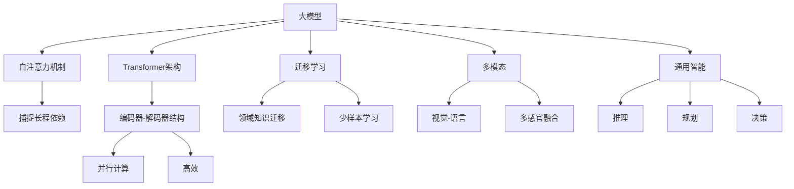
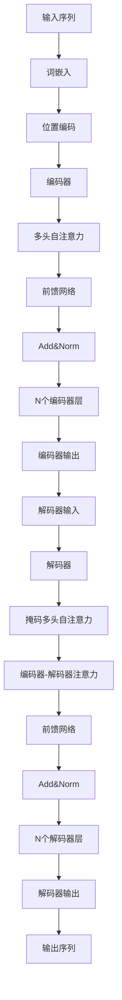

好的,我会严格按照您提供的要求和模板结构撰写这篇文章。以下是正文部分:

# AI Agent: AI的下一个风口 大模型时代的AI

## 1. 背景介绍

### 1.1 问题的由来

人工智能(AI)的发展一直是科技领域的热门话题。近年来,由于算力、数据和算法的飞速进步,AI取得了长足的发展,尤其是大型语言模型和多模态模型的出现,引发了AI新的热潮。这些大模型不仅在自然语言处理、计算机视觉等传统AI领域展现出卓越的性能,更令人振奋的是它们表现出了一定的通用智能能力,可以解决复杂的跨领域问题。

### 1.2 研究现状  

目前,以GPT-3、PaLM、ChatGPT等为代表的大模型已经在学术界和工业界引起广泛关注。研究人员正在探索大模型的潜力,试图将其应用到更多的领域,如智能辅助、决策支持、创意生成等。同时,也有不少学者对大模型的缺陷和风险提出质疑,比如模型的不可解释性、偏见传播、能源消耗等问题。

### 1.3 研究意义

大模型代表了AI发展的新阶段,具有重要的理论意义和应用价值。从理论层面看,大模型的出现有助于探索通用人工智能的奥秘,揭示智能的本质特征。从应用角度来说,大模型可以作为通用的AI助手,支持人类在各个领域的智力活动,提高工作效率,推动社会进步。因此,深入研究大模型无疑具有重大意义。

### 1.4 本文结构

本文将全面介绍大模型时代的AI Agent。首先阐述大模型的核心概念和关键技术,包括自注意力机制、transformer架构、迁移学习等。接下来详细解析主流大模型的算法原理和数学模型,并通过实例讲解其内在运作机制。然后探讨大模型在智能辅助、创意生成等领域的实际应用,分享开发实践的经验。最后总结大模型的发展趋势和面临的挑战,并给出相关工具和资源推荐。

## 2. 核心概念与联系

大模型时代的AI Agent主要涉及以下几个核心概念:

1. **自注意力机制(Self-Attention)**: 是transformer模型的核心,通过计算输入序列中每个元素与其他元素的相关性,捕捉长程依赖关系,从而提高模型性能。
2. **Transformer架构**: 基于自注意力机制构建的全新的序列到序列模型,采用编码器-解码器结构,支持高效的并行计算。
3. **迁移学习(Transfer Learning)**: 通过在大规模语料上预训练获得通用知识,然后在特定领域的数据上进行微调,实现领域知识的快速迁移和少样本学习。
4. **多模态(Multimodal)**: 指模型能够同时处理不同模态(如文本、图像、视频等)的输入,实现跨模态的感知融合和理解。
5. **通用智能(General Intelligence)**: 大模型展现出一定的通用智能能力,如推理、规划、决策等,为探索人工通用智能(AGI)带来新的契机。

这些概念相互关联、环环相扣,共同推动了大模型时代AI Agent的发展。自注意力机制和Transformer架构奠定了大模型的技术基础;迁移学习使大模型获得了广博的知识储备;多模态赋予了大模型跨领域的感知能力;而通用智能则是大模型所追求的终极目标。

## 3. 核心算法原理 & 具体操作步骤  

### 3.1 算法原理概述

大模型的核心算法主要包括两个部分:自注意力机制和Transformer架构。

**自注意力机制**通过计算查询(Query)与键(Key)的相似度,从值(Value)中选取相关信息,从而捕捉输入序列中元素间的长程依赖关系。具体来说,对于序列 $X = (x_1, x_2, ..., x_n)$,自注意力是通过以下公式计算的:

$$\mathrm{Attention}(Q, K, V) = \mathrm{softmax}(\frac{QK^T}{\sqrt{d_k}})V$$

其中 $Q$、$K$、$V$ 分别为查询、键和值,通过线性变换从输入 $X$ 计算得到。$d_k$ 为缩放因子,用于防止点积的值过大导致梯度消失。

**Transformer架构**则是基于自注意力机制构建的序列到序列模型,主要由编码器(Encoder)和解码器(Decoder)两部分组成。编码器将输入序列编码为连续的表示,解码器则根据编码器的输出生成目标序列。两者均采用多头自注意力和前馈神经网络构成,通过残差连接和层归一化实现更好的梯度传播。

### 3.2 算法步骤详解  

以机器翻译任务为例,Transformer的工作流程可分为以下几个步骤:

1. **输入表示**：将输入序列(如源语言句子)转换为词嵌入向量,并添加位置编码,赋予每个词位置信息。
2. **编码器**：输入序列经过 $N$ 个相同的编码器层,每一层由多头自注意力子层和前馈网络子层组成,通过残差连接和层归一化实现。
3. **解码器输入**：将编码器的输出作为解码器的输入,同时添加掩码以防止看到后续位置的词。
4. **解码器**：解码器输入经过 $N$ 个解码器层,每层包含掩码多头自注意力、编码器-解码器注意力和前馈网络三个子层。
5. **输出**：解码器最终输出目标序列(如目标语言句子)的词向量表示,并将其转换为词序列作为最终结果。

在训练过程中,通过最小化模型输出与真实标签之间的损失函数(如交叉熵损失),使用优化算法(如Adam)更新模型参数。预训练阶段在大规模无监督数据上训练,微调阶段则在特定任务数据上进行进一步训练。

### 3.3 算法优缺点

**优点**:

1. 自注意力机制能够有效捕捉长程依赖关系,解决了RNN等序列模型的梯度消失/爆炸问题。
2. Transformer架构支持并行计算,训练和推理速度更快。
3. 通过预训练和微调实现了迁移学习,大大提高了数据利用效率。
4. 多头注意力机制增强了模型的表达能力。
5. 编码器-解码器结构使模型可以广泛应用于各种序列到序列任务。

**缺点**:

1. 计算复杂度较高,需要大量计算资源,对GPU等硬件要求较高。
2. 对长序列的处理能力仍有限制,难以捕捉全局依赖关系。
3. 缺乏内在的归纳偏置,需要大量数据进行预训练。
4. 存在不可解释性问题,模型内部运作机制"黑盒化"。
5. 可能存在偏见和不当内容的风险。

### 3.4 算法应用领域

Transformer及其变体已广泛应用于自然语言处理、计算机视觉、语音识别、生成模型等多个领域:

- **自然语言处理**: 机器翻译、文本摘要、问答系统、对话系统等
- **计算机视觉**: 图像分类、目标检测、图像描述、视觉问答等
- **语音**: 语音识别、语音合成、语音转文本等
- **生成模型**: 文本生成、图像生成、音乐生成等
- **多模态**: 视觉-语言任务、多感官融合等

此外,大模型还可以用于智能决策辅助、创意设计、科研辅助等更广泛的领域。

## 4. 数学模型和公式 & 详细讲解 & 举例说明

### 4.1 数学模型构建

大模型的数学模型主要由以下几个部分组成:

1. **输入表示**:将输入序列(如文本)转换为词嵌入向量表示,并添加位置编码,形式化表示为:

$$\boldsymbol{x}_i = \boldsymbol{e}(w_i) + \boldsymbol{p}(i)$$

其中 $\boldsymbol{e}(\cdot)$ 为词嵌入函数, $\boldsymbol{p}(\cdot)$ 为位置编码函数。

2. **自注意力机制**:通过计算查询(Query)与键(Key)的相似度,从值(Value)中选取相关信息,公式如下:

$$\mathrm{Attention}(Q, K, V) = \mathrm{softmax}(\frac{QK^T}{\sqrt{d_k}})V$$

对于多头注意力,则是将注意力分成 $h$ 个头,分别计算后拼接:

$$\mathrm{MultiHead}(Q, K, V) = \mathrm{Concat}(\mathrm{head}_1, ..., \mathrm{head}_h)W^O$$
$$\mathrm{head}_i = \mathrm{Attention}(QW_i^Q, KW_i^K, VW_i^V)$$

3. **前馈网络**:对注意力输出进行非线性变换,包含两个线性变换和一个激活函数:

$$\mathrm{FFN}(x) = \max(0, xW_1 + b_1)W_2 + b_2$$

4. **编码器层**:将自注意力和前馈网络通过残差连接和层归一化组合而成:

$$\boldsymbol{x}_1' = \mathrm{LayerNorm}(\boldsymbol{x} + \mathrm{MultiHead}(Q, K, V))$$
$$\boldsymbol{x}_2' = \mathrm{LayerNorm}(\boldsymbol{x}_1' + \mathrm{FFN}(\boldsymbol{x}_1'))$$

5. **解码器层**:在编码器层的基础上,增加一个掩码多头注意力和编码器-解码器注意力层:

$$\boldsymbol{x}_1' = \mathrm{LayerNorm}(\boldsymbol{x} + \mathrm{MaskedMultiHead}(Q, K, V))$$
$$\boldsymbol{x}_2' = \mathrm{LayerNorm}(\boldsymbol{x}_1' + \mathrm{MultiHead}(Q, K_\mathrm{enc}, V_\mathrm{enc}))$$
$$\boldsymbol{x}_3' = \mathrm{LayerNorm}(\boldsymbol{x}_2' + \mathrm{FFN}(\boldsymbol{x}_2'))$$

6. **损失函数**:对于监督学习任务,通常采用交叉熵损失函数:

$$\mathcal{L}(\boldsymbol{\theta}) = -\frac{1}{N}\sum_{i=1}^N\sum_{t=1}^{T_i}y_t^{(i)}\log p_\theta(y_t^{(i)}|X^{(i)})$$

其中 $\boldsymbol{\theta}$ 为模型参数, $y_t^{(i)}$ 为第 $i$ 个样本在时间步 $t$ 处的真实标签, $p_\theta(\cdot)$ 为模型预测的条件概率分布。

### 4.2 公式