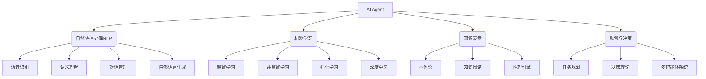

# AI Agent: AI的下一个风口 如何改变用户体验

## 1. 背景介绍

### 1.1 问题的由来

在当今快节奏的数字时代，用户对高效、智能和个性化的交互体验有着越来越高的期望。传统的人机交互方式已经无法满足用户日益增长的需求,因此亟需一种全新的交互范式来重塑用户体验。恰逢人工智能(AI)技术的飞速发展,AI Agent(智能代理)应运而生,成为重塑用户体验的关键力量。

### 1.2 研究现状 

AI Agent是一种基于人工智能技术的虚拟助手,能够理解和响应自然语言指令,并执行各种复杂任务。近年来,AI Agent在多个领域取得了长足进步,如智能语音助手(Siri、Alexa)、智能客服系统、智能写作辅助等,展现出巨大的应用潜力。然而,现有AI Agent仍存在一些局限性,如语义理解能力有限、缺乏情景感知、交互体验单一等,制约了其在提升用户体验方面的作用。

### 1.3 研究意义

设计和开发更智能、更人性化的AI Agent,将极大改善用户与数字产品和服务的交互体验,提高工作效率和生活质量。通过赋予AI Agent更强的语义理解、任务规划、情景感知等能力,它可以作为用户的"数字助手",主动识别并满足用户需求,为用户提供无缝、高效和个性化的服务体验。此外,AI Agent在教育、医疗、客户服务等多个领域也大有可为,有助于提升这些行业的服务质量和用户体验。

### 1.4 本文结构

本文将全面探讨AI Agent如何重塑用户体验。首先阐述AI Agent的核心概念及其与相关技术的联系;其次深入剖析AI Agent的核心算法原理和数学模型;再次通过实例展示AI Agent的开发实践;最后分析AI Agent在不同场景的应用,并对其未来发展趋势和面临的挑战进行展望。

## 2. 核心概念与联系

AI Agent是一种基于人工智能技术的智能系统,旨在模拟人类智能,为用户提供智能化服务。它涉及多个AI子领域,如自然语言处理(NLP)、机器学习、知识表示、规划与决策等。

自然语言处理(NLP)赋予AI Agent理解和生成自然语言的能力,包括语音识别、语义理解、对话管理和自然语言生成等技术。机器学习使AI Agent具备学习和推理的能力,涉及监督学习、非监督学习、强化学习和深度学习等范式。知识表示则为AI Agent提供了表示和存储知识的方式,如本体论、知识图谱和推理引擎。规划与决策技术使AI Agent能够制定行动计划并做出明智决策,包括任务规划、决策理论和多智能体系统等。

上述技术相互交织、相辅相成,共同赋能AI Agent成为一个智能化的虚拟助手,为用户提供自然、高效和个性化的交互体验。

## 3. 核心算法原理与具体操作步骤

### 3.1 算法原理概述

AI Agent的核心算法原理主要包括以下几个方面:

1. **自然语言理解(NLU)**: 将用户的自然语言输入(文本或语音)转换为结构化的语义表示,以便AI Agent理解用户的意图和需求。这通常涉及语音识别、词法分析、句法分析、语义分析等步骤。

2. **对话管理**: 根据当前对话上下文和用户意图,选择合适的对话策略,决定AI Agent的响应行为。这需要建立对话状态跟踪模型和对话策略模型。

3. **任务规划与执行**: 将用户意图映射到一系列具体的任务步骤,并协调各个组件完成这些任务。这需要构建任务规划模型和执行模块。

4. **知识库查询与推理**: 基于知识库(本体论、知识图谱等)查找相关信息,并通过推理引擎进行复杂推理,为任务执行提供所需知识支持。

5. **自然语言生成(NLG)**: 将AI Agent的响应(任务执行结果、查询结果等)转换为自然语言输出(文本或语音),以便用户理解。

6. **交互策略学习**: 通过机器学习技术(如强化学习),不断优化对话策略、任务规划和响应生成,提高AI Agent的整体性能和用户体验。

### 3.2 算法步骤详解

AI Agent的核心算法可概括为以下步骤:

1. **输入处理**:
   - 语音输入: 通过语音识别模块将用户语音转录为文本
   - 文本输入: 直接获取用户输入的自然语言文本

2. **自然语言理解**:
    - 词法分析: 将文本分割为词元序列
    - 句法分析: 构建语法树,确定词元之间的关系
    - 语义分析: 将语法树映射到语义表示(如意图和槽位)

3. **对话状态跟踪**:
    - 更新对话状态(上下文、槽位值等)
    - 检查对话是否应该终止

4. **对话策略选择**:
    - 根据对话状态,选择合适的对话策略
    - 策略可由规则或机器学习模型确定

5. **任务分解与规划**:
    - 将用户意图分解为一系列任务步骤
    - 通过规划算法(如启发式搜索、层次规划等)生成执行计划

6. **任务执行**:
    - 协调各个模块(知识库查询、API调用等)完成任务步骤
    - 可引入执行监控,处理异常情况

7. **响应生成**:
    - 根据任务执行结果,通过自然语言生成模块产生文本响应
    - 可融合模板、规则和神经网络等技术

8. **输出响应**:
    - 文本输出: 直接呈现生成的自然语言文本
    - 语音输出: 通过语音合成模块将文本转换为语音

9. **交互策略优化**:
    - 收集人机对话数据
    - 通过强化学习等技术优化对话策略、任务规划和响应生成模型
    - 提高AI Agent的整体性能和用户体验

### 3.3 算法优缺点

**优点**:

- 端到端的架构,能够理解自然语言输入,执行复杂任务,并生成自然语言响应,提供无缝的人机交互体验。
- 融合了多种AI技术,如NLP、机器学习、知识表示、规划与决策等,具有强大的功能。
- 通过交互策略学习,能够不断优化对话策略和响应生成,提高用户体验。
- 可扩展性强,能够集成各种领域知识和功能模块。

**缺点**:

- 系统复杂度高,需要大量的训练数据和计算资源。
- 各个模块之间的错误传递可能导致系统性能下降。
- 缺乏真正的理解和推理能力,难以处理复杂的开放域对话。
- 隐私和安全性问题需要重视。

### 3.4 算法应用领域

AI Agent算法可广泛应用于以下领域:

- 智能语音助手: 如Siri、Alexa、小米AI等
- 智能客服系统: 提供7*24小时在线客户服务
- 智能写作辅助: 协助用户撰写文章、邮件等
- 智能教育系统: 提供个性化的教学和学习辅助
- 智能医疗系统: 协助医生诊断和治疗
- 智能家居控制: 语音控制家电和智能家居设备
- 智能机器人: 为机器人提供自然语言交互能力
- 企业生产效率: 协助完成办公自动化任务

## 4. 数学模型和公式详细讲解与举例说明

AI Agent涉及多种数学模型,在自然语言处理、机器学习、知识表示和规划决策等方面发挥着关键作用。本节将重点介绍一些核心数学模型及其公式推导过程。

### 4.1 数学模型构建

#### 4.1.1 N-gram语言模型

N-gram语言模型是自然语言处理中最基本和最广泛使用的模型之一,用于估计一个词序列的概率。设有一个长度为m的词序列$W=w_1,w_2,...,w_m$,其概率可以根据链式法则计算:

$$P(W)=P(w_1)P(w_2|w_1)P(w_3|w_1,w_2)...P(w_m|w_1,w_2,...,w_{m-1})$$

由于计算上述精确概率是很困难的,N-gram模型做出了马尔可夫假设,即一个词的出现只与前面N-1个词相关,从而将概率简化为:

$$P(W)=\prod_{i=1}^{m}P(w_i|w_{i-N+1},...,w_{i-1})$$

其中,N为N-gram的阶数。当N=1时,称为一元语言模型(Unigram);当N=2时,称为二元语言模型(Bigram);当N=3时,称为三元语言模型(Trigram)。

#### 4.1.2 序列到序列模型(Seq2Seq)

序列到序列(Sequence-to-Sequence,Seq2Seq)模型是一种广泛使用的神经网络架构,常用于机器翻译、对话系统等任务。它由两部分组成:编码器(Encoder)和解码器(Decoder)。

编码器将输入序列$X=(x_1,x_2,...,x_n)$映射为语义向量$c$:

$$h_t=f(x_t,h_{t-1})\\
c=q(h_1,h_2,...,h_n)$$

其中,$f$是递归函数(如RNN或LSTM),$q$是向量编码函数。

解码器接收语义向量$c$,生成输出序列$Y=(y_1,y_2,...,y_m)$:

$$p(y_t|y_1,...,y_{t-1},c)=g(y_{t-1},s_t,c)$$

其中,$g$是解码函数,$s_t$是解码器的隐藏状态。

该模型的损失函数为:

$$L(\theta)=-\frac{1}{m}\sum_{t=1}^{m}\log p(y_t|y_1,...,y_{t-1},c;\theta)$$

通过反向传播算法对模型参数$\theta$进行优化训练。

#### 4.1.3 知识图谱嵌入

知识图谱是一种结构化知识表示形式,由实体(Entity)、关系(Relation)和事实三元组(head entity, relation, tail entity)组成。知识图谱嵌入(Knowledge Graph Embedding)旨在将实体和关系映射到低维连续向量空间,以捕获它们之间的语义关系。

TransE是一种简单而有效的知识图谱嵌入模型,将关系$r$看作是从头实体$h$到尾实体$t$的平移操作,目标是使$h+r\approx t$成立。形式化地,TransE的目标函数为:

$$L=\sum_{(h,r,t)\in S}\sum_{(h',r',t')\in S'}[\gamma+d(h+r,t)-d(h'+r',t')]_+$$

其中,$S$是知识图谱中的正三元组集合,$S'$是负三元组集合,$\gamma>0$是边距超参数,$ d $是距离函数(如$L_1$或$L_2$范数),$[\cdot]_+$是正值函数。

通过优化该目标函数,TransE可以学习出实体和关系的嵌入向量表示,并应用于链接预测、实体分类等任务。

### 4.2 公式推导过程

#### 4.2.1 隐马尔可夫模型(HMM)中的前向算法推导

隐马尔可夫模型(Hidden Markov Model