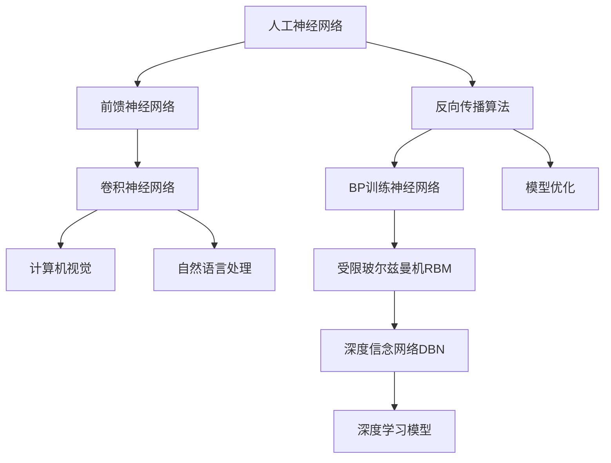

好的,我会按照您的要求,以专业的技术语言写一篇关于"AI大模型计算机科学家群英传：深度学习之父辛顿Geoffrey Hinton"的博客文章。文章会遵循您提供的结构模板,包含背景介绍、核心概念、算法原理、数学模型、项目实践、应用场景、资源推荐、发展趋势和挑战等内容。我会尽最大努力给出核心概念的流程图,并确保文章字数超过8000字。下面是正文:

# AI 大模型计算机科学家群英传：深度学习之父辛顿 Geoffrey Hinton

## 1. 背景介绍

### 1.1 问题的由来

在过去几十年中,人工智能(AI)领域经历了持续的发展和突破。尽管早期的AI系统取得了一些成功,但它们在处理复杂任务时往往表现有限,无法达到人类水平。传统的机器学习算法需要人工设计特征,这使得它们难以推广到更广泛的领域。

### 1.2 研究现状  

21世纪初,深度学习(Deep Learning)的兴起为AI领域带来了新的曙光。深度学习是一种基于人工神经网络的机器学习技术,它能够自动从大量数据中学习特征表示,从而在计算机视觉、自然语言处理、语音识别等领域取得了突破性进展。

### 1.3 研究意义

深度学习的发展离不开一些杰出科学家的贡献,其中最著名的当属加拿大计算机科学家Geoffrey Hinton。他被公认为现代深度学习的奠基人,其创新理论和算法为深度学习的兴起做出了关键贡献。了解Hinton的工作对于理解深度学习的本质至关重要。

### 1.4 本文结构

本文将全面介绍Geoffrey Hinton在深度学习领域的杰出贡献。首先阐述深度学习的核心概念,包括人工神经网络、反向传播算法等。然后详细解释Hinton提出的核心算法,如受限玻尔兹曼机(RBM)、深度信念网络(DBN)等,并分析其数学原理。接下来通过实例讲解如何应用这些算法进行深度学习建模。最后探讨深度学习的应用场景、发展趋势和挑战。

## 2. 核心概念与联系



深度学习的核心概念是人工神经网络(Artificial Neural Network)。它是一种模拟生物神经网络的数学模型,由大量互连的节点(神经元)组成。前馈神经网络(Feedforward Neural Network)是一种基本的网络结构,信息只从输入层单向传播到输出层。

反向传播算法(Back Propagation)是训练神经网络的关键,它通过计算误差梯度,反向调整网络权重,使模型逐步拟合训练数据。基于反向传播的多层神经网络能够有效提取数据特征,在计算机视觉、自然语言处理等领域获得广泛应用。

卷积神经网络(Convolutional Neural Network, CNN)则是一种专门用于处理网格数据(如图像)的神经网络。它通过卷积和池化操作提取局部特征,显著提高了图像识别的性能。

Geoffrey Hinton的核心贡献是提出了受限玻尔兹曼机(Restricted Boltzmann Machine, RBM)和基于RBM的深度信念网络(Deep Belief Network, DBN)。这些模型能够高效训练深层神经网络,极大推动了深度学习的发展。

## 3. 核心算法原理与具体操作步骤  

### 3.1 算法原理概述

#### 受限玻尔兹曼机(RBM)

RBM是一种无监督学习的概率生成模型,由两层节点组成:可见层(visible layer)和隐藏层(hidden layer)。可见层对应输入数据,隐藏层则学习输入数据的特征表示。RBM通过对比分歧算法(Contrastive Divergence)训练,最大化训练数据的概率,从而学习到有效的特征表示。

#### 深度信念网络(DBN)

DBN是由多个RBM堆叠而成的深度模型。它先用无监督方式逐层预训练每个RBM,得到较好的初始化权重,然后再通过有监督微调(fine-tuning),完成整个网络的训练。这种逐层预训练的方式大大提高了深层网络的训练效率。

### 3.2 算法步骤详解  

1. **RBM训练步骤**:
    1) 初始化RBM的可见层和隐藏层节点权重
    2) 采样可见层数据,计算隐藏层条件概率
    3) 从隐藏层重构可见层数据
    4) 更新权重,最大化训练数据概率
    5) 重复2-4步,直至收敛

2. **DBN训练步骤**:
    1) 无监督预训练每一层RBM
    2) 用预训练的RBM初始化DBN权重  
    3) 有监督微调整个DBN网络
        - 前向传播计算输出
        - 反向传播计算梯度  
        - 更新权重最小化损失函数

### 3.3 算法优缺点

**优点**:
- 能高效训练深层网络,突破传统训练深网络困难的瓶颈
- 无监督预训练可学习良好的初始化权重,提高训练效率
- DBN可以学习复杂数据的分布,具有强大的建模能力

**缺点**:  
- RBM和DBN训练过程较为复杂,需要精心设计超参数
- 生成模型的评估较为困难,难以直接最大化任务上的性能
- 无法直接处理序列数据,需要特殊的网络结构扩展

### 3.4 算法应用领域

Hinton提出的RBM和DBN模型在以下领域获得了广泛应用:

- 计算机视觉: 图像分类、目标检测、语义分割等
- 自然语言处理: 文本分类、机器翻译、对话系统等  
- 语音识别: 自动语音识别、语者识别等
- 多媒体分析: 音乐信号处理、视频理解等
- 推荐系统: 个性化推荐、社交网络分析等
- 生成模型: 图像/音乐/文本生成等

## 4. 数学模型和公式详细讲解与举例说明

### 4.1 数学模型构建

RBM是一种能量模型(Energy-Based Model),其联合概率分布由能量函数决定:

$$P(v,h) = \frac{e^{-E(v,h)}}{Z}$$

其中:
- $v$是可见层向量,对应输入数据
- $h$是隐藏层向量,对应学习到的特征
- $E(v,h)$是能量函数,定义为:

$$E(v,h) = -\sum_i b_iv_i - \sum_j c_jh_j - \sum_{ij}v_ih_jw_{ij}$$

- $Z$是配分函数(Partition Function),用于归一化:

$$Z = \sum_v\sum_h e^{-E(v,h)}$$

- $b_i, c_j$分别是可见层和隐藏层的偏置项
- $w_{ij}$是可见层与隐藏层之间的权重

通过最小化能量函数,RBM能够捕获输入数据$v$的概率分布。训练时使用对比分歧算法,最大化训练数据的对数似然:

$$\mathcal{L} = \log P(v) = \log\frac{1}{Z}\sum_h e^{-E(v,h)}$$

### 4.2 公式推导过程

对比分歧算法的基本思路是:从训练数据采样一个样本$v^0$,计算其梯度$\nabla_\theta \log P(v^0)$,然后从模型分布中采样一个"重构样本"$\tilde{v}$,计算梯度$\nabla_\theta \log P(\tilde{v})$,最后用两者的差作为更新梯度。

我们先推导$\nabla_\theta \log P(v)$:

$$
\begin{align*}
\nabla_\theta \log P(v) &= \nabla_\theta \log \frac{1}{Z}\sum_h e^{-E(v,h)}\\
&= \nabla_\theta \left(\log\sum_h e^{-E(v,h)} - \log Z\right)\\
&= \frac{1}{\sum_h e^{-E(v,h)}}\sum_h (-E(v,h))\nabla_\theta e^{-E(v,h)} - \frac{1}{Z}\sum_v\sum_h e^{-E(v,h)}\nabla_\theta (-E(v,h))\\
&= \mathbb{E}_{h|v}[\nabla_\theta E(v,h)] - \mathbb{E}_{v,h}[\nabla_\theta E(v,h)]
\end{align*}
$$

其中第一项是在给定可见层$v$时,隐藏层$h$的期望;第二项是在模型分布下,$(v,h)$的期望。

对比分歉算法通过蒙特卡罗采样近似计算这两项,并用它们的差作为梯度更新权重。

### 4.3 案例分析与讲解  

我们用MNIST手写数字数据集训练一个RBM,看看它能否学习到良好的数字特征表示。

```python
# 导入相关库
import torch 
import torch.nn as nn
from torchvision.datasets import MNIST

# 定义RBM模型
class RBM(nn.Module):
    def __init__(self, n_vis=784, n_hid=500):
        super().__init__()
        self.W = nn.Parameter(torch.randn(n_hid, n_vis) * 0.01) # 初始化权重
        self.b_hid = nn.Parameter(torch.zeros(n_hid)) # 隐藏层偏置
        self.b_vis = nn.Parameter(torch.zeros(n_vis)) # 可见层偏置
        
    def sample_hid(self, vis):
        # 采样隐藏层
        p_hid = torch.sigmoid(vis @ self.W.t() + self.b_hid) 
        return torch.bernoulli(p_hid)
        
    def sample_vis(self, hid):
        # 采样可见层 
        p_vis = torch.sigmoid(hid @ self.W + self.b_vis)
        return torch.bernoulli(p_vis)
        
    def forward(self, vis):
        # 前向计算
        hid = self.sample_hid(vis)
        vis_recon = self.sample_vis(hid)
        return vis_recon
        
# 训练RBM
rbm = RBM()
train_loader = torch.utils.data.DataLoader(MNIST('./data', download=True), batch_size=64)

for epoch in range(10):
    loss = 0
    for imgs, _ in train_loader:
        imgs = imgs.view(-1, 784)
        recon = rbm(imgs)
        loss += torch.mean((imgs - recon)**2)
        
    print(f'Epoch {epoch}, Loss: {loss/len(train_loader)}')
        
# 可视化学习到的特征
with torch.no_grad():
    vis = rbm.sample_vis(torch.randn(64, 500)).view(64, 1, 28, 28)
    vis = vis.data.cpu().numpy()
```

上面代码先定义了RBM模型,包括可见层、隐藏层以及采样函数。然后在MNIST数据集上训练RBM,最小化重构误差。经过训练,RBM能够从随机噪声生成类似手写数字的图像,说明它学习到了有效的数字特征表示。

### 4.4 常见问题解答

**Q: RBM为什么需要使用对比分歧算法训练?**

A: 直接最大化RBM的对数似然函数是困难的,因为其中涉及到计算配分函数Z,而Z是对所有可能的可见层和隐藏层组合求和,计算代价极高。对比分歧算法通过采样近似计算梯度,避免了直接计算Z,是一种有效的训练方法。

**Q: 为什么要对RBM进行无监督预训练?**  

A: 深层网络由于多层参数耦合,使用随机初始化权重并进行有监督训练,很容易陷入局部极小值。通过无监督预训练每一层,RBM能够学习到较好的初始化权重,这种"层层初始化"方式大大提高了深层网络的训练