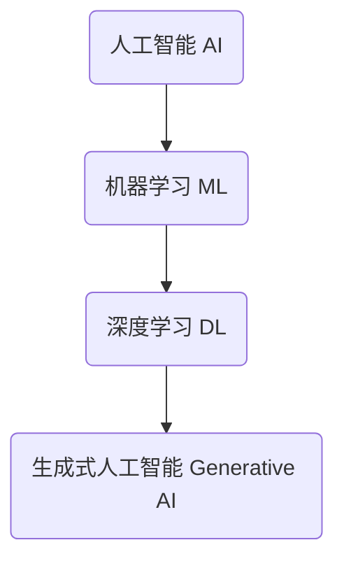

# AIGC从入门到实战：AIGC在金融行业的创新场景—银行零售新范式

## 1. 背景介绍

### 1.1 问题的由来

在数字化转型的大潮中,金融行业正面临着前所未有的挑战和机遇。传统的银行业务模式和服务方式已经难以满足客户日益增长的需求,迫切需要创新来提高效率、优化体验并降低成本。与此同时,人工智能(AI)和生成式人工智能(Generative AI,简称AIGC)技术的快速发展,为金融行业带来了全新的发展契机。

银行零售业务作为金融机构的核心业务之一,其创新转型对于提升客户体验、降低运营成本、优化风险管理等方面具有重要意义。AIGC技术在银行零售领域的应用,可以实现智能化客户服务、个性化产品推荐、自动化流程优化等,从而推动银行零售业务模式的全面创新。

### 1.2 研究现状

目前,AIGC技术在金融行业的应用研究还处于起步阶段,但已经展现出巨大的潜力。一些领先的金融机构已经开始探索AIGC在客户服务、营销、风险管理等领域的应用场景。例如,一些银行已经尝试使用AIGC技术开发智能客服系统,提供7*24小时的在线问答服务;另一些机构则利用AIGC生成个性化的营销内容,提高营销效率。

然而,AIGC技术在银行零售领域的深入应用仍然面临诸多挑战,例如数据质量、模型可解释性、隐私与安全等问题。因此,需要进一步的研究和探索,以充分发挥AIGC技术在银行零售创新中的作用。

### 1.3 研究意义

本文旨在深入探讨AIGC技术在银行零售业务中的创新应用场景,为金融机构提供理论指导和实践参考。通过分析AIGC技术的核心概念、算法原理、数学模型,并结合实际应用案例和代码实现,帮助读者全面了解AIGC在银行零售领域的应用前景和实现路径。

同时,本文还将探讨AIGC技术在银行零售创新中面临的挑战和未来发展趋势,为金融机构制定AIGC技术应用策略提供参考。

### 1.4 本文结构

本文共分为九个部分:

1. 背景介绍
2. 核心概念与联系
3. 核心算法原理与具体操作步骤
4. 数学模型和公式详细讲解与举例说明
5. 项目实践:代码实例和详细解释说明
6. 实际应用场景
7. 工具和资源推荐
8. 总结:未来发展趋势与挑战
9. 附录:常见问题与解答

## 2. 核心概念与联系

在探讨AIGC在银行零售领域的创新应用之前,我们需要先了解一些核心概念,包括人工智能(AI)、机器学习(ML)、深度学习(DL)、生成式人工智能(Generative AI)等,并理解它们之间的关系。

### 2.1 人工智能(AI)

人工智能(Artificial Intelligence,简称AI)是一门研究如何使机器模拟人类智能的科学,旨在让机器具备类似于人类的感知、学习、推理、规划和操作等智能行为。AI是一个广义的概念,包括了机器学习、深度学习、自然语言处理、计算机视觉等多个子领域。

### 2.2 机器学习(ML)

机器学习(Machine Learning,简称ML)是AI的一个重要分支,它赋予了计算机在没有明确程序的情况下,通过数据学习并优化模型参数,从而获取新的知识或技能的能力。ML算法通过学习大量数据,自动捕获数据中的模式和规律,从而实现预测、决策或其他智能行为。

常见的机器学习算法包括:

- 监督学习(Supervised Learning):基于标记数据训练模型,用于分类和回归任务,如线性回归、逻辑回归、决策树等。
- 无监督学习(Unsupervised Learning):基于未标记数据训练模型,用于聚类和降维任务,如K-Means聚类、主成分分析等。
- 强化学习(Reinforcement Learning):通过与环境交互并获得奖励信号来训练模型,常用于决策和控制任务,如AlphaGo等。

### 2.3 深度学习(DL)

深度学习(Deep Learning,简称DL)是机器学习的一个子集,它基于表示学习的理念,通过对数据的多层次特征抽取和模式识别,来解决复杂的机器学习问题。深度学习模型通常由多层神经网络组成,能够自动从原始数据中学习出多层次的抽象特征表示,从而实现端到端的学习。

常见的深度学习模型包括:

- 卷积神经网络(Convolutional Neural Network,CNN):擅长处理图像、视频等结构化数据。
- 循环神经网络(Recurrent Neural Network,RNN):擅长处理序列数据,如自然语言、时间序列等。
- transformer模型:基于自注意力机制,在自然语言处理、计算机视觉等领域表现出色。

### 2.4 生成式人工智能(Generative AI)

生成式人工智能(Generative AI,简称AIGC)是指能够基于输入数据生成新的、原创性的内容的AI技术。AIGC模型通过学习大量数据,捕捉数据的内在模式和规律,从而能够生成逼真、多样化的输出,如文本、图像、音频、视频等。

AIGC技术的核心是生成模型,常见的生成模型包括:

- 变分自编码器(Variational Autoencoder,VAE)
- 生成对抗网络(Generative Adversarial Network,GAN)
- 自回归模型(Autoregressive Model),如GPT等

AIGC技术的发展,为人工智能系统赋予了创造力,使其能够生成原创性的内容,在多个领域展现出巨大的应用潜力。

## 3. 核心算法原理与具体操作步骤

### 3.1 算法原理概述

AIGC技术的核心算法原理是基于生成模型,通过学习大量数据,捕捉数据的内在模式和规律,从而能够生成新的、原创性的内容。生成模型的基本思路是:首先从训练数据中学习一个潜在的概率分布,然后从这个分布中采样,生成新的样本。

常见的生成模型包括变分自编码器(VAE)、生成对抗网络(GAN)和自回归模型(如GPT等)。这些模型虽然具体实现方式不同,但都遵循上述基本原理。

以自回归模型为例,它的核心思想是将序列建模问题转化为基于上文预测下一个token的条件概率模型。自回归模型通过学习大量文本数据,捕捉语言的语法和语义规律,从而能够根据给定的上文,预测出合理的下一个token,进而生成逼真、流畅的文本内容。

### 3.2 算法步骤详解

以GPT(Generative Pre-trained Transformer)为代表的自回归模型,其核心算法步骤可概括为以下几个部分:

1. **预训练(Pre-training)**

   在预训练阶段,模型会在大规模无标注文本数据(如网页、书籍等)上进行自监督学习,目标是最大化下一个token的条件概率。通过这种方式,模型能够学习到语言的一般知识和规律。

2. **微调(Fine-tuning)**

   在特定任务上,模型会进一步在有标注的数据集上进行微调,以适应特定任务的需求。例如,对于文本生成任务,模型会在大量高质量文本数据上进行微调,以提高生成质量。

3. **生成(Generation)**

   在生成阶段,模型会根据给定的上文(可以是空),通过贪婪搜索或其他解码策略,预测出下一个最可能的token,并将其添加到输出序列中。重复该过程,直到生成完整的输出序列。

4. **采样(Sampling)**

   为了增加生成内容的多样性,模型还可以采用随机采样或顶端采样(Top-K/Top-P采样)等策略,从模型预测的token概率分布中随机采样token,而不是始终选择概率最大的token。

以上是自回归模型的基本算法步骤,其他生成模型(如VAE、GAN等)也有类似的训练和生成过程,只是具体实现细节有所不同。

### 3.3 算法优缺点

生成式AI模型具有以下优点:

1. **生成能力强**:能够生成逼真、多样化的原创性内容,如文本、图像、音频等。
2. **可控性好**:通过调整模型参数和解码策略,可以控制生成内容的属性和风格。
3. **通用性强**:同一模型可应用于多种任务,如文本生成、机器翻译、问答等。

但同时也存在一些缺点和挑战:

1. **训练数据量要求大**:需要大量高质量的训练数据,以捕捉足够的模式和规律。
2. **生成质量参差不齐**:生成内容的质量和一致性难以保证,存在语义漂移等问题。
3. **缺乏解释性**:模型内部机理黑盒操作,生成过程缺乏可解释性。
4. **潜在风险**:可能生成有害、不当或不实内容,存在潜在风险。

因此,在实际应用中,需要权衡利弊,并采取相应的策略来控制和优化模型的生成质量和可靠性。

### 3.4 算法应用领域

生成式AI模型由于其强大的生成能力和通用性,在多个领域展现出广阔的应用前景:

1. **自然语言处理**:文本生成、机器翻译、问答系统、文本摘要等。
2. **计算机视觉**:图像生成、图像编辑、图像描述等。
3. **音频处理**:语音合成、音乐生成、声音效果生成等。
4. **视频处理**:视频生成、视频编辑、视频描述等。
5. **创意设计**:内容创作、广告设计、产品设计等。
6. **科学研究**:分子设计、新材料发现、医学影像分析等。

总的来说,生成式AI模型为人工智能系统赋予了创造力,在各个领域展现出巨大的应用潜力和创新空间。

## 4. 数学模型和公式详细讲解与举例说明

### 4.1 数学模型构建

生成式AI模型的核心是学习数据的潜在概率分布,并从该分布中采样生成新的样本。因此,数学模型的构建就是对该潜在概率分布的建模。

以自回归模型为例,我们需要建模的是条件概率分布 $P(x_t|x_{<t})$,即给定上文 $x_{<t}$,预测下一个token $x_t$ 的概率分布。

对于一个长度为 $T$ 的序列 $\boldsymbol{x}=(x_1,x_2,\dots,x_T)$,其概率可以通过链式法则分解为:

$$
P(\boldsymbol{x}) = P(x_1)P(x_2|x_1)P(x_3|x_1,x_2)\cdots P(x_T|x_1,x_2,\dots,x_{T-1})
$$

自回归模型的目标就是最大化上述联合概率,即:

$$
\begin{aligned}
\theta^* &= \arg\max_\theta \sum_{\boldsymbol{x}}\log P_\theta(\boldsymbol{x})\\
&= \arg\max_\theta \sum_{\boldsymbol{x}}\sum_{t=1}^T\log P_\theta(x_t|x_{<t})
\end{aligned}
$$

其中 $\theta$ 表示模型参数,目标是找到最优参数 $\theta^*$ 来最大化训练数据的对数似然。

在实际中,由于词汇表通常非常大,直接对词汇概率建模是非常困难的。因此,自回归模型通常会先将token(如单词或子词)映射为连续的向量表示(Embedding),然后在这些Embedding上建模。具体来说,给定上文Embedding $\boldsymbol{h}