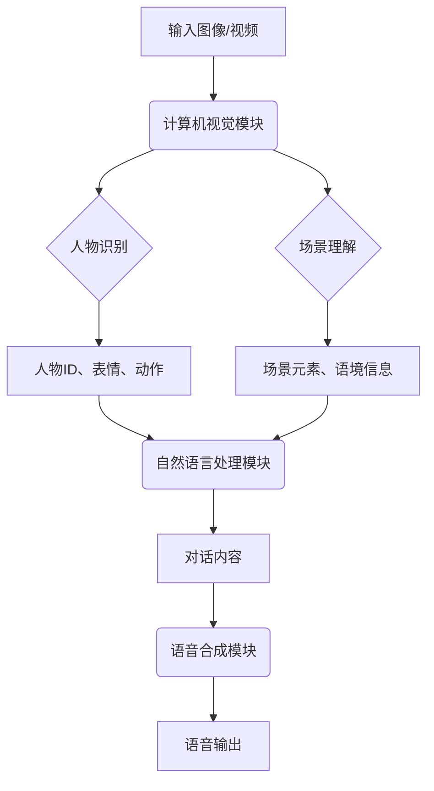

# AIGC从入门到实战：借助 AI，听听照片里的人物怎么说

## 1. 背景介绍

### 1.1 问题的由来

在当今的数字时代，图像和视频数据无处不在。从社交媒体平台到监控摄像头，海量的视觉信息被不断地创建和传播。然而，这些庞大的数据量对人类来说是难以直接理解和处理的。因此，如何从图像和视频中自动提取有价值的信息,并将其转化为可理解的形式,成为了一个亟待解决的问题。

就在这个背景下,AIGC(AI-Generated Content,人工智能生成内容)技术应运而生。AIGC技术利用人工智能算法从图像和视频中识别出关键元素,并基于这些元素生成相应的文本描述或语音输出。其中,一个引人入胜的应用场景就是"听照片说话"——让 AI 系统能够识别照片中的人物,并模拟他们的声音和语气,为照片中的场景添加生动的语音解说。

### 1.2 研究现状

近年来,计算机视觉、自然语言处理和语音合成等领域的快速发展,为 AIGC 技术的实现奠定了坚实的基础。目前,已有多家科技公司和研究机构在探索 AIGC 技术的应用,取得了一定的进展。

例如,谷歌的 Imagen 视觉模型可以根据文本描述生成高质量的图像;OpenAI 的 DALL-E 2 则可以生成逼真的图像、图示和艺术作品;而 Meta 的 Make-A-Video 模型则能够根据文本描述生成短视频。在语音合成方面,微软的 VALL-E 模型可以模仿任何人的声音,生成逼真的语音输出。

然而,现有的 AIGC 技术在实现"听照片说话"的功能时,仍然面临着诸多挑战。例如,如何准确地识别照片中的人物及其身份、表情和动作;如何根据场景语境生成合理的对话内容;如何模拟每个人物的声音、语调和情感等。这些问题都需要更先进的算法和模型来解决。

### 1.3 研究意义

成功实现"听照片说话"的 AIGC 技术,不仅能为我们提供全新的视觉体验,还可以在诸多领域发挥重要作用:

- 教育领域:为课本、教学视频等添加生动的语音解说,提高学习效率;
- 旅游业:为景点照片添加多语种的导游解说,增强旅游体验;
- 新闻报道:让新闻照片"说话",为观众提供更生动形象的报道;
- 无障碍应用:为视障人士提供照片内容的语音描述,消除信息障碍;
- 娱乐业:为电影、动画等添加定制的配音,提升沉浸感。

因此,研究和开发"听照片说话"的 AIGC 技术,不仅具有重要的理论价值,也蕴含着巨大的应用前景。

### 1.4 本文结构  

本文将全面介绍"听照片说话"的 AIGC 技术,内容包括:

- 核心概念与关键技术介绍
- 算法原理及实现步骤详解  
- 数学模型构建及公式推导
- 开源项目实践和代码分析
- 实际应用场景和案例分析
- 工具和学习资源推荐
- 技术发展趋势和面临的挑战

通过对该技术的全面解析,读者能够深入理解其工作原理,掌握实现方法,并了解其应用前景和发展方向。

## 2. 核心概念与联系

实现"听照片说话"的 AIGC 技术,需要融合多个领域的人工智能技术,包括:

1. **计算机视觉 (Computer Vision)**
    - 目标检测 (Object Detection)
    - 人物识别 (Face Recognition)
    - 动作识别 (Action Recognition)
    - 场景理解 (Scene Understanding)

2. **自然语言处理 (Natural Language Processing)**
    - 图像描述生成 (Image Captioning)  
    - 对话生成 (Dialogue Generation)
    - 语义理解 (Semantic Understanding)

3. **语音合成 (Speech Synthesis)**
    - 语音克隆 (Voice Cloning)
    - 情感转换 (Emotional Conversion)
    - 语音生成 (Speech Generation)

这些技术相互配合,构成了一个端到端的 AIGC 系统。下面将对各个模块的作用和关键技术进行介绍:

1. **计算机视觉模块**: 接收输入的图像或视频数据,利用目标检测、人脸识别、动作识别等技术,识别出图像中的人物身份、表情、动作,以及场景元素和语境信息。

2. **自然语言处理模块**: 基于计算机视觉模块提取的信息,结合图像描述生成和对话生成技术,生成与图像场景相符的对话内容。

3. **语音合成模块**: 利用语音克隆和情感转换技术,模拟每个人物的声音、语调和情感,将对话内容转化为逼真的语音输出。

上述三个模块的紧密集成,实现了从图像到语音的无缝转换,让照片中的人物"说话"成为可能。接下来,我们将详细介绍每个模块的核心算法原理和实现方法。

## 3. 核心算法原理 & 具体操作步骤

### 3.1 算法原理概述

要实现"听照片说话"的 AIGC 系统,需要将计算机视觉、自然语言处理和语音合成等多个领域的算法有机结合。下面将概述各个模块的核心算法原理:

1. **计算机视觉模块**:
    - 目标检测: 利用卷积神经网络 (CNN) 和区域候选网络 (RPN) 等技术,在图像中定位并识别出各种目标物体。
    - 人脸识别: 采用面部关键点检测、特征提取和人脸匹配等技术,识别出图像中人物的身份。
    - 动作识别: 基于时空卷积网络等深度学习模型,分析视频序列中人物的动作和姿态变化。
    - 场景理解: 利用语义分割、上下文建模等技术,理解图像场景的语境信息。

2. **自然语言处理模块**:
    - 图像描述生成: 采用编码器-解码器框架,将图像特征编码为语义向量,再解码生成对应的文本描述。
    - 对话生成: 基于序列到序列模型,根据当前对话历史和图像场景信息,生成自然且相关的对话回复。
    - 语义理解: 使用自然语言理解技术,提取对话内容中的关键语义信息,用于驱动后续的语音合成模块。

3. **语音合成模块**:
    - 语音克隆: 基于深度学习的语音转换技术,从少量语音样本中克隆出目标人物的声音特征。
    - 情感转换: 通过分析语音的语调、节奏等因素,将对话内容转换为带有相应情感色彩的语音。
    - 语音生成: 采用端到端的神经语音合成模型,将文本转换为逼真、流畅的语音波形输出。

上述算法的具体实现步骤和细节,将在接下来的章节中详细阐述。

### 3.2 算法步骤详解

实现"听照片说话"的 AIGC 系统,需要多个模块协同工作。下面将详细介绍各个模块的算法实现步骤:

#### 3.2.1 计算机视觉模块

1. **目标检测**
    - 步骤1: 使用 Faster R-CNN 等目标检测模型,在输入图像中生成目标边界框和类别概率。
    - 步骤2: 基于非极大值抑制 (NMS) 算法,去除重叠的冗余边界框。
    - 步骤3: 根据置信度阈值,保留高置信度的目标检测结果。

2. **人脸识别**
    - 步骤1: 使用 MTCNN 等人脸检测模型,在图像中定位人脸区域。
    - 步骤2: 提取人脸区域的特征向量,可采用 FaceNet 或 ArcFace 等模型。
    - 步骤3: 在人脸特征库中查找最相似的人脸特征向量,确定人物身份。

3. **动作识别**
    - 步骤1: 使用 I3D 或 SlowFast 等时空卷积网络模型,提取视频序列中的运动特征。
    - 步骤2: 将提取的特征输入分类器,预测出人物的动作类别。
    - 步骤3: 基于动作类别和时间戳,构建人物动作的时序信息。

4. **场景理解**
    - 步骤1: 使用 PSPNet 或 DeepLabV3+ 等语义分割模型,对图像像素进行逐像素分类。
    - 步骤2: 基于分割结果,提取场景中的物体、背景等语义元素。
    - 步骤3: 结合上下文信息,推理出场景的语境和氛围。

#### 3.2.2 自然语言处理模块

1. **图像描述生成**
    - 步骤1: 使用 CNN 等模型,从输入图像中提取视觉特征向量。
    - 步骤2: 将视觉特征输入编码器(如 LSTM),生成语义向量。
    - 步骤3: 将语义向量输入解码器(如 LSTM),生成对应的文本描述。

2. **对话生成**
    - 步骤1: 使用 Transformer 或 BERT 等模型,编码当前对话历史和图像场景信息。
    - 步骤2: 将编码后的向量输入解码器,自回归生成对话回复。
    - 步骤3: 使用 Beam Search 或 Top-K 采样等策略,生成多个候选回复。
    - 步骤4: 基于语义相关性和上下文一致性,选择最佳的对话回复。

3. **语义理解**
    - 步骤1: 使用 BERT 或 RoBERTa 等语言模型,提取对话内容的语义表示。
    - 步骤2: 基于语义表示,识别出对话中的关键词、情感倾向等语义信息。
    - 步骤3: 将提取的语义信息传递给语音合成模块,用于驱动声音和情感的合成。

#### 3.2.3 语音合成模块

1. **语音克隆**
    - 步骤1: 从目标人物的语音样本中,提取声音特征(如梅尔频谱等)。
    - 步骤2: 使用基于 WaveNet 或 Tacotron 的语音转换模型,学习目标人物的声音特征。
    - 步骤3: 将新的文本输入转换模型,生成目标人物声音的语音波形。

2. **情感转换**
    - 步骤1: 从对话内容的语义表示中,提取情感特征(如激动、悲伤等)。
    - 步骤2: 使用基于 WaveNet 或 Tacotron 的情感转换模型,将语音波形转换为目标情感。
    - 步骤3: 对转换后的语音进行后处理,提高情感表现的自然度。

3. **语音生成**
    - 步骤1: 使用 Tacotron 2 等端到端语音合成模型,将文本转换为语音特征序列。
    - 步骤2: 将语音特征输入 WaveNet 或 WaveRNN 等声码器,生成语音波形。
    - 步骤3: 对生成的语音进行后处理,提高音质和自然度。

通过上述步骤,AIGC 系统可以实现从图像到语音的无缝转换,让照片中的人物"说话"成为可能。下一节将介绍这些算法的优缺点和应用领域。

### 3.3 算法优缺点

任何算法都有其优缺点,下面将对本系统中涉及的主要算法进行分析:

1. **目标检测算法**