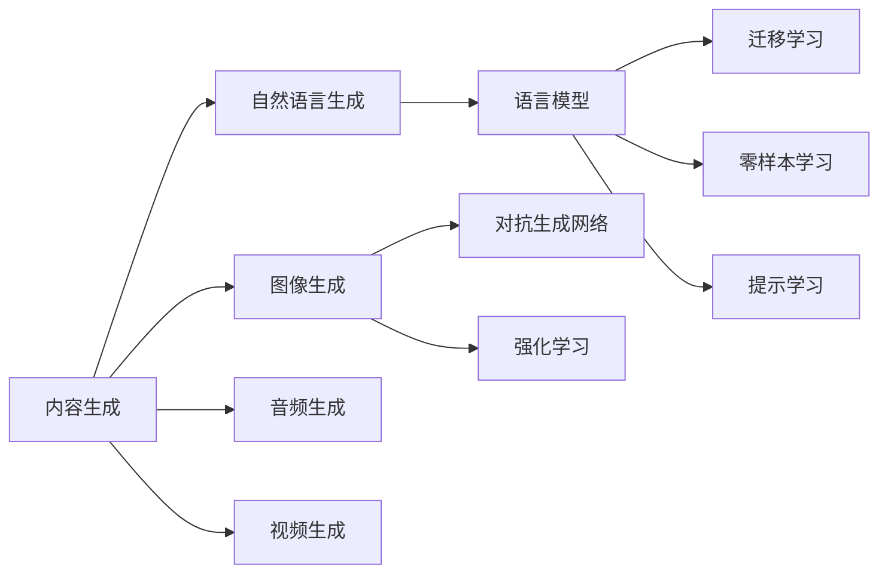

# AIGC从入门到实战：登录 D-ID

作者：禅与计算机程序设计艺术 / Zen and the Art of Computer Programming

## 1. 背景介绍
### 1.1 问题的由来
在人工智能技术飞速发展的今天,AIGC(AI Generated Content,人工智能生成内容)正在成为一个热门话题。AIGC利用人工智能算法,特别是深度学习和自然语言处理技术,自动生成各种形式的内容,如文本、图像、音频和视频等。这一技术正在深刻影响着内容创作、营销、教育等诸多领域。

### 1.2 研究现状  
目前,AIGC技术已经取得了显著进展。在文本生成方面,GPT-3、ERNIE等大型语言模型展现出了惊人的自然语言生成能力。在图像生成方面,DALL-E、Stable Diffusion等模型可以根据文本描述生成逼真的图像。在音频和视频生成方面,WaveNet、Vid2Vid等模型也取得了可喜的成果。

然而,AIGC技术仍面临着一些挑战。生成内容的质量和连贯性有待进一步提高,生成内容的可控性和可解释性也需要加强。此外,AIGC技术的应用也带来了一些伦理和法律问题,如版权归属、隐私保护等。

### 1.3 研究意义
AIGC技术具有重要的研究意义和应用价值。首先,它可以极大地提高内容生产效率,降低内容创作门槛。其次,AIGC可以为个性化内容推荐、智能助理等应用提供支持。再者,AIGC技术的进步也将推动人工智能基础理论的发展。

### 1.4 本文结构
本文将围绕AIGC技术展开深入探讨。第2部分将介绍AIGC的核心概念及其内在联系。第3部分将重点阐述AIGC的核心算法原理和具体操作步骤。第4部分将建立AIGC的数学模型,并结合案例进行详细讲解。第5部分将给出AIGC的代码实例和详细解释。第6部分将分析AIGC的实际应用场景。第7部分将推荐AIGC相关的工具和学习资源。第8部分将总结AIGC的研究现状,展望其未来发展趋势和挑战。第9部分为附录,列举了一些常见问题与解答。

## 2. 核心概念与联系
AIGC的核心概念包括:

1. **内容生成(Content Generation)**: 利用人工智能算法自动生成各种形式的内容,如文本、图像、音频、视频等。

2. **自然语言生成(Natural Language Generation,NLG)**: 利用自然语言处理技术,将结构化数据转化为自然语言文本。

3. **语言模型(Language Model)**: 用于刻画自然语言中词与词之间依赖关系的概率统计模型,是NLG的核心。

4. **对抗生成网络(Generative Adversarial Networks,GAN)**: 由生成器和判别器组成,通过两者的博弈生成逼真的内容,广泛用于图像生成。

5. **强化学习(Reinforcement Learning,RL)**: 一种机器学习范式,通过智能体与环境的交互实现目标,可用于提高生成内容的质量。

6. **迁移学习(Transfer Learning)**: 将已训练好的模型应用到新任务中,提高模型的泛化能力和训练效率。

7. **零样本学习(Zero-Shot Learning)**: 利用已学习的知识,对未见过的样本进行推理和生成。

8. **提示学习(Prompt Learning)**: 通过设计合适的提示,引导语言模型生成特定风格或主题的内容。

这些概念之间存在着紧密的联系。语言模型是NLG的基础,GAN和RL可以提高生成内容的质量和多样性。迁移学习和零样本学习可以提高模型的泛化能力。提示学习则为AIGC提供了更多可控性。理解这些概念之间的联系,对于深入研究AIGC技术至关重要。



## 3. 核心算法原理 & 具体操作步骤
### 3.1 算法原理概述
AIGC的核心算法主要包括:

1. **语言模型**:如GPT、BERT等,通过无监督学习从大规模语料中学习词与词之间的依赖关系,可用于文本生成。

2. **对抗生成网络**:由生成器和判别器组成,生成器负责生成逼真的内容,判别器负责判断内容的真伪,两者互相博弈,最终生成高质量的内容。

3. **变分自编码器(Variational AutoEncoder,VAE)**:由编码器和解码器组成,编码器将输入映射到隐空间,解码器从隐空间重构输入,可用于生成多样化的内容。

4. **扩散模型(Diffusion Model)**:通过逐步添加噪声破坏数据,再逐步去噪恢复数据,可用于生成高质量的图像。

5. **注意力机制(Attention Mechanism)**:通过计算不同位置之间的相关性,动态地聚焦到重要的信息上,广泛用于提高生成内容的连贯性。

### 3.2 算法步骤详解
以语言模型GPT为例,其训练和生成步骤如下:

1. **数据预处理**:对文本数据进行清洗、分词、编码等预处理操作,转化为模型可接受的输入格式。

2. **模型构建**:构建GPT模型,主要由多层Transformer解码器组成,使用自回归方式建模文本序列。

3. **模型训练**:使用大规模无标签文本数据对GPT进行预训练,通过最大化下一个词的概率来学习语言的统计规律。预训练通常使用自回归语言建模损失函数,如交叉熵损失函数。

4. **微调**:根据具体任务,使用少量标注数据对预训练的GPT进行微调,如对话生成、文本摘要等。微调时通常使用有监督的损失函数,如交叉熵损失函数。

5. **文本生成**:给定初始文本,使用训练好的GPT模型自回归地生成后续文本。生成过程通常使用各种解码策略,如贪心搜索、束搜索等,以平衡生成质量和多样性。

6. **生成结果后处理**:对生成的文本进行后处理,如去重、过滤、格式化等,以提高可用性。

其他算法如GAN、VAE等的步骤大同小异,主要区别在于模型结构、训练目标和生成过程。

### 3.3 算法优缺点
AIGC算法具有以下优点:

1. 生成效率高,可批量自动生成大量内容。
2. 生成内容具有一定的创新性和多样性。
3. 通过迁移学习等技术,可适应不同的任务和领域。

同时,AIGC算法也存在一些缺点:

1. 生成内容的质量和连贯性有待提高,可能出现语法错误、逻辑矛盾等问题。
2. 生成内容的可控性较差,难以精确控制生成内容的主题、风格等属性。
3. 需要大量的训练数据和计算资源,对硬件要求较高。
 
### 3.4 算法应用领域
AIGC算法在许多领域都有广泛应用,如:

1. **内容创作**:自动生成文章、新闻、剧本、诗歌等内容,辅助内容创作者提高效率。

2. **数字营销**:生成产品描述、广告文案、推荐语等营销内容,个性化用户体验。

3. **客户服务**:生成智能客服对话,自动回复用户咨询,提供24小时不间断服务。

4. **教育培训**:生成试题、讲义、教案等教学内容,实现个性化教学。

5. **游戏娱乐**:生成游戏关卡、NPC对话、剧情等内容,丰富游戏内容,提高游戏体验。

6. **艺术设计**:生成各种风格的图像、音乐、视频等艺术作品,激发创意灵感。

随着AIGC技术的不断发展,其应用领域也将不断拓展。

## 4. 数学模型和公式 & 详细讲解 & 举例说明
### 4.1 数学模型构建
以语言模型GPT为例,其数学模型可表示为:

给定一个文本序列 $x=(x_1,x_2,...,x_T)$,语言模型的目标是建模该序列的概率分布 $p(x)$。根据概率论的链式法则,序列的概率可分解为:

$$p(x)=\prod_{t=1}^T p(x_t|x_1,...,x_{t-1})$$

其中,$p(x_t|x_1,...,x_{t-1})$ 表示在给定前 $t-1$ 个词的条件下,第 $t$ 个词 $x_t$ 的条件概率。

GPT使用Transformer解码器对条件概率进行建模:

$$p(x_t|x_1,...,x_{t-1})=softmax(h_t W+b)$$

其中,$h_t$ 是第 $t$ 个位置的隐状态,$W$ 和 $b$ 是可学习的参数。$h_t$ 通过自注意力机制和前馈神经网络计算得到:

$$h_t=Transformer(x_1,...,x_{t-1})$$

模型训练时,最小化负对数似然损失函数:

$$L=-\sum_{t=1}^T \log p(x_t|x_1,...,x_{t-1})$$

### 4.2 公式推导过程
以注意力机制的计算过程为例,详细推导如下:

给定一个长度为 $n$ 的序列 $(x_1,x_2,...,x_n)$,每个 $x_i$ 是一个 $d$ 维向量。注意力机制的目标是计算每个位置的表示 $z_i$,作为值 $v_i$ 的加权求和:

$$z_i=\sum_{j=1}^n \alpha_{ij} v_j$$

其中,$\alpha_{ij}$ 是位置 $i$ 对位置 $j$ 的注意力权重,通过查询 $q_i$ 和键 $k_j$ 的相似度计算得到:

$$\alpha_{ij}=\frac{\exp(q_i k_j^T/\sqrt{d})}{\sum_{l=1}^n \exp(q_i k_l^T/\sqrt{d})}$$

其中,$q_i,k_j,v_j$ 分别是位置 $i,j$ 的查询、键、值向量,通过线性变换得到:

$$q_i=x_i W_q, k_j=x_j W_k, v_j=x_j W_v$$

其中,$W_q,W_k,W_v$ 是可学习的参数矩阵。

将上述公式代入,可得:

$$z_i=\sum_{j=1}^n \frac{\exp(x_i W_q (x_j W_k)^T/\sqrt{d})}{\sum_{l=1}^n \exp(x_i W_q (x_l W_k)^T/\sqrt{d})} (x_j W_v)$$

这就是注意力机制的完整计算过程。

### 4.3 案例分析与讲解
下面以一个简单的文本生成任务为例,说明如何使用GPT模型进行生成。

假设我们要生成一个关于"人工智能"的短文本,给定的初始文本为"人工智能是"。

首先,将初始文本编码为模型可接受的输入格式,如:

```python
input_text = "人工智能是"
input_ids = tokenizer.encode(input_text, return_tensors='pt')
```

然后,使用训练好的GPT模型生成后续文本:

```python
output = model.generate(input_ids, 
                        max_length=50, 
                        num_beams=5,
                        no_repeat_ngram_size=2,
                        early_stopping=True)
```

其中,`max_length`指定生成文本的最大长度,`num_beams`指定束搜索的宽度,`no_repeat_ngram_size`指定避免重复的n-gram大小,`early_stopping`指定当生成结束标记时提前停止生成。

最后,将生成的结果解码为可读的文本:

```python
output_text = tokenizer.decode(output[0], skip_special_tokens=True)