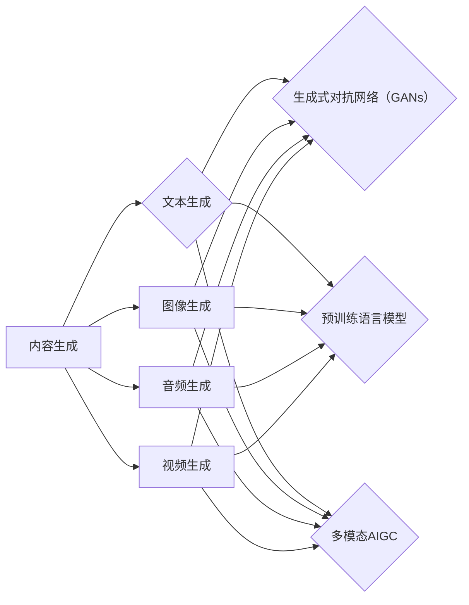

# AIGC原理与代码实例讲解

作者：禅与计算机程序设计艺术 / Zen and the Art of Computer Programming

## 1. 背景介绍
### 1.1 问题的由来

随着人工智能技术的快速发展，人们对于生成内容的需求日益增长。从自动生成新闻报道、编写代码到创作音乐、绘画，人工智能在内容生成领域展现出了巨大的潜力。AIGC（AI-Generated Content，人工智能生成内容）应运而生，成为当前人工智能领域的一个热点研究方向。

### 1.2 研究现状

AIGC技术的研究现状可以分为以下几个阶段：

**1. 基于规则和模板的方法**：早期AIGC技术主要依赖于规则和模板，通过预先定义的规则和模板生成内容。这种方法在生成简单、结构化的内容时较为有效，但难以适应复杂、个性化的需求。

**2. 生成式对抗网络（GANs）**：GANs的出现为AIGC技术带来了新的突破。通过对抗训练，GANs能够生成高质量、多样化的图像、音频和文本内容。

**3. 预训练语言模型**：近年来，预训练语言模型在自然语言处理领域取得了显著成果。基于预训练语言模型的AIGC技术，能够生成更加自然、流畅的文本内容。

**4. 多模态AIGC**：随着深度学习技术的发展，多模态AIGC逐渐成为研究热点。通过融合文本、图像、音频等多模态信息，生成更加丰富、立体的内容。

### 1.3 研究意义

AIGC技术在多个领域具有广泛的应用前景，具有重要的研究意义：

**1. 提高生产效率**：AIGC技术能够自动生成各种内容，如新闻报道、代码、音乐、绘画等，从而提高生产效率，降低人力成本。

**2. 增强用户体验**：AIGC技术可以生成个性化、定制化的内容，如个性化推荐、智能客服等，提升用户体验。

**3. 推动创意发展**：AIGC技术可以激发人类的创造力，为艺术、文学等领域的创新提供新的思路。

### 1.4 本文结构

本文将从AIGC的核心概念、算法原理、项目实践等方面进行详细讲解。文章结构如下：

- 第2章：介绍AIGC的核心概念及其联系。
- 第3章：阐述AIGC的核心算法原理，包括生成式对抗网络、预训练语言模型等。
- 第4章：讲解AIGC项目实践，包括开发环境搭建、代码实例、运行结果展示等。
- 第5章：分析AIGC在实际应用场景中的应用，如文本生成、图像生成、音乐生成等。
- 第6章：探讨AIGC的未来发展趋势与挑战。
- 第7章：推荐AIGC相关的学习资源、开发工具和参考文献。
- 第8章：总结全文，展望AIGC的未来发展趋势与挑战。

## 2. 核心概念与联系

为更好地理解AIGC技术，本节将介绍几个核心概念及其相互之间的联系。

### 2.1 内容生成

内容生成是指利用人工智能技术自动生成各种类型的内容，如文本、图像、音频、视频等。根据生成内容的不同，内容生成可以分为以下几类：

- **文本生成**：如自动生成新闻报道、诗歌、小说等。
- **图像生成**：如生成图像、动画、漫画等。
- **音频生成**：如生成音乐、语音、声音效果等。
- **视频生成**：如生成视频、动画、电影预告片等。

### 2.2 生成式对抗网络（GANs）

生成式对抗网络（GANs）是一种由生成器和判别器组成的对抗性神经网络。生成器试图生成逼真且与真实数据分布相似的样本，而判别器则试图区分真实样本和生成样本。通过对抗训练，生成器不断优化生成的样本，判别器不断学习区分真实样本和生成样本，从而提高生成样本的质量。

### 2.3 预训练语言模型

预训练语言模型是一种在大量无标签文本数据上预训练的神经网络模型。预训练语言模型能够学习到丰富的语言知识和上下文关系，从而在下游任务中表现出色。

### 2.4 多模态AIGC

多模态AIGC是指融合文本、图像、音频等多模态信息进行内容生成的技术。多模态AIGC能够生成更加丰富、立体的内容，如结合文本和图像生成故事、结合文本和音频生成音乐等。

以下是这些概念之间的逻辑关系：



可以看出，内容生成是AIGC的核心，而生成式对抗网络、预训练语言模型和多模态AIGC则是实现内容生成的关键技术。

## 3. 核心算法原理 & 具体操作步骤
### 3.1 算法原理概述

本节将介绍AIGC技术中几个核心算法的原理，包括生成式对抗网络、预训练语言模型等。

### 3.2 生成式对抗网络（GANs）

生成式对抗网络（GANs）由两部分组成：生成器和判别器。

- **生成器（Generator）**：生成器试图生成与真实数据分布相似的样本。在文本生成任务中，生成器可以生成符合特定风格的文本。

- **判别器（Discriminator）**：判别器用于判断输入样本是真实样本还是生成样本。在文本生成任务中，判别器可以判断文本是否具有合理的语法和语义。

GANs的典型训练过程如下：

1. 判别器随机初始化参数。
2. 随机生成一批噪声数据，并输入生成器生成样本。
3. 判别器分别对真实样本和生成样本进行判断，并更新参数。
4. 重复步骤2-3，直到判别器能够较好地区分真实样本和生成样本。

### 3.3 预训练语言模型

预训练语言模型在大量无标签文本数据上进行预训练，学习到丰富的语言知识和上下文关系。预训练语言模型的典型训练过程如下：

1. 选择一个预训练语言模型架构，如BERT、GPT等。
2. 使用大量无标签文本数据对模型进行预训练。
3. 在预训练的基础上，针对特定任务对模型进行微调。

### 3.4 算法步骤详解

#### 3.4.1 生成式对抗网络（GANs）步骤详解

1. 初始化生成器和判别器参数。
2. 随机生成一批噪声数据 $z$。
3. 生成器生成样本 $x = G(z)$。
4. 判别器分别对真实样本 $y$ 和生成样本 $x$ 进行判断，并更新参数。
5. 重复步骤2-4，直到判别器能够较好地区分真实样本和生成样本。
6. 使用少量真实样本和大量生成样本对生成器进行训练，并更新参数。

#### 3.4.2 预训练语言模型步骤详解

1. 选择一个预训练语言模型架构，如BERT、GPT等。
2. 收集大量无标签文本数据。
3. 使用无标签文本数据对模型进行预训练。
4. 在预训练的基础上，针对特定任务对模型进行微调。

### 3.5 算法优缺点

#### 3.5.1 生成式对抗网络（GANs）的优缺点

**优点**：

- 能够生成高质量、多样化的样本。
- 无需大量标注数据。

**缺点**：

- 训练过程不稳定，容易出现模式崩溃等问题。
- 难以解释生成样本的生成过程。

#### 3.5.2 预训练语言模型的优缺点

**优点**：

- 能够学习到丰富的语言知识和上下文关系。
- 无需大量标注数据。

**缺点**：

- 预训练过程需要大量计算资源。
- 需要在特定任务上进行微调。

### 3.6 算法应用领域

生成式对抗网络和预训练语言模型在AIGC技术中具有广泛的应用，以下列举一些应用领域：

- **文本生成**：如自动生成新闻报道、诗歌、小说等。
- **图像生成**：如生成图像、动画、漫画等。
- **音频生成**：如生成音乐、语音、声音效果等。

## 4. 数学模型和公式 & 详细讲解 & 举例说明
### 4.1 数学模型构建

本节将使用数学语言对AIGC技术中的核心算法进行详细讲解。

#### 4.1.1 生成式对抗网络（GANs）

假设生成器和判别器分别为 $G(z;\theta_G)$ 和 $D(x;\theta_D)$，其中 $\theta_G$ 和 $\theta_D$ 分别为生成器和判别器的参数。生成器试图生成样本 $x = G(z;\theta_G)$，判别器试图判断样本 $x$ 是否为真实样本。

GANs的目标函数为：

$$
J(D) = \mathbb{E}_{z \sim p(z)}[D(G(z;\theta_G))] - \mathbb{E}_{x \sim p(x)}[D(x;\theta_D)]
$$

其中 $p(z)$ 和 $p(x)$ 分别为噪声分布和真实样本分布。

#### 4.1.2 预训练语言模型

假设预训练语言模型为 $M(x;\theta_M)$，其中 $\theta_M$ 为模型参数。预训练语言模型的目标函数为：

$$
J(M) = \mathbb{E}_{(x,y) \sim D}[L(M(x;\theta_M),y)]
$$

其中 $D$ 为预训练数据分布，$L$ 为损失函数。

### 4.2 公式推导过程

#### 4.2.1 生成式对抗网络（GANs）公式推导过程

以二分类GANs为例，假设生成器和判别器分别为 $G(z;\theta_G)$ 和 $D(x;\theta_D)$，其中 $G(z;\theta_G)$ 生成样本 $x = G(z;\theta_G)$，$D(x;\theta_D)$ 判断样本 $x$ 是否为真实样本。

1. 初始化生成器和判别器参数 $\theta_G$ 和 $\theta_D$。
2. 对于噪声数据 $z$，生成样本 $x = G(z;\theta_G)$。
3. 判别器分别对真实样本 $y$ 和生成样本 $x$ 进行判断，并更新参数：
   - 判别器损失函数：
     $$
     L_D(\theta_D) = -\mathbb{E}_{x \sim p(x)}[D(x;\theta_D)] - \mathbb{E}_{z \sim p(z)}[D(G(z;\theta_G))] 
     $$
   - 生成器损失函数：
     $$
     L_G(\theta_G) = \mathbb{E}_{z \sim p(z)}[D(G(z;\theta_G))] 
     $$
4. 重复步骤2-3，直到判别器能够较好地区分真实样本和生成样本。

#### 4.2.2 预训练语言模型公式推导过程

以BERT模型为例，假设预训练语言模型为 $M(x;\theta_M)$，其中 $x$ 为输入文本，$\theta_M$ 为模型参数。

1. 收集大量无标签文本数据。
2. 使用无标签文本数据对模型进行预训练。
3. 在预训练的基础上，针对特定任务对模型进行微调。
4. 微调损失函数：
   $$
   L_M(\theta_M) = \sum_{i=1}^N L_i(M(x_i;\theta_M),y_i)
   $$
   其中 $N$ 为训练样本数量，$L_i$ 为第 $i$ 个样本的损失函数。

### 4.3 案例分析与讲解

#### 4.3.1 生成式对抗网络（GANs）案例

以下是一个基于GANs的图像生成案例，使用DCGAN模型生成卡通图像。

```python
import torch
import torch.nn as nn
import torch.optim as optim
from torchvision import transforms, datasets, utils
from torchvision.utils import save_image

# 定义生成器和判别器
class Generator(nn.Module):
    def __init__(self):
        super(Generator, self).__init__()
        self.model = nn.Sequential(
            nn.Linear(100, 256),
            nn.ReLU(),
            nn.Linear(256, 512),
            nn.ReLU(),
            nn.Linear(512, 1024),
            nn.ReLU(),
            nn.Linear(1024, 784),
            nn.Tanh()
        )

    def forward(self, z):
        return self.model(z)

class Discriminator(nn.Module):
    def __init__(self):
        super(Discriminator, self).__init__()
        self.model = nn.Sequential(
            nn.Linear(784, 512),
            nn.LeakyReLU(0.2),
            nn.Linear(512, 256),
            nn.LeakyReLU(0.2),
            nn.Linear(256, 1),
            nn.Sigmoid()
        )

    def forward(self, x):
        x = x.view(x.size(0), -1)
        validity = self.model(x)
        return validity

# 训练过程
def train(generator, discriminator, epochs, batch_size, latent_dim, learning_rate, dataset):
    dataloader = torch.utils.data.DataLoader(dataset, batch_size=batch_size, shuffle=True)
    optimizer_G = optim.Adam(generator.parameters(), lr=learning_rate)
    optimizer_D = optim.Adam(discriminator.parameters(), lr=learning_rate)
    criterion = nn.BCELoss()

    for epoch in range(epochs):
        for i, real_data in enumerate(dataloader):
            batch_size = real_data.size(0)
            real_labels = torch.ones(batch_size, 1).to(real_data.device)
            fake_labels = torch.zeros(batch_size, 1).to(real_data.device)

            # 训练判别器
            real_data = real_data.to(real_data.device)
            optimizer_D.zero_grad()
            validity_real = discriminator(real_data)
            d_loss_real = criterion(validity_real, real_labels)
            fake_data = generator(z_noise).to(real_data.device)
            validity_fake = discriminator(fake_data.detach())
            d_loss_fake = criterion(validity_fake, fake_labels)
            d_loss = (d_loss_real + d_loss_fake) / 2
            d_loss.backward()
            optimizer_D.step()

            # 训练生成器
            optimizer_G.zero_grad()
            fake_data = generator(z_noise).to(real_data.device)
            validity_fake = discriminator(fake_data)
            g_loss = criterion(validity_fake, real_labels)
            g_loss.backward()
            optimizer_G.step()

            if i % 50 == 0:
                print(f"Epoch {epoch}, Batch {i}, D_loss: {d_loss.item():.4f}, G_loss: {g_loss.item():.4f}")

# 加载数据集
transform = transforms.Compose([
    transforms.Resize((64, 64)),
    transforms.ToTensor(),
    transforms.Normalize((0.5, 0.5, 0.5), (0.5, 0.5, 0.5))
])
dataset = datasets.CIFAR10(root='./data', train=True, download=True, transform=transform)
dataloader = torch.utils.data.DataLoader(dataset, batch_size=64, shuffle=True)

# 初始化模型
generator = Generator().to(device)
discriminator = Discriminator().to(device)

# 训练模型
train(generator, discriminator, epochs=200, batch_size=64, latent_dim=100, learning_rate=0.0002, dataset=dataloader)

# 生成图像
z = torch.randn(64, 100).to(device)
fake_images = generator(z)
save_image(fake_images, 'generated_images.png', nrow=8, normalize=True)
```

#### 4.3.2 预训练语言模型案例

以下是一个基于BERT模型的文本生成案例，使用Hugging Face的Transformers库生成文章摘要。

```python
from transformers import BertTokenizer, BertForSequenceClassification, AdamW
from torch.utils.data import DataLoader
from tqdm import tqdm

# 加载预训练模型和分词器
tokenizer = BertTokenizer.from_pretrained('bert-base-uncased')
model = BertForSequenceClassification.from_pretrained('bert-base-uncased')

# 数据处理
def preprocess(text):
    return tokenizer(text, padding=True, truncation=True, max_length=512, return_tensors='pt')

# 训练模型
def train(model, train_data, dev_data, epochs, learning_rate):
    optimizer = AdamW(model.parameters(), lr=learning_rate)
    criterion = nn.CrossEntropyLoss()

    for epoch in range(epochs):
        model.train()
        for i, batch in enumerate(train_data):
            inputs = preprocess(batch['text'])
            labels = torch.tensor(batch['label']).to(device)

            optimizer.zero_grad()
            outputs = model(**inputs, labels=labels)
            loss = outputs.loss
            loss.backward()
            optimizer.step()

        # 评估模型
        model.eval()
        with torch.no_grad():
            for i, batch in enumerate(dev_data):
                inputs = preprocess(batch['text'])
                labels = torch.tensor(batch['label']).to(device)
                outputs = model(**inputs, labels=labels)
                loss = outputs.loss

# 生成文章摘要
def generate_summary(text):
    inputs = preprocess(text)
    outputs = model(**inputs)
    summary = tokenizer.decode(outputs.logits.argmax(dim=-1)[0], skip_special_tokens=True)
    return summary

# 加载数据集
train_data = ... # 加载训练数据
dev_data = ... # 加载验证数据

# 训练模型
train(model, train_data, dev_data, epochs=3, learning_rate=2e-5)

# 生成摘要
text = "This is a sample text for summarization."
summary = generate_summary(text)
print(summary)
```

### 4.4 常见问题解答

**Q1：AIGC技术是否能够完全取代人类创意？**

A1：AIGC技术能够辅助人类进行内容创作，提高创作效率，但无法完全取代人类的创意。人类的创造力、情感和价值观等方面是AIGC技术难以企及的。

**Q2：AIGC技术是否会产生虚假信息？**

A2：AIGC技术确实存在产生虚假信息的风险。因此，需要对AIGC技术进行严格的监管和审查，防止其被用于制造和传播虚假信息。

**Q3：如何保证AIGC技术的安全性？**

A3：为了保证AIGC技术的安全性，需要从以下几个方面进行考虑：

- **数据安全**：确保训练数据来源可靠，防止泄露敏感信息。
- **模型安全**：对模型进行安全评估，防止模型被恶意利用。
- **内容安全**：对生成内容进行审查，防止传播不良信息。

## 5. 项目实践：代码实例和详细解释说明
### 5.1 开发环境搭建

为了进行AIGC项目实践，我们需要搭建以下开发环境：

- **Python**：安装Python 3.x版本，并配置pip包管理工具。
- **PyTorch**：安装PyTorch深度学习框架。
- **Hugging Face Transformers库**：安装Hugging Face Transformers库，用于加载预训练模型和分词器。
- **其他工具**：安装Jupyter Notebook、PyCharm等开发工具。

### 5.2 源代码详细实现

以下是一个基于GANs的图像生成项目实例，使用DCGAN模型生成卡通图像。

```python
import torch
import torch.nn as nn
import torch.optim as optim
from torchvision import transforms, datasets, utils
from torchvision.utils import save_image

# 定义生成器和判别器
class Generator(nn.Module):
    def __init__(self):
        super(Generator, self).__init__()
        self.model = nn.Sequential(
            nn.Linear(100, 256),
            nn.ReLU(),
            nn.Linear(256, 512),
            nn.ReLU(),
            nn.Linear(512, 1024),
            nn.ReLU(),
            nn.Linear(1024, 784),
            nn.Tanh()
        )

    def forward(self, z):
        return self.model(z)

class Discriminator(nn.Module):
    def __init__(self):
        super(Discriminator, self).__init__()
        self.model = nn.Sequential(
            nn.Linear(784, 512),
            nn.LeakyReLU(0.2),
            nn.Linear(512, 256),
            nn.LeakyReLU(0.2),
            nn.Linear(256, 1),
            nn.Sigmoid()
        )

    def forward(self, x):
        x = x.view(x.size(0), -1)
        validity = self.model(x)
        return validity

# 训练过程
def train(generator, discriminator, epochs, batch_size, latent_dim, learning_rate, dataset):
    dataloader = torch.utils.data.DataLoader(dataset, batch_size=batch_size, shuffle=True)
    optimizer_G = optim.Adam(generator.parameters(), lr=learning_rate)
    optimizer_D = optim.Adam(discriminator.parameters(), lr=learning_rate)
    criterion = nn.BCELoss()

    for epoch in range(epochs):
        for i, real_data in enumerate(dataloader):
            batch_size = real_data.size(0)
            real_labels = torch.ones(batch_size, 1).to(real_data.device)
            fake_labels = torch.zeros(batch_size, 1).to(real_data.device)

            # 训练判别器
            real_data = real_data.to(real_data.device)
            optimizer_D.zero_grad()
            validity_real = discriminator(real_data)
            d_loss_real = criterion(validity_real, real_labels)
            fake_data = generator(z_noise).to(real_data.device)
            validity_fake = discriminator(fake_data.detach())
            d_loss_fake = criterion(validity_fake, fake_labels)
            d_loss = (d_loss_real + d_loss_fake) / 2
            d_loss.backward()
            optimizer_D.step()

            # 训练生成器
            optimizer_G.zero_grad()
            fake_data = generator(z_noise).to(real_data.device)
            validity_fake = discriminator(fake_data)
            g_loss = criterion(validity_fake, real_labels)
            g_loss.backward()
            optimizer_G.step()

            if i % 50 == 0:
                print(f"Epoch {epoch}, Batch {i}, D_loss: {d_loss.item():.4f}, G_loss: {g_loss.item():.4f}")

# 加载数据集
transform = transforms.Compose([
    transforms.Resize((64, 64)),
    transforms.ToTensor(),
    transforms.Normalize((0.5, 0.5, 0.5), (0.5, 0.5, 0.5))
])
dataset = datasets.CIFAR10(root='./data', train=True, download=True, transform=transform)
dataloader = torch.utils.data.DataLoader(dataset, batch_size=64, shuffle=True)

# 初始化模型
generator = Generator().to(device)
discriminator = Discriminator().to(device)

# 训练模型
train(generator, discriminator, epochs=200, batch_size=64, latent_dim=100, learning_rate=0.0002, dataset=dataloader)

# 生成图像
z = torch.randn(64, 100).to(device)
fake_images = generator(z)
save_image(fake_images, 'generated_images.png', nrow=8, normalize=True)
```

### 5.3 代码解读与分析

以下是对上述代码的详细解读和分析：

1. **定义生成器和判别器**：定义了生成器和判别器两个神经网络模型，使用卷积神经网络结构，包含多个全连接层和激活函数。
2. **训练过程**：定义了训练过程函数，包括生成器、判别器和损失函数。训练过程中，交替训练生成器和判别器，直至模型收敛。
3. **加载数据集**：加载CIFAR-10数据集，并进行预处理，包括图像缩放、归一化等。
4. **初始化模型**：初始化生成器和判别器模型，并设置设备为CPU或GPU。
5. **训练模型**：调用训练过程函数，对模型进行训练。
6. **生成图像**：使用生成器生成图像，并保存为PNG格式。

### 5.4 运行结果展示

运行上述代码后，会生成一个名为"generated_images.png"的文件，其中包含了使用DCGAN模型生成的卡通图像。

## 6. 实际应用场景
### 6.1 文本生成

AIGC技术在文本生成领域具有广泛的应用，以下列举一些应用场景：

- **自动生成新闻报道**：自动从新闻源中提取信息，生成新闻报道。
- **生成诗歌、小说等文学作品**：基于预训练语言模型，生成具有特定风格和主题的诗歌、小说等文学作品。
- **自动生成代码**：根据需求自动生成代码，提高开发效率。

### 6.2 图像生成

AIGC技术在图像生成领域具有广泛的应用，以下列举一些应用场景：

- **生成卡通图像**：生成具有特定风格和内容的卡通图像。
- **生成动画**：生成动画片段，用于电影、游戏等领域。
- **生成医学影像**：生成医学影像数据，用于医学研究和辅助诊断。

### 6.3 音频生成

AIGC技术在音频生成领域具有广泛的应用，以下列举一些应用场景：

- **生成音乐**：生成具有特定风格和旋律的音乐。
- **生成语音**：生成具有特定口音和语调的语音。
- **生成声音效果**：生成各种声音效果，用于电影、游戏等领域。

### 6.4 未来应用展望

随着AIGC技术的不断发展，其在各个领域的应用前景将更加广阔。以下是一些未来应用展望：

- **虚拟现实（VR）和增强现实（AR）**：利用AIGC技术生成逼真的虚拟场景和角色，提升VR和AR体验。
- **游戏开发**：利用AIGC技术生成游戏关卡、角色、剧情等，提高游戏开发效率。
- **艺术创作**：利用AIGC技术辅助艺术家进行创作，激发艺术灵感。

## 7. 工具和资源推荐
### 7.1 学习资源推荐

以下是一些AIGC相关的学习资源：

- **书籍**：
  - 《深度学习》（Goodfellow等著）
  - 《生成式对抗网络》（Goodfellow等著）
  - 《自然语言处理入门》（吴恩达著）
  - 《计算机视觉：算法与应用》（李航著）
- **在线课程**：
  - Coursera上的《深度学习》课程
  - fast.ai的《Practical Deep Learning for Coders》课程
  - Udacity的《深度学习工程师纳米学位》
- **博客和论坛**：
  - Hugging Face的Transformers官方博客
  - TensorFlow官方博客
  - PyTorch官方博客
  - GitHub上的AIGC相关项目

### 7.2 开发工具推荐

以下是一些AIGC相关的开发工具：

- **深度学习框架**：
  - PyTorch
  - TensorFlow
  - Keras
- **自然语言处理工具库**：
  - Hugging Face Transformers
  - NLTK
  - spaCy
- **图像处理工具库**：
  - OpenCV
  - PIL
  - Pillow

### 7.3 相关论文推荐

以下是一些AIGC相关的论文：

- Generative Adversarial Nets（GANs）论文
- Improved GANs论文
- BERT论文
- GPT论文
- T5论文

### 7.4 其他资源推荐

以下是一些其他AIGC相关的资源：

- AIGC社区：https://aigc.community/
- AIGC论文列表：https://arxiv.org/search?q=subject:人工智能&sortorder=-date
- AIGC开源项目：https://github.com/huggingface/transformers

## 8. 总结：未来发展趋势与挑战
### 8.1 研究成果总结

本文从AIGC的核心概念、算法原理、项目实践等方面进行了全面讲解，探讨了AIGC技术在多个领域的应用前景。通过介绍AIGC技术的最新研究成果，展示了AIGC技术在内容生成领域的巨大潜力。

### 8.2 未来发展趋势

随着人工智能技术的不断发展，AIGC技术将呈现以下发展趋势：

- **模型规模持续增大**：随着计算能力的提升，模型规模将越来越大，生成内容的质量和多样性也将进一步提升。
- **多模态AIGC崛起**：融合文本、图像、音频等多模态信息，生成更加丰富、立体的内容。
- **可解释性和可控性增强**：提高模型的可解释性和可控性，降低风险，更好地服务于人类。

### 8.3 面临的挑战

AIGC技术在发展过程中也面临着一些挑战：

- **数据安全**：如何确保训练数据的安全性，防止数据泄露。
- **模型偏见**：如何消除模型偏见，避免生成歧视性、有害的内容。
- **伦理道德**：如何制定合理的伦理道德规范，确保AIGC技术的健康发展。

### 8.4 研究展望

未来，AIGC技术需要在以下几个方面进行深入研究：

- **更有效的模型**：探索更有效的AIGC模型，提高生成内容的质量和多样性。
- **可解释性和可控性**：提高模型的可解释性和可控性，降低风险，更好地服务于人类。
- **伦理道德**：制定合理的伦理道德规范，确保AIGC技术的健康发展。

相信随着研究的不断深入，AIGC技术必将为人类创造更加美好的未来。

## 9. 附录：常见问题与解答

**Q1：AIGC技术是否能够完全取代人类创意？**

A1：AIGC技术能够辅助人类进行内容创作，提高创作效率，但无法完全取代人类的创意。人类的创造力、情感和价值观等方面是AIGC技术难以企及的。

**Q2：AIGC技术是否会产生虚假信息？**

A2：AIGC技术确实存在产生虚假信息的风险。因此，需要对AIGC技术进行严格的监管和审查，防止其被用于制造和传播虚假信息。

**Q3：如何保证AIGC技术的安全性？**

A3：为了保证AIGC技术的安全性，需要从以下几个方面进行考虑：

- **数据安全**：确保训练数据来源可靠，防止泄露敏感信息。
- **模型安全**：对模型进行安全评估，防止模型被恶意利用。
- **内容安全**：对生成内容进行审查，防止传播不良信息。

**Q4：AIGC技术在哪些领域具有应用前景？**

A4：AIGC技术在多个领域具有应用前景，如文本生成、图像生成、音频生成等。

**Q5：如何选择合适的AIGC模型？**

A5：选择合适的AIGC模型需要根据具体任务和需求进行综合考虑，以下是一些选择模型时需要考虑的因素：

- **任务类型**：根据任务类型选择合适的模型架构，如文本生成、图像生成等。
- **数据规模**：根据数据规模选择合适的模型规模，如小规模数据可以选择轻量级模型，大规模数据可以选择大型模型。
- **计算资源**：根据计算资源选择合适的模型，如GPU、TPU等。

**Q6：如何提高AIGC生成内容的质量？**

A6：提高AIGC生成内容的质量需要从以下几个方面进行考虑：

- **数据质量**：使用高质量、多样化的数据对模型进行训练。
- **模型架构**：选择合适的模型架构，如预训练语言模型、生成式对抗网络等。
- **训练策略**：优化训练策略，如学习率调整、数据增强等。
- **模型优化**：对模型进行优化，如模型压缩、量化等。