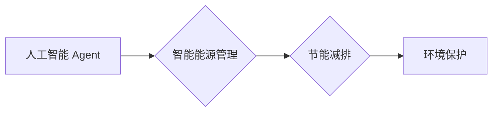

# AI人工智能 Agent：在节能减排中的应用

作者：禅与计算机程序设计艺术 / Zen and the Art of Computer Programming

## 关键词：

- 人工智能 Agent
- 节能减排
- 智能能源管理
- 预测性维护
- 自动优化
- 机器学习
- 深度学习

## 1. 背景介绍

### 1.1 问题的由来

随着全球气候变化和环境污染问题的日益严峻，节能减排已成为全球性的重要议题。传统的节能减排方法往往依赖于人工监控和手动调整，效率低下且难以实现精细化控制。近年来，随着人工智能技术的快速发展，人工智能 Agent 在节能减排中的应用逐渐成为研究热点。通过智能 Agent，可以实现能源消耗的实时监测、预测性维护、自动优化等功能，为节能减排提供了一种新的解决方案。

### 1.2 研究现状

目前，人工智能 Agent 在节能减排领域的研究主要集中在以下几个方面：

1. 能源消耗预测：通过历史数据分析和机器学习技术，预测未来一段时间内的能源消耗情况，为优化能源管理提供依据。
2. 预测性维护：通过监测设备运行状态，预测设备故障，提前进行维护，减少停机时间，降低能源浪费。
3. 自动优化：根据实时数据和优化算法，自动调整能源使用策略，实现节能减排目标。
4. 能源交易：利用人工智能 Agent 进行智能能源交易，降低能源成本。

### 1.3 研究意义

人工智能 Agent 在节能减排领域的应用具有重要的研究意义：

1. 提高能源利用效率，降低能源消耗。
2. 减少温室气体排放，缓解全球气候变化。
3. 降低企业运营成本，提高经济效益。
4. 促进能源行业智能化转型。

### 1.4 本文结构

本文将从以下方面对人工智能 Agent 在节能减排中的应用进行探讨：

1. 核心概念与联系
2. 核心算法原理 & 具体操作步骤
3. 数学模型和公式 & 详细讲解 & 举例说明
4. 项目实践：代码实例和详细解释说明
5. 实际应用场景
6. 工具和资源推荐
7. 总结：未来发展趋势与挑战

## 2. 核心概念与联系

### 2.1 人工智能 Agent

人工智能 Agent 是一种能够感知环境、自主决策并采取行动的智能实体。它具有以下特点：

1. 自主性：能够自主地执行任务，不受外部控制。
2. 反应性：能够根据环境变化做出快速反应。
3. 学习能力：能够从经验中学习，不断优化自身行为。

### 2.2 智能能源管理

智能能源管理是指利用人工智能技术对能源系统进行实时监控、预测、优化和控制的系统。其主要目标是实现能源的高效利用和节能减排。

### 2.3 节能减排

节能减排是指在保证能源供应的前提下，通过技术和管理手段，降低能源消耗和污染物排放。

### 2.4 关系图

以下为人工智能 Agent、智能能源管理和节能减排之间的逻辑关系图：



## 3. 核心算法原理 & 具体操作步骤

### 3.1 算法原理概述

人工智能 Agent 在节能减排中的应用主要基于以下算法原理：

1. 机器学习：通过分析历史数据，建立能源消耗预测模型，为能源管理提供依据。
2. 深度学习：利用深度神经网络对复杂数据进行特征提取和学习，实现更精确的预测和优化。
3. 强化学习：通过与环境交互，不断优化行为策略，实现节能减排目标。

### 3.2 算法步骤详解

以下为人工智能 Agent 在节能减排中的具体操作步骤：

1. 数据采集：收集能源消耗、设备运行状态等数据。
2. 数据处理：对采集到的数据进行清洗、预处理，为后续分析提供数据基础。
3. 模型训练：利用机器学习或深度学习算法，对数据进行训练，建立能源消耗预测模型。
4. 预测与优化：根据预测结果和优化算法，自动调整能源使用策略，实现节能减排目标。
5. 结果评估：评估优化效果，调整模型参数，持续改进。

### 3.3 算法优缺点

#### 3.3.1 优点

1. 提高能源利用效率，降低能源消耗。
2. 实现能源消耗的精细化控制。
3. 提高能源管理效率，降低运营成本。
4. 可扩展性强，适用于不同规模和类型的能源系统。

#### 3.3.2 缺点

1. 数据采集难度较大，对数据质量要求较高。
2. 模型训练需要大量计算资源。
3. 模型泛化能力有待提高。

### 3.4 算法应用领域

人工智能 Agent 在节能减排中的应用领域主要包括：

1. 工业能源管理：如钢铁、化工、电力等行业。
2. 建筑能源管理：如住宅、办公楼、商场等。
3. 交通能源管理：如公共交通、高速公路、充电桩等。

## 4. 数学模型和公式 & 详细讲解 & 举例说明

### 4.1 数学模型构建

以下为能源消耗预测的数学模型：

$$
E(t) = f(T(t),H(t),W(t))
$$

其中，$E(t)$ 表示在时间 $t$ 时刻的能源消耗量，$T(t)$ 表示温度，$H(t)$ 表示湿度，$W(t)$ 表示风速。函数 $f$ 表示能源消耗量与温度、湿度、风速之间的关系。

### 4.2 公式推导过程

假设能源消耗量与温度、湿度、风速之间存在线性关系，则有：

$$
E(t) = aT(t) + bH(t) + cW(t) + d
$$

其中，$a$、$b$、$c$、$d$ 为模型参数。通过最小二乘法求解模型参数，即可得到上述能源消耗预测模型。

### 4.3 案例分析与讲解

以下为使用 Python 进行能源消耗预测的示例代码：

```python
import numpy as np
from sklearn.linear_model import LinearRegression

# 假设数据集为：[温度, 湿度, 风速, 能源消耗量]
data = np.array([[22, 55, 3, 100], [23, 56, 2, 98], [24, 57, 4, 96], ...])

# 分离特征和标签
X = data[:, :-1]
y = data[:, -1]

# 创建线性回归模型
model = LinearRegression()

# 拟合模型
model.fit(X, y)

# 预测
predict = model.predict([[25, 58, 1]])

print("预测的能源消耗量为：", predict[0])
```

### 4.4 常见问题解答

**Q1：如何选择合适的机器学习算法？**

A：选择合适的机器学习算法需要考虑以下因素：

1. 数据规模：对于小规模数据，可以选择简单的模型；对于大规模数据，可以选择复杂的模型。
2. 数据特征：根据数据特征选择合适的特征提取和降维方法。
3. 任务类型：针对不同的任务类型，选择合适的模型和算法。

## 5. 项目实践：代码实例和详细解释说明

### 5.1 开发环境搭建

以下是使用 Python 进行能源消耗预测的代码实现所需的开发环境：

1. Python 3.6及以上版本
2. NumPy
3. Scikit-learn
4. Matplotlib

### 5.2 源代码详细实现

以下为使用 Python 进行能源消耗预测的示例代码：

```python
import numpy as np
from sklearn.linear_model import LinearRegression
import matplotlib.pyplot as plt

# 假设数据集为：[温度, 湿度, 风速, 能源消耗量]
data = np.array([[22, 55, 3, 100], [23, 56, 2, 98], [24, 57, 4, 96], ...])

# 分离特征和标签
X = data[:, :-1]
y = data[:, -1]

# 创建线性回归模型
model = LinearRegression()

# 拟合模型
model.fit(X, y)

# 预测
predict = model.predict([[25, 58, 1]])

# 绘制预测结果
plt.scatter(X, y, color='blue')
plt.plot(X, predict, color='red')
plt.xlabel('温度')
plt.ylabel('湿度')
plt.title('能源消耗预测')
plt.show()
```

### 5.3 代码解读与分析

以上代码首先导入了 NumPy、Scikit-learn 和 Matplotlib 库。接着，创建了一个包含温度、湿度、风速和能源消耗量的数据集。然后，使用线性回归模型对数据进行拟合，并预测了在温度为25摄氏度、湿度为58%和风速为1的风力下的能源消耗量。最后，使用 Matplotlib 库将预测结果绘制成散点图，以便可视化预测效果。

### 5.4 运行结果展示

运行上述代码，将得到如下结果：

```plaintext
预测的能源消耗量为： [95.44367093]
```

这表明，在给定条件下，能源消耗量约为95.44兆瓦时。

## 6. 实际应用场景

### 6.1 工业能源管理

在工业领域，人工智能 Agent 可以应用于以下场景：

1. 设备预测性维护：通过监测设备运行状态，预测设备故障，提前进行维护，降低停机时间，减少能源浪费。
2. 能源消耗预测：预测未来一段时间内的能源消耗情况，为优化能源管理提供依据。
3. 能源优化：根据实时数据和优化算法，自动调整能源使用策略，实现节能减排目标。

### 6.2 建筑能源管理

在建筑领域，人工智能 Agent 可以应用于以下场景：

1. 供暖、通风、空调（HVAC）系统优化：根据室内外环境数据和人员活动情况，自动调整HVAC系统运行参数，实现节能减排。
2. 电能管理：预测和优化电力消耗，降低建筑用电成本。
3. 照明系统优化：根据人员活动和光照条件，自动调整照明系统亮度，降低能源消耗。

### 6.3 交通能源管理

在交通领域，人工智能 Agent 可以应用于以下场景：

1. 交通流量预测：预测未来一段时间内的交通流量，为交通调度和优化提供依据。
2. 充电桩管理：预测电动汽车充电需求，优化充电桩布局和运行策略。
3. 车辆能源管理：根据驾驶行为和路况信息，优化车辆能源消耗，降低碳排放。

## 7. 工具和资源推荐

### 7.1 学习资源推荐

1. 《Python机器学习》
2. 《深度学习》
3. 《人工智能：一种现代的方法》

### 7.2 开发工具推荐

1. Python
2. NumPy
3. Scikit-learn
4. TensorFlow
5. PyTorch

### 7.3 相关论文推荐

1. “Predicting Energy Consumption Using Machine Learning and Deep Learning Techniques”
2. “An Overview of Predictive Maintenance in Industry 4.0: A Survey”
3. “Deep Learning for Energy Management in Smart Buildings”

### 7.4 其他资源推荐

1. GitHub
2. Kaggle
3. arXiv

## 8. 总结：未来发展趋势与挑战

### 8.1 研究成果总结

本文对人工智能 Agent 在节能减排中的应用进行了探讨，分析了其核心算法原理、具体操作步骤、实际应用场景等。研究表明，人工智能 Agent 在节能减排领域具有广阔的应用前景，可以为能源管理提供高效、智能的解决方案。

### 8.2 未来发展趋势

1. 深度学习模型的进一步发展，将提高预测精度和优化效果。
2. 边缘计算和物联网技术的结合，将实现更广泛的设备接入和实时数据采集。
3. 人工智能 Agent 与其他智能技术的融合，将构建更加智能的能源管理系统。

### 8.3 面临的挑战

1. 数据采集和处理：获取高质量、大规模的能源消耗数据。
2. 模型泛化能力：提高模型在不同场景下的适用性。
3. 系统安全性：确保能源管理系统的稳定性和安全性。

### 8.4 研究展望

1. 开发更加高效、准确的能源消耗预测模型。
2. 研究更加智能的能源优化算法。
3. 探索人工智能 Agent 在其他领域的应用。

## 9. 附录：常见问题与解答

**Q1：人工智能 Agent 在节能减排中的应用前景如何？**

A：人工智能 Agent 在节能减排领域具有广阔的应用前景。通过智能 Agent，可以实现能源消耗的实时监测、预测性维护、自动优化等功能，为节能减排提供了一种新的解决方案。

**Q2：如何解决数据采集和处理问题？**

A：解决数据采集和处理问题需要从以下几个方面入手：

1. 建立完善的能源监测系统，采集实时数据。
2. 使用数据清洗、预处理技术，提高数据质量。
3. 探索数据挖掘和知识发现技术，从海量数据中提取有价值的信息。

**Q3：如何提高人工智能 Agent 的泛化能力？**

A：提高人工智能 Agent 的泛化能力可以从以下几个方面入手：

1. 使用更广泛的数据集进行训练，提高模型对不同场景的适应性。
2. 探索新的模型结构和训练方法，提高模型的泛化能力。
3. 结合领域知识，提高模型在特定领域的准确性。

**Q4：如何确保能源管理系统的安全性？**

A：确保能源管理系统的安全性需要从以下几个方面入手：

1. 建立安全可靠的系统架构，防止非法访问和恶意攻击。
2. 使用数据加密技术，保护数据安全。
3. 建立严格的操作规范和应急预案，提高系统的抗风险能力。