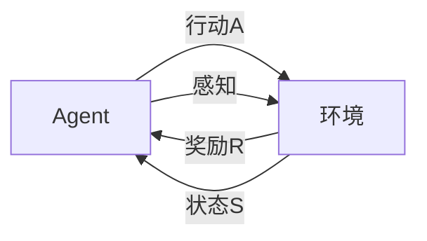

# AI人工智能 Agent：智能体与环境的交互理论

关键词：人工智能、智能Agent、环境交互、决策、学习、适应

## 1. 背景介绍
### 1.1  问题的由来
人工智能(Artificial Intelligence, AI)是计算机科学领域最具挑战性和前景的方向之一。而智能Agent作为AI的核心概念,是实现智能系统的关键。Agent如何与环境进行交互,从环境中学习和适应,进而做出最优决策,是人工智能领域的核心问题。

### 1.2  研究现状
目前,智能Agent的研究已取得了长足进展。从早期的反射型Agent、目标型Agent,到现在的学习型Agent、推理型Agent,智能体的能力不断增强。强化学习、深度学习等算法的出现,极大地提升了Agent的学习和决策水平。但如何构建更加智能、高效、鲁棒的Agent,仍然是亟待攻克的难题。

### 1.3  研究意义 
智能Agent技术在机器人、自动驾驶、智能助理、金融投资等诸多领域有广泛应用前景。深入研究Agent与环境的交互机理,对于推动人工智能的发展、解决实际应用问题具有重要意义。同时,它也有助于我们从信息论、控制论的角度来重新审视人类智能的本质。

### 1.4  本文结构
本文将分为以下几个部分：首先介绍Agent的核心概念及其与环境的关系；然后重点阐述几种主要的Agent决策算法原理；接着从数学角度对相关模型进行推导和案例分析；进而通过代码实例演示如何实现一个智能Agent系统；并讨论Agent技术在实际场景中的应用；最后总结全文,并对未来Agent的发展趋势和挑战进行展望。

## 2. 核心概念与联系
智能Agent是一个可以感知环境并采取行动的自主实体。它与环境之间存在着感知、决策、行动的交互循环。具体而言：

- 环境状态(State): Agent所处的环境在某一时刻的状态S。
- 行动(Action): Agent基于对环境的感知,采取的行动A。
- 奖励(Reward): 环境对Agent行动的反馈,用R表示。
- 策略(Policy): Agent的决策函数,即基于当前状态S选择行动A的映射π。
- 价值(Value): 衡量某一状态的长期奖励,即V(s)。
- 状态转移(Transition): 环境状态随Agent的行动发生转移,用T(s'|s,a)表示从状态s经过行动a到达状态s'的概率。

Agent与环境之间的关系可以用下图表示:



## 3. 核心算法原理 & 具体操作步骤
### 3.1  算法原理概述
智能Agent的核心是如何根据环境状态做出最优决策。主要有以下几类算法:

- 基于搜索的方法:如A*搜索,通过搜索状态空间寻找最优路径。
- 基于规划的方法:如STRIPS,通过规划动作序列实现目标。  
- 基于学习的方法:如强化学习,通过试错与环境交互,学习最优策略。

本文重点介绍强化学习方法。

### 3.2  算法步骤详解
强化学习的目标是学习一个最优策略π,使得Agent能获得最大的累积奖励。其主要步骤如下:

1. 初始化Q值函数Q(s,a),如随机初始化。
2. Agent根据当前状态s,用ε-greedy策略选取一个行动a。即以ε的概率随机选择行动,否则选择Q值最大的行动。  
3. 执行行动a,环境进入新状态s',并反馈奖励r。
4. 更新Q值:
$$Q(s,a) \leftarrow Q(s,a)+\alpha [r+\gamma \max _{a'} Q(s',a')-Q(s,a)]$$
其中α为学习率,γ为折扣因子。
5. s←s',转到步骤2,直到终止。

重复以上过程,不断更新Q值函数,最终收敛到最优策略。

### 3.3  算法优缺点
强化学习的优点是:
- 无需预先知道环境模型,通过探索获得
- 可以学习复杂的非线性策略
- 在连续状态空间中也适用

缺点包括:
- 样本效率低,学习速度慢
- 难以处理部分可观察环境
- 探索-利用困境,难以平衡

### 3.4  算法应用领域  
强化学习在以下领域有广泛应用:
- 游戏AI:如AlphaGo
- 机器人控制:如四足、人形机器人 
- 自动驾驶:如端到端驾驶策略学习
- 推荐系统:如新闻、商品推荐
- 金融投资:如股票、期货交易策略优化

## 4. 数学模型和公式 & 详细讲解 & 举例说明 
### 4.1  数学模型构建
马尔可夫决策过程(Markov Decision Process, MDP)是描述强化学习问题的经典数学模型。一个MDP由以下元素组成:

- 状态空间S
- 行动空间A 
- 转移概率T(s'|s,a)
- 奖励函数R(s,a)
- 折扣因子γ∈[0,1]

Agent的目标是找到一个最优策略π,使得期望累积奖励最大化:

$$\pi^*=\arg \max _{\pi} E\left[\sum_{t=0}^{\infty} \gamma^t r_t | \pi\right]$$

### 4.2  公式推导过程
为了求解最优策略,需要引入价值函数的概念。定义状态价值函数V(s)为从状态s开始,遵循策略π能获得的期望回报:

$$V^{\pi}(s)=E\left[\sum_{k=0}^{\infty} \gamma^k r_{t+k} | s_t=s,\pi\right]$$

类似地,定义动作价值函数Q(s,a)为在状态s下选择行动a,遵循策略π能获得的期望回报:

$$Q^{\pi}(s, a)=E\left[\sum_{k=0}^{\infty} \gamma^k r_{t+k} | s_t=s, a_t=a, \pi\right]$$

两者满足贝尔曼方程:

$$\begin{aligned}
V^{\pi}(s) &=\sum_a \pi(a | s) \sum_{s^{\prime}, r} p\left(s^{\prime}, r | s, a\right)\left[r+\gamma V^{\pi}\left(s^{\prime}\right)\right] \\
Q^{\pi}(s, a) &=\sum_{s^{\prime}, r} p\left(s^{\prime}, r | s, a\right)\left[r+\gamma \sum_{a^{\prime}} \pi\left(a^{\prime} | s^{\prime}\right) Q^{\pi}\left(s^{\prime}, a^{\prime}\right)\right]
\end{aligned}$$

最优价值函数满足最优贝尔曼方程:

$$\begin{aligned}
V^*(s) &=\max _{a} \sum_{s^{\prime}, r} p\left(s^{\prime}, r | s, a\right)\left[r+\gamma V^*\left(s^{\prime}\right)\right] \\
Q^*(s, a) &=\sum_{s^{\prime}, r} p\left(s^{\prime}, r | s, a\right)\left[r+\gamma \max _{a^{\prime}} Q^*\left(s^{\prime}, a^{\prime}\right)\right]
\end{aligned}$$

最优策略可由最优Q值函数给出:

$$\pi^*(a | s)=\left\{\begin{array}{ll}
1 & \text { if } a=\underset{a \in \mathcal{A}}{\arg \max } Q^*(s, a) \\
0 & \text { otherwise }
\end{array}\right.$$

### 4.3  案例分析与讲解
下面我们以一个简单的迷宫问题为例,说明如何用Q学习算法求解最优策略。

考虑一个3×3的网格迷宫环境,Agent的目标是从起点S走到终点G。每一步Agent可以选择上下左右四个方向移动,每走一步奖励-1,到达G后奖励+10。

```
+---+---+---+
| S |   |   |
+---+---+---+
|   | # |   |
+---+---+---+
|   |   | G |
+---+---+---+
```

我们可以将这个环境建模为一个MDP:
- 状态空间S=9,即9个格子
- 行动空间A=4,即上下左右
- 奖励R(s,a)=-1,除了R(G,·)=+10
- 折扣因子γ=0.9

然后使用Q学习算法,初始化Q(s,a)=0,设置学习率α=0.1,不断进行如下交互:

1. 随机选择一个起始状态s
2. 重复直到s为终止状态:
    - 用ε-greedy策略选取行动a
    - 执行a,观察下一状态s'和奖励r
    - 更新Q(s,a)←Q(s,a)+α[r+γmaxa'Q(s',a')-Q(s,a)]
    - s←s'

经过多轮训练,最终得到收敛的Q值函数:

```
+-------+-------+-------+
|  0.81 |  0.90 |  1.00 |
+-------+-------+-------+
|  0.73 |   #   |  0.90 |
+-------+-------+-------+
|  0.66 |  0.73 | 10.00 |
+-------+-------+-------+
```

根据Q值函数,我们得到最优策略为:
- 在起点S,向右走
- 在中间状态,向下走
- 在右下角,向右走到G

可以看到,Q学习算法成功地学习到了在迷宫中的最短路径策略。

### 4.4  常见问题解答
Q: Q学习算法能保证收敛到最优策略吗?
A: 理论上,当采用适当的学习率、探索策略,并且训练时间足够长时,Q学习能以概率1收敛到最优策略。但在实际应用中,很难严格满足这些条件。通常Q学习得到的是次优策略。

Q: 如何选择奖励函数设置?
A: 奖励函数的设置需要考虑到具体任务,应该能够引导Agent学习到期望的行为。一些常见的准则包括:
- 在目标状态给予较大的正奖励,在危险状态给予负奖励
- 希望Agent尽快完成任务的,可以给予负的步数奖励
- 稀疏奖励(如只在终点给奖励)会导致学习困难,适当添加一些辅助奖励有助于加速学习
- 奖励幅度不宜过大,否则会导致Q值差异太大,不利于学习

Q: 对于连续状态空间,Q学习还适用吗?
A: 原始的Q学习在连续状态上是不能直接使用的,因为Q表格是离散的。一种常见的处理方法是将连续状态离散化到有限个区间。另一种方法是使用函数逼近,用神经网络等模型来拟合Q函数。代表算法有DQN、DDPG等。

## 5. 项目实践：代码实例和详细解释说明
下面我们通过一个简单的Python代码实例,来演示如何实现Q学习算法。以上一节的迷宫环境为例。

### 5.1  开发环境搭建
首先导入需要的库,并定义一些辅助函数:

```python
import numpy as np
import random

# 迷宫地图
maze = [
    [0, 0, 0], 
    [0, -1, 0],
    [0, 0, 0]
]

# 状态编码字典
states = {}
for i in range(len(maze)):
    for j in range(len(maze[0])):
        states[(i,j)] = [i, j]

# 动作字典        
actions = [
    [-1, 0], # 上
    [1, 0],  # 下
    [0, -1], # 左
    [0, 1]   # 右
]

# Q表格
Q = {}
for s in states.keys():
    for a in actions:
        Q[(s,tuple(a))] = 0
        
# 获取下一状态和奖励
def nextState(s,a):
    i, j = states[s]
    x, y = a
    next_i = i + x
    next_j = j + y
    
    if next_i < 0 or next_i >= len(maze) or next_j < 0 or next_j >= len(maze[0]) or maze[next_i][next_j] == -1:
        return s, -1
    
    s_next = (next_i, next_j)
    
    if s_next == (2,2):