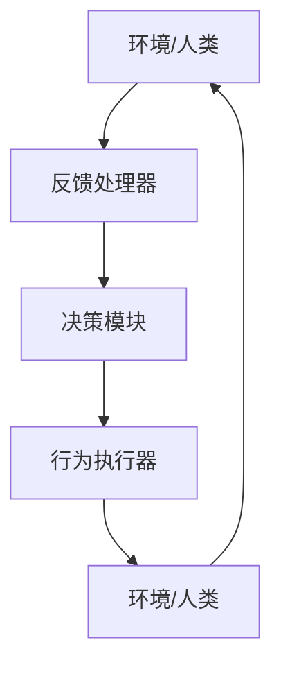

好的,我明白了您的要求。以下是题为《AI人工智能代理工作流 AI Agent WorkFlow:反馈的获取与处理》的技术博客正文:

# AI人工智能代理工作流 AI Agent WorkFlow:反馈的获取与处理

## 1. 背景介绍

### 1.1 问题的由来

在当今的人工智能系统中,智能代理扮演着至关重要的角色。它们被广泛应用于各种领域,如自动驾驶、智能家居、机器人控制等。然而,这些智能代理在与人类或环境交互的过程中,经常会遇到各种意外情况和反馈。如何有效地获取和处理这些反馈,对于提高系统的鲁棒性、可靠性和适应性至关重要。

### 1.2 研究现状

目前,已有一些研究致力于解决这一问题。例如,强化学习算法可以通过奖惩机制来调整代理的行为策略。另一种方法是利用人机交互技术,让人类用自然语言指令来指导代理。然而,这些方法都存在一定的局限性,比如需要大量的训练数据、难以处理复杂的语义信息等。

### 1.3 研究意义

设计一种高效、通用的反馈获取与处理机制,对于构建更加智能、可靠的人工智能系统至关重要。它不仅可以提高系统的鲁棒性和适应性,还能增强人机协作的效率,从而推动人工智能技术在更多领域的应用。

### 1.4 本文结构  

本文将首先介绍反馈获取与处理的核心概念,阐述它们之间的联系。接下来,将详细讲解反馈处理的核心算法原理和数学模型。然后,通过代码实例和案例分析,展示该机制在实际项目中的应用。最后,探讨该技术的发展趋势和面临的挑战。

## 2. 核心概念与联系

反馈获取与处理机制主要涉及以下几个核心概念:

1. **反馈(Feedback)**: 指代理在与环境或人类交互过程中获得的各种信息,包括奖惩信号、语音/文本指令、环境状态变化等。
2. **反馈处理器(Feedback Processor)**: 负责接收和解析各种形式的反馈,并将其转化为代理可以理解的内部表示。
3. **决策模块(Decision Maker)**: 根据当前状态和反馈信息,决定代理的下一步行为策略。
4. **行为执行器(Action Executor)**: 将决策模块输出的行为策略具体执行,并将执行结果反馈给环境或人类。

这些模块通过有机协作,构成了一个闭环的反馈控制系统。其核心流程如下所示:

## 3. 核心算法原理 & 具体操作步骤

### 3.1 算法原理概述

反馈获取与处理机制的核心算法原理可以概括为以下几个步骤:

1. **反馈获取**: 通过各种传感器和接口,获取来自环境或人类的原始反馈数据。
2. **反馈解析**: 利用自然语言处理、计算机视觉等技术,将原始反馈数据转化为代理可以理解的内部表示。
3. **状态更新**: 将解析后的反馈信息与当前状态进行融合,更新代理的内部状态表示。
4. **决策生成**: 根据更新后的状态,通过决策算法(如强化学习、规划等)生成新的行为策略。
5. **行为执行**: 将生成的行为策略具体执行,并将执行结果反馈给环境或人类。

### 3.2 算法步骤详解

1. **反馈获取**

   根据反馈的来源和形式的不同,可以采用不同的获取方式,如语音识别、图像识别、传感器读取等。

2. **反馈解析**

   - 对于文本/语音反馈,可以使用自然语言处理技术(如语义分析、命名实体识别等)将其转化为结构化的语义表示。
   - 对于图像/视频反馈,可以使用计算机视觉算法(如目标检测、语义分割等)提取出感兴趣的目标和属性。
   - 对于数值/状态反馈,可以直接将其映射为代理的状态向量的一部分。

3. **状态更新**

   将解析后的反馈信息与代理当前的状态进行融合,更新内部状态表示。状态表示可以是一个多维向量,每一维度对应着一种状态特征。

   假设代理当前状态为 $s_t$,反馈信息为 $f_t$,则更新后的状态 $s_{t+1}$ 可以表示为:

   $$s_{t+1} = \phi(s_t, f_t)$$

   其中 $\phi$ 是一个状态转移函数,可以是手工设计的规则,也可以是由神经网络等机器学习模型学习得到的。

4. **决策生成**

   根据更新后的状态 $s_{t+1}$,通过决策算法生成新的行为策略 $a_{t+1}$。决策算法可以是:

   - 基于规则的算法,如有限状态机、决策树等。
   - 基于优化的算法,如强化学习(Deep Q-Network等)、规划算法等。
   - 基于模型的算法,如基于世界模型的模型预测控制等。

   决策算法的输出是一个行为策略 $a_{t+1}$,可以是一个离散的动作,也可以是一个连续的控制向量。

5. **行为执行**

   将生成的行为策略 $a_{t+1}$ 具体执行,并将执行结果反馈给环境或人类。执行方式可以是通过机器人执行器、虚拟现实界面等。

### 3.3 算法优缺点

**优点**:

- 通用性强,可以处理各种形式的反馈,如语音、图像、数值等。
- 算法框架清晰,模块化设计,易于扩展和优化。
- 闭环控制机制,能够持续学习和适应环境变化。

**缺点**:

- 需要大量的训练数据和计算资源,尤其是在反馈解析和决策生成阶段。
- 存在反馈噪声和不确定性,可能导致错误的状态估计和决策生成。
- 决策算法的选择和调优是一个挑战,需要大量的领域知识和试验。

### 3.4 算法应用领域

反馈获取与处理机制可以广泛应用于以下领域:

- 自动驾驶系统: 处理来自传感器、导航系统和人类的各种反馈,实现安全可靠的自动驾驶。
- 智能家居系统: 根据用户的语音指令、手势等反馈,控制家电设备的工作状态。
- 机器人控制系统: 处理视觉、力觉等反馈,实现精准的机械臂操作和导航。
- 人机交互系统: 通过自然语言、手势等方式与人类进行自然的交互。
- 游戏AI: 根据玩家的操作和游戏状态的反馈,生成智能的AI行为策略。

## 4. 数学模型和公式 & 详细讲解 & 举例说明

在反馈获取与处理机制中,数学模型和公式扮演着重要的角色,尤其是在状态更新和决策生成阶段。下面将详细介绍其中的一些关键模型和公式。

### 4.1 数学模型构建

#### 4.1.1 马尔可夫决策过程(MDP)

马尔可夫决策过程(Markov Decision Process, MDP)是一种广泛用于建模序列决策问题的数学框架。在反馈获取与处理中,我们可以将代理与环境的交互过程建模为一个MDP:

- 状态集合 $\mathcal{S}$: 代表代理的所有可能状态
- 行为集合 $\mathcal{A}$: 代表代理可执行的所有行为
- 转移概率 $\mathcal{P}_{ss'}^a = \Pr(s'|s, a)$: 代表在状态 $s$ 执行行为 $a$ 后,转移到状态 $s'$ 的概率
- 奖赏函数 $\mathcal{R}: \mathcal{S} \times \mathcal{A} \rightarrow \mathbb{R}$: 定义了在状态 $s$ 执行行为 $a$ 后获得的即时奖赏

在这个框架下,我们的目标是找到一个最优策略 $\pi^*: \mathcal{S} \rightarrow \mathcal{A}$,使得期望的累积奖赏最大化:

$$\pi^* = \arg\max_\pi \mathbb{E}_\pi \left[ \sum_{t=0}^\infty \gamma^t r_t \right]$$

其中 $\gamma \in [0, 1]$ 是一个折现因子,用于权衡即时奖赏和长期奖赏的重要性。

#### 4.1.2 部分可观测马尔可夫决策过程(POMDP)

在现实场景中,代理往往无法直接观测到环境的完整状态,只能通过各种传感器获取部分观测值。这种情况可以用部分可观测马尔可夫决策过程(Partially Observable Markov Decision Process, POMDP)来建模:

- 状态集合 $\mathcal{S}$
- 行为集合 $\mathcal{A}$
- 转移概率 $\mathcal{P}_{ss'}^a$
- 奖赏函数 $\mathcal{R}$
- 观测集合 $\mathcal{O}$
- 观测概率 $\mathcal{Z}_{o}^{s} = \Pr(o|s)$: 代表在状态 $s$ 时观测到 $o$ 的概率

在 POMDP 中,代理无法直接访问状态 $s$,只能根据历史观测序列 $o_{1:t}$ 和执行的行为序列 $a_{1:t-1}$ 来估计当前状态,并选择最优行为。

### 4.2 公式推导过程

#### 4.2.1 值函数和Q函数

为了求解MDP和POMDP,我们首先需要定义状态值函数(Value Function)和状态-行为值函数(Q-Function):

- 状态值函数 $V^\pi(s)$: 表示在策略 $\pi$ 下,从状态 $s$ 开始执行,期望能获得的累积奖赏:

$$V^\pi(s) = \mathbb{E}_\pi \left[ \sum_{t=0}^\infty \gamma^t r_t | s_0 = s \right]$$

- 状态-行为值函数 $Q^\pi(s, a)$: 表示在策略 $\pi$ 下,从状态 $s$ 开始执行行为 $a$,期望能获得的累积奖赏:

$$Q^\pi(s, a) = \mathbb{E}_\pi \left[ \sum_{t=0}^\infty \gamma^t r_t | s_0 = s, a_0 = a \right]$$

对于MDP,值函数和Q函数可以通过贝尔曼方程(Bellman Equations)来递推计算:

$$\begin{aligned}
V^\pi(s) &= \sum_{a \in \mathcal{A}} \pi(a|s) \left( R(s, a) + \gamma \sum_{s' \in \mathcal{S}} P_{ss'}^a V^\pi(s') \right) \\
Q^\pi(s, a) &= R(s, a) + \gamma \sum_{s' \in \mathcal{S}} P_{ss'}^a V^\pi(s')
\end{aligned}$$

对于POMDP,我们需要定义基于历史观测和行为序列的值函数和Q函数:

$$\begin{aligned}
V^\pi(o_{1:t}, a_{1:t-1}) &= \mathbb{E}_\pi \left[ \sum_{k=t}^\infty \gamma^{k-t} r_k | o_{1:t}, a_{1:t-1} \right] \\
Q^\pi(o_{1:t}, a_{1:t}) &= \mathbb{E}_\pi \left[ \sum_{k=t}^\infty \gamma^{k-t} r_k | o_{1:t}, a_{1:t} \right]
\end{aligned}$$

这些值函数和Q函数需要通过近似方法来估计,如基于蒙特卡罗采样的方法、基于神经网络的近似等。

#### 4.2.2 策略迭代和值迭代

有了值函数和Q函数的定义,我们就可以通过策略迭代(Policy Iteration)