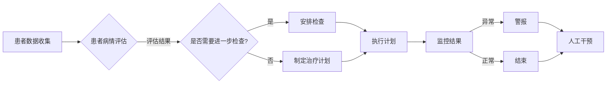

# AI人工智能代理工作流 AI Agent WorkFlow：在医疗保健中的应用

作者：禅与计算机程序设计艺术 / Zen and the Art of Computer Programming

## 1. 背景介绍

### 1.1 问题的由来

医疗保健行业正面临着日益增长的挑战，包括人口老龄化、医疗成本上升、医疗资源分配不均等问题。为了解决这些问题，人工智能（AI）技术被广泛地应用于医疗保健领域，以实现自动化、高效和个性化的医疗服务。其中，AI代理（AI Agent）作为一种具有自我决策能力和自主学习能力的智能实体，在医疗保健工作流管理中扮演着越来越重要的角色。

### 1.2 研究现状

近年来，AI代理在医疗保健领域的应用主要集中在以下几个方面：

- **患者监护**：AI代理可以实时监测患者的生命体征，如心率、血压、体温等，并在异常情况发生时及时发出警报。
- **临床决策支持**：AI代理可以根据患者的病历、检查结果等信息，为医生提供诊断建议和治疗方案。
- **药物管理**：AI代理可以帮助患者管理药物使用，包括药物提醒、用药指导、药物相互作用检测等。
- **预约和预约管理**：AI代理可以帮助患者预约医生和检查，并管理预约信息。

### 1.3 研究意义

AI代理工作流在医疗保健领域的应用具有重要意义：

- **提高效率**：AI代理可以自动化处理大量的重复性工作，从而提高医疗保健服务的效率。
- **降低成本**：通过自动化和优化工作流程，AI代理可以降低医疗保健服务的成本。
- **提升质量**：AI代理可以帮助医生做出更准确的诊断和治疗方案，从而提高医疗保健服务的质量。
- **改善患者体验**：AI代理可以提供个性化的服务，从而改善患者的体验。

### 1.4 本文结构

本文将探讨AI代理工作流在医疗保健领域的应用，包括核心概念、算法原理、实际应用场景、未来发展趋势和挑战等。

## 2. 核心概念与联系

### 2.1 AI代理

AI代理是指具有自我决策能力和自主学习能力的智能实体。它可以根据环境信息进行感知、推理和行动，以实现特定的目标。

### 2.2 工作流

工作流是指一组有序的、可执行的任务，它们按照一定的逻辑关系执行，以完成某个特定的业务目标。

### 2.3 AI代理工作流

AI代理工作流是指使用AI代理来管理医疗保健工作流程，包括任务分配、执行监控、异常处理等。

以下是一个AI代理工作流的Mermaid流程图：



## 3. 核心算法原理 & 具体操作步骤

### 3.1 算法原理概述

AI代理工作流的核心算法主要包括以下几部分：

- **感知**：AI代理通过收集患者的病历、检查结果、生命体征等信息，感知患者病情。
- **推理**：AI代理根据感知到的信息，结合医学知识库，进行推理，评估患者病情。
- **决策**：AI代理根据推理结果，制定相应的治疗计划或采取行动。
- **监控**：AI代理监控治疗计划的执行情况，并根据监控结果进行动态调整。
- **学习**：AI代理根据执行结果和用户反馈，不断学习和优化自己的行为。

### 3.2 算法步骤详解

以下是AI代理工作流的具体操作步骤：

1. **患者数据收集**：AI代理从医院信息系统、电子病历系统等渠道收集患者的病历、检查结果、生命体征等信息。
2. **患者病情评估**：AI代理根据收集到的信息，结合医学知识库，评估患者病情。
3. **是否需要进一步检查**？根据评估结果，AI代理判断是否需要进一步检查。
4. **安排检查**：如果需要进一步检查，AI代理将安排检查并通知患者。
5. **制定治疗计划**：如果不需要进一步检查，AI代理将根据评估结果制定治疗计划。
6. **执行计划**：AI代理将治疗计划执行给患者，并监控执行情况。
7. **监控结果**：AI代理根据监控结果，判断治疗计划是否需要调整。
8. **异常处理**：如果监控结果出现异常，AI代理将发出警报并通知相关人员进行人工干预。
9. **结束**：如果监控结果正常，AI代理将结束工作流。
10. **学习**：AI代理根据执行结果和用户反馈，不断学习和优化自己的行为。

### 3.3 算法优缺点

AI代理工作流具有以下优点：

- **自动化**：AI代理可以自动化处理大量的重复性工作，提高效率。
- **高效**：AI代理可以根据患者的具体情况，快速制定和调整治疗方案。
- **个性化**：AI代理可以根据患者的具体情况，提供个性化的服务。

AI代理工作流也存在以下缺点：

- **依赖数据**：AI代理需要大量的患者数据来支持其决策。
- **可解释性**：AI代理的决策过程可能缺乏可解释性，难以理解其决策依据。
- **安全性**：AI代理需要确保其决策过程的安全性，避免出现错误或恶意攻击。

### 3.4 算法应用领域

AI代理工作流可以应用于以下领域：

- **患者监护**：AI代理可以实时监测患者的生命体征，并在异常情况发生时及时发出警报。
- **临床决策支持**：AI代理可以帮助医生做出更准确的诊断和治疗方案。
- **药物管理**：AI代理可以帮助患者管理药物使用，包括药物提醒、用药指导、药物相互作用检测等。
- **预约和预约管理**：AI代理可以帮助患者预约医生和检查，并管理预约信息。

## 4. 数学模型和公式 & 详细讲解 & 举例说明

### 4.1 数学模型构建

AI代理工作流的数学模型主要包括以下几部分：

- **感知模型**：用于从数据中提取特征，如深度学习模型。
- **推理模型**：用于根据特征进行推理，如逻辑推理、决策树等。
- **决策模型**：用于制定决策，如强化学习、优化算法等。

### 4.2 公式推导过程

以下是一个简单的AI代理工作流数学模型的例子：

```
P(X|Y) = P(Y|X) * P(X) / P(Y)
```

其中，P(X|Y)表示在已知Y的情况下，X的概率；P(Y|X)表示在已知X的情况下，Y的概率；P(X)表示X的概率；P(Y)表示Y的概率。

### 4.3 案例分析与讲解

以下是一个AI代理工作流的案例分析：

**案例**：患者监护

**数据**：患者的生命体征数据，如心率、血压、体温等。

**目标**：监测患者生命体征，并在异常情况发生时及时发出警报。

**方法**：使用深度学习模型对生命体征数据进行特征提取，结合逻辑推理进行异常检测，并使用强化学习模型进行警报策略优化。

### 4.4 常见问题解答

**Q1**：AI代理工作流的性能如何评估？

A1：AI代理工作流的性能可以通过以下指标进行评估：

- **准确率**：预测结果与真实结果的匹配程度。
- **召回率**：预测结果中正确识别的样本数量与真实样本数量的比例。
- **F1分数**：准确率和召回率的调和平均值。

**Q2**：AI代理工作流是否安全？

A2：AI代理工作流的安全性需要从以下几个方面进行考虑：

- **数据安全**：确保数据的安全性和隐私性。
- **模型安全**：确保模型的鲁棒性和可解释性。
- **系统安全**：确保系统的稳定性和可靠性。

## 5. 项目实践：代码实例和详细解释说明

### 5.1 开发环境搭建

以下是使用Python和TensorFlow构建AI代理工作流的项目实践：

1. 安装Python和TensorFlow：
```bash
pip install tensorflow
```

2. 创建项目文件夹和配置文件。

### 5.2 源代码详细实现

以下是一个简单的AI代理工作流代码示例：

```python
import tensorflow as tf

# 定义感知模型
class PerceptionModel(tf.keras.Model):
    def __init__(self):
        super(PerceptionModel, self).__init__()
        self.layer1 = tf.keras.layers.Dense(64, activation='relu')
        self.layer2 = tf.keras.layers.Dense(32, activation='relu')

    def call(self, x):
        x = self.layer1(x)
        x = self.layer2(x)
        return x

# 定义推理模型
class InferenceModel(tf.keras.Model):
    def __init__(self):
        super(InferenceModel, self).__init__()
        self.layer1 = tf.keras.layers.Dense(32, activation='relu')
        self.output_layer = tf.keras.layers.Dense(1, activation='sigmoid')

    def call(self, x):
        x = self.layer1(x)
        x = self.output_layer(x)
        return x

# 定义决策模型
class DecisionModel(tf.keras.Model):
    def __init__(self):
        super(DecisionModel, self).__init__()
        self.output_layer = tf.keras.layers.Dense(1, activation='sigmoid')

    def call(self, x):
        x = self.output_layer(x)
        return x

# 加载数据
train_data = ...
train_labels = ...
test_data = ...
test_labels = ...

# 训练模型
perception_model = PerceptionModel()
inference_model = InferenceModel()
decision_model = DecisionModel()

# 编译模型
perception_model.compile(optimizer='adam', loss='mean_squared_error')
inference_model.compile(optimizer='adam', loss='binary_crossentropy')
decision_model.compile(optimizer='adam', loss='binary_crossentropy')

perception_model.fit(train_data, train_labels, epochs=10, batch_size=32)
inference_model.fit(train_data, train_labels, epochs=10, batch_size=32)
decision_model.fit(train_data, train_labels, epochs=10, batch_size=32)

# 评估模型
test_loss = perception_model.evaluate(test_data, test_labels)
test_loss inference_model.evaluate(test_data, test_labels)
test_loss decision_model.evaluate(test_data, test_labels)
```

### 5.3 代码解读与分析

以上代码展示了如何使用Python和TensorFlow构建一个简单的AI代理工作流。首先，定义了感知模型、推理模型和决策模型。然后，加载数据并训练模型。最后，评估模型性能。

### 5.4 运行结果展示

运行以上代码后，可以得到模型在测试集上的损失值。根据损失值可以判断模型的性能。

## 6. 实际应用场景

### 6.1 患者监护

AI代理可以实时监测患者的生命体征，并在异常情况发生时及时发出警报。例如，当患者的血压过高或过低时，AI代理会立即通知医生。

### 6.2 临床决策支持

AI代理可以根据患者的病历、检查结果等信息，为医生提供诊断建议和治疗方案。例如，当患者出现发热症状时，AI代理会根据患者的病史和检查结果，判断患者是否患有感冒或流感，并提出相应的治疗方案。

### 6.3 药物管理

AI代理可以帮助患者管理药物使用，包括药物提醒、用药指导、药物相互作用检测等。例如，AI代理可以根据患者的病情和药物说明，为患者制定个性化的用药方案，并提醒患者按时服药。

### 6.4 预约和预约管理

AI代理可以帮助患者预约医生和检查，并管理预约信息。例如，AI代理可以根据患者的需求和医生的时间安排，为患者预约合适的医生和检查项目，并提醒患者按时就诊。

## 7. 工具和资源推荐

### 7.1 学习资源推荐

- 《人工智能：一种现代的方法》
- 《深度学习》
- 《图灵奖大师的AI思想》

### 7.2 开发工具推荐

- TensorFlow
- PyTorch
- Keras

### 7.3 相关论文推荐

- “A survey of artificial intelligence in healthcare” (2019)
- “Artificial intelligence in radiology: promise and peril” (2018)
- “Artificial intelligence in cardiology: a narrative review” (2018)

### 7.4 其他资源推荐

- Hugging Face
- TensorFlow
- PyTorch

## 8. 总结：未来发展趋势与挑战

### 8.1 研究成果总结

本文探讨了AI代理工作流在医疗保健领域的应用，包括核心概念、算法原理、实际应用场景、未来发展趋势和挑战等。

### 8.2 未来发展趋势

未来，AI代理工作流在医疗保健领域的应用将呈现以下发展趋势：

- **更强大的模型**：随着深度学习技术的不断发展，AI代理的感知、推理和决策能力将得到进一步提升。
- **更广泛的应用场景**：AI代理工作流将应用于更广泛的医疗保健领域，如手术机器人、健康管理等。
- **更智能的交互**：AI代理将与用户进行更智能的交互，提供更加个性化、便捷的服务。

### 8.3 面临的挑战

AI代理工作流在医疗保健领域的应用也面临着以下挑战：

- **数据安全和隐私**：如何确保患者数据和模型的安全性，是AI代理工作流面临的重大挑战。
- **可解释性和透明度**：如何提高AI代理的决策过程的可解释性和透明度，是AI代理工作流面临的另一个挑战。
- **伦理和社会影响**：AI代理工作流的应用将带来一系列伦理和社会影响，需要我们认真思考和应对。

### 8.4 研究展望

未来，我们需要在以下几个方面加强研究：

- **数据安全和隐私保护**：研究如何确保患者数据和模型的安全性，保护患者隐私。
- **可解释性和透明度**：研究如何提高AI代理的决策过程的可解释性和透明度，增强用户对AI代理的信任。
- **伦理和社会影响**：研究AI代理工作流对医疗保健领域带来的伦理和社会影响，制定相应的规范和标准。

相信随着技术的不断进步和研究的深入，AI代理工作流将在医疗保健领域发挥越来越重要的作用，为人类健康事业做出更大的贡献。

## 9. 附录：常见问题与解答

**Q1**：AI代理工作流在医疗保健领域的应用有哪些优势？

A1：AI代理工作流在医疗保健领域的应用具有以下优势：

- **提高效率**：AI代理可以自动化处理大量的重复性工作，提高效率。
- **降低成本**：通过自动化和优化工作流程，AI代理可以降低医疗保健服务的成本。
- **提升质量**：AI代理可以帮助医生做出更准确的诊断和治疗方案，提高医疗保健服务的质量。
- **改善患者体验**：AI代理可以提供个性化的服务，改善患者的体验。

**Q2**：AI代理工作流在医疗保健领域的应用有哪些挑战？

A2：AI代理工作流在医疗保健领域的应用也面临着以下挑战：

- **数据安全和隐私**：如何确保患者数据和模型的安全性，保护患者隐私。
- **可解释性和透明度**：如何提高AI代理的决策过程的可解释性和透明度，增强用户对AI代理的信任。
- **伦理和社会影响**：AI代理工作流的应用将带来一系列伦理和社会影响，需要我们认真思考和应对。

**Q3**：AI代理工作流在医疗保健领域的应用前景如何？

A3：AI代理工作流在医疗保健领域的应用前景非常广阔。随着技术的不断进步和研究的深入，AI代理工作流将在医疗保健领域发挥越来越重要的作用，为人类健康事业做出更大的贡献。

---

作者：禅与计算机程序设计艺术 / Zen and the Art of Computer Programming