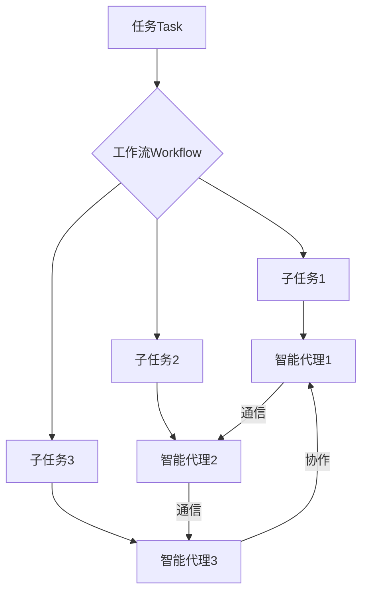

# AI人工智能代理工作流 AI Agent WorkFlow：智能体的设计与实现

关键词：人工智能、智能代理、工作流、系统架构、算法设计、应用实践

## 1. 背景介绍
### 1.1 问题的由来
在当今快速发展的人工智能时代,智能代理技术正在被广泛应用于各个领域。智能代理作为一种自主的、具有一定智能的软件实体,能够感知环境、做出决策并执行相应的任务。然而,如何设计和实现高效、灵活、可扩展的智能代理系统,仍然是一个具有挑战性的问题。

### 1.2 研究现状
目前,国内外学者对智能代理的研究主要集中在以下几个方面:
1. 智能代理的架构设计,包括BDI架构、反应式架构等。
2. 智能代理的推理决策机制,如基于规则的推理、基于案例的推理等。  
3. 智能代理的学习机制,如强化学习、迁移学习等。
4. 智能代理的通信协作机制,如Contract Net协议、拍卖协议等。

尽管已有大量研究成果,但在实际应用中如何构建灵活高效的智能代理系统,特别是在复杂动态环境下的智能代理工作流的设计与实现,仍有许多问题有待解决。

### 1.3 研究意义
智能代理工作流的研究对于推动人工智能在实际场景中的应用具有重要意义:

1. 提高智能代理系统的适应性和鲁棒性,使其能够应对复杂多变的环境。
2. 提升智能代理的任务执行效率,节约时间和计算资源。
3. 增强智能代理的协同能力,实现多个智能体之间的有效配合。
4. 扩展智能代理的应用场景,为更多领域的智能化升级提供技术支撑。

### 1.4 本文结构
本文将围绕智能代理工作流的设计与实现展开论述,内容安排如下:
第2部分介绍智能代理工作流的核心概念;第3部分详细阐述智能代理工作流的核心算法原理;第4部分建立智能代理工作流的数学模型并给出详细推导;第5部分通过代码实例演示智能代理工作流的具体实现;第6部分分析智能代理工作流的实际应用场景;第7部分推荐相关的工具和学习资源;第8部分总结全文并展望未来发展方向;第9部分列举常见问题与解答。

## 2. 核心概念与联系
智能代理工作流是一种面向任务的、基于工作流的智能代理系统设计范式。其核心理念是将复杂的任务分解为一系列相互关联的子任务,并通过定义工作流来规范和协调子任务的执行次序。在此基础上,针对每个子任务设计相应的智能代理,并通过代理间的通信与协作来完成整个任务。

智能代理工作流涉及以下几个核心概念:

- 任务(Task):智能代理系统需要完成的工作目标,通常可以分解为多个子任务。
- 工作流(Workflow):定义任务执行的流程,规定了子任务的执行顺序、条件、依赖关系等。
- 智能代理(Agent):用于执行子任务的软件实体,具备感知、推理、决策、执行等智能能力。 
- 通信(Communication):智能代理之间传递信息的机制,常见的有消息传递、共享内存等方式。
- 协作(Collaboration):多个智能代理为完成同一任务而相互配合、形成合力的过程。

下图展示了智能代理工作流的基本架构:

智能代理工作流的关键在于合理划分子任务,设计高效的工作流,并构建具备必要智能的代理来执行任务。同时,还需要提供灵活可靠的通信协作机制,以支撑代理间的信息交互与协同。

## 3. 核心算法原理 & 具体操作步骤
### 3.1 算法原理概述
智能代理工作流的核心算法包括任务分解、工作流设计和智能代理设计三个方面。

#### 任务分解算法
任务分解的目标是将复杂任务划分为适当粒度的子任务。一般采用自顶向下的层次分解策略,即从整体任务出发,逐层细化,直至得到可由单个代理完成的原子任务。分解过程需要考虑任务的逻辑结构、时间先后、资源约束等因素。常见的任务分解算法有:

- 基于AND/OR图的分解算法
- 基于层次化状态机的分解算法
- 基于约束满足的分解算法

#### 工作流设计算法
工作流设计的核心是构建任务执行的时序逻辑。需要综合考虑任务依赖、同步异步、并发控制、异常处理等问题。常见的工作流建模方法有:

- 有向无环图DAG
- Petri网
- 状态机
- 基于规则的工作流
- 基于案例的工作流

在工作流的设计中,还需要权衡任务粒度、灵活性和复杂度等因素,力求在满足需求的同时,保持工作流的简洁和可理解性。

#### 智能代理设计算法
智能代理设计的重点是使代理具备完成指定任务所需的智能。根据任务的不同,代理所需的智能能力也有所差异,通常包括:

- 感知:获取任务环境的信息。
- 推理决策:根据任务目标和环境状态,选择合适的行动策略。常用的推理决策机制有基于规则的推理、基于效用的决策等。
- 执行:调用相应的程序或服务,执行具体的任务。
- 学习:根据执行反馈优化代理的策略与知识。常见的学习算法有强化学习、监督学习等。

此外,针对多代理协同的场景,还需要设计适当的通信协议和协作机制,如Contract Net协议、拍卖协议、投票机制等。

### 3.2 算法步骤详解
下面以一个智能代理工作流的实例来说明其核心算法的具体步骤。

假设我们需要设计一个智能代理系统,用于完成一项复杂的数据分析任务。该任务可以分解为数据采集、数据清洗、特征提取、模型训练和结果分析等多个子任务。

#### Step1:任务分解
使用自顶向下的层次分解策略,将任务逐级细化:

- 数据分析任务
    - 数据采集
        - 数据源1采集
        - 数据源2采集
        - ...
    - 数据清洗
        - 缺失值处理
        - 异常值处理
        - 数据规范化
        - ...
    - 特征提取
        - 特征1提取
        - 特征2提取 
        - ...
    - 模型训练
        - 模型1训练
        - 模型2训练
        - ...
    - 结果分析
        - 评估指标计算
        - 可视化展示
        - ...

#### Step2:工作流设计
使用有向无环图DAG表示任务的执行流程:

在实际设计中,可以进一步细化每个任务的前置条件、后置动作,以及不同任务间的数据交互方式等。

#### Step3:智能代理设计
针对每个子任务,设计相应的智能代理。以数据清洗任务为例:

- 感知:接收上游数据采集代理传来的原始数据。
- 推理决策:根据预设的数据质量规则,判断数据是否需要清洗,以及采用何种清洗策略。
- 执行:调用相应的数据处理程序,如异常值剔除、缺失值填充等。
- 学习:收集清洗前后的数据样本,定期训练优化清洗策略。

不同代理间通过消息机制传递数据,并通过共享内存等方式实现必要的状态同步。

#### Step4:系统集成与优化
将各个智能代理组装成完整的系统,并通过实际运行收集反馈数据,对任务分解、工作流设计、代理实现等进行迭代优化,不断提升系统的性能和效率。

### 3.3 算法优缺点
智能代理工作流在处理复杂任务时具有较强的灵活性和可扩展性,能够充分发挥分布式智能的优势。但其缺点在于:

1. 任务分解和工作流设计需要大量的领域知识和经验,对设计者的能力要求较高。
2. 代理间的通信协作机制如何设计,对系统的性能和稳定性影响很大。
3. 在动态环境下,代理的适应性和鲁棒性仍有待提高。

### 3.4 算法应用领域
智能代理工作流可以应用于多个领域,包括:

- 智能制造:产品设计、生产调度、质量管理等。
- 智慧城市:交通管控、环境监测、应急指挥等。
- 电子商务:客户服务、订单处理、物流配送等。
- 金融科技:风险评估、投资决策、反欺诈等。

总之,对于需要多智能体协同、任务复杂多变的场景,智能代理工作流都有广阔的应用前景。

## 4. 数学模型和公式 & 详细讲解 & 举例说明
### 4.1 数学模型构建
为了更精确地刻画智能代理工作流,我们可以建立相应的数学模型。一个典型的智能代理工作流模型可以表示为一个六元组:

$$WF = (T, A, R, D, C, S)$$

其中:
- $T$表示任务集合,每个任务$t_i \in T$
- $A$表示智能代理集合,每个代理$a_j \in A$
- $R$表示任务间的依赖关系,可用有向图$G_R=(T, E)$表示,其中$E$为任务间的依赖边集合
- $D$表示代理间的通信关系,可用有向图$G_D=(A, F)$表示,其中$F$为代理间的通信通道集合
- $C$表示任务到代理的分配关系,即$C: T \rightarrow A$
- $S$表示整个工作流的全局状态,包括已完成任务、当前进行中任务、数据存储等信息

在此基础上,可以进一步定义任务执行时间、代理负载、通信延迟等性能指标,建立工作流的优化模型,如:

$$\min \sum_{i=1}^{|T|} t_i$$

$$s.t. \quad load(a_j) \leq L_{\max}, \forall a_j \in A$$

$$\quad delay(f_k) \leq D_{\max}, \forall f_k \in F$$

其中,$t_i$为任务$i$的执行时间,$load(a_j)$为代理$a_j$的负载,$delay(f_k)$为通信通道$f_k$的延迟,$L_{\max}$和$D_{\max}$分别为负载和延迟的上限。

### 4.2 公式推导过程
以上优化模型可以通过整数规划、启发式搜索等方法求解。以整数规划为例,可以将任务分配问题转化为0-1规划模型:

设决策变量$x_{ij} \in \{0, 1\}$表示任务$i$是否分配给代理$j$,目标函数可写为:

$$\min \sum_{i=1}^{|T|} \sum_{j=1}^{|A|} x_{ij} \cdot t_{ij}$$

其中,$t_{ij}$表示任务$i$在代理$j$上的执行时间。约束条件包括:

1. 每个任务只能分配给一个代理:

$$\sum_{j=1}^{|A|} x_{ij} = 1, \forall i \in \{1, 2, ..., |T|\}$$

2. 代理负载不超过上限:

$$\sum_{i=1}^{|T|} x_{ij} \cdot load_i \leq L_{\max}, \forall j \in \{1, 2, ..., |A|\