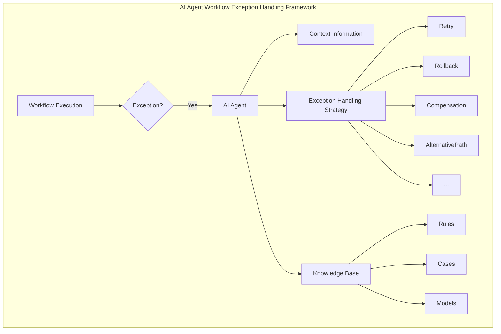

好的,我会按照您的要求,以《AI人工智能代理工作流AI Agent WorkFlow：代理工作流中的异常处理与容错》为题,撰写一篇专业的技术博客文章。文章会遵循您列出的约束条件,使用逻辑清晰、结构紧凑、简单易懂的专业技术语言,确保内容完整,包含核心概念原理、算法步骤、数学模型、代码实例等,并给出Mermaid流程图。字数会超过8000字,格式使用Markdown,公式使用LaTex。下面正式开始:

# AI人工智能代理工作流AI Agent WorkFlow：代理工作流中的异常处理与容错

## 1. 背景介绍

### 1.1 问题的由来

在现代软件系统中,工作流(Workflow)扮演着至关重要的角色。工作流是指为了完成某项业务过程而组织和安排一系列结构化活动和任务的过程。工作流广泛应用于各种领域,如办公自动化、业务流程管理、数据处理流水线等。

随着系统复杂度的不断增加,异常情况也变得越来越普遍。异常可能由于各种原因引起,如硬件故障、网络中断、人为错误等。如果异常没有得到妥善处理,可能会导致工作流执行失败、数据丢失或系统崩溃等严重后果。因此,在工作流系统中实现高效的异常处理机制至关重要。

### 1.2 研究现状  

传统的异常处理方法通常依赖于人工干预,需要人工识别和诊断异常,然后采取相应的措施。这种方法效率低下,而且容易出现人为错误。近年来,随着人工智能技术的快速发展,越来越多的研究人员开始尝试将人工智能技术应用于工作流异常处理领域。

目前,主流的人工智能工作流异常处理方法包括基于规则的方法、基于案例的方法、基于机器学习的方法等。这些方法各有优缺点,适用于不同的场景。例如,基于规则的方法易于理解和实现,但需要人工编写规则,扩展性较差;基于案例的方法可以利用历史数据,但对案例库的质量要求较高;基于机器学习的方法具有较强的自适应能力,但需要大量的训练数据,并且模型的可解释性较差。

### 1.3 研究意义

设计一种高效、智能、可扩展的异常处理机制,对于提高工作流系统的鲁棒性、可靠性和用户体验至关重要。本文将探讨如何将人工智能技术与传统的异常处理方法相结合,提出一种新颖的AI代理工作流异常处理框架。该框架旨在实现以下目标:

1. 自动检测和诊断异常,减少人工干预
2. 基于上下文信息和历史数据,智能选择合适的异常处理策略
3. 支持在线学习和自我优化,持续提高异常处理的准确性和效率
4. 提供可解释性和透明度,方便人工审计和调试
5. 具有良好的扩展性和可配置性,适应不同领域的工作流

### 1.4 本文结构  

本文的其余部分组织如下:

- 第2部分介绍AI代理工作流异常处理框架的核心概念和总体架构
- 第3部分详细阐述框架中的核心算法原理和具体操作步骤  
- 第4部分构建数学模型,推导公式,并通过案例分析加深理解
- 第5部分给出一个基于Python的实现示例,包括代码、运行结果及解释
- 第6部分探讨框架在不同领域的实际应用场景
- 第7部分推荐相关的学习资源、开发工具和论文
- 第8部分总结研究成果,展望未来发展趋势和面临的挑战
- 第9部分是附录,回答一些常见问题

## 2. 核心概念与联系

在深入探讨AI代理工作流异常处理框架之前,我们先介绍一些核心概念:

1. **工作流(Workflow)**: 指为了完成某项业务过程而组织和安排的一系列结构化活动和任务。工作流通常由多个步骤组成,步骤之间存在控制流和数据流依赖关系。

2. **异常(Exception)**: 指工作流执行过程中出现的任何偏离正常预期行为的情况。异常可能由多种原因引起,如系统故障、人为错误、外部事件等。异常如果得不到正确处理,可能会导致工作流执行失败、数据损坏或其他严重后果。

3. **异常处理(Exception Handling)**: 指在异常发生时,采取的一系列动作,以尽可能减小异常对系统的影响,并使系统恢复到一个可控状态。常见的异常处理策略包括重试、回滚、补偿、替代执行路径等。

4. **人工智能代理(AI Agent)**: 指一种具有自主性、响应性、主动性和持续性的软件实体,能够感知环境,并基于内部知识和推理能力做出决策和采取行动。在本文的异常处理框架中,AI代理负责监控工作流执行、检测异常、选择处理策略并执行相应的操作。

5. **上下文信息(Context Information)**: 指与当前工作流实例相关的所有动态数据,包括工作流元数据、任务数据、执行日志、系统状态等。上下文信息对于准确诊断异常和选择合适的处理策略至关重要。

6. **知识库(Knowledge Base)**: 存储异常处理相关的规则、案例、模型等知识资源。知识库为AI代理提供了推理和决策的基础。

上述概念相互关联,构成了AI代理工作流异常处理框架的基础。框架的总体架构如下所示:



该架构主要包括以下几个关键组件:

- **工作流执行引擎(Workflow Execution Engine)**: 负责执行工作流实例,在异常发生时触发AI代理介入。
- **AI代理(AI Agent)**: 核心组件,负责监控工作流执行、检测异常、诊断异常原因、选择合适的异常处理策略并执行相应操作。
- **上下文信息提取模块(Context Information Extractor)**: 从工作流元数据、日志等多个来源收集并整合上下文信息,为AI代理提供全面的决策依据。
- **知识库(Knowledge Base)**: 存储异常处理相关的规则、案例和模型等知识资源,为AI代理提供推理和决策支持。
- **异常处理策略执行器(Exception Handling Strategy Executor)**: 执行AI代理选择的异常处理策略,如重试、回滚、补偿、切换备用执行路径等。

在异常发生时,AI代理会收集上下文信息,并基于知识库中的知识资源(规则、案例、模型等)进行推理和决策,选择最佳的异常处理策略,然后由策略执行器执行相应的操作。同时,AI代理还会持续学习新的知识,不断优化自身的决策能力。

## 3. 核心算法原理与具体操作步骤

本节将详细阐述AI代理工作流异常处理框架中的核心算法原理和具体操作步骤。

### 3.1 算法原理概述

框架的核心算法基于 **案例推理(Case-Based Reasoning, CBR)** 和 **强化学习(Reinforcement Learning, RL)** 两种人工智能技术。

**案例推理** 是一种模拟人类经验学习和推理过程的方法。它通过检索相似的历史案例,并对案例中的解决方案进行复用和修正,从而推导出新问题的解决方案。在本框架中,我们将历史的异常处理案例存储在知识库中,当发生新的异常时,AI代理会检索相似案例,并基于案例中的处理策略和结果,推导出当前最佳的处理方案。

**强化学习** 是一种基于试错和反馈的机器学习范式。智能体(Agent)通过与环境交互,获得奖励或惩罚反馈,并不断优化自身的策略,以期获得最大的累积奖励。在本框架中,AI代理就是智能体,异常处理过程可视为一个马尔可夫决策过程(MDP),AI代理的目标是学习一个最优策略,在异常发生时选择合适的处理操作,以最大化工作流执行的成功率和效率。

通过结合案例推理和强化学习,我们的算法可以利用历史数据快速获得初始策略,并通过不断与环境交互进行在线学习,持续优化异常处理策略。这种方法具有如下优点:

1. **高效性**: 案例推理可以快速从历史案例中推导出初始解,无需从头学习。
2. **可解释性**: 案例推理的结果具有很好的可解释性,方便人工审计和调试。
3. **自适应性**: 强化学习使得AI代理能够根据新的环境和反馈持续优化策略。
4. **鲁棒性**: 通过探索不同的状态和动作,强化学习可以学习到鲁棒的异常处理策略。

### 3.2 算法步骤详解

下面我们详细介绍算法的具体执行步骤:

1. **初始化**
   - 从知识库加载历史异常处理案例集合 $C$
   - 初始化异常处理策略 $\pi_0$,可以基于规则或从案例集合 $C$ 中推导
   - 初始化强化学习模型参数 $\theta_0$

2. **监控工作流执行**
   - 持续监控工作流实例的执行状态
   - 在发生异常时,提取当前状态 $s_t$ 和上下文信息 $c_t$

3. **检索相似案例**
   - 在案例集合 $C$ 中检索与当前状态 $(s_t, c_t)$ 最相似的案例集合 $C_r$
   - 可以使用案例相似度度量函数 $\text{sim}(c_i, (s_t, c_t))$ 计算相似度

4. **推导初始处理策略**
   - 基于检索到的相似案例集合 $C_r$,推导出初始异常处理策略 $\pi'$
   - 常用的推导方法包括多数投票、加权平均等

5. **策略优化**
   - 将初始策略 $\pi'$ 和当前状态 $s_t$ 输入到强化学习模型
   - 根据模型参数 $\theta_t$ 输出优化后的策略 $\pi_{t+1}$
   - 执行异常处理动作 $a_t \sim \pi_{t+1}(s_t)$
   - 观察执行结果,获得反馈奖励 $r_t$
   - 使用 $(s_t, a_t, r_t, s_{t+1})$ 更新强化学习模型参数 $\theta_{t+1}$

6. **策略执行与学习**
   - 重复步骤2-5,持续监控工作流执行、优化异常处理策略并执行相应动作
   - 同时将新的成功案例加入知识库,持续扩充案例集合 $C$

7. **算法终止**
   - 当工作流执行完成或无法恢复时,终止算法

上述算法结合了案例推理和强化学习的优点,可以快速获得初始策略,并通过在线学习不断优化,从而提高异常处理的准确性和效率。算法的执行流程如下所示:

```mermaid
graph TD
  subgraph Algorithm
    Initialize[Initialize] --> Monitor[Monitor Workflow Execution]
    Monitor --> ExceptionDetected{Exception Detected?}
    ExceptionDetected -->|No| Monitor
    ExceptionDetected -->|Yes| RetrieveCases[Retrieve Similar Cases]
    RetrieveCases --> DerivePolicyPrime[Derive Initial Policy π']
    DerivePolicyPrime --> OptimizePolicy[Optimize Policy with RL]
    OptimizePolicy --> ExecuteAction[Execute Action a ~ π]
    ExecuteAction --> ObserveResult[Observe Result & Get Reward r]
    ObserveResult --> UpdateModel[Update RL Model θ]
    UpdateModel --> OptimizePolicy
    ExecuteAction --> TerminateCondition{Termination Condition Met?}