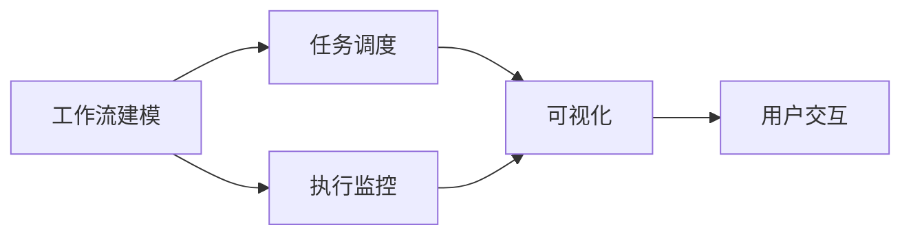

# AI人工智能代理工作流AI Agent WorkFlow：代理工作流的可视化与用户交互设计

## 1. 背景介绍

### 1.1 问题的由来

在当今快节奏的数字时代，人工智能(AI)代理已经无处不在,并在各个领域发挥着越来越重要的作用。然而,随着AI系统的复杂性不断增加,有效管理和协调AI代理的工作流程变得至关重要。传统的工作流管理系统通常是为人类设计的,难以满足AI代理的特殊需求,例如自主决策、动态调度和实时响应等。因此,构建一个专门用于AI代理工作流的可视化和用户交互系统,成为了一个亟待解决的问题。

### 1.2 研究现状  

目前,已有一些研究致力于开发AI代理工作流管理系统。例如,IBM的工作流管理系统可以协调多个AI代理之间的任务分配和执行。Google的Cloud AI Platform也提供了一些工具来管理AI工作流。然而,这些系统大多缺乏直观的可视化界面和用户友好的交互设计,使得它们难以被非技术人员使用和理解。

### 1.3 研究意义

设计一个直观、用户友好的AI代理工作流可视化和交互系统,对于提高AI系统的可用性、可解释性和可控性至关重要。通过可视化工具,用户可以直观地了解AI代理的工作流程、任务分配和执行状态,从而更好地监控和控制整个系统。此外,良好的用户交互设计可以降低AI系统的使用门槛,使非技术人员也能轻松地利用AI的强大功能。

### 1.4 本文结构

本文将首先介绍AI代理工作流的核心概念和关键技术,包括工作流建模、任务调度和执行监控等。接下来,我们将详细阐述核心算法的原理和具体实现步骤。然后,我们将构建数学模型并推导相关公式,并通过案例分析加深理解。第五部分将提供一个实际项目的代码实现和解释。第六部分将探讨AI代理工作流的实际应用场景。第七部分将推荐一些有用的工具和学习资源。最后,我们将总结研究成果,展望未来发展趋势和面临的挑战。

## 2. 核心概念与联系

AI代理工作流管理系统的核心概念包括:

1. **工作流建模(Workflow Modeling)**: 将AI代理的任务和执行逻辑抽象为一个可视化的工作流模型,通常采用图形表示法,如流程图、Petri网等。

2. **任务调度(Task Scheduling)**: 根据工作流模型和当前系统状态,动态地为AI代理分配和调度任务,以实现高效的资源利用和任务执行。

3. **执行监控(Execution Monitoring)**: 实时监控AI代理的任务执行状态,收集执行数据和日志,以便进行故障诊断、性能优化和决策支持。

4. **可视化(Visualization)**: 通过图形化界面,直观地展示工作流模型、任务分配、执行状态等信息,提高系统的可解释性和透明度。

5. **用户交互(User Interaction)**: 设计友好的交互界面和操作流程,使用户能够轻松地监控、控制和调整AI代理的工作流。

这些核心概念相互关联、相辅相成,共同构建了一个完整的AI代理工作流管理系统。其中,工作流建模为整个系统奠定了基础;任务调度和执行监控确保了系统的高效运行;而可视化和用户交互则提高了系统的可用性和可控性。

## 3. 核心算法原理 & 具体操作步骤

### 3.1 算法原理概述

AI代理工作流管理系统的核心算法包括工作流建模算法、任务调度算法和执行监控算法。

**工作流建模算法**通常采用图论和形式化方法,将AI代理的任务和执行逻辑抽象为一个可视化的工作流模型。常见的建模方法包括有限状态机、Petri网和BPMN(Business Process Model and Notation)等。

**任务调度算法**则负责根据工作流模型和当前系统状态,动态地为AI代理分配和调度任务。常见的调度算法包括优先级调度、公平调度和基于约束的调度等。这些算法需要考虑多种因素,如任务优先级、资源利用率、执行时间和依赖关系等,以实现高效的任务执行。

**执行监控算法**则实时跟踪AI代理的任务执行状态,收集执行数据和日志。这些数据可用于故障诊断、性能优化和决策支持。常见的监控算法包括状态跟踪、日志分析和异常检测等。

### 3.2 算法步骤详解

以下是AI代理工作流管理系统核心算法的具体步骤:

#### 工作流建模算法

1. 收集AI代理的任务和执行逻辑信息
2. 选择合适的建模方法(如有限状态机、Petri网或BPMN)
3. 定义任务节点、转移条件和执行顺序
4. 构建可视化的工作流模型
5. 验证和优化工作流模型

#### 任务调度算法

1. 获取当前工作流模型和系统状态信息
2. 根据调度策略(如优先级调度、公平调度或基于约束的调度)计算任务优先级
3. 分配可用资源(如CPU、内存和GPU等)给高优先级任务
4. 执行分配的任务
5. 更新系统状态和任务执行情况

#### 执行监控算法

1. 收集AI代理任务的执行数据和日志
2. 分析执行数据,跟踪任务状态
3. 检测异常情况(如失败、超时或性能下降)
4. 生成执行报告和可视化图表
5. 根据监控结果优化系统配置和调度策略

### 3.3 算法优缺点

上述核心算法具有以下优点:

- 工作流建模算法提供了清晰的可视化表示,有助于理解和管理复杂的AI系统
- 任务调度算法可以动态地分配资源,提高资源利用效率
- 执行监控算法可以实时跟踪系统状态,及时发现和解决问题

但也存在一些缺点和挑战:

- 工作流建模可能难以捕获AI系统的所有细节和动态行为
- 任务调度算法需要权衡多种因素,算法复杂度较高
- 执行监控算法需要处理大量数据,存在性能和可扩展性挑战

### 3.4 算法应用领域

AI代理工作流管理系统的核心算法可应用于多个领域:

- **智能制造**: 协调多个AI代理执行智能制造任务,如产品设计、工艺优化和质量控制等
- **智能交通**: 管理自动驾驶汽车、无人机和机器人的任务调度和协作
- **智能医疗**: 整合多个AI诊断系统的工作流,提高医疗决策的准确性和效率
- **智能客服**: 协调多个AI客服代理处理用户查询和请求
- **智能安防**: 管理视频监控、入侵检测和响应AI代理的工作流

## 4. 数学模型和公式 & 详细讲解 & 举例说明

### 4.1 数学模型构建

为了更好地描述和优化AI代理工作流系统,我们可以构建数学模型。常见的建模方法包括:

1. **图论模型**: 将工作流抽象为有向图,任务为节点,执行顺序为边。可用图论算法分析关键路径、循环等特性。

2. **队列模型**: 将任务视为到达的请求,AI代理为服务台,用排队论模型描述任务调度和等待时间。

3. **约束优化模型**: 将资源分配、任务执行时间等作为约束,构建优化目标函数(如最小化总执行时间),求解最优调度方案。

4. **Petri网模型**: 使用有向双亲重置网络(Duplication Reset Petri Net)建模AI代理工作流的并发和同步行为。

5. **马尔可夫模型**: 使用马尔可夫链或马尔可夫决策过程(MDP)描述AI代理工作流的状态转移和决策过程。

以上模型各有特点,需根据具体场景和需求选择合适的模型。下面将以队列模型为例,详细推导相关公式。

### 4.2 公式推导过程

假设AI代理工作流系统可视为M/M/c队列模型,其中:

- 任务到达服从泊松分布,平均到达率为$\lambda$
- 任务执行时间服从负指数分布,平均执行率为$\mu$
- 系统有c个AI代理提供服务

我们希望确定系统的稳态特征,如平均队长$L_q$、平均等待时间$W_q$和平均响应时间$W$等。

首先,我们需要确定系统的利用率$\rho$:

$$\rho = \frac{\lambda}{c\mu}$$

如果$\rho < 1$,系统将达到稳态。

利用生灭过程的平衡方程,我们可以推导出稳态概率$P_n$:

$$P_n = P_0 \frac{(c\rho)^n}{n!}\rho^n, n \ge c$$
$$P_n = P_0 \frac{(c\rho)^n}{c!c^{n-c}}, 0 \le n < c$$

其中,

$$P_0 = \left[\sum_{n=0}^{c-1}\frac{(c\rho)^n}{n!} + \frac{(c\rho)^c}{c!(1-\rho)}\right]^{-1}$$

根据小情节推理(Little's Law),我们可以得到:

$$L_q = \frac{\lambda^2P_0(c\rho)^c}{c!(c\mu-\lambda)^2}$$
$$W_q = \frac{L_q}{\lambda}$$
$$W = W_q + \frac{1}{\mu}$$

通过上述公式,我们可以计算出AI代理工作流系统的关键性能指标,从而评估和优化系统配置。

### 4.3 案例分析与讲解

假设一个AI客服系统有5个AI代理,平均每小时收到50个查询请求,平均处理时间为3分钟。我们希望确定系统的平均等待时间和响应时间。

已知:
- $c = 5$ (AI代理数量)
- $\lambda = 50/60 = 0.833$ (平均到达率,单位:请求/分钟)
- $\mu = 1/3 = 0.333$ (平均执行率,单位:请求/分钟)

首先计算利用率:

$$\rho = \frac{\lambda}{c\mu} = \frac{0.833}{5 \times 0.333} = 0.5$$

由于$\rho < 1$,系统将达到稳态。

接下来计算稳态概率$P_0$:

$$P_0 = \left[\sum_{n=0}^{4}\frac{(5 \times 0.5)^n}{n!} + \frac{(5 \times 0.5)^5}{5!(1-0.5)}\right]^{-1} \approx 0.0625$$

然后计算平均队长$L_q$:

$$L_q = \frac{0.833^2 \times 0.0625 \times (5 \times 0.5)^5}{5!(5 \times 0.333 - 0.833)^2} \approx 0.5208$$

进而得到平均等待时间$W_q$和平均响应时间$W$:

$$W_q = \frac{L_q}{\lambda} = \frac{0.5208}{0.833} \approx 0.6256 \text{ 分钟}$$
$$W = W_q + \frac{1}{\mu} = 0.6256 + \frac{1}{0.333} \approx 3.6256 \text{ 分钟}$$

因此,在该AI客服系统中,平均等待时间约为0.63分钟,平均响应时间约为3.63分钟。

### 4.4 常见问题解答

**Q1: 如何选择合适的数学模型?**

答: 选择数学模型时,需要考虑系统的特点和建模目的。例如,如果关注任务执行顺序和并发行为,可选择Petri网模型;如果关注资源利用和调度优化,可选择约束优化模型;如果关注系统性能指标,可选