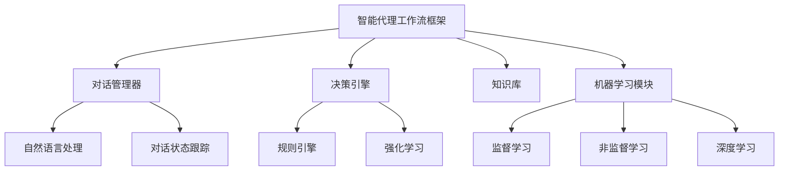

# AI人工智能代理工作流AI Agent WorkFlow：利用机器学习提升代理决策质量

## 1. 背景介绍

### 1.1 问题的由来

在当今快节奏的商业环境中，企业面临着大量的客户查询、订单处理和支持请求。为了高效地管理这些请求并提供卓越的客户服务体验，许多公司都采用了智能代理系统。传统的规则引擎方法虽然可以解决一些常见问题,但往往缺乏灵活性和适应性,难以处理复杂、多变的场景。因此,利用机器学习技术来优化和提升代理决策质量成为了一个迫切的需求。

### 1.2 研究现状

目前,一些公司已经开始探索将机器学习技术应用于智能代理系统中。例如,一些客户服务中心使用自然语言处理(NLP)技术来更好地理解客户查询,并提供更准确的响应。另一些公司则采用强化学习算法来优化代理的决策过程,从而提高效率和客户满意度。然而,这些尝试大多局限于特定领域或任务,缺乏一个统一的、可扩展的框架来整合不同的机器学习技术,并将其应用于各种代理场景。

### 1.3 研究意义

开发一个基于机器学习的智能代理工作流框架,可以为企业带来以下重要意义:

1. **提高决策质量**:通过利用机器学习算法,代理系统可以从历史数据中学习,并做出更准确、更符合客户需求的决策。
2. **增强适应能力**:机器学习模型可以持续学习和优化,从而更好地适应不断变化的业务需求和客户行为。
3. **提升效率**:自动化决策过程可以减少人工干预,从而提高代理的工作效率。
4. **改善客户体验**:更准确的决策有助于提供更个性化、更高质量的客户服务,从而提升客户满意度和忠诚度。

### 1.4 本文结构

本文将详细介绍一种基于机器学习的智能代理工作流框架。首先,我们将探讨该框架的核心概念和组件。然后,我们将深入分析其中所采用的关键算法原理和数学模型。接下来,我们将通过一个实际项目案例,展示如何在实践中应用该框架。最后,我们将讨论该框架的实际应用场景、未来发展趋势和面临的挑战。

## 2. 核心概念与联系

智能代理工作流框架是一个复杂的系统,涉及多个核心概念和组件,它们相互关联、协同工作。下面是该框架的主要概念及其关系:

1. **对话管理器(Dialog Manager)**: 负责管理与客户的对话流程,包括理解客户查询、维护对话状态以及生成适当的响应。它通常包含自然语言处理(NLP)和对话状态跟踪(Dialog State Tracking)等组件。

2. **决策引擎(Decision Engine)**: 根据当前的对话状态和知识库中的信息,做出相应的决策,如提供解决方案、转接人工服务等。它可以包含基于规则的引擎和基于强化学习的决策模型。

3. **知识库(Knowledge Base)**: 存储与业务相关的信息,如产品详情、常见问题解答等,为决策引擎和对话管理器提供必要的知识支持。

4. **机器学习模块(Machine Learning Module)**: 包含各种机器学习算法和模型,如监督学习、非监督学习和深度学习等,用于从历史数据中学习,优化决策引擎和对话管理器的性能。

这些核心概念相互关联、协同工作,共同构建了一个智能化的代理工作流系统。其中,机器学习模块扮演着关键角色,通过学习历史数据,不断优化决策引擎和对话管理器的性能,从而提升整个系统的决策质量。

## 3. 核心算法原理 & 具体操作步骤

### 3.1 算法原理概述

在智能代理工作流框架中,机器学习算法扮演着至关重要的角色。它们可以从历史数据中学习,优化决策引擎和对话管理器的性能,从而提升整个系统的决策质量。常用的机器学习算法包括:

1. **监督学习算法**: 利用标注好的历史数据(如客户查询、代理响应和反馈)训练模型,学习将输入映射到正确的输出。常用算法包括逻辑回归、决策树、支持向量机等。

2. **非监督学习算法**: 从未标注的原始数据中发现隐藏的模式和结构,用于聚类、降维和关联规则挖掘等任务。常用算法包括K-Means聚类、主成分分析(PCA)等。

3. **强化学习算法**: 通过与环境交互并获得奖励或惩罚,学习做出最优决策。常用算法包括Q-Learning、深度Q网络(DQN)等。

4. **深度学习算法**: 利用多层神经网络从原始数据(如文本、图像、语音等)中自动学习特征表示,用于各种任务,如自然语言处理、计算机视觉等。常用算法包括卷积神经网络(CNN)、循环神经网络(RNN)等。

这些算法可以应用于智能代理工作流框架的不同组件,如对话管理器、决策引擎和知识库等,以提升它们的性能。下面我们将详细介绍其中一种核心算法——深度Q网络(DQN),并展示它在决策引擎中的具体应用。

### 3.2 算法步骤详解

深度Q网络(Deep Q-Network, DQN)是一种结合深度学习和强化学习的算法,常用于解决决策问题。在智能代理工作流框架中,DQN可以应用于决策引擎,学习做出最优决策,从而提升代理的决策质量。DQN算法的具体步骤如下:

1. **初始化**: 初始化一个深度神经网络作为Q网络,用于估计每个状态-动作对的Q值(期望未来奖励)。同时初始化一个经验回放池(Experience Replay Buffer)用于存储过去的状态-动作-奖励-新状态样本。

2. **观察并存储样本**: 代理观察当前状态,并根据当前Q网络输出的Q值选择一个动作执行。观察到新状态和获得的奖励后,将(状态,动作,奖励,新状态)样本存储到经验回放池中。

3. **采样并学习**: 从经验回放池中随机采样一批样本,计算目标Q值(基于获得的奖励和新状态的估计Q值),并使用这些目标Q值更新Q网络的参数,最小化Q网络预测值与目标值之间的差异。

4. **目标Q网络更新**: 为了提高算法的稳定性,我们维护一个目标Q网络,其参数定期从Q网络复制过来。目标Q网络用于计算目标Q值,而Q网络则根据目标Q值进行更新。

5. **重复步骤2-4**: 重复观察、存储样本、采样学习和更新目标Q网络的过程,直到Q网络收敛。

6. **决策**: 在实际决策时,代理根据当前状态,选择Q网络输出的最大Q值对应的动作作为决策。

通过上述步骤,DQN算法可以从过去的经验中学习,逐步优化Q网络,使其能够为每个状态选择最优动作,从而提升决策引擎的决策质量。

### 3.3 算法优缺点

**优点**:

1. **高效学习**: DQN能够从经验回放池中高效地学习,避免了传统强化学习算法中的数据相关性问题。

2. **高维状态空间**: DQN可以处理高维状态空间,因为它使用深度神经网络来近似Q值函数。

3. **连续改进**: DQN可以持续学习和改进,适应不断变化的环境和需求。

4. **泛化能力强**: DQN可以从有限的训练数据中学习,并具有较强的泛化能力,适用于未见过的状态。

**缺点**:

1. **不稳定性**: DQN训练过程中可能会出现不稳定性,如Q值估计的高方差等,需要采取一些技巧(如目标Q网络、双Q学习等)来缓解。

2. **样本效率低**: DQN需要大量的样本数据进行训练,否则可能会导致过拟合或欠拟合问题。

3. **超参数敏感**: DQN的性能高度依赖于超参数的设置,如学习率、折扣因子等,需要进行大量的调参工作。

4. **环境限制**: DQN适用于离散动作空间的环境,对于连续动作空间的环境可能需要一些扩展或变体算法。

### 3.4 算法应用领域

DQN算法可以应用于各种需要做出决策的场景,尤其是在智能代理系统中发挥重要作用。以下是一些典型的应用领域:

1. **客户服务**: DQN可以应用于智能客服代理系统中,根据客户查询和对话历史做出最优决策,如提供解决方案、转接人工服务等。

2. **游戏AI**: DQN广泛应用于各种电子游戏中,控制游戏角色做出最优决策,如移动、攻击等。

3. **机器人控制**: DQN可以用于控制机器人在不确定环境中做出最优动作决策,如导航、操作等。

4. **资源调度**: DQN可以应用于数据中心、云计算等领域,优化资源调度和分配决策。

5. **投资决策**: DQN可以用于金融领域,根据市场数据做出最优投资决策。

6. **交通控制**: DQN可以应用于交通信号控制、车辆路径规划等场景,优化交通决策。

总的来说,DQN算法可以应用于任何需要在复杂、不确定环境中做出最优决策的领域,为智能代理系统的决策质量提供有力支持。

## 4. 数学模型和公式 & 详细讲解 & 举例说明

在深度Q网络(DQN)算法中,涉及到一些重要的数学模型和公式,下面我们将详细讲解它们的含义和推导过程。

### 4.1 数学模型构建

在强化学习中,我们通常将问题建模为一个马尔可夫决策过程(Markov Decision Process, MDP)。MDP可以用一个元组 $(S, A, P, R, \gamma)$ 来表示,其中:

- $S$ 是状态空间,表示环境可能的状态集合
- $A$ 是动作空间,表示代理可以执行的动作集合
- $P(s'|s,a)$ 是状态转移概率,表示在状态 $s$ 下执行动作 $a$ 后,转移到状态 $s'$ 的概率
- $R(s,a)$ 是奖励函数,表示在状态 $s$ 下执行动作 $a$ 后获得的即时奖励
- $\gamma \in [0,1)$ 是折扣因子,用于权衡即时奖励和未来奖励的重要性

在MDP中,我们的目标是找到一个最优策略 $\pi^*$,使得在任何状态 $s$ 下执行该策略,可以最大化预期的累积未来奖励,也称为状态值函数 $V^{\pi}(s)$:

$$V^{\pi}(s) = \mathbb{E}_{\pi}\left[\sum_{t=0}^{\infty}\gamma^t R(s_t, a_t) | s_0 = s\right]$$

其中 $\mathbb{E}_{\pi}[\cdot]$ 表示在策略 $\pi$ 下的期望值。

我们还可以定义动作值函数 $Q^{\pi}(s,a)$,表示在状态 $s$ 下执行动作 $a$,然后按照策略 $\pi$ 执行,可获得的预期累积未来奖励:

$$Q^{\pi}(s,a) = \mathbb{E}_{\pi}\left[\sum_{t=0}^{\infty}\gamma^t R(