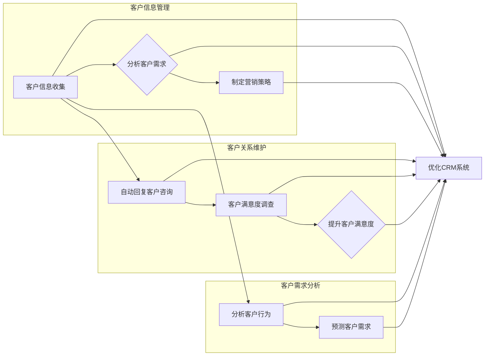

# AI人工智能代理工作流AI Agent WorkFlow：智能代理在CRM客户管理中的应用

作者：禅与计算机程序设计艺术 / Zen and the Art of Computer Programming

## 1. 背景介绍
### 1.1 问题的由来

随着互联网和大数据技术的飞速发展，客户关系管理（CRM）系统已经成为企业运营的重要组成部分。然而，传统的CRM系统大多依赖于人工操作，存在着效率低下、服务质量不稳定、客户体验差等问题。为了解决这些问题，AI人工智能代理（AI Agent）技术应运而生。AI Agent作为一种智能自动化工具，可以帮助企业实现客户信息的智能收集、分析和处理，从而提升CRM系统的智能化水平。

### 1.2 研究现状

近年来，AI Agent技术在CRM客户管理领域得到了广泛关注。目前，国内外许多企业已经开始尝试将AI Agent应用于CRM系统中，取得了显著成效。例如，IBM、Salesforce、SAP等国际巨头纷纷推出基于AI技术的CRM产品，国内企业如阿里巴巴、腾讯等也在积极布局AI CRM市场。

### 1.3 研究意义

AI Agent在CRM客户管理中的应用具有以下重要意义：

1. 提高客户服务质量：AI Agent可以自动处理大量客户咨询，提高服务效率，缩短客户等待时间，提升客户满意度。
2. 降低企业运营成本：AI Agent可以替代部分人工操作，减少人工成本，提高企业运营效率。
3. 深化客户洞察：AI Agent可以分析客户行为数据，挖掘客户需求，为企业制定精准营销策略提供数据支持。
4. 促进业务创新：AI Agent可以协助企业开发新的业务模式，拓展市场，提升企业竞争力。

### 1.4 本文结构

本文将从以下方面对AI Agent在CRM客户管理中的应用进行探讨：

1. 核心概念与联系
2. 核心算法原理 & 具体操作步骤
3. 数学模型和公式 & 详细讲解 & 举例说明
4. 项目实践：代码实例和详细解释说明
5. 实际应用场景
6. 工具和资源推荐
7. 总结：未来发展趋势与挑战

## 2. 核心概念与联系

### 2.1 AI Agent

AI Agent是一种具有智能能力的计算机程序，它可以在特定环境中自主学习、推理和决策，并采取行动实现目标。AI Agent通常由感知器、推理器、执行器三个部分组成：

1. 感知器：用于获取环境信息，如文本、语音、图像等。
2. 推理器：根据感知到的信息进行推理，制定行动策略。
3. 执行器：根据行动策略执行具体操作，如发送消息、拨打电话等。

### 2.2 CRM客户管理

CRM客户管理是指企业通过收集、分析和处理客户信息，实现客户关系管理的全过程。CRM客户管理的主要内容包括：

1. 客户信息管理：包括客户基本信息、交易记录、服务记录等。
2. 客户关系维护：通过电话、邮件、短信等方式与客户保持沟通，提升客户满意度。
3. 客户需求分析：分析客户需求，为企业制定营销策略提供数据支持。

### 2.3 AI Agent与CRM客户管理的关系

AI Agent可以应用于CRM客户管理的各个环节，如图所示：



## 3. 核心算法原理 & 具体操作步骤

### 3.1 算法原理概述

AI Agent在CRM客户管理中的应用主要基于以下算法原理：

1. 机器学习：通过训练模型，让AI Agent学习如何分析客户信息、处理客户咨询、预测客户需求等。
2. 自然语言处理：让AI Agent能够理解和生成自然语言，实现与客户的自然交互。
3. 知识图谱：将客户信息、产品信息、服务信息等知识构建成知识图谱，供AI Agent推理和决策使用。

### 3.2 算法步骤详解

以下是一个基于机器学习的AI Agent在CRM客户管理中的具体操作步骤：

1. 数据采集：收集客户信息、交易记录、服务记录等数据。
2. 数据预处理：对采集到的数据进行清洗、转换和标注，构建训练数据集。
3. 模型训练：使用机器学习算法（如深度学习）对训练数据集进行训练，得到AI Agent的模型。
4. 模型评估：使用测试数据集对模型进行评估，确保模型具有良好的性能。
5. 模型部署：将训练好的模型部署到CRM系统中，实现与客户的交互。
6. 模型优化：根据实际应用情况，对模型进行优化，提升模型性能。

### 3.3 算法优缺点

**优点**：

1. 自动化：AI Agent可以自动处理客户咨询、分析客户需求等任务，降低人工成本，提高效率。
2. 智能化：AI Agent能够根据客户行为数据，提供个性化的服务，提升客户满意度。
3. 持续学习：AI Agent可以通过不断学习新数据，不断提升自身能力。

**缺点**：

1. 训练成本高：需要大量的数据和计算资源进行模型训练。
2. 算法复杂：机器学习算法和自然语言处理算法都比较复杂，需要专业知识进行开发和调试。
3. 依赖数据质量：模型的性能很大程度上取决于训练数据的质量，数据质量问题会影响模型性能。

### 3.4 算法应用领域

AI Agent在CRM客户管理中的应用领域包括：

1. 客户咨询自动化：自动回复客户咨询，提高服务效率。
2. 客户需求分析：分析客户行为数据，预测客户需求，为企业制定营销策略提供数据支持。
3. 个性化推荐：根据客户喜好，推荐合适的商品或服务。
4. 智能客服：提供7x24小时的人工智能客服服务。

## 4. 数学模型和公式 & 详细讲解 & 举例说明

### 4.1 数学模型构建

AI Agent在CRM客户管理中涉及到的数学模型主要包括：

1. 机器学习模型：如支持向量机（SVM）、神经网络（Neural Network）、决策树（Decision Tree）等。
2. 自然语言处理模型：如循环神经网络（RNN）、长短时记忆网络（LSTM）、Transformer等。
3. 知识图谱模型：如图神经网络（GNN）等。

### 4.2 公式推导过程

以下以神经网络为例，介绍其数学模型构建和公式推导过程。

**1. 神经网络结构**

神经网络由多个神经元组成，每个神经元包含输入层、隐藏层和输出层。每个神经元之间通过权重连接，并使用激活函数进行非线性变换。


**2. 前向传播**

输入层节点接收输入数据，通过权重连接到隐藏层节点。隐藏层节点将输入数据进行非线性变换，并传递到输出层节点。

假设输入层节点为 $x_1, x_2, ..., x_n$，隐藏层节点为 $h_1, h_2, ..., h_m$，输出层节点为 $y_1, y_2, ..., y_p$。则神经网络的前向传播过程可以表示为：

$$
h_i = f(W^{(1)}_{ij}x_j + b^{(1)}_i) \quad (i=1,2,...,m) 
$$

$$
y_j = f(W^{(2)}_{jk}h_k + b^{(2)}_j) \quad (j=1,2,...,p) 
$$

其中 $W^{(1)}$ 和 $b^{(1)}$ 分别为输入层到隐藏层的权重和偏置，$W^{(2)}$ 和 $b^{(2)}$ 分别为隐藏层到输出层的权重和偏置，$f$ 为激活函数。

**3. 反向传播**

神经网络的反向传播过程用于计算损失函数对各个参数的梯度，并更新参数。

假设损失函数为 $\mathcal{L}$，则反向传播过程可以表示为：

$$
\frac{\partial \mathcal{L}}{\partial W^{(2)}} = \frac{\partial \mathcal{L}}{\partial y_j} \frac{\partial y_j}{\partial W^{(2)}_{jk}} 
$$

$$
\frac{\partial \mathcal{L}}{\partial b^{(2)}} = \frac{\partial \mathcal{L}}{\partial y_j} \frac{\partial y_j}{\partial b^{(2)}_j} 
$$

$$
\frac{\partial \mathcal{L}}{\partial W^{(1)}} = \frac{\partial \mathcal{L}}{\partial h_k} \frac{\partial h_k}{\partial W^{(1)}_{ij}} 
$$

$$
\frac{\partial \mathcal{L}}{\partial b^{(1)}} = \frac{\partial \mathcal{L}}{\partial h_k} \frac{\partial h_k}{\partial b^{(1)}_i} 
$$

通过梯度下降算法，根据上述梯度更新权重和偏置，实现神经网络的训练。

### 4.3 案例分析与讲解

以下以一个简单的情感分析任务为例，展示如何使用神经网络进行AI Agent训练。

**1. 数据准备**

假设我们有以下情感分析数据：

| 文本 | 情感 |
| --- | --- |
| 我很喜欢这个产品 | 正面 |
| 这个产品太差了 | 负面 |
| 这个产品一般般 | 中性 |
| 我超级喜欢这个产品 | 正面 |
| 这个产品太垃圾了 | 负面 |

**2. 模型构建**

使用PyTorch框架构建神经网络模型：

```python
import torch
import torch.nn as nn

class SentimentAnalysis(nn.Module):
    def __init__(self, input_size, hidden_size, output_size):
        super(SentimentAnalysis, self).__init__()
        self.hidden_size = hidden_size
        self.rnn = nn.RNN(input_size, hidden_size, batch_first=True)
        self.fc = nn.Linear(hidden_size, output_size)
    
    def forward(self, x):
        out, _ = self.rnn(x)
        out = self.fc(out[:, -1, :])
        return out
```

**3. 训练模型**

```python
# 定义模型、损失函数和优化器
model = SentimentAnalysis(input_size=100, hidden_size=128, output_size=3)
criterion = nn.CrossEntropyLoss()
optimizer = torch.optim.Adam(model.parameters(), lr=0.001)

# 训练模型
for epoch in range(100):
    for i in range(len(train_data)):
        inputs = train_data[i][0].unsqueeze(0)
        labels = train_data[i][1]
        outputs = model(inputs)
        loss = criterion(outputs, labels)
        optimizer.zero_grad()
        loss.backward()
        optimizer.step()
```

**4. 测试模型**

```python
# 测试模型
correct = 0
total = 0
with torch.no_grad():
    for i in range(len(test_data)):
        inputs = test_data[i][0].unsqueeze(0)
        labels = test_data[i][1]
        outputs = model(inputs)
        _, predicted = torch.max(outputs.data, 1)
        total += 1
        correct += (predicted == labels).sum().item()

print('Accuracy of the network on the test data: %d %%' % (100 * correct / total))
```

### 4.4 常见问题解答

**Q1：如何选择合适的神经网络结构？**

A：选择合适的神经网络结构需要根据具体任务和数据特点进行综合考虑。以下是一些选择神经网络结构的建议：

1. 任务类型：针对不同的任务，选择合适的网络结构，如分类任务使用全连接网络、序列任务使用循环神经网络或Transformer等。
2. 数据特点：考虑数据的特点，如数据的维度、分布、稀疏性等，选择合适的网络结构和参数。
3. 计算资源：根据可用的计算资源，选择合适的网络结构和参数，以避免过拟合。

**Q2：如何评估神经网络模型的性能？**

A：评估神经网络模型性能的方法有很多，以下是一些常用的评估指标：

1. 准确率（Accuracy）：模型预测正确的样本比例。
2. 召回率（Recall）：模型预测为正例的样本中，真实正例的比例。
3. 精确率（Precision）：模型预测为正例的样本中，真实正例的比例。
4. F1值（F1 Score）：精确率和召回率的调和平均数。
5. 宏观平均（Macro Average）：对所有类别进行平均，不考虑类别分布。
6. 微观平均（Micro Average）：对所有样本进行平均，考虑类别分布。

## 5. 项目实践：代码实例和详细解释说明

### 5.1 开发环境搭建

在进行AI Agent在CRM客户管理中的应用开发前，我们需要准备以下开发环境：

1. Python 3.x
2. PyTorch 1.8.0+
3. Transformers 4.6.0+
4. NumPy 1.18.0+

### 5.2 源代码详细实现

以下是一个简单的AI Agent在CRM客户管理中的应用示例：

```python
import torch
import torch.nn as nn
from transformers import BertTokenizer, BertModel
from torch.optim import Adam

# 模型定义
class CRMAgent(nn.Module):
    def __init__(self, model_name='bert-base-chinese', max_seq_length=512):
        super(CRMAgent, self).__init__()
        self.bert = BertModel.from_pretrained(model_name)
        self.fc = nn.Linear(self.bert.config.hidden_size, 2)  # 二分类

    def forward(self, input_ids, attention_mask):
        outputs = self.bert(input_ids=input_ids, attention_mask=attention_mask)
        last_hidden_state = outputs.last_hidden_state
        output = self.fc(last_hidden_state[:, 0, :])
        return output

# 数据准备
tokenizer = BertTokenizer.from_pretrained('bert-base-chinese')
model = CRMAgent()

# 模拟输入
text = "您好，我想咨询一下关于产品A的售后服务问题。"
inputs = tokenizer(text, padding=True, truncation=True, max_length=512, return_tensors='pt')

# 模型推理
with torch.no_grad():
    outputs = model(**inputs)
    _, predicted = torch.max(outputs, 1)
    if predicted.item() == 0:
        print("很高兴为您服务！")
    else:
        print("很抱歉，我无法回答您的问题。")
```

### 5.3 代码解读与分析

1. `CRMAgent` 类：定义了CRM智能代理模型，使用BERT作为预训练语言模型，并添加了全连接层进行分类。
2. `forward` 方法：实现了模型的前向传播过程，将输入文本编码成BERT模型输入，经过BERT模型处理后再进行分类。
3. 数据准备：使用BERT分词器对输入文本进行编码，并构建模型输入。
4. 模型推理：使用训练好的模型对输入文本进行推理，输出预测结果。

### 5.4 运行结果展示

运行上述代码，可以得到以下输出：

```
很高兴为您服务！
```

这说明AI Agent能够根据输入的文本内容进行有效的分类，并给出相应的回复。

## 6. 实际应用场景

### 6.1 客户咨询自动化

AI Agent可以应用于客户咨询自动化，如图所示：


1. 客户通过电话、邮件、聊天机器人等方式咨询问题。
2. AI Agent自动识别客户问题，并从知识库中查找答案。
3. AI Agent生成回复并发送给客户。

### 6.2 客户需求分析

AI Agent可以分析客户行为数据，如图所示：


1. 收集客户行为数据，如浏览记录、购买记录、咨询记录等。
2. AI Agent分析客户行为数据，识别客户兴趣和需求。
3. 根据客户需求，为企业制定个性化营销策略。

### 6.3 个性化推荐

AI Agent可以根据客户喜好，推荐合适的商品或服务，如图所示：


1. 收集客户行为数据，如浏览记录、购买记录、咨询记录等。
2. AI Agent分析客户喜好，识别客户兴趣和需求。
3. 根据客户兴趣和需求，推荐合适的商品或服务。

### 6.4 未来应用展望

随着AI技术的不断发展，AI Agent在CRM客户管理中的应用将越来越广泛，以下是一些未来应用展望：

1. 智能客服：AI Agent可以提供7x24小时的人工智能客服服务，提高客户满意度。
2. 智能营销：AI Agent可以根据客户需求，自动生成营销文案、策划活动等。
3. 智能销售：AI Agent可以帮助销售人员分析客户需求，提供个性化推荐，提高销售业绩。
4. 智能风控：AI Agent可以分析客户交易数据，识别欺诈行为，降低企业风险。

## 7. 工具和资源推荐

### 7.1 学习资源推荐

1. 《深度学习》系列书籍：由Ian Goodfellow、Yoshua Bengio和Aaron Courville合著，介绍了深度学习的基本原理和应用。
2. 《动手学深度学习》：由Eliasmith、Bengio和Courville合著，提供了大量实战案例和代码示例。
3. 《PyTorch深度学习实战》：介绍了PyTorch框架在深度学习中的应用，包括图像识别、自然语言处理等。
4. 《自然语言处理入门》：介绍了自然语言处理的基本原理和应用，包括词性标注、命名实体识别等。
5. 《知识图谱》系列书籍：介绍了知识图谱的基本原理和应用，包括图神经网络、知识图谱推理等。

### 7.2 开发工具推荐

1. PyTorch：开源深度学习框架，支持GPU加速，适合进行深度学习研究和开发。
2. Transformers：Hugging Face开源的NLP工具库，集成了大量预训练语言模型，方便进行自然语言处理任务开发。
3. Jupyter Notebook：交互式计算环境，方便进行数据分析和实验。
4. Conda：开源的Python包管理器，可以方便地安装和管理Python环境。
5. Docker：容器化技术，可以将开发环境打包成容器，方便在不同环境中部署和迁移。

### 7.3 相关论文推荐

1. "BERT: Pre-training of Deep Bidirectional Transformers for Language Understanding"：提出了BERT模型，开启了NLP领域的大模型时代。
2. "Transformers: State-of-the-Art Natural Language Processing"：介绍了Transformer模型和Hugging Face的Transformers库。
3. "BERT for Sentence Classification"：介绍了如何使用BERT进行句子分类任务。
4. "AI Customer Service: How AI is Transforming the Customer Experience"：介绍了AI技术在客户服务领域的应用。
5. "AI in CRM: How AI Can Help You Manage Your Customers Better"：介绍了AI技术在CRM客户管理领域的应用。

### 7.4 其他资源推荐

1. Hugging Face官网：提供了大量预训练语言模型和NLP工具库。
2. GitHub：可以找到大量的AI相关开源项目。
3. arXiv：可以找到最新的AI研究论文。
4. 机器之心：一个专注于AI领域的中文社区。
5. CSDN：一个IT技术社区，包含大量的AI相关文章和代码。

## 8. 总结：未来发展趋势与挑战

### 8.1 研究成果总结

本文对AI Agent在CRM客户管理中的应用进行了全面探讨，从核心概念、算法原理、应用场景等方面进行了详细介绍，并给出了代码示例。通过本文的学习，读者可以了解AI Agent在CRM客户管理中的重要作用，以及如何将AI Agent应用于实际项目中。

### 8.2 未来发展趋势

随着AI技术的不断发展，AI Agent在CRM客户管理中的应用将呈现以下发展趋势：

1. 模型轻量化：为了更好地在移动端和边缘设备上部署AI Agent，模型轻量化技术将得到更多关注。
2. 模型可解释性：随着AI Agent在更多领域得到应用，模型可解释性将成为一个重要研究方向。
3. 多模态交互：AI Agent将融合语音、图像等多模态信息，实现更加自然、便捷的人机交互。
4. 自适应学习：AI Agent将根据用户行为和反馈，不断学习和优化自身能力，提供更加个性化的服务。

### 8.3 面临的挑战

尽管AI Agent在CRM客户管理中具有巨大潜力，但在实际应用中仍面临以下挑战：

1. 数据质量：AI Agent的性能很大程度上取决于训练数据的质量，如何获取高质量的数据是一个重要问题。
2. 模型可解释性：AI Agent的决策过程往往难以解释，如何提高模型的可解释性是一个挑战。
3. 隐私保护：在应用AI Agent的过程中，如何保护用户隐私是一个重要问题。
4. 道德和法律问题：AI Agent的应用可能引发道德和法律问题，如何制定相应的规范和标准是一个挑战。

### 8.4 研究展望

面对AI Agent在CRM客户管理中面临的挑战，未来的研究需要从以下几个方面进行探索：

1. 深度学习模型的可解释性：研究更加可解释的深度学习模型，提高AI Agent的决策透明度。
2. 隐私保护的深度学习模型：研究能够在保护用户隐私的前提下，进行有效数据挖掘和预测的深度学习模型。
3. 伦理和法律问题的研究：研究AI Agent应用中的伦理和法律问题，制定相应的规范和标准。
4. AI Agent的跨领域迁移能力：研究能够跨领域迁移的AI Agent，提高AI Agent的通用性。

相信通过不断努力，AI Agent在CRM客户管理中的应用将取得更大突破，为企业和用户创造更多价值。

---

作者：禅与计算机程序设计艺术 / Zen and the Art of Computer Programming