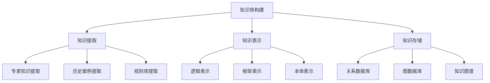
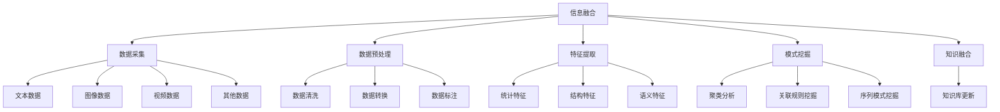
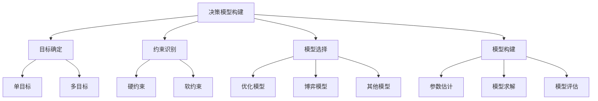
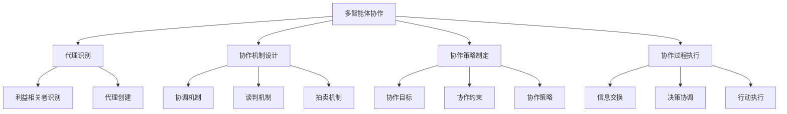
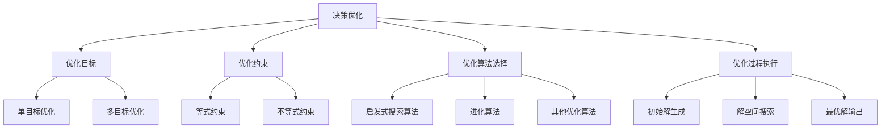

# AI人工智能代理工作流AI Agent Workflow：智能代理在决策支持系统中的应用

## 1. 背景介绍

### 1.1 问题的由来

在当今快节奏的商业环境中，企业需要快速做出明智的决策来保持竞争优势。然而,决策过程通常涉及大量复杂的数据和信息,需要综合考虑各种因素,这使得决策变得异常困难。传统的决策支持系统虽然提供了一定的帮助,但仍然存在局限性,无法完全满足现代企业的需求。

为了解决这一问题,人工智能(AI)技术应运而生。AI代理作为一种智能系统,能够模拟人类专家的决策过程,从海量数据中提取有价值的信息,并提供高质量的决策建议。通过将AI代理集成到决策支持系统中,可以显著提高决策的效率和质量。

### 1.2 研究现状

近年来,AI代理在决策支持系统中的应用受到了广泛关注。许多学者和研究机构都在探索如何利用AI技术来优化决策过程。目前,AI代理主要应用于以下几个领域:

1. 金融投资决策
2. 医疗诊断决策
3. 智能交通管理
4. 供应链优化决策
5. 电子商务推荐系统

虽然取得了一定进展,但AI代理在决策支持系统中的应用仍面临诸多挑战,如数据质量、算法性能、可解释性等问题亟待解决。

### 1.3 研究意义

将AI代理引入决策支持系统,可以带来以下重要意义:

1. 提高决策效率:AI代理能够快速处理海量数据,缩短决策周期。
2. 提高决策质量:AI代理能够发现人类难以察觉的模式和规律,提供更准确的决策建议。
3. 降低决策成本:AI代理可以减轻人工决策的工作量,节省人力和时间成本。
4. 增强决策的一致性:AI代理遵循统一的算法和规则,确保决策的一致性和公平性。

总的来说,AI代理有望成为决策支持系统的重要补充,为企业赢得更大的竞争优势。

### 1.4 本文结构  

本文将全面介绍AI代理在决策支持系统中的应用。首先阐述核心概念和原理,然后详细解释关键算法和数学模型,并通过实际案例进行说明。接下来介绍代码实现和应用场景,最后总结未来发展趋势和面临的挑战。文章结构安排如下:

```
1. 背景介绍
2. 核心概念与联系
3. 核心算法原理与具体操作步骤
4. 数学模型和公式详细讲解与举例说明  
5. 项目实践:代码实例和详细解释说明
6. 实际应用场景
7. 工具和资源推荐 
8. 总结:未来发展趋势与挑战
9. 附录:常见问题与解答
```

## 2. 核心概念与联系

在探讨AI代理在决策支持系统中的应用之前,我们需要先了解以下几个核心概念:

1. **决策支持系统(Decision Support System, DSS)**: 一种基于计算机的信息系统,旨在协助决策者收集有用的信息、识别问题、构建模型并评估各种替代方案,从而做出更好的决策。

2. **人工智能代理(AI Agent)**: 一种具有一定智能的软件实体,能够感知环境、处理信息、执行任务并与人或其他代理进行交互。在决策支持系统中,AI代理扮演着重要角色,负责数据分析、模型构建和决策推理等工作。

3. **多智能体系统(Multi-Agent System, MAS)**: 由多个智能代理组成的分布式系统,代理之间可以相互协作或竞争,以完成复杂的任务。在决策支持系统中,多智能体系统可以模拟不同利益相关者的决策过程,并协调各方利益,从而得出更加平衡的决策方案。

4. **机器学习(Machine Learning, ML)**: 赋予计算机系统从数据中自动学习和改进的能力,无需显式编程。在决策支持系统中,机器学习算法可以用于数据挖掘、模式识别和预测分析等任务。

5. **知识表示与推理(Knowledge Representation and Reasoning, KR&R)**: 指在计算机系统中表示和操作知识的方法。在决策支持系统中,KR&R技术可用于构建知识库,存储专家知识和经验,并进行推理和决策。

6. **自然语言处理(Natural Language Processing, NLP)**: 研究计算机系统如何理解和生成人类语言的技术。在决策支持系统中,NLP可用于处理文本数据,提取关键信息,并生成自然语言的决策报告。

上述概念相互关联、相辅相成,共同构建了AI代理在决策支持系统中的应用框架。下一节将详细介绍核心算法原理和具体操作步骤。

## 3. 核心算法原理与具体操作步骤

### 3.1 算法原理概述

AI代理在决策支持系统中的核心算法原理可概括为以下几个方面:

1. **知识库构建**: 通过知识表示与推理技术,从各种数据源(如专家知识、历史案例、规则库等)中提取知识,并将其形式化存储在知识库中。

2. **信息融合**: 利用机器学习和数据挖掘算法,从海量异构数据(如文本、图像、视频等)中提取有价值的信息,并将其融合到知识库中。

3. **决策模型构建**: 基于知识库中的知识,结合优化理论、博弈论等数学模型,构建决策模型,用于评估各种决策方案。

4. **多智能体协作**: 在复杂决策场景中,需要多个AI代理相互协作,模拟不同利益相关者的决策过程,并协调各方利益,得出平衡的决策方案。

5. **决策优化**: 通过启发式搜索、约束优化等算法,在满足各种约束条件的前提下,寻找最优决策方案。

6. **决策解释**: 利用可解释AI技术,解释AI代理得出决策建议的原因和依据,增强决策的可信度和透明度。

7. **人机交互**: 通过自然语言处理和可视化技术,实现人机之间高效、友好的交互,使决策者能够轻松理解和操作AI代理。

上述原理相互关联、环环相扣,构成了AI代理在决策支持系统中的完整工作流程。下一小节将对核心算法的具体操作步骤进行详细阐述。

### 3.2 算法步骤详解

AI代理在决策支持系统中的工作流程可分为以下几个主要步骤:

#### 步骤1: 知识库构建



该步骤的目标是从各种数据源中提取相关知识,并将其形式化存储在知识库中。主要包括以下子步骤:

1. 知识提取:从专家知识、历史案例、规则库等数据源中提取相关知识。
2. 知识表示:将提取的知识表示为逻辑形式、框架形式或本体形式。
3. 知识存储:将表示后的知识存储在关系数据库、图数据库或知识图谱中。

#### 步骤2: 信息融合



该步骤的目标是从海量异构数据中提取有价值的信息,并将其融合到知识库中。主要包括以下子步骤:

1. 数据采集:从各种来源采集文本、图像、视频等异构数据。
2. 数据预处理:对采集的数据进行清洗、转换和标注等预处理。
3. 特征提取:从预处理后的数据中提取统计特征、结构特征和语义特征。
4. 模式挖掘:利用聚类分析、关联规则挖掘和序列模式挖掘等技术,发现数据中潜在的模式。
5. 知识融合:将提取的特征和挖掘的模式融合到知识库中,更新知识库。

#### 步骤3: 决策模型构建



该步骤的目标是基于知识库中的知识,结合优化理论、博弈论等数学模型,构建决策模型。主要包括以下子步骤:

1. 目标确定:明确决策问题的目标,可能是单一目标或多个目标。
2. 约束识别:识别决策问题中的硬约束(必须满足)和软约束(尽量满足)。
3. 模型选择:根据决策问题的特点,选择合适的优化模型、博弈模型或其他模型。
4. 模型构建:估计模型参数,求解模型,并对模型进行评估和调整。

#### 步骤4: 多智能体协作



该步骤的目标是在复杂决策场景中,通过多个AI代理的相互协作,模拟不同利益相关者的决策过程,并协调各方利益,得出平衡的决策方案。主要包括以下子步骤:

1. 代理识别:识别决策问题中的利益相关者,并为每个利益相关者创建一个AI代理。
2. 协作机制设计:设计代理之间的协调机制、谈判机制和拍卖机制等,以促进协作。
3. 协作策略制定:确定协作的目标、约束和策略。
4. 协作过程执行:代理之间进行信息交换、决策协调和行动执行,实现协作决策。

#### 步骤5: 决策优化



该步骤的目标是在满足各种约束条件的前提