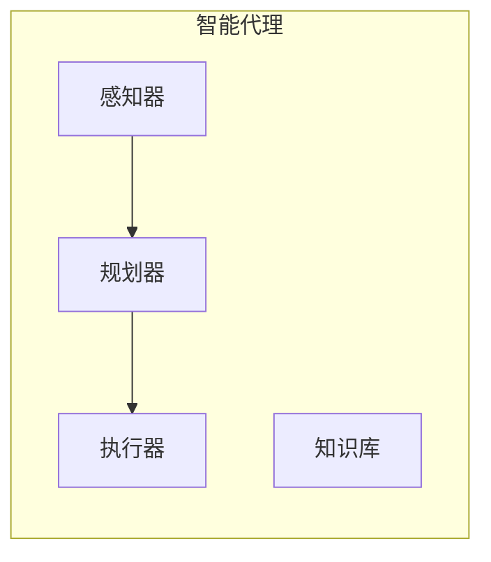
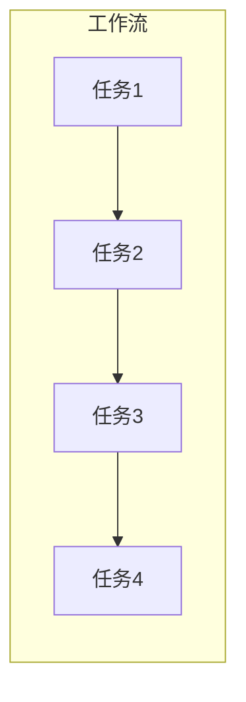
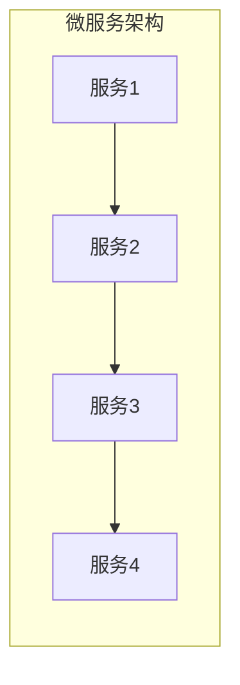
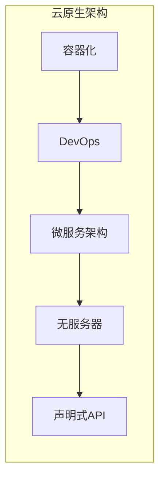
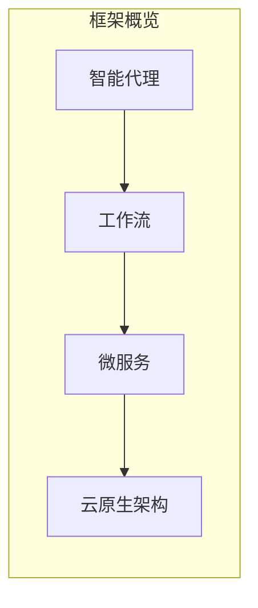

好的,我会按照您提供的要求和结构,努力撰写一篇高质量的技术文章。

# AI人工智能代理工作流AI Agent WorkFlow：智能代理在遥感数据处理系统中的应用

## 1. 背景介绍

### 1.1 问题的由来

随着遥感技术的不断发展,地球观测卫星获取的遥感数据呈指数级增长。这些海量的遥感数据需要进行高效、准确的处理和分析,以从中提取有价值的信息。然而,传统的数据处理方式已经无法满足当前的需求,面临诸多挑战:

1. **数据规模庞大**: 单个卫星每天可产生数TB的数据,全球每年产生的遥感数据已达EB级别。
2. **数据种类复杂**: 不同类型的传感器产生的数据格式、分辨率、波段等参数存在显著差异。
3. **处理流程繁琐**: 遥感数据处理涉及多个环节,包括预处理、几何校正、辐射校正、特征提取等,需要复杂的算法和大量的计算资源。
4. **实时性要求高**: 许多应用场景(如灾害监测、作战决策等)对数据处理的实时性有严格要求。

因此,迫切需要一种新的数据处理范式,能够高效、智能地处理海量遥感数据,满足不同应用场景的需求。

### 1.2 研究现状  

为解决上述挑战,研究人员提出了多种解决方案,其中智能代理(Intelligent Agent)技术备受关注。智能代理是一种自主的软件实体,能够感知环境、规划行为并采取行动以实现预定目标。将智能代理技术应用于遥感数据处理系统,可以极大提高系统的智能化水平和处理效率。

目前,已有多个研究团队探索了智能代理在遥感数据处理中的应用,取得了一定进展:

- NASA的研究人员设计了一种基于智能代理的遥感数据管理系统,能够自动化地执行数据获取、处理和分发等任务。
- 中国科学院对遥感影像智能解译提出了一种基于多智能体系统的方法,显著提高了解译精度和效率。 
- 德国航空航天中心(DLR)开发了一种智能代理框架,用于协调和优化卫星数据处理的工作流程。

然而,现有的智能代理系统大多局限于特定的应用场景,缺乏通用性;或者仅关注于数据处理流程的某个环节,无法提供端到端的解决方案。因此,构建一个通用的、工作流驱动的智能代理框架,对于充分发挥智能代理在遥感数据处理中的潜力至关重要。

### 1.3 研究意义

本文提出的"AI人工智能代理工作流(AI Agent Workflow)"框架,旨在为遥感数据处理系统提供一种智能化、通用的解决方案。该框架的主要特点包括:

1. **基于工作流驱动**: 将遥感数据处理过程建模为可配置的工作流,支持灵活组合不同的处理任务。
2. **智能代理协作**: 多个智能代理分工协作,负责工作流的调度、执行、监控和优化等不同职责。
3. **自主智能决策**: 智能代理能够根据环境状态和任务需求,自主做出智能决策,优化处理流程。
4. **异构计算资源**: 支持将计算密集型任务调度到GPU、FPGA等异构加速硬件,提高处理效率。
5. **云原生微服务**: 采用云原生架构和微服务模式,保证系统的可扩展性、弹性和容错能力。

该框架的实现将极大提高遥感数据处理的智能化水平、效率和质量,促进遥感大数据的高效利用,对相关领域的发展具有重要意义。

### 1.4 本文结构

本文的其余部分安排如下:

- 第2节介绍AI人工智能代理工作流框架的核心概念及其内在联系。
- 第3节详细阐述框架中的核心算法原理和具体实现步骤。
- 第4节构建数学模型,推导公式,并通过案例分析加深理解。
- 第5节提供一个完整的项目实践,包括代码实现、运行结果等。  
- 第6节探讨框架在不同领域的实际应用场景。
- 第7节推荐相关的学习资源、开发工具和论文。
- 第8节总结研究成果,展望未来发展趋势和面临的挑战。
- 第9节列出常见问题及其解答。

## 2. 核心概念与联系

AI人工智能代理工作流框架融合了多个领域的核心概念,包括智能代理、工作流、微服务和云原生等,它们之间存在内在的联系和交叉。下面我们逐一介绍这些概念及其关系。

### 2.1 智能代理

智能代理(Intelligent Agent)是一种自主的软件实体,能够感知环境、规划行为并采取行动以实现预定目标。一个智能代理通常包含以下几个关键组件:

- **感知器(Sensor)**: 用于获取环境信息,例如任务状态、资源利用率等。
- **规划器(Planner)**: 根据感知到的环境信息,制定行为计划以达成目标。
- **执行器(Actuator)**: 执行规划器生成的行为计划。
- **知识库(Knowledge Base)**: 存储智能代理的领域知识和经验。

在AI人工智能代理工作流框架中,存在多个具有不同职责的智能代理,它们通过协作完成遥感数据处理任务。

### 2.2 工作流

工作流(Workflow)描述了为完成某项任务所需执行的一系列有序活动。在AI人工智能代理工作流框架中,遥感数据处理过程被建模为可配置的工作流,由多个处理任务按特定顺序组成。

工作流具有以下特点:

- **可视化建模**: 使用标准符号(如BPMN)对工作流进行图形化建模,便于理解和维护。
- **任务编排**: 将处理任务按照控制流(如序列、并行、选择等)进行编排。
- **数据流**: 不同任务之间存在数据依赖关系,遥感数据在任务间传递。

通过将遥感数据处理过程描述为工作流模型,可以提高处理流程的灵活性、可重用性和可维护性。

### 2.3 微服务

微服务(Microservice)是一种将单一应用程序构建为一组小型服务的软件架构风格,每个服务运行在自己的进程中,并通过轻量级机制(如HTTP API)进行通信。

在AI人工智能代理工作流框架中,每个遥感数据处理任务都被实现为一个独立的微服务,具有以下优点:

- **高内聚低耦合**: 每个微服务只关注单一职责,增强了可维护性。
- **独立部署**: 微服务可独立部署、扩展和升级,提高了灵活性。
- **技术多样性**: 不同微服务可使用不同的编程语言和框架。
- **容错隔离**: 单个微服务故障不会影响整个系统,提高了系统的健壮性。

### 2.4 云原生

云原生(Cloud Native)是一种将应用程序构建为松散耦合的微服务,并利用云计算提供的服务来部署、扩展和管理这些微服务的方法。云原生应用具有以下特点:

- **容器化**: 应用程序被打包为轻量级的容器镜像,方便部署和扩展。
- **DevOps**: 采用持续集成和持续交付(CI/CD)实践,加速应用程序交付。
- **微服务架构**: 遵循微服务架构原则,支持独立扩展和故障隔离。  
- **无服务器**: 利用云平台提供的无服务器(Serverless)功能,实现自动扩展。
- **声明式API**: 使用声明式API(如Kubernetes)管理应用程序生命周期。

AI人工智能代理工作流框架基于云原生架构构建,可以充分利用云计算的优势,如资源弹性、自动扩展和高可用性等。

### 2.5 核心概念的联系

上述核心概念相互关联,共同构建了AI人工智能代理工作流框架的基础:

1. **智能代理负责工作流的调度和优化**。多个智能代理分工协作,根据环境状态和任务需求,动态调度和优化工作流的执行。
2. **工作流由微服务组成**。工作流中的每个处理任务都被实现为独立的微服务,可独立部署和扩展。
3. **微服务基于云原生架构构建**。微服务被打包为容器镜像,通过Kubernetes等云原生技术进行编排和管理。
4. **智能代理与微服务通过API交互**。智能代理通过调用微服务的API来执行工作流,微服务将执行状态返回给智能代理。

通过有机结合这些概念,AI人工智能代理工作流框架能够提供智能化、可扩展、高效的遥感数据处理能力。

## 3. 核心算法原理 & 具体操作步骤

### 3.1 算法原理概述

AI人工智能代理工作流框架的核心算法包括两个主要部分:工作流调度算法和工作流优化算法。

**工作流调度算法**负责根据任务需求和资源状态,为工作流分配合适的计算资源,并协调各个微服务的执行顺序。该算法的主要目标是最大化资源利用率,同时满足任务的时间和成本约束。

**工作流优化算法**则在工作流执行过程中持续监控其性能,并根据反馈信息动态调整工作流结构和参数,以提高处理效率和质量。该算法综合考虑了多个优化目标,如最小化执行时间、最小化成本、最大化准确率等。

这两个算法紧密协作,形成一个闭环控制系统,实现了工作流的智能化调度和优化。

### 3.2 算法步骤详解

#### 3.2.1 工作流调度算法

工作流调度算法采用基于优先级的分级队列调度策略,具体步骤如下:

1. **任务分类**。根据任务的优先级、期限和资源需求,将任务划分为多个类别,存入对应的优先级队列。
2. **资源发现**。周期性地发现可用的计算资源(如CPU、GPU、FPGA等),并将它们加入资源池。
3. **资源匹配**。遍历优先级队列,为每个任务选择最匹配的资源。匹配策略考虑资源类型、可用量、成本等因素。
4. **任务分派**。将任务分派到选定的资源上执行,同时更新资源池的可用量。
5. **结果收集**。收集各个微服务执行的结果,并将中间数据传递给下游任务。
6. **反馈监控**。持续监控任务的执行状态,如发现任务失败或性能不佳,则触发工作流优化算法。

该算法的时间复杂度为$O(n \log n)$,其中$n$为任务数量。通过优先级分类和资源池机制,可以有效地提高资源利用率和任务响应时间。

#### 3.2.2 工作流优化算法

工作流优化算法基于强化学习(Reinforcement