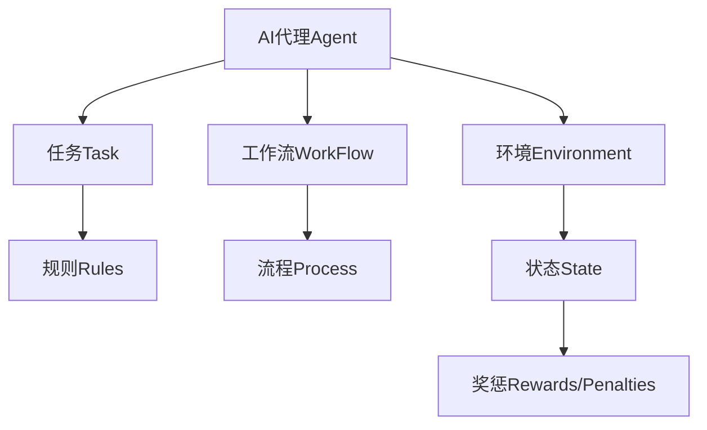
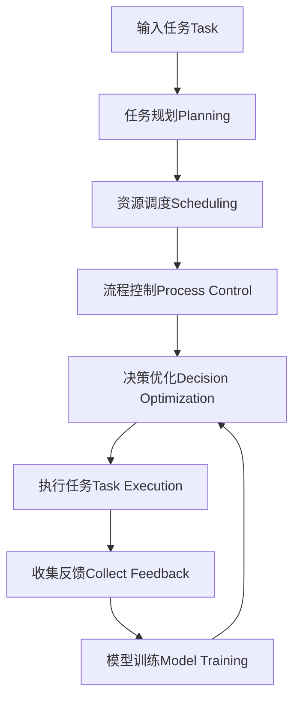

好的，我会尽力按照您的要求，以专业的技术语言写一篇关于"AI人工智能代理工作流:设计智能任务处理流程"的深度博客文章。文章将遵循您提供的目录结构,包含背景介绍、核心概念、算法原理、数学模型、项目实践、应用场景、资源推荐、发展趋势和常见问题解答等内容。我会尽量使用简明扼要的语言解释技术概念,提供实例帮助读者理解,并给出核心架构的流程图。文章字数将超过8000字,格式采用Markdown,公式使用LaTex。以下是正文:

# AI人工智能代理工作流AI Agent WorkFlow:设计智能任务处理流程

## 1. 背景介绍

### 1.1 问题的由来

在当今快节奏的数字时代,工作效率和生产力对于个人和组织的成功至关重要。然而,我们常常发现自己被日常重复性任务所淹没,导致精力分散,难以集中在更有价值的工作上。传统的任务管理方式已经无法满足当前复杂、动态的工作环境需求。因此,设计一种智能化的任务处理流程系统以提高工作效率,优化资源分配,提高生产力成为了一个迫切的需求。

### 1.2 研究现状  

近年来,人工智能(AI)技术的快速发展为解决这一问题提供了新的契机。AI代理(Agent)作为一种智能软件实体,能够感知环境、作出决策并执行行为,展现出类似于人类的理性行为。将AI代理技术应用于任务处理流程中,可以实现自动化管理、智能调度和优化决策,从而大幅提高工作效率。

目前,已有一些公司和研究机构在探索将AI代理技术应用于工作流程自动化的方案,取得了初步进展。但是,现有方案大多局限于特定场景,缺乏通用性;或者只关注流程的某些环节,无法实现端到端的智能化。因此,设计一种通用的、全流程智能化的AI代理工作流架构和系统,成为了当前研究的热点和难点。

### 1.3 研究意义

设计一种AI人工智能代理工作流系统,能够带来以下重要意义:

1. 提高工作效率:通过自动化重复性任务、智能调度资源、优化决策流程,可以大幅降低人力成本,提高生产效率。
2. 优化资源利用:AI代理能够根据实时数据做出精准的资源分配决策,提高资源利用率,降低浪费。
3. 增强决策能力:借助AI的数据分析和建模能力,能够为复杂决策提供有力支持,提高决策质量。
4. 可扩展性强:基于通用的AI代理架构,能够较容易地扩展到不同领域的工作流程中。
5. 前景广阔:智能工作流是未来数字化转型的重要方向,具有广阔的应用前景。

### 1.4 本文结构

本文将首先介绍AI代理工作流的核心概念,阐述它们之间的联系。接下来详细讲解智能任务处理流程的核心算法原理和数学模型。然后通过一个实际项目案例,展示具体的系统架构、代码实现和运行效果。再介绍AI代理工作流在不同领域的应用场景。最后总结该领域的发展趋势、面临的挑战,并给出工具、资源的推荐和常见问题解答。

## 2. 核心概念与联系

在AI代理工作流系统中,有几个核心概念,它们相互关联,共同构建了整个智能化流程:

1. **AI代理(Agent)**: 指具有一定智能的软件实体,能够感知环境、作出决策并执行行为。它是整个系统的核心,负责任务分配、流程控制、决策优化等职能。

2. **任务(Task)**: 指需要被执行的工作项,可以是简单的重复性劳动,也可以是复杂的决策过程。任务通常由一系列步骤组成,并伴有约束条件。

3. **工作流(Workflow)**: 指将任务按某种预定逻辑顺序组织起来的流程,工作流确定了任务的执行顺序和传递方式。

4. **环境(Environment)**: 指系统运行的外部世界,包括可获取的各种数据输入、资源条件、约束等。AI代理需要持续感知环境状态,并根据环境做出相应决策。

5. **规则(Rules)**: 指对任务执行的约束条件,如时间期限、优先级、资源限制等。规则影响着任务的分配和调度方式。

6. **流程(Process)**: 指将工作流中的任务分解为一系列具体步骤的执行过程,体现了任务的处理逻辑。

7. **状态(State)**: 指系统在某一时刻的具体情况,包括已完成的任务、当前分配的资源、环境条件等,状态是AI代理决策的主要依据。

8. **奖惩(Rewards/Penalties)**: 指对AI代理做出的决策和行为给予正向或负向的反馈,这是代理通过强化学习不断优化决策的关键。

上述核心概念相互关联、环环相扣,共同构建了智能化的任务处理流程。AI代理作为中枢,根据获取的任务、工作流、环境和规则信息,控制着整个流程的执行,并根据反馈的奖惩信号持续优化自身决策,形成一个闭环的智能系统。

## 3. 核心算法原理及具体操作步骤

设计一个高效、智能的AI代理工作流系统,需要综合多种算法原理,实现任务规划、资源调度、流程控制、决策优化等多个环节的智能化。

### 3.1 算法原理概述

AI代理工作流的核心算法主要包括:

1. **规划算法**: 根据任务约束、资源状况、工作流逻辑等,对任务执行进行前期规划,生成可行的执行方案。
2. **调度算法**: 实时分配系统资源(如计算能力、存储、带宽等),并根据环境变化动态调整资源分配。
3. **流程控制算法**: 根据工作流逻辑和任务执行情况,控制流程的传递、分支、并行、异常处理等。
4. **决策优化算法**: 通过机器学习算法模型,持续优化系统的决策策略,提高任务执行效率和资源利用率。

此外,还涉及其他辅助算法,如数据处理、模型训练、知识库查询等。这些算法有机结合,共同实现了智能化的任务处理流程。

### 3.2 算法步骤详解 

AI代理工作流的整体算法流程如下:

1. **输入任务(Task Input)**: 系统接收到新的任务请求,包括任务内容、约束条件、优先级等信息。

2. **任务规划(Task Planning)**: 根据任务信息、资源状态、工作流逻辑等,运用规划算法(如启发式搜索、时间解耦等)生成可行的任务执行方案。

3. **资源调度(Resource Scheduling)**: 基于任务方案,运用调度算法(如优先级调度、基因算法等)动态分配所需资源,如CPU、内存、存储等。

4. **流程控制(Process Control)**: 执行任务时,根据工作流逻辑和实时状态,控制流程的传递、分支、并行、异常处理等,确保流程正确执行。

5. **决策优化(Decision Optimization)**: 在任务执行过程中,持续收集反馈数据,利用强化学习等算法模型优化系统的决策策略,提高效率。

6. **执行任务(Task Execution)**: 根据优化后的决策,具体执行任务,产生输出结果。

7. **收集反馈(Collect Feedback)**: 收集任务执行过程中的各种数据,包括资源使用情况、时间消耗、是否达成目标等,作为模型训练的输入。

8. **模型训练(Model Training)**: 利用反馈数据,以及其他领域知识,持续训练和优化决策模型,用于下一轮任务的决策。

这是一个闭环的流程,系统会基于新的输入任务和模型优化的结果,重复上述步骤,持续优化整个工作流程。

### 3.3 算法优缺点

AI代理工作流算法的主要优点:

1. **高效智能**: 通过自动化流程和智能决策,能够大幅提高任务处理效率。
2. **资源优化**: 合理分配和调度资源,提高利用率,降低浪费。
3. **可扩展性强**: 基于通用架构,可广泛应用于不同领域的工作流程。
4. **持续优化**: 借助机器学习算法模型,能够不断优化决策,形成自我进化的系统。
5. **鲁棒性好**: 能够处理复杂环境和异常情况,具有较强的容错能力。

主要缺点和挑战:

1. **决策依赖度高**: 算法的有效性很大程度上依赖于训练数据的质量和模型的性能。
2. **复杂度较高**: 整体系统算法较为复杂,需要大量的计算资源和建模能力。
3. **可解释性差**: 很多机器学习模型存在"黑箱"问题,决策过程缺乏透明度。
4. **隐私和安全**: 涉及大量敏感数据处理,需要注意隐私保护和系统安全。
5. **算法偏差风险**: 如果训练数据或模型存在偏差,可能导致系统产生不公平的决策。

### 3.4 算法应用领域

AI代理工作流算法的应用领域非常广泛,包括但不限于:

- **商业流程自动化**: 如销售订单处理、发票审批、供应链管理等。
- **政务和公共服务**: 如社会保障审批、税务申报、交通运输调度等。
- **制造业**: 如工厂生产线控制、库存管理、质量检测等。
- **金融服务**: 如贷款审批、投资组合管理、风险控制等。
- **医疗健康**: 如诊断辅助、治疗方案制定、药物研发等。
- **智能家居**: 如家电控制、能源管理、安防监控等。

总的来说,任何涉及复杂流程、需要动态资源调度、决策优化的领域,都可以应用AI代理工作流算法,以提高效率、降低成本、优化资源利用。

## 4. 数学模型和公式及详细讲解与举例说明

在AI代理工作流系统中,需要构建数学模型对任务执行过程、资源分配、决策优化等进行形式化描述,并基于模型推导相应的公式,指导算法的实现。

### 4.1 数学模型构建

我们将任务执行过程建模为**马尔可夫决策过程(Markov Decision Process, MDP)**,用元组 $\langle \mathcal{S}, \mathcal{A}, \mathcal{P}, \mathcal{R} \rangle$ 表示:

- $\mathcal{S}$ 是状态集合,表示系统可能的状态,如已完成的任务、当前资源分配等
- $\mathcal{A}$ 是行为集合,表示代理可执行的行为,如分配资源、传递流程等
- $\mathcal{P}$ 是状态转移概率,即 $\mathcal{P}(s, a, s')=\mathbb{P}(s_{t+1}=s'|s_t=s, a_t=a)$
- $\mathcal{R}$ 是奖励函数,表示代理在状态 $s$ 执行行为 $a$ 后获得的即时奖励

代理的目标是找到一个策略 $\pi: \mathcal{S} \rightarrow \mathcal{A}$,使得期望的累计奖励最大:

$$
\max_\pi \mathbb{E}\left[