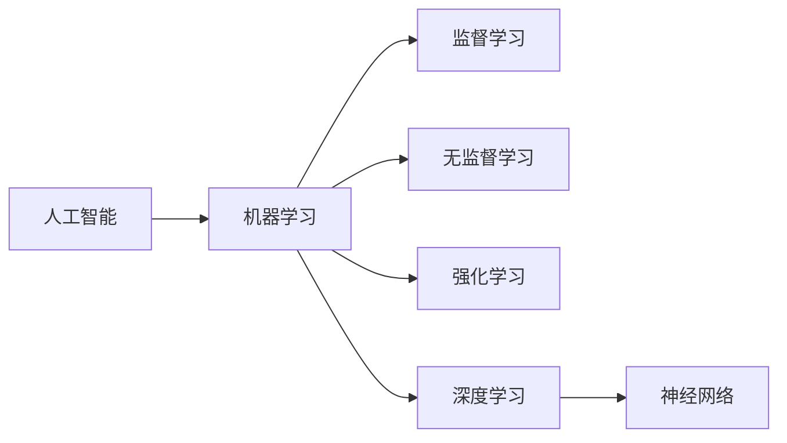

# AI人工智能核心算法原理与代码实例讲解：人工智能应用发展趋势

关键词：人工智能, 机器学习, 深度学习, 神经网络, 计算机视觉, 自然语言处理, 强化学习, TensorFlow, PyTorch, 人工智能应用

## 1. 背景介绍
### 1.1 问题的由来
人工智能(Artificial Intelligence, AI)作为计算机科学的一个分支,旨在研究如何让机器模拟人类的智能行为,如学习、推理、判断等。自1956年达特茅斯会议首次提出"人工智能"的概念以来,AI经历了从早期的符号主义、连接主义到如今的深度学习,取得了长足的进步。当前,以深度学习为代表的AI技术在计算机视觉、语音识别、自然语言处理等领域取得了广泛应用,正在深刻影响和改变人类社会生活的方方面面。

### 1.2 研究现状 
近年来,深度学习的兴起掀起了AI发展的新浪潮。一系列里程碑式的成果,如AlphaGo击败人类围棋冠军、GPT-3展现出接近人类水平的对话和写作能力等,让业界和学界对AI的发展前景充满期待。各国政府和科技巨头纷纷加大对AI的投入,AI专利申请量和论文发表数呈现爆发式增长。与此同时,AI技术在医疗、金融、教育、交通等领域的应用日益深入,正在重塑传统行业,催生新的商业模式。

### 1.3 研究意义
在这个AI飞速发展的大背景下,深入理解AI的核心算法原理,掌握主流的AI开发框架和工具,对于从事AI研究和应用的人员来说至关重要。一方面,这有助于我们把握AI技术发展的脉络,洞察其内在规律,为未来AI的理论突破提供思路。另一方面,算法和工程实践的结合,是实现AI落地应用的关键。只有对算法原理有清晰的认识,并能灵活运用编程工具,才能开发出高质量、高性能的AI应用,推动AI产业化进程。

### 1.4 本文结构
本文将重点介绍当前AI领域的几大核心算法,包括监督学习、无监督学习、半监督学习、迁移学习、强化学习等。通过阐述其基本原理,并给出具体的代码实例,帮助读者全面把握这些算法的特点和实现方法。同时,文章还将探讨AI技术在计算机视觉、自然语言处理等热点领域的应用现状和发展趋势,分享一些实用的开发工具和学习资源。最后,对AI未来的发展进行展望,提出AI研究面临的挑战和机遇。

## 2. 核心概念与联系
在正式介绍AI核心算法之前,我们有必要先明确几个基本概念:
- 机器学习:使计算机系统能够自主学习和改进性能的方法,是实现AI的主要途径。
- 深度学习:机器学习的一个分支,基于神经网络,模拟人脑结构和功能,能够从海量数据中自动提取特征。
- 神经网络:由大量神经元组成的网络结构,每个神经元可以看作一个简单的处理单元,通过调整神经元之间的连接权重,网络可以逼近任意复杂的函数。
- 监督学习:训练数据带有标签,模型学习输入到输出的映射关系,代表算法有线性回归、逻辑回归、支持向量机、决策树等。
- 无监督学习:训练数据没有标签,模型自主发现数据内在结构和规律,代表算法有聚类、降维、生成对抗网络等。  
- 强化学习:通过与环境的交互,获得奖励反馈,不断优化策略,代表算法有Q-learning、策略梯度等。

这些概念之间并非孤立,而是相互关联的。例如,深度学习是机器学习的一个重要分支,神经网络则是实现深度学习的基本模型。监督学习、无监督学习、强化学习是三大机器学习范式。理解它们的内在联系,对于我们掌握AI算法全局至关重要。

## 3. 核心算法原理 & 具体操作步骤
### 3.1 算法原理概述
本节将重点介绍几种常见的机器学习算法原理,包括线性回归、逻辑回归、决策树、支持向量机、K-means聚类等。这些算法分别代表了监督学习和无监督学习的典型方法。

#### 3.1.1 线性回归
线性回归是监督学习的一种,用于拟合连续型因变量和自变量之间的线性关系。给定数据集$D=\{(x_1,y_1),(x_2,y_2),...,(x_m,y_m)\}$,线性回归的目标是学得一个线性模型:
$$f(x)=wx+b$$
使得$f(x)$与$y$尽可能接近。其中,$w$和$b$分别为模型参数,表示权重和偏置。模型训练过程就是求解最优$w$和$b$,使均方误差最小化:
$$\min_{w,b} \frac{1}{m}\sum_{i=1}^m(f(x_i)-y_i)^2$$
该问题可以用梯度下降法求解。

#### 3.1.2 逻辑回归
逻辑回归用于二分类问题,将样本的特征通过Sigmoid函数映射到(0,1)区间,作为样本属于正类的概率。假设
$$P(Y=1|x)=\frac{1}{1+e^{-(wx+b)}}$$
$$P(Y=0|x)=1-P(Y=1|x)$$
逻辑回归的目标是最大化似然函数:
$$\max_{w,b} \sum_{i=1}^m \log P(y_i|x_i)$$
通过梯度上升等优化算法可以求解该问题。

#### 3.1.3 决策树
决策树通过树形结构来表示样本的分类过程。非叶节点表示一个特征,叶节点表示类别。从根节点开始,根据样本特征选择分支,直至达到叶节点,完成分类。决策树的关键是如何选择最优划分特征。常用的准则有信息增益、信息增益比、基尼指数等。以基尼指数为例,假设样本集合$D$中第$k$类样本所占比例为$p_k$,则$D$的基尼指数定义为:
$$\mathrm{Gini}(D)=1-\sum_{k=1}^K p_k^2$$
基尼指数反映了集合的不确定性,选择基尼指数最小的特征作为最优划分。

#### 3.1.4 支持向量机
支持向量机(SVM)试图找到一个超平面将不同类别的样本分开,并且使得超平面两侧的间隔最大化。对于线性可分的情况,SVM优化目标可表示为:
$$\min_{w,b} \frac{1}{2}||w||^2 \quad s.t. \quad y_i(wx_i+b) \geq 1, i=1,2,...,m$$
对于线性不可分的情况,可以引入松弛变量和核技巧,将样本映射到高维空间,再寻找分离超平面。SVM的优点是泛化能力强,对高维数据处理有效。

#### 3.1.5 K-means聚类
K-means是无监督学习的代表算法之一,将数据划分为K个簇,使得簇内样本相似度最大,簇间差异性最大。算法流程如下:
1. 随机选择K个样本作为初始聚类中心
2. 重复直到收敛:
   - 对每个样本,计算它到各个聚类中心的距离,并划分到距离最近的簇
   - 更新每个簇的聚类中心为簇内所有样本的均值
3. 输出最终的K个簇

K-means的关键是如何度量样本之间的距离,常见的距离度量有欧氏距离、曼哈顿距离等。另外,K值的选择对聚类结果影响很大,需要根据先验知识或评估准则来确定。

### 3.2 算法步骤详解
以上介绍的几种算法原理,可以用如下步骤来实现:
1. 数据预处理:对原始数据进行清洗、转换、集成、规约等,提高数据质量。
2. 特征工程:从原始数据中提取有效特征,并进行特征选择和降维。
3. 模型训练:根据具体算法原理,设计目标函数和优化算法,用训练集对模型进行训练。
4. 模型评估:用验证集或测试集对训练好的模型进行性能评估,计算准确率、召回率、F1值等指标。
5. 模型调优:通过调整模型超参数、特征选择等手段,进一步提升模型性能。
6. 模型部署:将训练好的模型部署到实际系统中,进行在线预测和决策。

### 3.3 算法优缺点
- 线性回归:
  - 优点:简单直观,计算开销小,适用于线性数据
  - 缺点:无法处理非线性数据,对异常值敏感
- 逻辑回归:
  - 优点:直接估计概率,可解释性强,训练和预测速度快  
  - 缺点:特征之间不能有强相关性,容易欠拟合
- 决策树:
  - 优点:可解释性强,能处理离散和连续变量,对缺失值不敏感
  - 缺点:容易过拟合,对不平衡数据效果不佳
- 支持向量机:
  - 优点:泛化能力强,高维问题上表现出色,对异常值和噪声不敏感
  - 缺点:训练时间长,参数调优复杂,大样本低效
- K-means:
  - 优点:原理简单,收敛速度快,适合大规模数据
  - 缺点:K值选择困难,对异常值敏感,容易陷入局部最优

### 3.4 算法应用领域  
- 线性回归:预测房价、销量等连续值
- 逻辑回归:垃圾邮件识别、疾病诊断等分类问题
- 决策树:金融风控、故障诊断等决策问题
- 支持向量机:人脸识别、文本分类等模式识别问题
- K-means:客户细分、图像分割等无监督学习场景

## 4. 数学模型和公式 & 详细讲解 & 举例说明
### 4.1 数学模型构建
以逻辑回归为例,我们详细讲解其数学模型的构建过程。假设有$m$个样本,每个样本$x \in \mathbb{R}^n$,二分类标签$y \in \{0,1\}$。逻辑回归模型:
$$P(Y=1|x)=\frac{1}{1+e^{-z}}$$
其中,$z=wx+b$,是$x$的线性函数。记$P(Y=1|x)$为$\pi(x)$,则
$$\pi(x)=\frac{e^z}{1+e^z}$$
$$1-\pi(x)=\frac{1}{1+e^z}$$
两式相除,可得
$$\frac{\pi(x)}{1-\pi(x)}=e^z$$
等式两边取对数,得
$$\ln(\frac{\pi(x)}{1-\pi(x)})=z=wx+b$$
这就是对数几率函数,反映了正例的对数几率与$x$呈线性关系。

### 4.2 公式推导过程
接下来,我们推导逻辑回归模型的参数求解过程。假设样本$(x_i,y_i), i=1,2,...,m$相互独立,则似然函数为
$$L(w,b)=\prod_{i=1}^m[\pi(x_i)]^{y_i}[1-\pi(x_i)]^{1-y_i}$$
对数似然函数为
$$\begin{aligned}
l(w,b) &= \log L(w,b) \\
       &= \sum_{i=1}^m [y_i \log \pi(x_i) + (1-y_i) \log (1-\pi(x_i))]
\end{aligned}$$
求导可得
$$\begin{aligned}
\frac{\partial l}{\partial w} &= \sum_{i=1}^m [y_i - \pi(x_i)]x_i \\
\