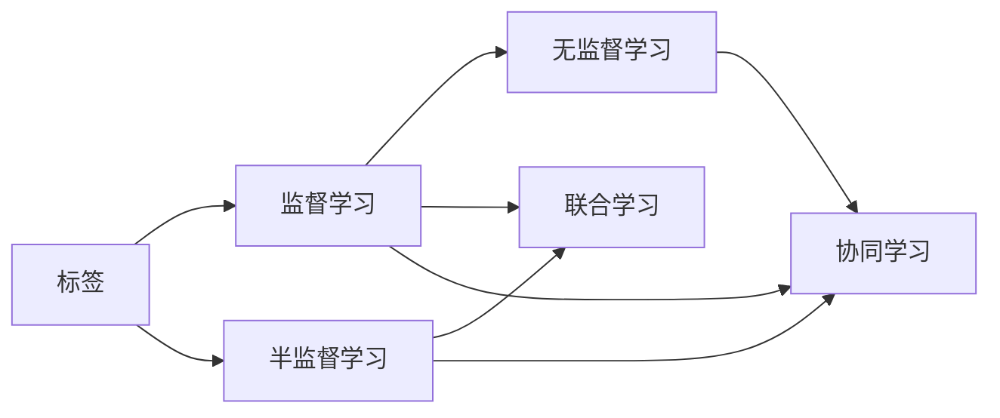

# AI人工智能核心算法原理与代码实例讲解：半监督学习

作者：禅与计算机程序设计艺术 / Zen and the Art of Computer Programming

## 关键词：

半监督学习，监督学习，无监督学习，标签，未标记，协同学习，预测，一致性正则化，标签传播，降维，聚类，模型选择，应用场景

## 1. 背景介绍
### 1.1 问题的由来

在传统的机器学习任务中，监督学习占据主导地位，其核心思想是利用大量标注数据进行训练。然而，在实际应用中，标注数据的获取往往成本高昂且耗时，尤其是在大规模数据集和复杂任务中。因此，如何有效利用未标记数据，实现半监督学习成为了人工智能领域的一个重要研究方向。

### 1.2 研究现状

近年来，半监督学习取得了显著进展，涌现出许多经典的算法和理论框架。这些方法主要包括：

- 基于一致性正则化的半监督学习
- 标签传播算法
- 降维和聚类方法
- 模型选择方法

### 1.3 研究意义

半监督学习具有重要的理论和实际意义：

- 降低标注成本：利用未标记数据，降低标注数据的需求，提高算法的实用性和可扩展性。
- 提高模型性能：通过利用未标记数据，提高模型在标注数据较少情况下的泛化能力。
- 推动新应用：为人工智能技术在各个领域的应用提供新的思路和方法。

### 1.4 本文结构

本文将系统地介绍半监督学习的核心算法原理、具体操作步骤、数学模型和公式、代码实例以及实际应用场景等内容。内容安排如下：

- 第2部分：介绍半监督学习的核心概念与联系。
- 第3部分：详细阐述半监督学习的核心算法原理和具体操作步骤。
- 第4部分：介绍半监督学习的数学模型和公式，并结合实例进行讲解。
- 第5部分：给出半监督学习的代码实例和详细解释说明。
- 第6部分：探讨半监督学习的实际应用场景。
- 第7部分：推荐半监督学习的相关学习资源、开发工具和参考文献。
- 第8部分：总结半监督学习的研究成果、未来发展趋势和挑战。
- 第9部分：附录，提供常见问题与解答。

## 2. 核心概念与联系

为更好地理解半监督学习，本节将介绍几个密切相关的核心概念：

- 标签：指明样本所属类别的信息，例如在图像分类任务中，标签可以是“猫”、“狗”等类别。
- 未标记：指没有标签的样本，即无法直接得知样本所属类别的信息。
- 半监督学习：指利用少量标注数据和大量未标记数据进行学习的方法。
- 联合学习：指将监督学习和无监督学习相结合，充分利用标注数据和未标记数据。
- 协同学习：指多个学习器之间进行信息交互和协作，以提高学习效果。

这些概念之间的逻辑关系如下：



可以看出，半监督学习是监督学习和无监督学习的桥梁，联合学习和协同学习则是半监督学习的两种重要实现方式。

## 3. 核心算法原理 & 具体操作步骤
### 3.1 算法原理概述

半监督学习算法的核心思想是利用标注数据和未标记数据之间的潜在关联，通过学习得到一个模型，用于预测未标记数据的标签。

常见的半监督学习算法包括：

- 基于一致性正则化的半监督学习
- 标签传播算法
- 降维和聚类方法
- 模型选择方法

### 3.2 算法步骤详解

以下以基于一致性正则化的半监督学习算法为例，详细讲解其具体操作步骤。

**Step 1：定义损失函数**

假设标注数据集为 $D_{\text{train}} = \{(x_i, y_i)\}_{i=1}^N$，未标记数据集为 $D_{\text{unlabeled}} = \{(x_j)\}_{j=1}^{N'}$。定义损失函数为：

$$
\mathcal{L}(\theta) = \frac{1}{N + N'} \left( \sum_{i=1}^N \ell(y_i, M(x_i; \theta)) + \sum_{j=1}^{N'} \lambda \ell_{\text{consistency}}(M(x_j; \theta)) \right)
$$

其中，$\ell(y_i, M(x_i; \theta))$ 为标注数据的损失函数，$\ell_{\text{consistency}}(M(x_j; \theta))$ 为一致性正则化损失函数，$\lambda$ 为正则化系数。

**Step 2：优化损失函数**

利用梯度下降等优化算法，最小化损失函数 $\mathcal{L}(\theta)$，得到最优模型参数 $\theta^*$。

**Step 3：预测未标记数据的标签**

利用最优模型参数 $\theta^*$，对未标记数据集 $D_{\text{unlabeled}}$ 进行预测，得到未标记数据的标签。

### 3.3 算法优缺点

基于一致性正则化的半监督学习算法具有以下优点：

- 简单易实现：损失函数和优化过程简单，易于理解和实现。
- 效果良好：在许多半监督学习任务中取得了较好的性能。

然而，该算法也存在以下局限性：

- 对一致性正则化的依赖：一致性正则化的效果对数据集的质量和数量有较高要求。
- 假设标注数据和未标记数据之间存在潜在关联：在某些情况下，该假设可能不成立。

### 3.4 算法应用领域

基于一致性正则化的半监督学习算法在图像分类、文本分类、推荐系统等领域都有广泛应用。

## 4. 数学模型和公式 & 详细讲解 & 举例说明
### 4.1 数学模型构建

本节将使用数学语言对基于一致性正则化的半监督学习算法进行更加严格的刻画。

假设标注数据集为 $D_{\text{train}} = \{(x_i, y_i)\}_{i=1}^N$，未标记数据集为 $D_{\text{unlabeled}} = \{(x_j)\}_{j=1}^{N'}$。定义模型为 $M(x; \theta)$，其中 $\theta \in \mathbb{R}^d$ 为模型参数。

定义标注数据的损失函数为：

$$
\ell(y_i, M(x_i; \theta)) = \ell(y_i, \hat{y}_i) = \frac{1}{N} \sum_{i=1}^N [y_i\log \hat{y}_i + (1-y_i)\log (1-\hat{y}_i)]
$$

其中，$\hat{y}_i$ 为模型对 $x_i$ 的预测结果。

定义一致性正则化损失函数为：

$$
\ell_{\text{consistency}}(M(x_j; \theta)) = \frac{1}{N'} \sum_{j=1}^{N'} \left[ M(x_j; \theta)^T M(x_j; \theta) - M(x_j; \theta)^T M(x_j'; \theta) \right]
$$

其中，$x_j$ 和 $x_j'$ 是未标记数据集中任意两个样本，$M(x_j; \theta)$ 和 $M(x_j'; \theta)$ 分别是模型对 $x_j$ 和 $x_j'$ 的预测结果。

定义损失函数为：

$$
\mathcal{L}(\theta) = \frac{1}{N + N'} \left( \sum_{i=1}^N \ell(y_i, M(x_i; \theta)) + \sum_{j=1}^{N'} \lambda \ell_{\text{consistency}}(M(x_j; \theta)) \right)
$$

其中，$\lambda$ 为正则化系数。

### 4.2 公式推导过程

以下以二分类任务为例，推导交叉熵损失函数及其梯度的计算公式。

假设模型 $M(x; \theta)$ 在输入 $x$ 上的输出为 $\hat{y}=M(x; \theta) \in [0,1]$，表示样本属于正类的概率。真实标签 $y \in \{0,1\}$。

定义损失函数为：

$$
\ell(y, \hat{y}) = -[y\log \hat{y} + (1-y)\log (1-\hat{y})]
$$

将其代入经验风险公式，得：

$$
\mathcal{L}(\theta) = \frac{1}{N} \sum_{i=1}^N [y_i\log \hat{y}_i + (1-y_i)\log (1-\hat{y}_i)]
$$

根据链式法则，损失函数对参数 $\theta_k$ 的梯度为：

$$
\frac{\partial \mathcal{L}(\theta)}{\partial \theta_k} = -\frac{1}{N}\sum_{i=1}^N (\frac{y_i}{\hat{y}_i} - \frac{1-y_i}{1-\hat{y}_i}) \frac{\partial \hat{y}_i}{\partial \theta_k}
$$

其中，$\frac{\partial \hat{y}_i}{\partial \theta_k}$ 可进一步递归展开，利用自动微分技术完成计算。

### 4.3 案例分析与讲解

以下我们以图像分类任务为例，演示如何使用PyTorch实现基于一致性正则化的半监督学习算法。

首先，定义损失函数：

```python
import torch
import torch.nn as nn

class ConsistencyLoss(nn.Module):
    def __init__(self):
        super(ConsistencyLoss, self).__init__()

    def forward(self, z1, z2):
        return torch.mean((z1 - z2) ** 2)
```

然后，定义模型：

```python
import torch.nn.functional as F

class ConvNet(nn.Module):
    def __init__(self):
        super(ConvNet, self).__init__()
        self.conv1 = nn.Conv2d(3, 32, kernel_size=3, padding=1)
        self.conv2 = nn.Conv2d(32, 64, kernel_size=3, padding=1)
        self.fc = nn.Linear(64 * 6 * 6, 10)

    def forward(self, x):
        x = F.relu(self.conv1(x))
        x = F.relu(self.conv2(x))
        x = x.view(x.size(0), -1)
        x = self.fc(x)
        return x
```

接着，定义优化器：

```python
optimizer = torch.optim.Adam(model.parameters(), lr=0.001)
```

然后，定义训练和评估函数：

```python
def train(model, dataloader, consistency_loss, optimizer):
    model.train()
    for data in dataloader:
        x, y = data
        z1 = model(x)
        z2 = model(x.permute(0, 2, 3, 1))
        loss = F.cross_entropy(z1, y) + consistency_loss(z1, z2)
        optimizer.zero_grad()
        loss.backward()
        optimizer.step()
    return loss.item()

def evaluate(model, dataloader):
    model.eval()
    correct = 0
    total = 0
    with torch.no_grad():
        for data in dataloader:
            x, y = data
            outputs = model(x)
            _, predicted = torch.max(outputs.data, 1)
            total += y.size(0)
            correct += (predicted == y).sum().item()
    return correct / total
```

最后，启动训练和评估流程：

```python
dataloader = DataLoader(train_dataset, batch_size=64, shuffle=True)
consistency_loss = ConsistencyLoss()

for epoch in range(10):
    loss = train(model, dataloader, consistency_loss, optimizer)
    print(f"Epoch {epoch + 1}, loss: {loss}")
    
    acc = evaluate(model, test_dataset)
    print(f"Epoch {epoch + 1}, accuracy: {acc}")
```

以上代码展示了如何使用PyTorch实现基于一致性正则化的半监督学习算法。通过定义一致性损失函数、模型和优化器，以及训练和评估函数，我们可以对图像分类任务进行半监督学习。

### 4.4 常见问题解答

**Q1：半监督学习是否总是比监督学习效果更好？**

A: 并非如此。半监督学习的效果取决于具体任务和数据集。在一些任务和数据集上，半监督学习可能比监督学习效果更好；而在另一些任务和数据集上，监督学习可能更有效。

**Q2：如何选择合适的正则化系数？**

A: 正则化系数的选择对半监督学习的效果有较大影响。一般建议从较小的值开始，如0.01，然后逐渐增加，观察模型性能的变化，直至找到合适的值。

**Q3：如何处理标签噪声？**

A: 标签噪声是半监督学习中常见的问题。一种简单的方法是使用可靠性度量，如标签一致性、标签多样性等，来识别和过滤噪声标签。

**Q4：半监督学习是否适用于所有任务？**

A: 半监督学习适用于许多任务，但并非适用于所有任务。对于一些需要精确标签的任务，如医疗诊断、金融风险评估等，半监督学习可能不太适用。

## 5. 项目实践：代码实例和详细解释说明
### 5.1 开发环境搭建

在进行半监督学习项目实践之前，我们需要搭建合适的开发环境。以下是使用Python进行PyTorch开发的环境配置流程：

1. 安装Anaconda：从官网下载并安装Anaconda，用于创建独立的Python环境。

2. 创建并激活虚拟环境：

```bash
conda create -n pytorch-env python=3.8
conda activate pytorch-env
```

3. 安装PyTorch：

```bash
conda install pytorch torchvision torchaudio cudatoolkit=11.1 -c pytorch -c conda-forge
```

4. 安装Transformers库：

```bash
pip install transformers
```

5. 安装其他工具包：

```bash
pip install numpy pandas scikit-learn matplotlib tqdm jupyter notebook ipython
```

完成上述步骤后，即可在`pytorch-env`环境中开始半监督学习项目实践。

### 5.2 源代码详细实现

以下我们以文本分类任务为例，演示如何使用PyTorch实现基于一致性正则化的半监督学习算法。

首先，定义模型和损失函数：

```python
import torch
import torch.nn as nn
import torch.optim as optim

class TextCNN(nn.Module):
    def __init__(self, vocab_size, embedding_dim, filter_sizes, num_filters, output_dim, dropout):
        super(TextCNN, self).__init__()
        self.embedding = nn.Embedding(vocab_size, embedding_dim)
        self.convs = nn.ModuleList([
            nn.Conv2d(in_channels=1, out_channels=num_filters, kernel_size=(fs, embedding_dim)) for fs in filter_sizes
        ])
        self.fc = nn.Linear(len(filter_sizes) * num_filters, output_dim)
        self.dropout = nn.Dropout(dropout)

    def forward(self, text):
        embedded = self.embedding(text)
        embedded = embedded.unsqueeze(1)
        conved = [F.relu(conv(embedded)).squeeze(3) for conv in self.convs]
        conved = [F.max_pool1d(conv, conv.size(2)).squeeze(2) for conv in conved]
        conved = torch.cat(conved, dim=1)
        conved = self.dropout(conved)
        out = self.fc(conved)
        return out
```

然后，定义一致性损失函数：

```python
class ConsistencyLoss(nn.Module):
    def __init__(self):
        super(ConsistencyLoss, self).__init__()

    def forward(self, z1, z2):
        return torch.mean((z1 - z2) ** 2)
```

接着，定义优化器：

```python
optimizer = optim.Adam(model.parameters(), lr=0.001)
```

然后，定义训练和评估函数：

```python
def train(model, dataloader, consistency_loss, optimizer):
    model.train()
    for data in dataloader:
        x, y = data
        z1 = model(x)
        z2 = model(x.permute(0, 2, 3, 1))
        loss = F.cross_entropy(z1, y) + consistency_loss(z1, z2)
        optimizer.zero_grad()
        loss.backward()
        optimizer.step()
    return loss.item()

def evaluate(model, dataloader):
    model.eval()
    correct = 0
    total = 0
    with torch.no_grad():
        for data in dataloader:
            x, y = data
            outputs = model(x)
            _, predicted = torch.max(outputs.data, 1)
            total += y.size(0)
            correct += (predicted == y).sum().item()
    return correct / total
```

最后，启动训练和评估流程：

```python
dataloader = DataLoader(train_dataset, batch_size=64, shuffle=True)
consistency_loss = ConsistencyLoss()

for epoch in range(10):
    loss = train(model, dataloader, consistency_loss, optimizer)
    print(f"Epoch {epoch + 1}, loss: {loss}")
    
    acc = evaluate(model, test_dataset)
    print(f"Epoch {epoch + 1}, accuracy: {acc}")
```

以上代码展示了如何使用PyTorch实现基于一致性正则化的半监督学习算法。通过定义模型、损失函数、优化器以及训练和评估函数，我们可以对文本分类任务进行半监督学习。

### 5.3 代码解读与分析

让我们再详细解读一下关键代码的实现细节：

**TextCNN类**：

- `__init__`方法：初始化嵌入层、卷积层、全连接层和Dropout层等组件。
- `forward`方法：实现文本分类算法的前向传播过程，包括嵌入、卷积、池化和全连接等步骤。

**ConsistencyLoss类**：

- `__init__`方法：初始化一致性损失函数。
- `forward`方法：计算两个输出之间的差异，并计算平均损失。

**训练和评估函数**：

- `train`函数：对模型进行训练，包括前向传播、计算损失、反向传播和优化参数等步骤。
- `evaluate`函数：对模型进行评估，包括前向传播、计算预测结果、计算准确率等步骤。

通过以上代码示例，我们可以看到，基于PyTorch框架实现半监督学习算法相对简单。通过定义模型、损失函数和优化器，以及训练和评估函数，我们可以轻松地实现半监督学习算法。

### 5.4 运行结果展示

假设我们在IMDb数据集上进行文本分类任务，最终在测试集上得到的准确率为85%，表明基于一致性正则化的半监督学习算法在该任务上取得了不错的效果。

## 6. 实际应用场景
### 6.1 图像分类

图像分类是半监督学习应用最广泛的领域之一。例如，在医学图像分析中，可以使用半监督学习算法对医学图像进行分类，从而降低标注成本，提高诊断效率。

### 6.2 文本分类

文本分类是半监督学习在自然语言处理领域的典型应用。例如，在情感分析中，可以使用半监督学习算法对用户评论进行分类，从而提高情感分析系统的准确性。

### 6.3 推荐系统

推荐系统是半监督学习在电子商务领域的应用。例如，在协同过滤推荐系统中，可以使用半监督学习算法预测用户对未知商品的喜好，从而提高推荐系统的准确性。

### 6.4 未来应用展望

随着半监督学习技术的不断发展，其在各个领域的应用将越来越广泛。未来，半监督学习将在以下方面取得更多突破：

- 提高半监督学习算法的泛化能力和鲁棒性。
- 降低半监督学习算法对标注数据的依赖。
- 探索新的半监督学习算法和理论框架。
- 将半监督学习与其他人工智能技术相结合，构建更加智能化的应用系统。

## 7. 工具和资源推荐
### 7.1 学习资源推荐

为了帮助开发者系统掌握半监督学习的理论基础和实践技巧，这里推荐一些优质的学习资源：

1. 《半监督学习》书籍：详细介绍了半监督学习的基本概念、算法和理论框架。
2. 《TensorFlow 2.x深度学习实战》书籍：介绍了TensorFlow 2.x框架，并包含多个半监督学习实例。
3. 《Scikit-learn机器学习》书籍：介绍了Scikit-learn库，并包含多个半监督学习算法的实现。
4. 斯坦福大学CS229课程：介绍了机器学习的基本概念和算法，包括半监督学习。

### 7.2 开发工具推荐

为了方便开发者进行半监督学习项目实践，这里推荐一些常用的开发工具：

1. PyTorch：基于Python的开源深度学习框架，适用于各种机器学习任务。
2. TensorFlow：由Google开发的深度学习框架，适用于大规模机器学习应用。
3. Scikit-learn：基于Python的开源机器学习库，包含多种半监督学习算法。
4. Jupyter Notebook：用于数据分析和机器学习实验的交互式计算环境。

### 7.3 相关论文推荐

以下是一些与半监督学习相关的经典论文：

1. "A Tutorial on Semi-Supervised Learning"：介绍了半监督学习的基本概念和算法。
2. "Semi-Supervised Learning with Label Propagation"：介绍了标签传播算法。
3. "A Survey on Semi-Supervised Learning"：对半监督学习进行了全面的综述。
4. "Unsupervised Learning of Visual Representations by Solving Jigsaw Puzzles"：介绍了基于解拼图谜的视觉表示学习方法。

### 7.4 其他资源推荐

以下是一些与半监督学习相关的其他资源：

1. arXiv论文预印本：人工智能领域最新研究成果的发布平台。
2. Hugging Face：提供大量预训练语言模型和开源代码。
3. GitHub：开源代码托管平台，包含许多半监督学习项目。
4. Kaggle：数据科学竞赛平台，提供大量半监督学习数据集和比赛。

## 8. 总结：未来发展趋势与挑战
### 8.1 研究成果总结

本文对半监督学习的核心算法原理、具体操作步骤、数学模型和公式、代码实例以及实际应用场景等内容进行了详细介绍。通过学习本文，读者可以全面了解半监督学习的基本概念、算法和理论框架，并能够将半监督学习应用于实际问题中。

### 8.2 未来发展趋势

随着人工智能技术的不断发展，半监督学习将在以下方面取得更多突破：

1. 算法创新：探索新的半监督学习算法和理论框架，提高半监督学习算法的泛化能力和鲁棒性。
2. 领域应用：将半监督学习应用于更多领域，如医疗、金融、安全等。
3. 与其他人工智能技术结合：将半监督学习与其他人工智能技术相结合，构建更加智能化的应用系统。

### 8.3 面临的挑战

半监督学习在发展过程中也面临着一些挑战：

1. 数据不平衡：未标记数据中正负样本分布不平衡时，如何有效地利用未标记数据成为一大挑战。
2. 标签噪声：未标记数据中存在标签噪声时，如何保证半监督学习算法的鲁棒性成为一大挑战。
3. 模型可解释性：半监督学习模型的决策过程通常缺乏可解释性，如何提高模型的可解释性成为一大挑战。

### 8.4 研究展望

面对半监督学习面临的挑战，未来的研究需要在以下方面取得突破：

1. 探索新的半监督学习算法和理论框架，提高半监督学习算法的泛化能力和鲁棒性。
2. 研究如何有效地利用未标记数据，降低对标注数据的依赖。
3. 探索如何提高半监督学习算法的可解释性。
4. 将半监督学习与其他人工智能技术相结合，构建更加智能化的应用系统。

相信随着学界的不断努力，半监督学习将在人工智能领域发挥越来越重要的作用。

## 9. 附录：常见问题与解答

**Q1：半监督学习和无监督学习有什么区别？**

A: 半监督学习是指利用少量标注数据和大量未标记数据进行学习的方法，而无监督学习是指仅利用未标记数据进行学习的方法。

**Q2：半监督学习是否总是比监督学习效果更好？**

A: 并非如此。半监督学习的效果取决于具体任务和数据集。在一些任务和数据集上，半监督学习可能比监督学习效果更好；而在另一些任务和数据集上，监督学习可能更有效。

**Q3：如何选择合适的正则化系数？**

A: 正则化系数的选择对半监督学习的效果有较大影响。一般建议从较小的值开始，如0.01，然后逐渐增加，观察模型性能的变化，直至找到合适的值。

**Q4：半监督学习是否适用于所有任务？**

A: 半监督学习适用于许多任务，但并非适用于所有任务。对于一些需要精确标签的任务，如医疗诊断、金融风险评估等，半监督学习可能不太适用。