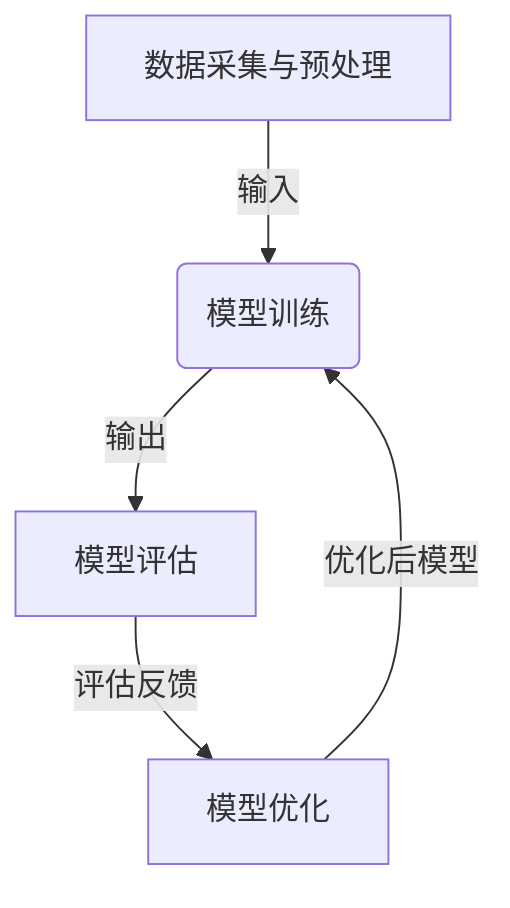

好的,我会按照您的要求,以"AI人工智能核心算法原理与代码实例讲解：模型评估"为主题,撰写一篇专业的技术博客文章。文中将包含背景介绍、核心概念、算法原理、数学模型、代码实例、应用场景、资源推荐、发展趋势与挑战等内容。我会努力使用逻辑清晰、结构紧凑、语言专业但通俗易懂的写作风格,确保内容深入、见解独到。同时也会尽量插入Mermaid流程图来阐释核心概念和算法流程。请耐心等待,这可能需要一些时间。

# AI人工智能核心算法原理与代码实例讲解：模型评估

## 1. 背景介绍

### 1.1 问题的由来

在人工智能系统的开发过程中,模型评估是一个至关重要的环节。构建高质量的AI模型需要进行大量的实验和调优,而评估模型的性能对于指导模型优化至关重要。传统的机器学习算法通常会在训练数据集上表现良好,但在新的测试数据集上往往会出现性能下降的情况,这种现象被称为"过拟合"。因此,需要对模型进行全面评估,以衡量其泛化能力。

### 1.2 研究现状  

目前,已有多种常用的模型评估指标和方法,如准确率、精确率、召回率、F1分数、ROC曲线、K折交叉验证等。不同的任务场景需要选择合适的评估指标。此外,近年来随着深度学习的兴起,一些新的评估方法也被提出,如校准误差图、可解释性评估等。但总的来说,模型评估仍是一个值得深入研究的重要课题。

### 1.3 研究意义

合理评估模型性能对于构建高质量的AI系统至关重要。准确的评估不仅可以反映模型的泛化能力,还可以为模型优化提供依据,指导算法和超参数的选择。此外,对于一些关键任务,模型评估还关系到系统的可靠性和安全性。因此,深入研究模型评估方法具有重要的理论意义和应用价值。

### 1.4 本文结构

本文将首先介绍模型评估的核心概念,并阐述其与其他机器学习环节的关系。接下来详细讲解几种核心的模型评估算法原理、数学模型以及具体操作步骤。然后通过代码实例展示如何实现这些评估算法。之后探讨模型评估在实际应用中的场景。最后总结模型评估的发展趋势和面临的挑战,并给出相关的学习资源推荐。

## 2. 核心概念与联系

模型评估是机器学习系统开发过程中的一个重要环节,与其他环节密切相关,如下图所示:



- **数据采集与预处理**:获取高质量的训练数据集和测试数据集是模型评估的基础。数据预处理如特征工程等也会影响模型性能。
- **模型训练**:使用训练数据集训练模型,得到初步的模型。
- **模型评估**:使用测试数据集对训练好的模型进行评估,得到模型在新数据上的性能指标。
- **模型优化**:根据评估结果,通过调整算法、超参数、训练策略等优化模型,再返回模型训练环节。

模型评估是模型优化的关键驱动力,高质量的评估指标可以更好地指导优化方向。同时,评估结果也是判断是否可以将模型投入实际应用的重要依据。

## 3. 核心算法原理与具体操作步骤

在介绍具体算法之前,我们先了解一下模型评估的一些核心概念:

- **真实值(Ground Truth)**:样本的已知正确标签或值。
- **预测值(Prediction)**:模型对样本的预测输出。
- **混淆矩阵(Confusion Matrix)**:将真实值和预测值进行对比的矩阵。

接下来,我们逐一介绍几种常用的模型评估算法。

### 3.1 算法原理概述

1. **准确率(Accuracy)**

准确率是模型评估中最简单、最直观的指标。它反映了模型预测正确的比例。适用于分类和回归任务。

2. **精确率(Precision)、召回率(Recall)和F1分数**  

精确率和召回率主要用于二分类问题评估。精确率反映了被模型预测为正例的样本中,真正的正例占的比例。召回率反映了所有真实的正例样本中,被模型正确预测为正例的比例。
F1分数是精确率和召回率的加权调和平均值,综合考虑了两者。

3. **ROC曲线和AUC**

ROC(Receiver Operating Characteristic)曲线展示了二分类模型在不同分类阈值下,真正例率(TPR)和假正例率(FPR)的变化情况。
AUC(Area Under Curve)是ROC曲线下的面积,可以理解为模型的分类能力。AUC越接近1,模型性能越好。

4. **K折交叉验证(K-fold Cross Validation)** 

K折交叉验证是一种常用的评估模型泛化能力的方法。它将数据集分成K份,每次使用K-1份作为训练集,剩下的1份作为测试集,重复K次,最后取平均值作为模型评估指标。这种方法可以充分利用数据,评估结果更加可靠。

### 3.2 算法步骤详解

以二分类问题为例,我们详细解释一下准确率、精确率、召回率和F1分数的计算过程:

1. **准确率**

准确率的计算公式为:

$$Accuracy = \frac{TP + TN}{TP + TN + FP + FN}$$

其中TP(True Positive)为真正例数,TN(True Negative)为真反例数,FP(False Positive)为假正例数,FN(False Negative)为假反例数。

2. **精确率和召回率**

精确率和召回率的计算公式为:

$$Precision = \frac{TP}{TP + FP}$$

$$Recall = \frac{TP}{TP + FN}$$

3. **F1分数**  

F1分数的计算公式为:

$$F1 = 2 \times \frac{Precision \times Recall}{Precision + Recall}$$

这些指标的计算需要依赖混淆矩阵,如下所示:

```mermaid
---
flowchart LR
    subgraph 混淆矩阵
    TP[真正例] --> FN[假反例]
    FP[假正例] --> TN[真反例]
    end
```

其中,行表示真实值,列表示预测值。理想情况下,非对角线的值都应为0。

4. **K折交叉验证步骤**

K折交叉验证的具体步骤如下:

1) 将数据集随机分成K份,每份称为一个"折"。
2) 对于第i折(i=1,...,K):
    - 使用除第i折外的K-1份数据作为训练集训练模型
    - 在第i折数据上评估模型,得到一个评估指标值score[i]  
3) 重复步骤2),直到所有K折数据都做过一次测试
4) 将K个score[i]取平均,得到最终的评估指标值

### 3.3 算法优缺点

1. **准确率**
    - 优点:直观,易于理解和计算
    - 缺点:对于不平衡数据集,高准确率未必意味着模型性能好
    
2. **精确率和召回率**
    - 优点:能够更好地评估不平衡数据集
    - 缺点:需要确定分类阈值,且无法兼顾两者
    
3. **F1分数**
    - 优点:平衡了精确率和召回率
    - 缺点:对极端值较为敏感
    
4. **ROC和AUC**
    - 优点:能评估各种分类阈值下的性能,不受不平衡数据的影响
    - 缺点:计算过程相对复杂
    
5. **K折交叉验证**
    - 优点:能更全面评估模型泛化能力,结果更可靠
    - 缺点:计算开销较大,需要多次重复训练模型

### 3.4 算法应用领域

不同的模型评估算法适用于不同的任务场景:

- 准确率:常用于分类和回归任务的初步评估
- 精确率/召回率/F1:常用于对查准率和查全率要求较高的场景,如病理诊断、欺诈检测等
- ROC/AUC:常用于对分类性能要求较高的场景,如医疗诊断、信用评分等
- K折交叉验证:常用于评估小数据集模型的泛化能力

此外,对于一些特殊任务,还需要使用其他评估指标,如序列标注任务的编辑距离、对抗样本的鲁棒性评估等。

## 4. 数学模型和公式详细讲解与举例说明

在上一节中,我们介绍了几种常用的模型评估算法及其计算公式。接下来,我们将详细解释其中的数学原理和推导过程。

### 4.1 数学模型构建

在构建模型评估的数学模型时,我们首先需要定义一些基本概念和符号:

- $y$: 样本的真实标签或值
- $\hat{y}$: 模型对样本的预测输出
- $P(y, \hat{y})$: 真实值和预测值的联合概率分布
- $P(y)$和$P(\hat{y})$: 真实值和预测值的边缘概率分布

在二分类问题中,我们通常将正例标记为1,反例标记为0。那么混淆矩阵可以表示为:

$$
\begin{bmatrix}
P(y=1, \hat{y}=1) & P(y=1, \hat{y}=0)\\
P(y=0, \hat{y}=1) & P(y=0, \hat{y}=0)
\end{bmatrix}
$$

其中,$P(y=1, \hat{y}=1)$对应真正例(TP),$P(y=0, \hat{y}=0)$对应真反例(TN),$P(y=1, \hat{y}=0)$对应假反例(FN),$P(y=0, \hat{y}=1)$对应假正例(FP)。

### 4.2 公式推导过程  

1. **准确率**

准确率的数学定义为:

$$Accuracy = P(y = \hat{y})$$

即真实值和预测值相等的概率。根据全概率公式,我们可以推导出:

$$
\begin{aligned}
Accuracy &= P(y = \hat{y}) \\
&= \sum_{y, \hat{y}} \mathbb{I}(y = \hat{y})P(y, \hat{y})\\
&= P(y=1, \hat{y}=1) + P(y=0, \hat{y}=0)
\end{aligned}
$$

其中$\mathbb{I}(\cdot)$是示性函数,当条件为真时值为1,否则为0。

2. **精确率**

精确率的数学定义为:

$$Precision = P(\hat{y}=1 | y=1) = \frac{P(y=1, \hat{y}=1)}{P(\hat{y}=1)}$$

根据贝叶斯公式,我们可以推导出:

$$
\begin{aligned}
Precision &= \frac{P(y=1, \hat{y}=1)}{P(y=1, \hat{y}=1) + P(y=0, \hat{y}=1)}\\
&= \frac{TP}{TP + FP}
\end{aligned}
$$

3. **召回率**

召回率的数学定义为:

$$Recall = P(y=1 | \hat{y}=1) = \frac{P(y=1, \hat{y}=1)}{P(y=1)}$$

同理可以推导出:

$$
\begin{aligned}
Recall &= \frac{P(y=1, \hat{y}=1)}{P(y=1, \hat{y}=1) + P(y=1, \hat{y}=0)}\\
&= \frac{TP}{TP + FN}
\end{aligned}
$$

4. **F1分数**

F1分数是精确率和召回率的调和平均,定义为:

$$F1 = 2 \times \frac{Precision \times Recall}{Precision + Recall}$$

将精确率和召回率的公式代入,可以得到:

$$F1 = \frac{2TP}{2TP + FP + FN}$$

### 4.3 案例