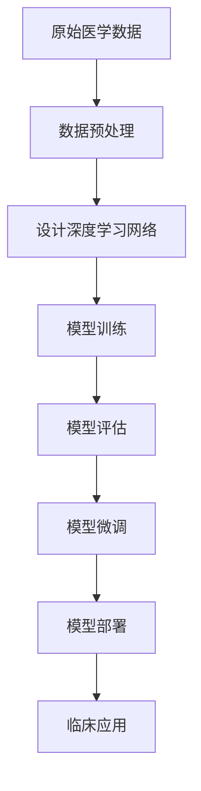

以下是根据您的要求撰写的技术博客文章正文内容：

# AI人工智能深度学习算法：在精准医疗中的应用

## 1. 背景介绍

### 1.1 问题的由来

医疗健康领域一直是人类社会最关注的重点领域之一。随着人口老龄化加剧和慢性病患病率上升,传统的医疗模式面临着诸多挑战。首先,医疗资源的分布不均衡导致部分地区存在医疗服务短缺;其次,医生的诊断和治疗决策过于依赖个人经验,缺乏系统化、标准化的方法,存在一定的主观性和不确定性;再者,医疗数据的海量和多样性给疾病诊断和治疗带来了新的挑战。因此,迫切需要新的技术手段来应对这些挑战,提高医疗服务的可及性、精准性和高效性。

### 1.2 研究现状

人工智能(AI)技术在医疗健康领域的应用研究和实践已经取得了长足的进展。深度学习作为人工智能的一个重要分支,因其在图像识别、自然语言处理等领域的卓越表现而备受关注。目前,深度学习已经在医学影像分析、智能辅助诊断、药物研发、医疗数据挖掘等多个领域展现出巨大的潜力。

### 1.3 研究意义

将深度学习算法应用于精准医疗具有重大的理论意义和现实意义。从理论层面看,医疗数据的复杂性和多样性为深度学习算法的发展和完善提供了宝贵的实践机会;从现实层面看,深度学习算法在医疗领域的应用有望极大提高诊疗水平,降低医疗成本,提升患者的就医体验。因此,深入探讨深度学习算法在精准医疗中的应用是当务之急。

### 1.4 本文结构

本文将从以下几个方面对深度学习算法在精准医疗中的应用进行全面阐述:首先介绍相关的核心概念和技术;其次详细解析核心算法的原理和具体实现步骤;然后构建相应的数学模型并推导公式;接着通过实际案例分析具体应用;最后总结该领域的发展趋势和面临的挑战。

## 2. 核心概念与联系

在探讨深度学习算法在精准医疗中的应用之前,我们需要理解以下几个核心概念:

1. **深度学习(Deep Learning)**:深度学习是机器学习的一个分支,它通过对数据进行表征学习,使计算机在特征层次上不断构建越来越抽象的高层次数据表示,从而能更精准地完成检测、分类等任务。常见的深度学习模型包括卷积神经网络(CNN)、循环神经网络(RNN)等。

2. **医学影像分析(Medical Image Analysis)**:利用计算机视觉和图像处理技术对医学影像数据(如CT、MRI、X光片等)进行分析,实现疾病检测、器官分割、图像配准等功能。

3. **自然语言处理(Natural Language Processing, NLP)**:研究计算机处理人类语言数据的方法,包括语音识别、语义理解、文本生成等技术。在医疗领域,NLP技术可用于电子病历分析、医疗报告自动生成等场景。

4. **生物信息学(Bioinformatics)**:将计算机科学的理论和技术应用于管理和分析生物数据,如基因组数据、蛋白质结构数据等。深度学习算法可用于基因组数据分析、蛋白质结构预测等任务。

5. **精准医疗(Precision Medicine)**:根据个体的基因组、生物标记物等特征,为患者量身定制个性化的预防、诊断和治疗方案,是未来医疗发展的重要趋势。

这些概念相互关联、相辅相成,共同推动着深度学习算法在精准医疗领域的应用。

## 3. 核心算法原理与具体操作步骤

### 3.1 算法原理概述

在精准医疗领域,深度学习算法主要用于医学影像分析、电子病历分析等任务。其核心原理是利用多层神经网络对输入数据(如图像、文本等)进行特征提取和模式识别,从而实现对疾病的检测、分类等功能。

以医学影像分析为例,传统的方法需要人工设计图像特征,而深度学习算法能够自动从原始图像数据中学习到多层次的特征表示,从低层次的边缘、纹理等特征到高层次的语义特征,从而达到更好的分类和检测效果。

常用的深度学习模型包括卷积神经网络(CNN)、全卷积网络(FCN)、递归神经网络(RNN)等。其中,CNN由于其在图像处理任务上的出色表现而被广泛应用于医学影像分析;RNN则常用于序列数据(如文本、语音等)的处理,可用于电子病历分析等场景。

下面以CNN为例,介绍其在医学影像分析中的具体应用步骤。

### 3.2 算法步骤详解

1. **数据预处理**:对原始医学影像数据进行标准化、增强等预处理,以提高模型的训练效果。

2. **网络设计**:设计合适的CNN网络结构,包括卷积层、池化层和全连接层等,并选择适当的激活函数、损失函数和优化器。

3. **模型训练**:使用标注好的医学影像数据集对CNN模型进行训练,通过反向传播算法不断调整网络参数,使模型在训练集上达到最优表现。

4. **模型评估**:在独立的测试集上评估训练好的模型,计算分类准确率、查全率、查准率等指标,检验模型的泛化能力。

5. **模型微调**:根据评估结果对模型进行微调,如调整超参数、增加训练数据等,以进一步提升模型性能。

6. **模型部署**:将训练好的模型部署到医疗AI系统中,为临床医生提供辅助诊断建议。

在实际应用中,上述步骤需要根据具体任务进行调整和优化。例如,对于3D医学影像数据,需要使用3D卷积网络;对于时序医疗数据(如病程记录),可采用RNN等序列模型。

### 3.3 算法优缺点

**优点**:

1. 自动特征学习,减少人工参与
2. 建模灵活,可处理多模态数据
3. 性能优异,在多个任务上超越人类

**缺点**:

1. 需要大量标注数据进行训练
2. 模型训练耗时耗力且不可解释
3. 存在数据偏差和隐私泄露风险

### 3.4 算法应用领域

深度学习算法在精准医疗领域的应用主要包括以下几个方面:

1. **医学影像分析**:包括疾病检测(如癌症、心脑血管疾病等)、器官分割、图像配准等,是应用最广泛的领域。

2. **基因组学分析**:利用深度学习对基因组数据进行分析,用于基因表达谱分析、基因调控网络预测等。

3. **蛋白质结构预测**:基于深度学习预测蛋白质的二级、三级结构,为新药研发提供支持。

4. **电子病历分析**:从电子病历文本中自动提取相关信息,用于辅助诊断、风险预测等。

5. **药物相关性分析**:预测新分子与已知药物的相似性、毒性等,加速新药研发进程。

6. **智能医疗助手**:基于自然语言处理和知识图谱技术,为患者提供智能问答和健康咨询服务。

总的来说,深度学习算法在精准医疗领域大有可为,有望推动医疗AI向前迈进一大步。

## 4. 数学模型和公式详细讲解举例说明

在深度学习算法中,数学模型和公式扮演着重要角色。本节将以CNN为例,介绍其中的关键数学原理。

### 4.1 数学模型构建

CNN的核心思想是通过卷积操作对输入数据(如图像)进行特征提取,并使用池化操作降低特征维度,最终通过全连接层对特征进行分类或回归。

设输入数据为 $X$,卷积核为 $W$,卷积操作可表示为:

$$
X_{l+1}=f(W_l*X_l+b_l)
$$

其中 $*$ 表示卷积操作, $b_l$ 为偏置项, $f$ 为激活函数(如ReLU函数)。

池化操作通常采用最大池化或平均池化,用于降低特征维度,公式如下:

$$
X_l^{m,n}=\underset{(i,j)\in R_{m,n}}{\max}X_{l-1}^{i,j}
$$

$X_l^{m,n}$ 表示第 $l$ 层特征图在位置 $(m,n)$ 处的值, $R_{m,n}$ 为池化区域。

在CNN的最后一层,通常使用全连接层对特征进行分类,其数学模型为:

$$
y=\text{softmax}(W_Lh_L+b_L)
$$

其中 $h_L$ 为最后一层隐含层的输出, $W_L$ 和 $b_L$ 分别为权重和偏置,softmax函数将输出值映射到(0,1)范围内。

### 4.2 公式推导过程

以卷积操作为例,我们来推导其数学公式。

设输入数据 $X$ 为二维矩阵,卷积核 $W$ 也为二维矩阵,卷积操作可表示为:

$$
X_{l+1}(m,n)=\sum_{i=0}^{k_1-1}\sum_{j=0}^{k_2-1}W(i,j)X_l(m+i,n+j)
$$

其中 $k_1,k_2$ 分别为卷积核的高度和宽度。通过滑动卷积核在输入数据上进行卷积操作,可得到新的特征图 $X_{l+1}$。

对于二维卷积,我们可以将其等价为矩阵乘法的形式:

$$
X_{l+1}=W_l*X_l+b_l
$$

其中 $*$ 表示有效的卷积操作(如零填充等),可以看作是一种特殊的矩阵乘法。

通过上述推导,我们可以发现卷积操作实际上是在不同位置的局部区域内进行加权求和,从而提取出局部特征。通过堆叠多层卷积,CNN能够自动学习到多级语义特征,实现端到端的特征提取和模式识别。

### 4.3 案例分析与讲解

下面我们以皮肤癌病灶检测为例,具体分析CNN在医学影像分析中的应用。

假设输入为皮肤病灶彩色图像,我们的目标是检测出图像中的癌症病灶区域。传统的方法需要人工提取颜色、纹理等低级特征,而CNN能够自动从原始图像中学习到多级语义特征,从而更好地检测出病灶区域。

具体来说,我们可以构建一个基于CNN的端到端模型,包括卷积层、池化层和全连接层。其中卷积层负责从图像中提取低级特征(如边缘、纹理等),多层卷积和池化操作后可以得到高级语义特征;全连接层则根据这些特征对图像像素进行二值分类(病灶或正常皮肤)。

在训练阶段,我们需要准备一个包含病灶标注的皮肤病灶图像数据集。利用该数据集对CNN模型进行有监督训练,通过反向传播算法不断调整网络参数,使模型能够很好地拟合训练数据。

在测试阶段,我们将训练好的模型应用到新的皮肤病灶图像上,模型会输出一个二值图像,其中白色区域表示预测的病灶区域。我们可以根据模型的输出对患者进行初步诊断,为临床医生提供辅助决策支持。

通过这个案例,我们可以看到CNN在医学