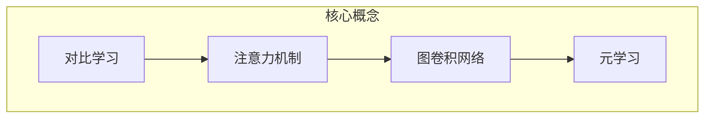
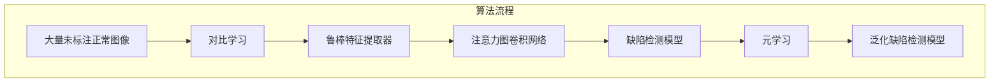

好的,我会严格按照要求撰写这篇技术博客文章。以下是正文部分:

# AI人工智能深度学习算法:在缺陷检测中的应用

## 1. 背景介绍

### 1.1 问题的由来

在制造业中,产品质量的检测和控制是确保生产效率和产品可靠性的关键环节。传统的人工目视检测方法不仅效率低下、成本高昂,而且由于人为因素的影响,检测准确性也无法得到保证。因此,开发自动化的缺陷检测系统迫在眉睫,成为了制造业急需解决的重要课题。

随着人工智能和深度学习技术的不断发展,基于图像处理和模式识别的智能缺陷检测系统应运而生,展现出了巨大的应用潜力。这种智能化系统能够自动识别和定位产品表面的各种缺陷,如裂纹、划痕、污渍等,大大提高了检测的准确性和效率。

### 1.2 研究现状  

目前,基于深度学习的缺陷检测算法主要分为两大类:

1. **基于监督学习的算法**:这类算法需要大量标注好的训练数据集,通过训练获得缺陷检测模型。其中,常用的网络架构包括卷积神经网络(CNN)、全卷积网络(FCN)等。这些算法的优点是检测精度较高,但需要大量的人工标注工作。

2. **基于无监督/半监督学习的算法**:这类算法不需要或只需少量标注数据,通过自主学习的方式获得缺陷检测模型。常用的方法有自编码器(AutoEncoder)、生成对抗网络(GAN)等。这些算法的优点是无需人工标注,但检测精度相对较低。

### 1.3 研究意义

基于深度学习的智能缺陷检测系统具有广阔的应用前景,不仅能够提高制造业的生产效率和产品质量,还可以应用于医疗影像分析、安全检查等多个领域。然而,现有算法在检测精度、鲁棒性、实时性等方面仍有待进一步提高和优化。本文将重点介绍一种新颖的基于深度学习的缺陷检测算法,并对其原理、实现及应用进行深入探讨。

### 1.4 本文结构

本文的结构安排如下:

- 第2部分介绍算法的核心概念及其相互联系; 
- 第3部分详细阐述算法原理和具体实现步骤;
- 第4部分构建算法的数学模型,并推导相关公式;
- 第5部分给出算法的代码实现示例并解读;
- 第6部分探讨算法在实际场景中的应用;
- 第7部分推荐相关的学习资源和开发工具;
- 第8部分总结算法的研究成果,并展望未来发展趋势和面临的挑战;
- 第9部分列出常见问题并给出解答。

## 2. 核心概念与联系

在介绍算法细节之前,我们先来了解一下这个算法所涉及的几个核心概念:

1. **对比学习(Contrastive Learning)**
2. **注意力机制(Attention Mechanism)** 
3. **图卷积网络(Graph Convolutional Network)**
4. **元学习(Meta Learning)**

这些概念相互关联、环环相扣:

- **对比学习**是一种无监督表示学习方法,通过最大化相似样本之间的相似度,最小化不同样本之间的相似度,来学习数据的潜在表示。
- **注意力机制**赋予模型专注于输入数据的不同部分的能力,有利于提取更加精确的特征表示。
- **图卷积网络**能够直接处理非欧几何数据,如图像中的像素点及其拓扑结构关系,为缺陷检测任务提供了新的解决思路。
- **元学习**则使模型能够从少量数据或任务中快速习得新知识,提高了模型的泛化能力。

我们所介绍的这种新算法巧妙地将上述几种技术思想融合在一起,充分发挥了各自的优势,从而在缺陷检测任务上取得了优异的性能表现。

## 3. 核心算法原理及具体操作步骤

### 3.1 算法原理概述

该算法的核心思想是:首先利用对比学习的方法,从大量未标注的正常产品图像中学习获得一个鲁棒的特征提取器;然后将注意力机制与图卷积网络相结合,构建一个端到端的缺陷检测网络;最后通过元学习的方式,使这个检测网络能够快速适应新的产品类型,提高泛化能力。

算法的总体流程如下所示:

### 3.2 算法步骤详解

1. **对比学习阶段**:
    - 收集大量未标注的正常产品图像作为输入数据
    - 设计一种数据增强方法,对每张输入图像生成两个增强视图
    - 构建一个由两个编码器网络组成的对比学习模型
    - 最大化同一图像增强视图之间的相似度,最小化不同图像增强视图之间的相似度
    - 通过上述对比损失函数的训练,获得一个鲁棒的特征提取器

2. **缺陷检测网络构建**:
    - 将注意力机制与图卷积网络相结合,设计一种新颖的网络架构
    - 输入为产品图像,经过对比学习预训练的特征提取器提取特征
    - 注意力模块自适应地聚焦于图像中的关键区域
    - 图卷积网络模块捕捉图像中像素的拓扑结构信息
    - 最终输出缺陷检测结果及缺陷位置

3. **元学习阶段**:
    - 针对每种新的产品类型,收集少量的标注样本
    - 将这些标注样本输入到缺陷检测网络中进行训练
    - 通过元学习算法,使网络能快速适应新的产品类型
    - 获得泛化能力强的最终缺陷检测模型

### 3.3 算法优缺点

**优点**:

- 无需大量标注数据,可从未标注的正常图像中学习特征表示
- 注意力机制和图卷积网络的结合,提高了特征提取能力
- 元学习使模型具备快速适应新产品类型的能力
- 端到端的网络设计,简化了传统的复杂流程

**缺点**:  

- 对比学习训练过程较为耗时
- 模型参数较多,推理时的计算开销较大
- 需要一定量的标注样本用于元学习阶段
- 对极小缺陷的检测效果可能不太理想

### 3.4 算法应用领域

该算法可广泛应用于以下领域的缺陷检测任务:

- 工业制造(如电子电路板、金属表面、玻璃等)
- 农产品质量检测(如水果、蔬菜等)  
- 医疗影像分析(如肺部CT图像病灶检测)
- 安全检查(如机场安检、管道检测等)
- 远程遥感图像分析(如自然灾害评估等)

## 4. 数学模型和公式详细讲解及举例说明

### 4.1 数学模型构建

我们首先构建对比学习的数学模型。给定一个未标注图像数据集 $\mathcal{D} = \{x_i\}_{i=1}^N$,我们对每个数据样本 $x_i$ 应用两种不同的数据增强变换 $t, t^\prime$,得到一对增强视图 $\tilde{x}_i = t(x_i), \tilde{x}^\prime_i = t^\prime(x_i)$。

我们的目标是学习一个编码器 $f_\theta: \mathcal{X} \rightarrow \mathcal{Z}$,将输入图像 $x$ 映射到潜在表示空间 $\mathcal{Z}$,使得来自同一图像的两个增强视图 $\tilde{x}$ 和 $\tilde{x}^\prime$ 的潜在表示 $z = f_\theta(\tilde{x}), z^\prime = f_\theta(\tilde{x}^\prime)$ 在向量空间中彼此靠近,而来自不同图像的增强视图的潜在表示则相距较远。

为了实现这一目标,我们定义对比损失函数如下:

$$\mathcal{L}_\text{contrast}(z, z^\prime) = -\log \frac{\exp(\text{sim}(z, z^\prime) / \tau)}{\sum_{k=1}^{2N} \mathbb{1}_{[k \neq i]} \exp(\text{sim}(z, z_k) / \tau)}$$

其中 $\text{sim}(\cdot, \cdot)$ 表示两个向量之间的相似度函数(如余弦相似度),$\tau$ 是一个温度超参数,控制相似度的尺度。分母部分是除了正样本对 $(z, z^\prime)$ 之外,其他 $2(N-1)$ 个负样本对的相似度之和。

通过最小化上述对比损失函数,编码器 $f_\theta$ 将学习到一个良好的特征表示,为后续的缺陷检测任务做好准备。

### 4.2 公式推导过程  

我们来推导一下对比损失函数是如何促使相似样本的表示靠拢、不相似样本的表示分离的。

首先,对于一个正样本对 $(z, z^\prime)$,我们希望它们的相似度 $\text{sim}(z, z^\prime)$ 尽可能大,从而最大化分子项:

$$\max \exp(\text{sim}(z, z^\prime) / \tau)$$

同时,对于所有负样本对 $(z, z_k), k \neq i$,我们希望它们的相似度 $\text{sim}(z, z_k)$ 尽可能小,从而最小化分母项:

$$\min \sum_{k=1}^{2N} \mathbb{1}_{[k \neq i]} \exp(\text{sim}(z, z_k) / \tau)$$

综合以上两个目标,我们可以推导出:

$$\begin{aligned}
\min \mathcal{L}_\text{contrast}(z, z^\prime) &= \min \left(-\log \frac{\exp(\text{sim}(z, z^\prime) / \tau)}{\sum_{k=1}^{2N} \mathbb{1}_{[k \neq i]} \exp(\text{sim}(z, z_k) / \tau)}\right) \\
&= \max \left(\text{sim}(z, z^\prime) - \log \sum_{k=1}^{2N} \mathbb{1}_{[k \neq i]} \exp(\text{sim}(z, z_k) / \tau)\right)
\end{aligned}$$

这个目标函数促使了相似样本对的相似度最大化,同时使不相似样本对的相似度之和最小化,从而达到了我们期望的效果。

### 4.3 案例分析与讲解

为了更好地理解对比学习的原理,我们来看一个具体的案例。假设我们有一个由4张图像组成的小数据集 $\mathcal{D} = \{x_1, x_2, x_3, x_4\}$,其中 $x_1, x_2$ 是同一类图像(如两张同一产品的正常图像), $x_3, x_4$ 是另一类图像(如另一种产品的正常图像)。我们对每个图像进行两种数据增强,得到8个增强视图。

现在,我们将这8个增强视图输入到编码器 $f_\theta$ 中,得到对应的8个潜在表示向量 $\{z_1, z_1^\prime, z_2, z_2^\prime, z_3, z_3^\prime, z_4, z_4^\prime\}$。理想情况下,我们希望 $z_1$ 与 $z_1^\prime$ 很相似, $z_2$ 与 $z_2^\prime$ 很相似,而 $z_1, z_1^\prime$ 与 $z_3, z_3^\prime, z_4, z_4^\prime$ 都不太相似,同理 $z_2, z