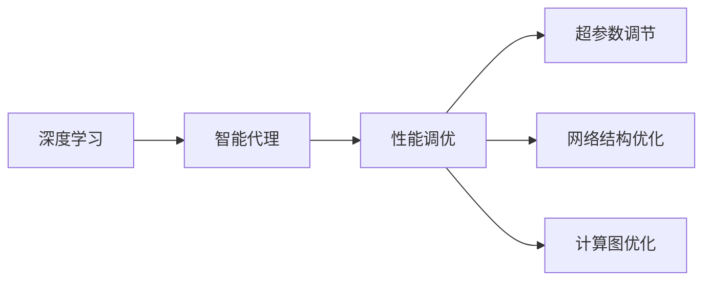

# AI人工智能深度学习算法：智能深度学习代理的性能调整与优化

关键词：深度学习、人工智能、智能代理、性能优化、算法调优

## 1. 背景介绍
### 1.1  问题的由来
随着人工智能技术的飞速发展,深度学习算法已成为当前人工智能领域的研究热点。深度学习算法能够从海量数据中自动学习特征,并建立复杂的映射关系,在计算机视觉、语音识别、自然语言处理等领域取得了突破性进展。然而,随着深度学习模型的日益复杂化,如何提高深度学习智能代理的性能,实现高效的训练和推理,成为亟待解决的关键问题。

### 1.2  研究现状
目前,学术界和工业界都在积极探索深度学习算法的性能优化技术。一方面,研究人员提出了许多新颖的网络结构和训练方法,如ResNet、DenseNet、AdaNet等,显著提升了模型的性能。另一方面,工程师们开发了一系列加速库和硬件设备,如cuDNN、TPU等,大幅缩短了模型的训练时间。尽管如此,深度学习算法的性能优化仍然存在诸多挑战,亟需系统性的研究。

### 1.3  研究意义 
深入研究深度学习智能代理的性能调优方法,对于推动人工智能技术的进步具有重要意义。首先,性能优化可以降低算法的计算开销,节省硬件资源,使得深度学习模型能够在更广泛的场景中得到应用。其次,性能优化有助于加速模型的迭代更新,缩短开发周期,提高人工智能产品的竞争力。最后,通过对深度学习算法的性能瓶颈进行系统分析,可以为算法的改进和创新提供新的思路。

### 1.4  本文结构
本文将围绕深度学习智能代理的性能调优展开系统性探讨。第2节介绍相关的核心概念；第3节重点阐述性能优化的核心算法原理和具体操作步骤；第4节建立性能调优的数学模型,并结合案例进行详细讲解；第5节通过代码实例,演示性能优化的具体实现；第6节分析性能调优技术在实际场景中的应用；第7节推荐相关的工具和学习资源；第8节总结全文,展望未来的发展趋势与挑战；第9节列举常见问题,并给出专业解答。

## 2. 核心概念与联系
在探讨深度学习智能代理性能调优之前,需要明确几个核心概念：

- 深度学习(Deep Learning):一种基于人工神经网络的机器学习方法,通过构建多层网络结构,从数据中自动学习特征表示,建立输入到输出的复杂映射关系。
- 智能代理(Intelligent Agent):能够感知环境,并根据环境做出自主行为的计算机程序。深度学习算法赋予了智能代理强大的感知和决策能力。
- 性能调优(Performance Tuning):通过算法改进、参数调节、资源优化等手段,提高深度学习模型的训练效率和推理速度,降低计算资源消耗。
- 超参数(Hyper-parameter):深度学习算法中需要人工设置的参数,如学习率、批量大小、正则化系数等,对模型性能有重要影响。
- 计算图(Computation Graph):描述深度学习模型前向和反向传播过程的有向无环图,是优化计算过程的重要工具。

这些概念之间密切相关,共同构成了深度学习智能代理性能调优的理论基础。下图展示了它们之间的联系：



## 3. 核心算法原理 & 具体操作步骤
### 3.1  算法原理概述
深度学习智能代理的性能调优涉及多个层面的优化,包括超参数选择、网络结构设计、训练策略改进等。其核心是通过减少计算冗余、加速收敛速度、提高泛化能力,从而达到性能提升的目的。常见的优化算法包括：

- 随机梯度下降(SGD):通过计算小批量样本的梯度,更新模型参数,实现增量学习。
- 自适应学习率算法(AdaGrad、RMSProp、Adam等):根据梯度历史动态调整每个参数的学习率,加速收敛。
- 批量归一化(Batch Normalization):对每一层的输入进行归一化,缓解梯度消失问题,加速训练。
- 剪枝(Pruning)和量化(Quantization):通过减少模型的参数和计算量,在保持性能的同时降低存储和计算开销。

### 3.2  算法步骤详解
以随机梯度下降算法为例,详细说明性能优化的具体步骤：

1. 初始化模型参数和超参数(学习率、批量大小、迭代次数等)
2. 将训练数据划分为小批量
3. 对每个小批量数据:
   a. 前向传播,计算模型输出
   b. 计算损失函数
   c. 反向传播,计算梯度
   d. 更新模型参数
4. 重复步骤3,直到满足停止条件(如达到预设的迭代次数或验证集性能不再提升)
5. 使用学习到的参数对测试数据进行预测,评估模型性能

在实际操作中,可以通过调节学习率、批量大小等超参数,或引入Momentum、AdaGrad等改进算法,进一步提升优化效果。

### 3.3  算法优缺点
随机梯度下降算法的优点包括：
- 计算效率高,每次只使用一部分数据更新参数
- 适用于大规模数据集和在线学习场景
- 容易实现,调参灵活

缺点包括：
- 对学习率敏感,选择不当可能导致收敛速度慢或震荡
- 可能陷入局部最优,影响全局性能
- 对数据的顺序敏感,需要进行随机打乱

### 3.4  算法应用领域
SGD及其变种被广泛应用于深度学习的各个领域,包括计算机视觉、自然语言处理、语音识别、推荐系统等。一些著名的深度学习框架,如TensorFlow、PyTorch,都内置了SGD优化器,方便用户进行模型训练。

## 4. 数学模型和公式 & 详细讲解 & 举例说明
### 4.1  数学模型构建
为了刻画深度学习智能代理性能调优的数学本质,我们考虑一个简化的场景：使用SGD算法优化一个L层的前馈神经网络。记第 $l$ 层的权重参数为 $W^{(l)}$,偏置参数为 $b^{(l)}$,激活函数为 $\sigma(\cdot)$,则前向传播过程可表示为:

$$
\begin{aligned}
a^{(0)} &= x \\
z^{(l)} &= W^{(l)}a^{(l-1)} + b^{(l)} \\
a^{(l)} &= \sigma(z^{(l)})
\end{aligned}
$$

其中 $x$ 为输入特征, $a^{(l)}$ 为第 $l$ 层的激活值。

假设损失函数为 $J(W,b)$,学习率为 $\alpha$,则SGD的参数更新公式为:

$$
\begin{aligned}
W^{(l)} &:= W^{(l)} - \alpha \frac{\partial J}{\partial W^{(l)}} \\
b^{(l)} &:= b^{(l)} - \alpha \frac{\partial J}{\partial b^{(l)}}
\end{aligned}
$$

其中 $\frac{\partial J}{\partial W^{(l)}}$ 和 $\frac{\partial J}{\partial b^{(l)}}$ 通过反向传播算法计算。

### 4.2  公式推导过程
为了推导出反向传播中的梯度计算公式,我们引入误差项 $\delta^{(l)}$,表示第 $l$ 层的误差。根据链式法则,有:

$$
\begin{aligned}
\delta^{(L)} &= \nabla_a J \odot \sigma'(z^{(L)}) \\
\delta^{(l)} &= ((W^{(l+1)})^T \delta^{(l+1)}) \odot \sigma'(z^{(l)})
\end{aligned}
$$

其中 $\odot$ 表示Hadamard乘积, $\nabla_a J$ 为损失函数对输出层激活值的梯度。

进而可以得到损失函数对权重和偏置的梯度:

$$
\begin{aligned}
\frac{\partial J}{\partial W^{(l)}} &= \delta^{(l)} (a^{(l-1)})^T \\
\frac{\partial J}{\partial b^{(l)}} &= \delta^{(l)}
\end{aligned}
$$

将上述梯度代入SGD的更新公式,即可实现参数的迭代优化。

### 4.3  案例分析与讲解
下面我们以一个简单的二分类问题为例,演示SGD算法的性能调优过程。

假设输入特征为二维向量 $x=(x_1,x_2)$,对应的二元标签为 $y\in\{0,1\}$。我们构建一个2层的前馈神经网络,其中输入层2个节点,隐藏层3个节点,输出层1个节点。激活函数选择sigmoid函数 $\sigma(z)=\frac{1}{1+e^{-z}}$,损失函数选择交叉熵函数:

$$
J(W,b) = -\frac{1}{m} \sum_{i=1}^m [y^{(i)} \log a^{(L)(i)} + (1-y^{(i)}) \log (1-a^{(L)(i)})]
$$

其中 $m$ 为样本数量, $a^{(L)(i)}$ 为第 $i$ 个样本的输出。

在随机初始化参数后,我们使用SGD算法进行迭代优化。每次迭代的具体步骤如下:

1. 从训练集中随机选择一个小批量(如64个)样本
2. 前向传播计算每个样本的输出
3. 计算损失函数及其梯度
4. 反向传播计算每层参数的梯度
5. 使用学习率为0.01的SGD更新参数

重复上述步骤,直到损失函数收敛或达到预设的迭代次数。

通过合理设置超参数(如学习率、批量大小)和迭代次数,SGD算法可以在较短的时间内找到最优的模型参数,实现性能的提升。同时,我们还可以引入AdaGrad、Adam等自适应学习率算法,进一步加速收敛过程。

### 4.4  常见问题解答
Q: SGD算法对学习率的选择有什么要求?

A: 学习率是SGD算法中最重要的超参数之一。选择过大的学习率可能导致损失函数震荡或发散；选择过小的学习率会使收敛速度变慢。一般建议通过交叉验证或网格搜索等方法,在一个合理的范围内(如0.1到1e-6)选择最优的学习率。同时,学习率衰减策略(如指数衰减、阶梯衰减)也有助于改善优化效果。

Q: 随机梯度下降算法是否适用于所有类型的深度学习模型?

A: SGD算法及其变种是深度学习中最常用的优化算法,适用于绝大多数模型,如前馈神经网络、卷积神经网络、循环神经网络等。但对于一些特殊的网络结构(如生成对抗网络),可能需要针对性地设计优化算法。此外,对于非凸优化问题,SGD算法可能收敛到局部最优解。因此,有时需要结合模拟退火等全局优化技术,跳出局部最优。

## 5. 项目实践：代码实例和详细解释说明
### 5.1  开发环境搭建
本项目使用Python语言和PyTorch深度学习框架,在Jupyter Notebook中进行交互式开发。首先安装必要的依赖库:

```bash
pip install torch torchvision matplotlib
```

然后启动Jupyter Notebook:

```bash
jupyter notebook
```

### 5.2  源代码详细实现
下面给出使用PyTorch实现SGD优化算法的完整代码:

```python
import torch
import torch.nn as nn
import torch.optim as optim
from torchvision import datasets, transforms