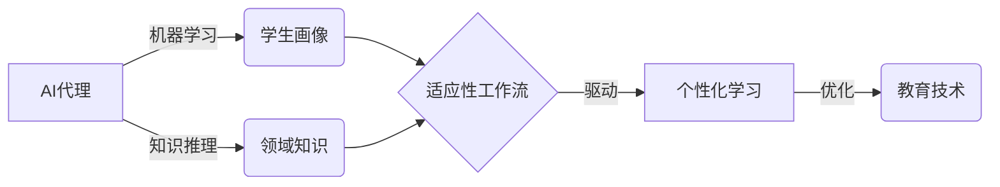

# AI代理在教育技术中的适应性工作流案例

关键词：AI代理，教育技术，适应性工作流，机器学习，个性化学习

## 1. 背景介绍

### 1.1  问题的由来

随着人工智能技术的快速发展，AI代理在教育领域的应用越来越广泛。传统的教育模式已经无法满足学生个性化、自适应学习的需求。如何利用AI代理技术，构建适应性工作流，为学生提供个性化的学习支持，成为教育技术领域亟待解决的问题。

### 1.2  研究现状

目前，国内外学者对AI代理在教育中的应用开展了广泛研究。斯坦福大学的研究者提出了基于知识图谱的智能教育系统[1]，利用本体和语义网技术，为学生提供个性化的学习路径推荐。麻省理工学院的学者开发了一种自适应学习平台[2]，通过机器学习算法分析学生的学习行为，动态调整学习内容和难度。国内清华大学等高校也在智慧教育方面开展了卓有成效的探索[3]。

### 1.3  研究意义

AI代理驱动的适应性工作流，能够根据学生的知识水平、学习风格、认知特点等，智能生成个性化的学习路径和资源推荐，大大提高学习效率。同时，AI代理可以通过对学习过程的智能分析，及时发现学生的学习问题并给出针对性指导。研究AI代理在教育领域的应用，对于推动教育变革、提升教学质量具有重要意义。

### 1.4  本文结构

本文将围绕AI代理在教育技术中的适应性工作流展开探讨。第2部分介绍相关的核心概念；第3部分重点阐述工作流的核心算法原理；第4部分给出算法的数学模型和公式推导；第5部分通过代码实例演示算法的实现；第6部分分析算法在教育实践中的应用场景；第7部分推荐相关工具和学习资源；第8部分对全文进行总结，并展望未来的发展方向。

## 2. 核心概念与联系

在探讨AI代理适应性工作流之前，有必要对几个核心概念进行梳理：

- **AI代理(AI Agent)**：能够感知环境并采取行动以达成目标的人工智能系统[4]。它通过机器学习算法，从数据中学习和优化策略，解决复杂问题。

- **适应性工作流(Adaptive Workflow)**：根据应用场景的实时反馈，动态调整工作流的内容、顺序和节奏，以优化整个流程[5]。适应性是智能系统的重要特征。

- **教育技术(Educational Technology)**：将现代信息技术应用于教育教学的理论与实践[6]，旨在利用技术手段革新传统教学模式，提高学习效果。

- **个性化学习(Personalized Learning)**：根据学习者的个体差异，量身定制学习内容、进度、方式和环境的教学模式[7]。它强调以学习者为中心，尊重个体特点。

在教育领域，AI代理通过机器学习算法，对学生画像进行建模；结合领域知识，生成适应性的个性化学习工作流，引导学生高效学习。下图展示了几个核心概念间的联系：

## 3. 核心算法原理 & 具体操作步骤

### 3.1  算法原理概述

AI代理适应性工作流的核心是根据学生的个体特征，动态生成个性化的学习序列。其基本原理可总结为：

1. 学生建模：通过机器学习算法，从学生的学习行为数据中提取特征，构建用户画像。
2. 知识表示：利用本体、知识图谱等技术，对学科知识进行结构化表示和语义建模。
3. 工作流生成：结合学生画像和知识图谱，通过启发式搜索、强化学习等算法，生成最优学习路径。
4. 动态调整：根据学生的实时反馈，对工作流进行动态微调，实现自适应优化。

### 3.2  算法步骤详解

下面以基于强化学习的工作流生成算法为例，详细说明其具体步骤。

**输入**：学生特征向量 $\mathbf{x}$，知识图谱 $\mathcal{G}$，学习目标 $g$

**输出**：最优学习路径 $\mathbf{p}^*$

1. 状态空间构建。将知识图谱 $\mathcal{G}$ 的每个概念节点视为强化学习的一个状态 $s \in \mathcal{S}$。

2. 动作空间定义。对于每个状态 $s$，可选的后继学习节点为其动作空间 $\mathcal{A}(s)$。

3. 奖励函数设计。学习效果提升值 $\Delta p$ 作为即时奖励 $r$，目标节点的奖励设为 $R_g$。

$$
r(s,a,s') = 
\begin{cases}
\Delta p, & s' \neq g \\
R_g, & s' = g
\end{cases}
$$

4. 价值函数估计。通过值迭代或策略梯度等算法，估计状态-动作值函数 $Q(s,a|\theta)$。

5. 策略优化。根据 $\varepsilon$-贪心策略选择动作，并通过梯度下降等方法优化策略参数 $\theta$。

$$
\pi(s|\theta) = 
\begin{cases}
\arg\max_{a} Q(s,a|\theta), & \text{with prob.} 1-\varepsilon \\
\text{random } a \in \mathcal{A}(s), & \text{with prob.} \varepsilon
\end{cases}
$$

6. 路径生成。从初始状态 $s_0$ 开始，根据最优策略 $\pi^*$ 选择动作，得到学习路径 $\mathbf{p}^*$。

$$
\mathbf{p}^* = (s_0, a_0, s_1, a_1, \dots, s_{T-1}, a_{T-1}, s_T)
$$

其中，$s_T = g$ 为学习目标节点。

### 3.3  算法优缺点

上述基于强化学习的算法具有以下优点：

- 能够根据学生的实时反馈，动态调整学习路径，实现自适应优化。
- 通过奖励函数设计，可以灵活地引入个性化学习偏好和领域知识。
- 强化学习算法具有良好的探索性，能够发现新颖的学习路径。

但该算法也存在一些局限性：

- 状态空间和动作空间随知识图谱复杂度急剧增长，导致计算开销大。
- 对奖励函数的设计依赖专家经验，存在一定主观性。
- 学生建模依赖大量高质量的学习行为数据，现实中难以获取。

### 3.4  算法应用领域

该算法为教育领域的个性化学习提供了新思路，具有广阔的应用前景：

- 智能教育系统：根据学生特点，自动规划个性化学习路径和资源推荐。
- 自适应学习平台：动态调整学习内容难度，实现因材施教。
- 知识图谱构建：利用学习者反馈优化知识图谱，提高知识表示质量。

## 4. 数学模型和公式 & 详细讲解 & 举例说明

### 4.1  数学模型构建

为了形式化描述AI代理工作流，引入如下数学符号：

- $\mathcal{S}$：知识状态空间，每个状态 $s \in \mathcal{S}$ 对应知识图谱的一个节点。
- $\mathcal{A}$：学习动作空间，每个动作 $a \in \mathcal{A}$ 表示从当前状态到下一状态的转移。
- $\mathcal{P}$：状态转移概率矩阵，$\mathcal{P}(s'|s,a)$ 表示在状态 $s$ 下选择动作 $a$ 到达状态 $s'$ 的概率。
- $\mathcal{R}$：奖励函数，$\mathcal{R}(s,a,s')$ 表示从状态 $s$ 通过动作 $a$ 到达状态 $s'$ 获得的即时奖励。
- $\gamma$：折扣因子，$\gamma \in [0,1]$ 表示未来奖励的衰减程度。
- $\pi$：学习策略，$\pi(a|s)$ 表示在状态 $s$ 下选择动作 $a$ 的概率。
- $V^\pi(s)$：状态值函数，表示从状态 $s$ 开始，遵循策略 $\pi$ 的期望总奖励。
- $Q^\pi(s,a)$：动作值函数，表示在状态 $s$ 下选择动作 $a$，遵循策略 $\pi$ 的期望总奖励。

学习的目标是寻找最优策略 $\pi^*$，使得期望总奖励最大化：

$$
\pi^* = \arg\max_\pi V^\pi(s_0)
$$

其中，$s_0$ 为初始状态。根据Bellman最优性方程，最优状态值函数 $V^*(s)$ 满足：

$$
V^*(s) = \max_{a \in \mathcal{A}} \sum_{s' \in \mathcal{S}} \mathcal{P}(s'|s,a) [\mathcal{R}(s,a,s') + \gamma V^*(s')]
$$

### 4.2  公式推导过程

为了求解最优策略，可以使用值迭代算法，迭代更新状态值函数：

$$
V_{k+1}(s) \leftarrow \max_{a \in \mathcal{A}} \sum_{s' \in \mathcal{S}} \mathcal{P}(s'|s,a) [\mathcal{R}(s,a,s') + \gamma V_k(s')]
$$

当 $V_k$ 收敛时，即可得到最优状态值函数 $V^*$。根据 $V^*$ 可以导出最优策略：

$$
\pi^*(s) = \arg\max_{a \in \mathcal{A}} \sum_{s' \in \mathcal{S}} \mathcal{P}(s'|s,a) [\mathcal{R}(s,a,s') + \gamma V^*(s')]
$$

在实践中，由于状态空间过大，上述值迭代算法往往难以直接求解。因此，可以使用函数近似的方法，通过参数化的值函数 $V(s|\theta)$ 来近似 $V^*(s)$：

$$
V(s|\theta) \approx V^*(s)
$$

其中，$\theta$ 为待学习的参数向量。将值函数近似引入Bellman最优性方程，可得：

$$
V(s|\theta) = \max_{a \in \mathcal{A}} \sum_{s' \in \mathcal{S}} \mathcal{P}(s'|s,a) [\mathcal{R}(s,a,s') + \gamma V(s'|\theta)]
$$

通过最小化均方误差损失函数，可以优化参数 $\theta$：

$$
\mathcal{L}(\theta) = \sum_{s \in \mathcal{S}} \Big[ V(s|\theta) - \max_{a \in \mathcal{A}} \sum_{s' \in \mathcal{S}} \mathcal{P}(s'|s,a) [\mathcal{R}(s,a,s') + \gamma V(s'|\theta)] \Big]^2
$$

常用的优化算法包括梯度下降法、Adam等。

### 4.3  案例分析与讲解

下面以一个简单的学习场景为例，说明如何应用上述数学模型。

假设某课程的知识图谱包含4个节点：$\mathcal{S}=\{s_1, s_2, s_3, s_4\}$，每个节点表示一个知识点。学习动作空间 $\mathcal{A}=\{a_1, a_2, a_3\}$，分别表示"阅读教材"、"观看视频"、"做练习"。

状态转移概率矩阵 $\mathcal{P}$ 根据学生的历史学习数据估计得到。奖励函数 $\mathcal{R}$ 可以根据学生的学习效果提升值和学习偏好设计。

假设当前学生处于状态 $s_1$，通过值迭代算法，得到了最优状态值函数 $V^*$：

$$
V^*(s_