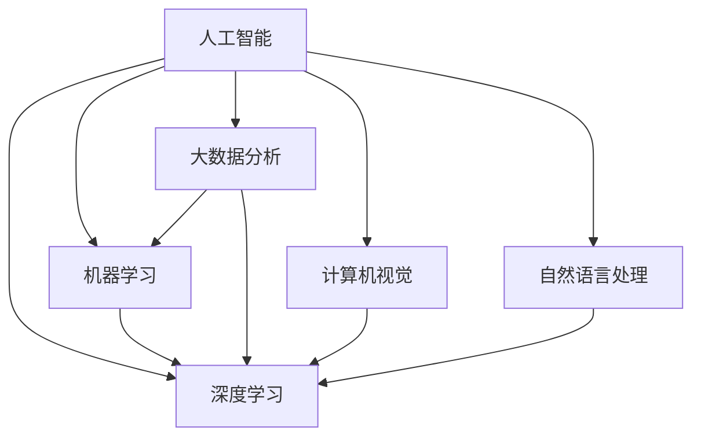

# AI在科学研究中的应用

关键词：人工智能、机器学习、深度学习、科学研究、大数据分析、计算机视觉、自然语言处理

## 1. 背景介绍
### 1.1 问题的由来
人工智能（Artificial Intelligence，AI）自诞生以来就一直是科技界关注的焦点。随着计算机硬件性能的不断提升和大数据时代的到来，AI技术取得了突飞猛进的发展。近年来，AI在各个领域都展现出了巨大的应用潜力，科学研究领域也不例外。科学家们开始探索如何利用AI技术来辅助甚至颠覆传统的科学研究范式，以期获得更多的研究突破。

### 1.2 研究现状
目前，AI已经在多个科学研究领域崭露头角，包括但不限于生物医学、天文学、材料科学、粒子物理等。一些典型的应用包括：

- 利用机器学习算法分析基因组数据，发现疾病相关基因
- 使用深度学习模型分析天文望远镜图像，发现新的天体
- 运用强化学习算法优化材料合成工艺，开发新型功能材料
- 基于自然语言处理技术挖掘科学文献，发现新的研究方向
- 结合计算机视觉和机器人技术，实现科学实验自动化

可以看到，AI正在为科学研究注入新的活力，有望加速科学发现的步伐。

### 1.3 研究意义
探索AI在科学研究中的应用具有重要意义：

1. 提高研究效率：AI可以自动处理海量的科学数据，大大节省人力物力，提高研究效率。
2. 发现新规律：AI善于从复杂数据中提取特征、建立模型，有助于发现人类难以察觉的隐藏规律。 
3. 优化实验方案：AI可以对实验参数进行智能优化，减少不必要的实验，缩短研发周期。
4. 开拓新领域：将AI引入交叉学科，有望催生出全新的研究方向和学科分支。

总之，AI有望成为推动科学研究发展的新引擎，值得学界和业界给予高度重视。

### 1.4 本文结构
本文将重点探讨AI在科学研究中的应用，内容安排如下：

- 第2部分介绍AI在科学研究中的核心概念及其内在联系
- 第3部分剖析AI核心算法的基本原理及其操作步骤 
- 第4部分建立AI在科研中的数学模型，并结合实例讲解相关公式
- 第5部分通过代码实例演示如何将AI算法应用到具体科研项目中
- 第6部分总结AI在各科学领域的实际应用案例及未来场景展望
- 第7部分推荐AI科研相关的学习资源、开发工具和文献资料
- 第8部分对AI科研的发展趋势、面临挑战及研究方向进行展望
- 第9部分以FAQ的形式解答AI科研的一些常见问题

## 2. 核心概念与联系
要理解AI在科学研究中的应用，首先需要了解几个核心概念：

- 机器学习：让计算机系统从数据中自主学习，无需显式编程。常见的机器学习任务包括分类、回归、聚类等。
- 深度学习：机器学习的一个分支，使用类似人脑结构的深度神经网络，擅长处理图像、语音等非结构化数据。
- 大数据分析：从海量数据中提取有价值的信息和知识。机器学习是大数据分析的重要工具。
- 计算机视觉：使计算机能够从图像或视频中"看到"并理解其内容，如目标检测、语义分割等。
- 自然语言处理：让计算机理解、生成和处理人类语言，如文本分类、机器翻译、问答系统等。

这些概念之间有着紧密的联系。机器学习和深度学习是AI的核心方法，为其他AI技术提供基础支撑。大数据为AI提供了海量的训练样本。计算机视觉和自然语言处理则体现了AI在理解非结构化数据方面的能力。它们相互配合，构成了AI在科学研究中的完整技术栈。

下图展示了这些概念之间的逻辑关系：

## 3. 核心算法原理 & 具体操作步骤
### 3.1 算法原理概述
AI在科学研究中的应用离不开各种机器学习算法的支撑。这里我们重点介绍几种常用的算法：

1. 支持向量机（SVM）：一种二分类模型，通过寻找最大间隔超平面将样本划分到不同类别中。
2. 随机森林（Random Forest）：由多棵决策树组成的集成学习模型，通过投票或求平均来预测结果。 
3. 卷积神经网络（CNN）：一种深度学习模型，擅长处理网格拓扑结构的数据，广泛用于图像识别等任务。
4. 循环神经网络（RNN）：一种深度学习模型，擅长处理序列数据，常用于自然语言处理、时间序列预测等。
5. 生成对抗网络（GAN）：由生成器和判别器组成，通过二者的博弈生成逼真的样本数据。

这些算法各有特点，在不同的科研场景中发挥着重要作用。

### 3.2 算法步骤详解
以卷积神经网络为例，其基本步骤如下：

1. 准备训练数据：收集大量的图像数据，并进行预处理和数据增强。
2. 设计网络结构：根据任务需求设计CNN的层数、卷积核大小、激活函数等超参数。
3. 训练网络：使用训练数据对CNN进行训练，优化网络参数以最小化损失函数。常用的优化算法包括随机梯度下降（SGD）、Adam等。
4. 评估模型：使用验证集评估模型性能，必要时进行调参。
5. 测试模型：在测试集上测试模型的泛化能力，得到最终的性能指标。
6. 应用模型：将训练好的模型部署到实际的科研任务中，如分析实验图像数据等。

其他算法的步骤也大同小异，都需要经过数据准备、模型设计、训练优化、评估测试等环节。

### 3.3 算法优缺点
每种算法都有其优缺点，需要根据具体的科研任务来选择：

- SVM：优点是可以处理高维数据，缺点是对参数敏感，训练时间长。  
- 随机森林：优点是不容易过拟合，可以评估特征重要性，缺点是对噪声敏感。
- CNN：优点是能提取多尺度特征，缺点是需要大量标注数据，训练成本高。
- RNN：优点是能捕捉时序信息，缺点是训练不稳定，容易梯度消失。
- GAN：优点是能生成逼真样本，缺点是训练不稳定，评估标准缺乏。

科研人员需要权衡算法的性能、计算成本、可解释性等因素，选择最适合的算法。

### 3.4 算法应用领域
不同的机器学习算法在科研的不同领域大放异彩：

- 在生物信息学领域，SVM和随机森林常用于基因表达数据分析、疾病诊断等任务。
- 在天文学领域，CNN被广泛用于天体图像分类、星系形态研究等。  
- 在材料科学领域，GAN可用于材料结构优化、新材料设计等。
- 在高能物理领域，RNN可用于粒子碰撞事件的识别和重建。

此外，还有很多前沿的研究方向，如将图神经网络用于分子结构预测，将强化学习用于药物虚拟筛选等。未来AI算法必将在更多科研领域崭露头角。

## 4. 数学模型和公式 & 详细讲解 & 举例说明
### 4.1 数学模型构建
AI算法的背后都有严谨的数学模型作为支撑。以线性回归为例，其数学模型可表示为：

$$y = w^Tx + b$$

其中，$x$为输入特征向量，$y$为预测值，$w$为权重向量，$b$为偏置项。线性回归的目标是找到最优的$w$和$b$，使得预测值$y$与真实值尽可能接近。

再如，卷积神经网络中的卷积操作可表示为：

$$(f * g)(i,j) = \sum_m \sum_n f(m,n)g(i-m,j-n)$$

其中，$f$为输入特征图，$g$为卷积核，$*$表示卷积操作。卷积的作用是提取输入特征图中的局部模式。

### 4.2 公式推导过程
以线性回归的损失函数为例，推导过程如下：

假设样本数为$n$，损失函数定义为均方误差（MSE）：

$$L(w,b) = \frac{1}{n} \sum_{i=1}^n (y_i - \hat{y}_i)^2$$

其中，$y_i$为第$i$个样本的真实值，$\hat{y}_i$为预测值。将$\hat{y}_i$展开：

$$L(w,b) = \frac{1}{n} \sum_{i=1}^n (y_i - w^Tx_i - b)^2$$

对$w$和$b$求偏导，得到梯度：

$$\frac{\partial L}{\partial w} = -\frac{2}{n} \sum_{i=1}^n (y_i - w^Tx_i - b)x_i$$

$$\frac{\partial L}{\partial b} = -\frac{2}{n} \sum_{i=1}^n (y_i - w^Tx_i - b)$$

令梯度为0，即可得到$w$和$b$的最优解。

### 4.3 案例分析与讲解
下面我们以一个简单的案例来说明线性回归的应用。假设我们要研究某种药物的剂量与疗效之间的关系。我们收集了10个样本，每个样本包含药物剂量（$x$）和对应的疗效（$y$），数据如下：

| 剂量（mg） | 疗效（%） |
|------------|-----------|
| 10         | 20        |
| 20         | 40        |
| 30         | 50        |
| 40         | 70        |
| 50         | 80        |
| 60         | 90        |
| 70         | 100       |
| 80         | 110       |
| 90         | 120       |
| 100        | 130       |

我们可以用线性回归模型来拟合剂量和疗效之间的关系。首先将数据归一化，然后使用梯度下降法求解模型参数$w$和$b$。最终得到的模型为：

$$y = 1.19x + 8.13$$

这表明，药物剂量每增加1mg，疗效平均增加1.19%。我们可以用这个模型来预测任意剂量下的疗效。比如，当剂量为75mg时，预测疗效为：

$$y = 1.19 \times 75 + 8.13 = 97.38\%$$

这个案例展示了线性回归在建模药物剂量反应关系中的应用。类似地，在其他科研场景中，我们也可以用合适的数学模型来刻画变量之间的关联规律。

### 4.4 常见问题解答
Q：线性回归对数据有哪些假设？  
A：线性回归假设变量之间是线性关系，残差服从高斯分布且相互独立。如果数据不满足这些假设，可能需要考虑使用其他模型。

Q：如何评价回归模型的性能？  
A：常用的指标有均方误差（MSE）、均方根误差（RMSE）、决定系数（$R^2$）等。$R^2$越接近1，表示模型拟合效果越好。

Q：多项式回归和线性回归有什么区别？  
A：多项式回归在特征的基础上引入了高次项，因此可以拟合非线性关系。但过高的阶数可能导致过拟合，需要谨慎选择。

Q：回归模型如何处理多个特征？  
A：可以使用多元线性回归，将多个特征同时纳入模型。但当特征数较多时，可能