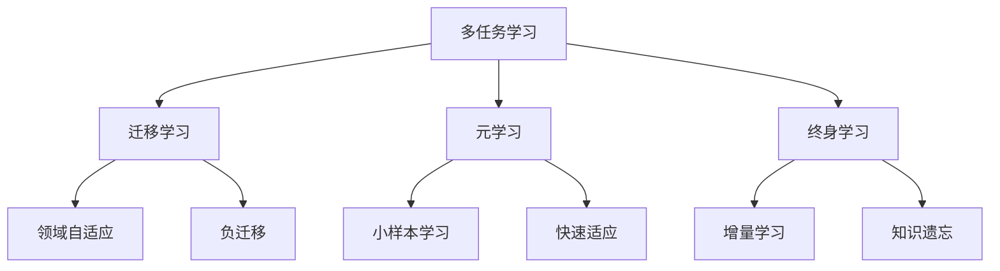

# AI大模型中的多任务学习：一石多鸟

关键词：AI大模型, 多任务学习, 迁移学习, 自监督学习, 端到端学习, 预训练模型, 参数共享, 知识蒸馏

## 1. 背景介绍
### 1.1  问题的由来
随着深度学习的快速发展,AI系统在各个领域取得了显著的进步,如计算机视觉、自然语言处理、语音识别等。然而,传统的AI系统通常是为特定任务专门设计和训练的,缺乏通用性和泛化能力。为了让AI系统具备类似人类的学习能力,即能够同时处理多个不同的任务,研究者们提出了多任务学习(Multi-task Learning)的概念。

多任务学习旨在通过共享不同任务之间的知识,来提高模型的泛化性能。近年来,随着计算能力的提升和大规模数据的积累,AI大模型(如GPT-3、BERT等)的出现进一步推动了多任务学习的发展。这些大模型通过在海量数据上进行预训练,学习到了丰富的语言知识和世界知识,可以应用于各种下游任务,展现出了强大的迁移学习能力。

### 1.2  研究现状 
目前,多任务学习已经成为AI领域的一个重要研究方向。谷歌、微软、OpenAI等科技巨头都在积极布局AI大模型和多任务学习技术。以下是一些代表性的研究成果:

- BERT(Bidirectional Encoder Representations from Transformers):由Google提出,是一种基于Transformer的预训练语言模型,可以应用于11种不同的NLP任务。

- GPT-3(Generative Pre-trained Transformer 3):由OpenAI开发,是目前最大的语言模型之一,在few-shot learning等方面取得了突破性进展。

- T5(Text-to-Text Transfer Transformer):由Google提出,将所有NLP问题统一为文本到文本的格式,实现了多任务学习。  

- UniLM(Unified Language Model):由微软提出,通过共享不同任务的Transformer参数,实现了语言理解和生成的统一建模。

除了上述的语言模型,多任务学习在计算机视觉、语音识别、强化学习等领域也得到了广泛应用。总的来说,当前多任务学习的研究主要集中在模型架构、任务设计、学习策略等方面。

### 1.3  研究意义
多任务学习对于推动AI的发展具有重要意义:

1. 提高模型的泛化能力:通过在多个任务上进行联合训练,模型可以学习到更加通用的特征表示,从而提高在新任务上的泛化性能。

2. 降低数据需求:多任务学习可以利用不同任务之间的相关性,实现知识的迁移和共享,减少单个任务所需的训练数据。

3. 节省计算资源:与为每个任务单独训练模型相比,多任务学习可以显著减少模型参数和训练时间,提高计算效率。

4. 促进AI的普适性:多任务学习是实现通用人工智能(AGI)的重要途径之一,有助于开发出更加智能、高效、鲁棒的AI系统。

### 1.4  本文结构
本文将围绕AI大模型中的多任务学习展开深入探讨。主要内容包括:

- 多任务学习的核心概念与关键技术
- 主流的多任务学习算法原理及优缺点分析 
- 多任务学习的数学建模与公式推导
- 多任务学习的代码实现与案例分析
- 多任务学习的应用场景及实践经验总结
- 多任务学习的未来发展趋势与挑战

## 2. 核心概念与联系
多任务学习的核心思想是通过共享不同任务之间的知识,来提高模型的泛化性能。它与传统的单任务学习有着本质的区别:

- 单任务学习(Single-task Learning):为每个任务分别训练一个独立的模型,任务之间没有关联。
- 多任务学习(Multi-task Learning):多个任务共享同一个模型结构,通过联合训练来学习通用的特征表示。

多任务学习的关键是找到任务之间的相关性,并设计合适的模型架构和学习策略来挖掘和利用这些相关性。根据任务间的相关程度,多任务学习可以分为:  

- 松耦合多任务学习(Loosely-coupled MTL):任务之间的相关性较弱,通过共享浅层的特征表示来实现迁移。
- 紧耦合多任务学习(Tightly-coupled MTL):任务之间的相关性较强,通过共享深层的特征表示甚至是端到端的网络结构来实现迁移。

除了任务间的相关性,多任务学习还需要考虑不同任务的重要程度、难易程度、数据分布等因素,合理地设计损失函数和优化策略,以平衡多个任务的学习过程。

多任务学习与迁移学习、元学习、终身学习等概念也有着密切的联系:

- 迁移学习(Transfer Learning):旨在将已学习的知识从源任务迁移到目标任务,多任务学习可以看作是一种特殊的迁移学习。 
- 元学习(Meta Learning):又称为"学会学习",主要研究如何从少量数据中快速学习新任务的算法,多任务学习可以为元学习提供良好的初始化。
- 终身学习(Lifelong Learning):研究如何让AI系统在连续的学习过程中不断积累和迁移知识,避免灾难性遗忘,多任务学习是实现终身学习的重要手段。

下图展示了多任务学习与其他学习范式之间的关系:



## 3. 核心算法原理 & 具体操作步骤
### 3.1  算法原理概述
多任务学习的核心是通过参数共享,来实现不同任务之间的知识迁移。根据参数共享的方式,主要有两种经典的多任务学习算法:

1. 硬参数共享(Hard Parameter Sharing)
   
   不同任务共享同一个主干网络(Backbone),在网络的顶层使用独立的任务特定层。主干网络负责学习通用的特征表示,任务特定层负责将通用特征映射到具体的任务输出。

2. 软参数共享(Soft Parameter Sharing)

   每个任务都有独立的网络结构,但不同任务的网络参数通过正则化项来鼓励彼此相似。常见的正则化方式有L2正则化、迹范数正则化等。

除了参数共享,多任务学习还可以通过知识蒸馏(Knowledge Distillation)、对抗学习(Adversarial Learning)等技术来实现知识的迁移和融合。

### 3.2  算法步骤详解
以硬参数共享为例,多任务学习的基本步骤如下:

1. 定义多任务模型结构:设计共享的主干网络和任务特定的输出层。
2. 准备多任务数据集:为每个任务准备对应的训练数据。
3. 设计多任务损失函数:根据任务的类型(分类、回归等)和重要程度,设计加权的损失函数。
4. 联合训练多任务模型:将多个任务的数据和损失函数输入到模型中,进行端到端的训练。
5. 微调任务特定层:根据具体任务的需求,可以选择冻结主干网络,只微调任务特定层。
6. 评估多任务性能:在每个任务的测试集上评估模型的性能,分析多任务学习的效果。

下面是一个简单的PyTorch代码示例,展示了如何构建和训练多任务模型:

```python
import torch
import torch.nn as nn

# 定义多任务模型结构
class MultiTaskModel(nn.Module):
    def __init__(self):
        super(MultiTaskModel, self).__init__()
        self.shared_layer = nn.Sequential(
            nn.Linear(100, 128),
            nn.ReLU(),
            nn.Linear(128, 64),
            nn.ReLU()
        )
        self.task1_layer = nn.Linear(64, 10) 
        self.task2_layer = nn.Linear(64, 20)
        
    def forward(self, x):
        h = self.shared_layer(x)
        out1 = self.task1_layer(h)
        out2 = self.task2_layer(h)
        return out1, out2

# 实例化模型    
model = MultiTaskModel()

# 定义任务的损失函数和优化器
criterion1 = nn.CrossEntropyLoss()
criterion2 = nn.MSELoss()
optimizer = torch.optim.Adam(model.parameters())

# 训练循环
for epoch in range(num_epochs):
    for batch in dataloader:
        x, y1, y2 = batch
        optimizer.zero_grad()
        out1, out2 = model(x)
        loss1 = criterion1(out1, y1) 
        loss2 = criterion2(out2, y2)
        loss = loss1 + 0.5 * loss2  # 加权损失
        loss.backward()
        optimizer.step()
```

### 3.3  算法优缺点
硬参数共享的优点是:
- 结构简单,易于实现。
- 可以显著减少模型参数,提高训练效率。
- 适用于任务之间相关性较强的场景。

缺点是:  
- 任务之间的差异性可能会影响共享表示的学习。
- 需要精心设计任务特定层,以适应不同任务的输出。
- 在任务之间相关性较弱时,效果可能不如软参数共享。

软参数共享的优点是:
- 每个任务有独立的网络,可以更好地适应任务的差异性。
- 通过正则化项来柔性地约束不同任务的参数,更加灵活。  

缺点是:
- 网络结构相对复杂,参数量较大。
- 超参数(正则化系数)需要仔细调节,以平衡任务间的相似性和差异性。
- 训练时间较长,计算开销较大。

### 3.4  算法应用领域
多任务学习在很多领域都有广泛的应用,例如:

- 自然语言处理:同时训练文本分类、命名实体识别、语义角色标注等任务。
- 计算机视觉:同时训练图像分类、目标检测、语义分割等任务。  
- 语音识别:同时训练声学模型、语言模型、说话人识别等任务。
- 推荐系统:同时训练评分预测、点击预测、转化预测等任务。
- 强化学习:同时训练多个子任务或辅助任务,加速主任务的学习。

总的来说,只要存在多个相关的任务,并且可以共享某些知识或表示,就可以考虑使用多任务学习来提升模型性能。

## 4. 数学模型和公式 & 详细讲解 & 举例说明
### 4.1  数学模型构建
假设我们有$T$个任务,每个任务$t$有$N_t$个样本$\{(x_i^t,y_i^t)\}_{i=1}^{N_t}$。多任务学习的目标是学习一个联合模型$f_\theta(x)$,它由共享参数$\theta_s$和任务特定参数$\theta_1,\cdots,\theta_T$组成。我们希望最小化所有任务的加权损失之和:

$$
\min_{\theta_s,\theta_1,\cdots,\theta_T} \sum_{t=1}^T \lambda_t \frac{1}{N_t} \sum_{i=1}^{N_t} L_t(f_{\theta_s,\theta_t}(x_i^t), y_i^t)
$$

其中$L_t$是任务$t$的损失函数,$\lambda_t$是任务$t$的权重系数。

对于硬参数共享,模型可以表示为:

$$
f_{\theta_s,\theta_t}(x) = g_{\theta_t}(h_{\theta_s}(x))
$$

其中$h_{\theta_s}$是共享的主干网络,$g_{\theta_t}$是任务特定的输出层。

对于软参数共享,模型可以表示为:

$$
f_{\theta_t}(x) = g_{\theta_t}(x), \quad t=1,\cdots,T
$$

同时在损失函数中加入正则化项:

$$
\min_{\theta_1,\cdots,\theta_T} \sum_{t=1}^T \lambda