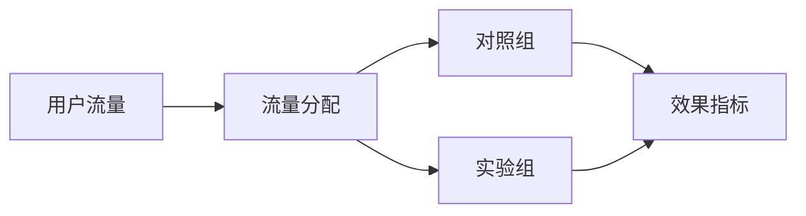

# AI系统A/B测试原理与代码实战案例讲解

关键词：A/B测试、AI系统、实验设计、统计学、机器学习

## 1. 背景介绍 

### 1.1 问题的由来
随着人工智能技术的快速发展,越来越多的企业开始将AI系统应用到实际业务场景中,如个性化推荐、智能客服、广告投放等。但在实际应用过程中,我们常常面临一个问题:如何评估一个新的AI算法模型相比现有系统的效果提升?这就需要借助A/B测试的力量。

### 1.2 研究现状
目前,A/B测试已经在互联网领域得到了广泛应用,尤其是在电商、社交、广告等领域。一些大型科技公司如Google、Facebook、亚马逊等,都建立了完善的A/B测试平台和规范流程。但是,在AI系统领域,A/B测试的应用还处于起步阶段,缺乏成熟的理论指导和实践案例。

### 1.3 研究意义
AI系统的A/B测试不同于传统的Web页面A/B测试,有其特殊性:
1. AI系统往往是一个黑盒,无法直接对内部逻辑进行修改,只能通过调整输入数据、参数等进行优化。
2. AI系统的效果评估往往需要较长的时间周期,如CTR、转化率等,而页面A/B测试的指标一般是即时可见的。
3. AI系统涉及的数据量和计算量大,对实验流量的切分、效果监控等都提出了更高要求。

因此,有必要对AI系统的A/B测试进行专门的研究,建立一套科学、规范、高效的方法论,指导AI系统的迭代优化。这对于提升AI应用的效果,加速AI商业化进程,具有重要意义。

### 1.4 本文结构
本文将分为理论和实践两大部分,系统阐述AI系统A/B测试的原理和方法:

第一部分重点介绍A/B测试的核心概念、数学原理和实验流程,并结合AI系统的特点进行讲解。主要包括:

- 核心概念:对照组、实验组、流量分配、效果指标等
- 数学原理:假设检验、p值、置信区间、最小样本量估计等  
- 实验流程:实验设计、数据采集、效果分析、结果解读等

第二部分则通过一个真实的案例,演示AI系统A/B测试的代码实现。我们将针对一个电商推荐系统,展示如何进行流量切分、效果监控、数据分析等关键环节的编码操作。

## 2. 核心概念与联系

在详细介绍A/B测试的原理之前,我们先来了解几个核心概念:

- 对照组(Control Group):使用当前系统的一组用户,作为基准参照。
- 实验组(Treatment Group):使用新算法或策略的一组用户,要评估其效果。
- 流量分配:将用户按一定比例随机分配到对照组和实验组。
- 效果指标:衡量实验效果的关键数据指标,如CTR、转化率等。

它们之间的关系可以用下图表示:

可见,A/B测试的核心是通过对用户流量的分组对比,来评估不同算法策略的效果差异。

## 3. 核心算法原理 & 具体操作步骤

### 3.1 算法原理概述
A/B测试的本质是一种假设检验,它的基本思路是:

1. 提出零假设$H_0$和备择假设$H_1$。一般$H_0$表示实验组和对照组效果无显著差异,$H_1$表示有显著差异。
2. 计算p值,即在零假设成立的前提下,得到当前实验数据的概率。p值越小,表示接受$H_0$的可能性越小。
3. 给定显著性水平$\alpha$(通常取0.05),若$p<\alpha$,则拒绝$H_0$,接受$H_1$。否则无法拒绝$H_0$。

### 3.2 算法步骤详解
下面以二项分布为例,详细介绍假设检验的步骤。

假设实验组点击率为$p_t$,对照组点击率为$p_c$。实验组样本量为$n_t$,点击数为$x_t$;对照组样本量为$n_c$,点击数为$x_c$。

1. 建立假设:
   - $H_0: p_t=p_c$
   - $H_1: p_t \neq p_c$
2. 选择检验统计量。这里选择两个独立样本比例之差:
$$ \hat{p}_t - \hat{p}_c $$
其中$\hat{p}_t=\frac{x_t}{n_t}, \hat{p}_c=\frac{x_c}{n_c}$

3. 计算p值。在二项分布的情况下,可以用正态分布来近似(适用于大样本):
$$ \frac{\hat{p}_t - \hat{p}_c}{\sqrt{\hat{p}(1-\hat{p})(\frac{1}{n_t}+\frac{1}{n_c})}} \sim N(0,1) $$
其中$\hat{p}=\frac{x_t+x_c}{n_t+n_c}$,表示总体点击率的估计。

由此可得:
$$ p=2\cdot(1-\Phi(|\frac{\hat{p}_t - \hat{p}_c}{\sqrt{\hat{p}(1-\hat{p})(\frac{1}{n_t}+\frac{1}{n_c})}}|)) $$

其中$\Phi$为标准正态分布的累积分布函数。

4. 在给定显著性水平$\alpha$下做出统计决策。

### 3.3 算法优缺点
上述基于二项分布的假设检验方法简单直观,计算效率高,适合流量较大的情况。

但它也有一些局限性:
- 要求样本量足够大,否则正态近似不准确。
- 只能验证点击率等二元指标,对于多元指标还需要借助其他方法,如卡方检验等。
- 未考虑时间因素的影响,可能受节假日等特殊时期的干扰。

### 3.4 算法应用领域
二项分布假设检验是A/B测试中最常用的一种方法,适用于验证各类二元指标,如:
- 点击率(CTR)
- 转化率(CVR) 
- 付费率
- 跳出率
- 是否完成某个行为

除此之外,对于连续型指标如停留时长、消费金额等,可以采用t检验等方法。多个指标的联合分析,可以使用Bonferroni校正、FDR校正等多重检验方法。

## 4. 数学模型和公式 & 详细讲解 & 举例说明

### 4.1 数学模型构建
为了进一步阐述A/B测试的原理,我们构建一个简化的数学模型。

考虑一个二元结果的实验,记单次实验的结果为随机变量$X$:
$$ X = \begin{cases} 
1, & \text{if 点击} \\\\
0, & \text{if 未点击}
\end{cases} $$

假设实验组点击率为$p_t$,对照组点击率为$p_c$。那么$X$服从参数为$p$的0-1分布:
$$ P(X=1) = p, \quad P(X=0) = 1-p $$

进行$n$次独立实验,记点击次数为$Y$,则$Y$服从二项分布:
$$ Y = \sum\_{i=1}^n X\_i \sim B(n,p) $$

其概率质量函数为:
$$ P(Y=k) = \binom{n}{k} p^k (1-p)^{n-k}, \quad k=0,1,\cdots,n $$

### 4.2 公式推导过程
根据中心极限定理,当$n$较大时,二项分布可以用正态分布来近似:
$$ Y \sim N(np, np(1-p)) $$

标准化后可得:
$$ \frac{Y-np}{\sqrt{np(1-p)}} \sim N(0,1) $$

由此,我们可以推导出实验组和对照组点击率之差的渐近分布:
$$ \hat{p}\_t - \hat{p}\_c = \frac{Y\_t}{n\_t} - \frac{Y\_c}{n\_c} \sim N(p\_t-p\_c, \frac{p\_t(1-p\_t)}{n\_t}+\frac{p\_c(1-p\_c)}{n\_c}) $$

在零假设$H_0:p_t=p_c$下,令$p=\frac{Y_t+Y_c}{n_t+n_c}$,则有:
$$ \frac{\hat{p}\_t - \hat{p}\_c}{\sqrt{\hat{p}(1-\hat{p})(\frac{1}{n\_t}+\frac{1}{n\_c})}} \sim N(0,1) $$

这就是我们前面用到的假设检验统计量。

### 4.3 案例分析与讲解
下面我们用一个具体的数值例子来说明上述理论。

假设某电商平台要测试一个新的推荐算法,随机选取了10000个用户作为实验组,10000个用户作为对照组。实验结果如下:

- 实验组:点击人数2500,点击率25% 
- 对照组:点击人数2300,点击率23%

问实验组和对照组的点击率是否有显著差异($\alpha=0.05$)?

解:

1. 建立假设:
   - $H_0: p_t=p_c$ 
   - $H_1: p_t \neq p_c$
2. 计算检验统计量:
   $$ \hat{p}\_t=\frac{2500}{10000}=0.25, \quad \hat{p}\_c=\frac{2300}{10000}=0.23 $$
   $$ \hat{p}=\frac{2500+2300}{10000+10000}=0.24 $$
   $$ \frac{\hat{p}\_t - \hat{p}\_c}{\sqrt{\hat{p}(1-\hat{p})(\frac{1}{10000}+\frac{1}{10000})}} = \frac{0.25-0.23}{\sqrt{0.24\times 0.76 \times \frac{2}{10000}}} \approx 3.25 $$
3. 查表得到双侧检验的临界值$z\_{0.025}=1.96$,而$3.25>1.96$,因此在显著性水平0.05下拒绝原假设,认为实验组和对照组差异显著。

这说明新的推荐算法能够带来显著的点击率提升。

### 4.4 常见问题解答
问:如何确定实验的最小样本量?

答:这取决于我们预期的效果大小和所需的统计检验力。一般可以用如下公式估算:
$$ n \approx \frac{(z\_{\alpha/2}+z\_{\beta})^2\cdot 2\bar{p}(1-\bar{p})}{(\hat{p}\_t-\hat{p}\_c)^2} $$

其中$\alpha$为显著性水平,$\beta$为第二类错误(漏报)概率,$\bar{p}$为总体点击率的估计值,$\hat{p}_t-\hat{p}_c$为预期的点击率差异。

例如,当$\alpha=0.05,\beta=0.2,\bar{p}=0.2,\hat{p}_t-\hat{p}_c=0.02$时,代入公式得:
$$ n \approx \frac{(1.96+0.84)^2\times 2\times 0.2\times 0.8}{0.02^2} \approx 12294 $$

因此,要检验出2%的点击率提升,单个分组样本量应不低于12294。

问:如何处理多个实验指标的综合分析?

答:对多个指标分别进行假设检验,会提高整体的犯第一类错误(误报)的概率。因此需要进行多重检验校正,控制总体错误率。常见的方法有:

- Bonferroni校正:将每个指标的显著性水平设为$\alpha/k$,其中$k$为指标个数。
- Holm校正:根据p值由小到大依次检验,第$i$个指标的显著性水平设为$\alpha/(k-i+1)$。
- FDR校正:控制错误发现率(False Discovery Rate),即在所有拒绝原假设的指标中,错误拒绝的比例。

这些方法在降低误报风险的同时,也可能提高漏报风险,需要根据实际情况权衡。

## 5. 项目实践：代码实例和详细解释说明

接下来,我们用Python代码实现一个简单的A/