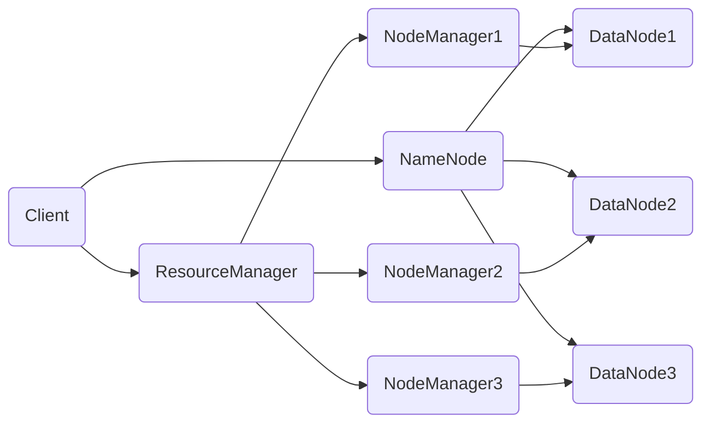
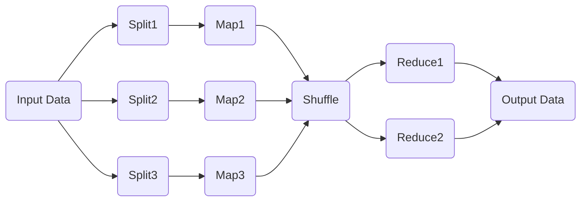

# AI系统Hadoop原理与代码实战案例讲解

关键词：Hadoop, HDFS, MapReduce, YARN, 大数据处理, 分布式计算

## 1. 背景介绍

### 1.1 问题的由来
随着互联网、物联网、社交媒体等技术的快速发展,数据呈现爆炸式增长。传统的数据处理和存储方式已经无法满足海量数据的实时分析和挖掘需求。因此,迫切需要一种高效、可扩展的大数据处理框架。

### 1.2 研究现状
Hadoop作为开源的分布式计算平台,为大数据处理提供了可靠的解决方案。Hadoop生态系统包括HDFS分布式文件系统、MapReduce分布式计算框架、YARN资源管理系统等核心组件。目前,Hadoop已成为大数据领域事实上的标准,广泛应用于互联网、金融、电信等行业。

### 1.3 研究意义
深入研究Hadoop的原理和实现,对于理解大数据处理的核心技术,掌握分布式计算的思想和方法具有重要意义。通过剖析Hadoop源码,可以学习到系统设计、性能优化等方面的最佳实践,提升编程和架构能力。

### 1.4 本文结构
本文将从以下几个方面对Hadoop进行深入探讨:

1. 介绍Hadoop的核心概念和架构设计
2. 剖析HDFS分布式文件系统的原理和实现
3. 详解MapReduce编程模型和工作流程
4. 讲解YARN资源管理和任务调度机制 
5. 通过实战案例演示Hadoop编程和优化技巧
6. 总结Hadoop未来的发展趋势和挑战

## 2. 核心概念与联系

Hadoop是一个开源的分布式计算平台,主要由以下几个核心组件构成:

- HDFS(Hadoop Distributed File System):分布式文件系统,提供高吞吐量的数据存储
- MapReduce:分布式计算框架,实现并行处理海量数据
- YARN(Yet Another Resource Negotiator):集群资源管理系统,负责调度和管理计算任务

下图展示了Hadoop的整体架构:



在Hadoop中,HDFS负责海量数据的分布式存储,将数据切分成块并存放在多个DataNode上,保证数据的容错和可用性。MapReduce基于分治思想,将大规模计算任务拆分为Map和Reduce两个阶段,在集群中并行执行。YARN作为资源管理者,动态分配资源,调度任务执行,实现集群的高效利用。

这三大组件紧密配合,构建了一个高度可扩展、容错的大数据处理平台。HDFS为计算提供了数据基础,MapReduce实现了并行计算,YARN保证了资源利用率。理解它们的原理和协作方式,是掌握Hadoop的关键。

## 3. 核心算法原理 & 具体操作步骤

### 3.1 算法原理概述
MapReduce是Hadoop的核心计算模型,基于函数式编程中的Map和Reduce原语。其基本思想是将大规模计算任务分解为两个阶段:Map(映射)和Reduce(规约)。

- Map阶段:并行处理输入数据,将其转换为中间的key-value对。
- Reduce阶段:对Map输出的中间结果按照key进行分组,并执行规约操作,生成最终结果。

通过Map和Reduce的有机结合,MapReduce可以实现对海量数据的高效并行处理。

### 3.2 算法步骤详解
MapReduce的工作流程可以分为以下几个步骤:

1. 输入数据切分:将大规模输入数据切分为多个Split,每个Split对应一个Map任务。
2. Map任务处理:为每个Split创建一个Map任务,并行读取数据,执行用户定义的map函数,生成中间的key-value对。
3. Shuffle阶段:对Map任务的输出结果按照key进行分区,将同一个key的数据发送到同一个Reduce任务。
4. Reduce任务处理:为每个分区创建一个Reduce任务,读取属于该分区的所有数据,执行用户定义的reduce函数,生成最终结果。
5. 结果输出:将Reduce任务的输出结果写入HDFS或其他输出系统。

下图展示了MapReduce的数据流向:



### 3.3 算法优缺点
MapReduce的优点包括:

- 高度抽象的编程模型,用户只需实现map和reduce函数
- 良好的可扩展性,可以透明地在大规模集群上并行执行
- 自动容错,Hadoop会自动检测和重新执行失败的任务
- 灵活的数据处理,不限制数据类型和处理方式

MapReduce的缺点包括:

- 不适合实时和迭代计算,因为需要等待所有Map和Reduce任务完成
- 中间结果需要写入磁盘,导致大量的I/O开销
- 处理逻辑被限制在Map和Reduce两个阶段,灵活性有限

### 3.4 算法应用领域
MapReduce在大数据处理领域有广泛的应用,典型场景包括:

- 日志分析:分析Web服务器日志,统计PV、UV等指标
- 文本处理:分布式的文本索引、倒排索引构建
- 数据挖掘:频繁项集挖掘、聚类、分类等
- 图计算:PageRank、最短路径等图算法
- 机器学习:分布式训练逻辑回归、SVM等模型

## 4. 数学模型和公式 & 详细讲解 & 举例说明

### 4.1 数学模型构建
MapReduce可以用以下数学模型来描述:

设输入数据集为$D=\{d_1,d_2,...,d_n\}$,Map函数为$m$,Reduce函数为$r$。

Map阶段:

$$m:d_i \rightarrow list(k_j,v_j)$$

其中,$d_i$为输入数据,$list(k_j,v_j)$为输出的key-value对列表。

Reduce阶段:

$$r:(k,list(v)) \rightarrow list(v')$$

其中,$k$为key,$list(v)$为该key对应的value列表,$list(v')$为规约后的结果列表。

因此,MapReduce可以表示为:

$$MapReduce:D \rightarrow list(k,v) \rightarrow list(k,list(v)) \rightarrow list(k,list(v'))$$

### 4.2 公式推导过程
以词频统计为例,假设输入数据为一组文本文件,要求统计每个单词出现的次数。

Map阶段输出:

$$m:(filename,content) \rightarrow list((word,1))$$

即将文本内容切分为单词,并输出(单词,1)的key-value对。

Reduce阶段输入:

$$(word1,list(1,1,1...))$$
$$(word2,list(1,1...))$$
$$...$$

即将相同单词的计数值聚合在一起。

Reduce阶段输出: 

$$r:(word,list(1,1,1...)) \rightarrow (word,sum(list(1,1,1...)))$$

即对每个单词的计数值求和,得到最终的词频结果。

### 4.3 案例分析与讲解
以上词频统计的MapReduce实现可以用如下伪代码表示:

```python
def map(filename, content):
    for word in content.split():
        emit(word, 1)

def reduce(word, counts):
    emit(word, sum(counts))
```

Map函数读取文本内容,将其切分为单词,并输出(word,1)的中间结果。Reduce函数接收每个单词对应的计数列表,对其求和,得到单词的总频次。

假设输入数据为:

```
file1: "hello world, hello hadoop"
file2: "hello mapreduce, world cloud"
```

Map阶段输出:
```
(hello, 1), (world, 1), (hello, 1), (hadoop, 1) 
(hello, 1), (mapreduce, 1), (world, 1), (cloud, 1)
```

Reduce阶段输出:
```
(hello, 3)
(world, 2)
(hadoop, 1)
(mapreduce, 1) 
(cloud, 1)
```

这就是词频统计的MapReduce实现过程,体现了分布式并行计算的思想。

### 4.4 常见问题解答
1. Map和Reduce函数能否接收多个输入?

Map函数可以接收多个输入文件,即输入的splits可以来自不同的文件。Reduce函数的输入是Map输出的中间结果,同一个key的value会自动聚合在一起。

2. MapReduce适合处理什么样的数据?

MapReduce适合处理大规模的批量数据,如日志、网页、文本等。对于实时性要求高或数据量较小的场景,MapReduce并不适合。

3. Reduce任务的个数如何确定?

Reduce任务的个数可以通过参数`mapreduce.job.reduces`来设置,默认为1。通常根据key的数量、Reducer的处理能力等因素来决定Reduce任务的个数。

4. MapReduce如何实现容错?

Hadoop会跟踪Map和Reduce任务的执行状态,如果发现失败的任务,会自动在另一个节点上重新执行。同时,Hadoop将中间结果写入磁盘,即使任务失败,也不会丢失数据。

## 5. 项目实践：代码实例和详细解释说明

### 5.1 开发环境搭建
要进行Hadoop开发,需要搭建如下环境:

- JDK:Hadoop是用Java语言编写的,需要安装JDK
- Hadoop:下载并解压Hadoop安装包,配置环境变量
- IDE:可以使用Eclipse、IDEA等IDE进行开发
- Maven:用于管理项目依赖和构建

具体搭建步骤可以参考Hadoop官方文档。

### 5.2 源代码详细实现
以词频统计为例,给出Hadoop MapReduce的Java代码实现:

```java
public class WordCount {
    public static class TokenizerMapper extends Mapper<Object, Text, Text, IntWritable> {
        private final static IntWritable one = new IntWritable(1);
        private Text word = new Text();
        
        public void map(Object key, Text value, Context context) throws IOException, InterruptedException {
            StringTokenizer itr = new StringTokenizer(value.toString());
            while (itr.hasMoreTokens()) {
                word.set(itr.nextToken());
                context.write(word, one);
            }
        }
    }
    
    public static class IntSumReducer extends Reducer<Text,IntWritable,Text,IntWritable> {
        private IntWritable result = new IntWritable();
        
        public void reduce(Text key, Iterable<IntWritable> values, Context context) throws IOException, InterruptedException {
            int sum = 0;
            for (IntWritable val : values) {
                sum += val.get();
            }
            result.set(sum);
            context.write(key, result);
        }
    }
    
    public static void main(String[] args) throws Exception {
        Configuration conf = new Configuration();
        Job job = Job.getInstance(conf, "word count");
        job.setJarByClass(WordCount.class);
        job.setMapperClass(TokenizerMapper.class);
        job.setCombinerClass(IntSumReducer.class);
        job.setReducerClass(IntSumReducer.class);
        job.setOutputKeyClass(Text.class);
        job.setOutputValueClass(IntWritable.class);
        FileInputFormat.addInputPath(job, new Path(args[0]));
        FileOutputFormat.setOutputPath(job, new Path(args[1]));
        System.exit(job.waitForCompletion(true) ? 0 : 1);
    }
}
```

### 5.3 代码解读与分析
1. TokenizerMapper:自定义的Map类,继承自`Mapper`。

- 在`map`方法中,通过`StringTokenizer`将文本内容切分为单词,并输出`<word, 1>`的key-value对。
- `one`是常量,表示每个单词的初始计数为1。
- `word`是存储单词的变量,类型为`Text`。
- `context`是MapReduce的上下文,用于输出key-value对。

2. IntSumReducer:自定义的Reduce类,继承自`Reducer`。

- 在`reduce`方法中,通过迭代`values`,累加每个单词的计数值,得到单词的总频次。
- `result`是存储计数结果的变量,类型为`IntWritable`。
- `context`用于