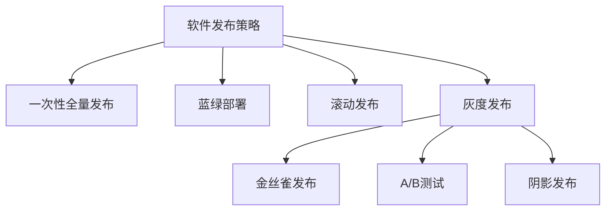

以下是《AI系统灰度发布原理与代码实战案例讲解》的博客文章正文内容：

# AI系统灰度发布原理与代码实战案例讲解

## 1. 背景介绍

### 1.1 问题的由来

在现代软件开发过程中,AI系统的发布往往是一个复杂而又充满挑战的任务。传统的一次性全量发布方式存在诸多风险,如系统宕机、性能下降、用户体验恶化等,这些问题都可能给企业带来巨大损失。因此,如何平滑、安全地发布AI系统,成为当前亟待解决的重要课题。

### 1.2 研究现状 

为了应对这一挑战,业界提出了"灰度发布"(Grayscale Release)的概念。灰度发布允许将系统分批次、分区域逐步推广,从而最大限度降低发布风险,确保系统的稳定性和可用性。目前,许多领先企业如Google、Facebook、Netflix等都广泛采用了灰度发布策略。

### 1.3 研究意义

对于AI系统而言,灰度发布尤为重要。AI算法的复杂性和不确定性,使其发布过程更加棘手。通过灰度发布,我们可以逐步评估AI系统的表现,及时发现并修复潜在问题,从而确保AI系统的高质量发布。此外,灰度发布还有利于提高AI系统的可解释性和可信任度。

### 1.4 本文结构

本文将全面介绍AI系统灰度发布的原理、实践和案例。我们将首先阐述灰度发布的核心概念,然后深入探讨其算法原理、数学模型和实现细节。接下来,我们将通过实际案例,演示如何在实践中应用灰度发布策略。最后,我们将总结灰度发布的发展趋势和面临的挑战。

## 2. 核心概念与联系

灰度发布(Grayscale Release)是一种软件发布策略,它将系统分批次、分区域逐步推广,而非一次性全量发布。其核心思想是通过控制发布流量,将新版本系统首先推送给一小部分用户,待系统表现良好后,再逐步扩大推广范围,直至完全替换旧版本。

灰度发布与其他软件发布策略的关系如下:

其中:

- 一次性全量发布: 将新版本系统一次性推送给所有用户,风险较高。
- 蓝绿部署: 在不中断服务的情况下,将新版本系统与旧版本系统并行运行,待新版本验证后,将流量切换至新版本。
- 滚动发布: 按照服务器组或机器组的维度,逐步将新版本系统推送至各个组件。
- 金丝雀发布: 将新版本系统首先推送给内部测试人员,待验证后再推广。
- A/B测试: 将用户分为两组,分别接收新旧版本系统,用于对比测试。
- 阴影发布: 将新版本系统与生产流量并行运行,但不对外提供服务,仅用于测试和验证。

可见,灰度发布是一种综合了上述多种策略优点的发布方式,具有更高的灵活性和可控性。

## 3. 核心算法原理与具体操作步骤

### 3.1 算法原理概述

灰度发布算法的核心思想是,通过流量控制和版本路由,将新版本系统逐步推送给用户。具体来说,它包括以下三个关键步骤:

1. **流量分类**: 根据预先设定的规则(如地域、用户组等),将总体流量划分为多个子流量。

2. **版本路由**: 为每个子流量分配对应的系统版本(新版或旧版)。

3. **流量迁移**: 根据发布策略,逐步调整各子流量的版本分配比例,直至完全切换至新版本。

该算法的优点是发布过程可控、平滑,且能够最大限度降低风险。其关键在于如何制定合理的流量分类和版本路由规则,并根据系统表现动态调整发布策略。

### 3.2 算法步骤详解

我们使用一个示例来详细解释灰度发布算法的具体步骤。假设我们需要将一个AI推荐系统从v1.0升级到v2.0版本,整个过程分为以下几个阶段:

1. **流量分类**

   我们根据用户所在地域,将总流量划分为6个子流量:

   - 北美20%
   - 欧洲15% 
   - 亚洲40%
   - 南美10%
   - 非洲5%
   - 大洋洲10%

2. **版本路由(初始阶段)**

   在发布初期,我们将这6个子流量的版本分配如下:

   - v1.0(旧版本): 北美、欧洲、亚洲、南美、非洲、大洋洲(100%)
   - v2.0(新版本): 无(0%)

3. **流量迁移(过渡阶段)**

   随着时间推移,我们根据v2.0版本的表现,逐步调整子流量的版本分配:

   - 第1周: v2.0版本推送给5%的亚洲流量
   - 第2周: v2.0版本推送给20%的亚洲和10%的北美流量
   - 第3周: v2.0版本推送给50%的亚洲、30%的北美和10%的欧洲流量
   - ...

4. **版本切换(最终阶段)**

   当v2.0版本表现良好,达到预期目标后,我们将所有子流量全部切换至v2.0版本,旧版本v1.0将被完全下线。

该算法的优点是:

1. **平滑过渡**: 通过逐步调整版本路由比例,可以实现版本间的平滑过渡。
2. **风险可控**: 发布风险可控,如果新版本存在严重问题,可以及时中止发布。
3. **可监控**: 可以实时监控每个子流量的系统表现,并根据反馈调整策略。

### 3.3 算法优缺点

**优点**:

1. **降低风险**: 通过分批次、分区域发布,可以最大限度降低发布风险。
2. **平滑过渡**: 版本间可以平滑过渡,避免系统受到剧烈冲击。 
3. **可控性强**: 发布过程可控,可根据系统表现动态调整策略。
4. **可监控**: 可实时监控各子流量的系统表现,并及时发现问题。
5. **提高可用性**: 通过多版本并行,可提高系统的整体可用性。

**缺点**:

1. **实现复杂**: 需要对流量进行分类、版本路由和动态调度,实现较为复杂。
2. **成本较高**: 需要维护多个版本的系统,运维成本较高。
3. **一致性挑战**: 不同版本间可能存在数据一致性和业务逻辑一致性问题。
4. **测试复杂**: 需要针对不同的版本组合进行全面测试,测试工作量加大。

### 3.4 算法应用领域

灰度发布算法可广泛应用于以下领域:

- **Web服务**: 如电商网站、在线视频网站等
- **移动应用**: 如手机App、游戏等
- **物联网系统**: 如智能家居、车联网等
- **云计算服务**: 如云服务器、云存储等
- **大数据系统**: 如实时数据处理、数据分析等
- **人工智能系统**: 如推荐系统、语音识别、计算机视觉等

总的来说,对于任何需要高可用、平滑升级的大规模分布式系统,都可以考虑采用灰度发布策略。

## 4. 数学模型和公式详细讲解与举例说明

### 4.1 数学模型构建

为了量化描述灰度发布过程,我们构建如下数学模型:

假设总流量为$T$,划分为$n$个子流量$\{t_1,t_2,...,t_n\}$,且$\sum_{i=1}^n t_i = T$。

对于每个子流量$t_i$,我们定义其新旧版本的流量分配比例为$p_i^{new}$和$p_i^{old}$,且$p_i^{new} + p_i^{old} = 1$。

因此,在给定时刻,新旧版本系统分别接收的总流量为:

$$
T^{new} = \sum_{i=1}^n t_i \cdot p_i^{new}
$$

$$
T^{old} = \sum_{i=1}^n t_i \cdot p_i^{old} = T - T^{new}
$$

我们的目标是,通过调整$\{p_i^{new}\}$的值,使$T^{new}$逐步增大,直至完全取代$T^{old}$。

在实际操作中,我们可以设置一些约束条件,如:

- 每个$p_i^{new}$的变化速率不超过一个上限$r_i$,即$|p_i^{new}(t+1) - p_i^{new}(t)| \leq r_i$
- 对于关键子流量$t_k$,其$p_k^{new}$的变化必须滞后,即$p_k^{new}(t) \leq \min\limits_{i \neq k} p_i^{new}(t)$
- 确保$T^{new}$的增长速率在一个可控范围内,即$\frac{T^{new}(t+1) - T^{new}(t)}{T} \leq r$

通过建模和约束,我们可以更好地制定和优化灰度发布策略。

### 4.2 公式推导过程

下面我们推导出,如何根据目标$T^{new}$值计算各$p_i^{new}$。

已知:
$$
T^{new} = \sum_{i=1}^n t_i \cdot p_i^{new}
$$

我们的目标是找到一组$\{p_i^{new}\}$,使得$T^{new}$达到预期值。

定义:
$$
q_i = \frac{t_i}{T}
$$

则:
$$
\sum_{i=1}^n q_i = 1
$$

带入$T^{new}$公式,得:
$$
T^{new} = T \cdot \sum_{i=1}^n q_i \cdot p_i^{new}
$$

令$T^{new} = \alpha T$,其中$\alpha$为预期的新版本流量占比,则:

$$
\alpha = \sum_{i=1}^n q_i \cdot p_i^{new}
$$

上式是关于$\{p_i^{new}\}$的线性方程组,可以使用线性规划的方法求解。

在实际应用中,我们还可以加入其他约束条件,如对$p_i^{new}$的变化速率、重要子流量的发布优先级等,形成一个约束优化问题,可使用对偶简化法等方法求解。

### 4.3 案例分析与讲解

现在,我们用一个实际案例,演示如何应用上述数学模型:

**背景**:
某电商网站的AI推荐系统需要升级,预计新版本的点击率将提高20%。我们计划在2周内,将新版本系统逐步推广至全部流量。

**已知条件**:

- 总流量$T = 100,000$请求/秒
- 子流量划分:
    - 北美$t_1 = 30,000$
    - 欧洲$t_2 = 20,000$
    - 亚洲$t_3 = 40,000$
    - 其他$t_4 = 10,000$
- 第1周目标:$T^{new} = 0.3T$
- 第2周目标:$T^{new} = T$

**求解过程**:

1. 计算各子流量权重:

$$
q_1 = \frac{30,000}{100,000} = 0.3 \\
q_2 = 0.2 \\
q_3 = 0.4 \\
q_4 = 0.1
$$

2. 第1周,根据$\alpha = 0.3$构建线性方程组:

$$
\begin{cases}
0.3p_1^{new} + 0.2p_2^{new} + 0.4p_3^{new} + 0.1p_4^{new} = 0.3\\
0 \leq p_i^{new} \leq 1
\end{cases}
$$