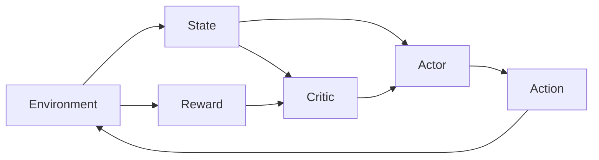

# Actor-Critic 原理与代码实例讲解

## 1. 背景介绍
### 1.1  问题的由来
强化学习是人工智能领域的一个重要分支,它研究如何让智能体通过与环境的交互来学习最优策略,以获得最大的累积奖励。在强化学习算法中,Actor-Critic 算法是一类非常重要且应用广泛的算法。它结合了 Policy-based 和 Value-based 两种方法的优点,能够同时学习策略函数和价值函数,从而更高效地找到最优策略。
### 1.2  研究现状 
目前,Actor-Critic 算法已经在许多领域取得了重要的研究进展。例如在 AlphaGo 中使用了 Actor-Critic 算法来优化价值网络和策略网络;在自然语言处理领域,Actor-Critic 被用于对话生成、机器翻译等任务;在计算机视觉领域,Actor-Critic 算法也被广泛应用于视频理解、目标检测等任务。此外,Actor-Critic 算法还被用于机器人控制、自动驾驶、推荐系统等诸多领域。
### 1.3  研究意义
Actor-Critic 算法作为强化学习的核心算法之一,对于理解和掌握强化学习的原理和应用具有重要意义。深入研究 Actor-Critic 算法有助于我们设计出更高效、更鲁棒的强化学习系统,推动人工智能在更多领域的应用。同时,Actor-Critic 思想对于理解生物学习机制,特别是大脑的奖赏学习机制也有重要启示。
### 1.4  本文结构
本文将首先介绍 Actor-Critic 算法的核心概念和数学原理,然后通过理论分析和代码实践相结合的方式对该算法进行全面而深入的讲解。内容安排如下:

第2部分介绍 Actor-Critic 的核心概念;第3部分重点讲解 Actor-Critic 的算法原理和具体步骤;第4部分从数学角度对 Actor-Critic 的模型和公式进行推导;第5部分通过代码实例和详细的注释说明,演示如何用 PyTorch 实现 Actor-Critic 算法;第6部分讨论 Actor-Critic 在实际应用中的一些场景;第7部分推荐一些学习 Actor-Critic 的资源;最后第8部分对全文进行总结,并对 Actor-Critic 算法的未来发展趋势和挑战进行展望。

## 2. 核心概念与联系

在介绍 Actor-Critic 算法之前,我们先来了解几个核心概念:

- 智能体(Agent):可以感知环境状态并作出行动的实体,比如机器人、自动驾驶汽车等。
- 环境(Environment):智能体所处的环境,提供观测值和奖励。
- 状态(State):对环境的描述,包含了智能体做出决策所需的信息。 
- 动作(Action):智能体施加于环境的行为。
- 策略(Policy):将状态映射为动作的函数,即给定状态下应该采取什么动作。
- 价值(Value):衡量状态或状态-动作对的好坏,代表了从当前开始能获得的期望累积奖励。
- 轨迹(Trajectory):智能体与环境交互产生的一系列状态-动作-奖励序列。

Actor-Critic 中的 Actor 对应策略函数,负责在给定状态下生成动作;Critic 对应价值函数,负责评估状态的价值。二者相互配合,Actor 根据 Critic 的评估来调整策略,Critic 根据 Actor 的策略采样轨迹来学习价值。

下图展示了 Actor-Critic 算法中各个组件之间的关系:

## 3. 核心算法原理 & 具体操作步骤
### 3.1  算法原理概述
Actor-Critic 算法结合了 Policy Gradient 和 Temporal Difference 两种方法。Actor 部分通过梯度上升来更新策略参数,使得能够生成获得更高累积奖励的动作序列;Critic 部分则通过时序差分来学习每个状态的价值,为 Actor 的策略改进提供引导。

具体来说,Actor 的目标是最大化如下的目标函数:

$$
J(\theta) = \mathbb{E}_{\tau \sim \pi_{\theta}}[R(\tau)]
$$

其中 $\theta$ 为策略参数,$\pi_{\theta}$ 为参数化的策略函数,$\tau$ 为根据 $\pi_{\theta}$ 生成的轨迹,$R(\tau)$ 为轨迹 $\tau$ 的累积奖励。

对 $J(\theta)$ 求梯度,可得策略梯度定理:

$$
\nabla_{\theta} J(\theta) = \mathbb{E}_{\tau \sim \pi_{\theta}}[\sum_{t=0}^{T-1} \nabla_{\theta} \log \pi_{\theta}(a_t|s_t) Q^{\pi}(s_t, a_t)]
$$

其中 $Q^{\pi}(s_t, a_t)$ 表示在状态 $s_t$ 下采取动作 $a_t$ 的动作价值函数。

Critic 部分的目标是学习状态价值函数 $V^{\pi}(s)$ 或动作价值函数 $Q^{\pi}(s,a)$,可以使用时序差分算法如 TD(0)、Sarsa、Q-learning 等来更新。以 TD(0) 为例,价值函数更新公式为:

$$
V(s_t) \leftarrow V(s_t) + \alpha [r_{t+1} + \gamma V(s_{t+1}) - V(s_t)]
$$

其中 $\alpha$ 为学习率,$\gamma$ 为折扣因子。

### 3.2  算法步骤详解

Actor-Critic 算法的主要步骤如下:

1. 随机初始化 Actor 的策略参数 $\theta$ 和 Critic 的价值函数参数 $\phi$。

2. 重复以下步骤,直到满足停止条件(如达到最大迭代次数或策略收敛):
   
   a. 根据当前策略 $\pi_{\theta}$ 与环境交互,生成一条轨迹 $\tau={(s_0,a_0,r_1,s_1,a_1,r_2,...,s_{T-1},a_{T-1},r_T)}$。
   
   b. 对于轨迹中的每个时间步 $t=0,1,...,T-1$:
      
      i. 计算 Critic 的时序差分误差:
      $$\delta_t = r_{t+1} + \gamma V_{\phi}(s_{t+1}) - V_{\phi}(s_t)$$
      
      ii. 更新 Critic 的价值函数参数 $\phi$:
      $$\phi \leftarrow \phi + \alpha \delta_t \nabla_{\phi} V_{\phi}(s_t)$$
      
      iii. 更新 Actor 的策略参数 $\theta$: 
      $$\theta \leftarrow \theta + \beta \delta_t \nabla_{\theta} \log \pi_{\theta}(a_t|s_t)$$
      其中 $\alpha$、$\beta$ 分别为 Critic 和 Actor 的学习率。

3. 输出最终的策略 $\pi_{\theta}$ 和价值函数 $V_{\phi}$。

### 3.3  算法优缺点

Actor-Critic 算法的主要优点有:

- 结合了 Policy Gradient 和 Temporal Difference 的优点,能够同时学习策略和价值函数,更高效地找到最优策略。
- 通过引入 Critic 来指导 Actor 的策略更新,减少了策略梯度的方差,提高了学习效率和稳定性。
- 适用于连续动作空间和高维状态空间,具有较好的通用性和扩展性。

Actor-Critic 算法的主要缺点包括:

- 引入了价值函数作为 Critic,增加了算法的复杂度和计算量。
- Actor 和 Critic 的更新依赖彼此,如果两者任一方学习不好,都会影响整体性能。
- 对超参数较为敏感,需要仔细调参才能达到良好效果。
- 采样效率较低,需要大量的环境交互才能学习到较好的策略。

### 3.4  算法应用领域

Actor-Critic 算法在强化学习领域应用十分广泛,一些典型的应用包括:

- 游戏 AI:如 AlphaGo 使用 Actor-Critic 算法来优化价值网络和策略网络。
- 机器人控制:用 Actor-Critic 算法学习机器人的运动策略,实现避障、抓取等任务。 
- 自动驾驶:通过 Actor-Critic 算法学习驾驶策略,实现自动车道保持、避撞等功能。
- 推荐系统:将推荐问题建模为强化学习任务,使用 Actor-Critic 算法优化推荐策略。
- 通信和网络:用 Actor-Critic 算法优化通信协议、路由策略、资源分配等。
- 智能电网:使用 Actor-Critic 算法优化发电调度、需求侧响应等任务。

## 4. 数学模型和公式 & 详细讲解 & 举例说明
### 4.1  数学模型构建

在 Actor-Critic 算法中,我们考虑一个马尔可夫决策过程(MDP),其中包含:

- 状态空间 $\mathcal{S}$,其中每个状态 $s \in \mathcal{S}$
- 动作空间 $\mathcal{A}$,其中每个动作 $a \in \mathcal{A}$  
- 状态转移概率 $\mathcal{P}(s'|s,a)$,表示在状态 $s$ 下采取动作 $a$ 后转移到状态 $s'$ 的概率
- 奖励函数 $\mathcal{R}(s,a)$,表示在状态 $s$ 下采取动作 $a$ 后获得的即时奖励

策略 $\pi(a|s)$ 定义为在状态 $s$ 下选择动作 $a$ 的概率。我们的目标是找到一个最优策略 $\pi^*$,使得从任意状态 $s$ 开始,执行该策略能够获得最大的期望累积奖励:

$$
\pi^* = \arg\max_{\pi} \mathbb{E}_{\tau \sim \pi}[\sum_{t=0}^{\infty} \gamma^t r_t]
$$

其中 $\tau=(s_0,a_0,r_1,s_1,a_1,r_2,...)$ 表示按照策略 $\pi$ 生成的轨迹,$\gamma \in [0,1]$ 为折扣因子。

状态价值函数 $V^{\pi}(s)$ 表示从状态 $s$ 开始,执行策略 $\pi$ 能够获得的期望累积奖励:

$$
V^{\pi}(s) = \mathbb{E}_{\tau \sim \pi}[\sum_{t=0}^{\infty} \gamma^t r_t | s_0=s]
$$

动作价值函数 $Q^{\pi}(s,a)$ 表示在状态 $s$ 下采取动作 $a$,然后执行策略 $\pi$ 能够获得的期望累积奖励:

$$
Q^{\pi}(s,a) = \mathbb{E}_{\tau \sim \pi}[\sum_{t=0}^{\infty} \gamma^t r_t | s_0=s, a_0=a]
$$

状态价值函数和动作价值函数满足 Bellman 方程:

$$
V^{\pi}(s) = \sum_{a} \pi(a|s) \sum_{s',r} \mathcal{P}(s',r|s,a) [r + \gamma V^{\pi}(s')]
$$

$$
Q^{\pi}(s,a) = \sum_{s',r} \mathcal{P}(s',r|s,a) [r + \gamma \sum_{a'} \pi(a'|s') Q^{\pi}(s',a')]
$$

### 4.2  公式推导过程

下面我们推导 Actor-Critic 算法中的关键公式。

首先是策略梯度定理。我们的目标是最大化期望累积奖励:

$$
J(\theta) = \mathbb{E}_{\tau \sim \pi_{\theta}}[R(\tau)] = \mathbb{E}_{\tau \sim \pi_{\theta}}[\sum_{t=0}^{T-1} r_t]
$$

其中 $R(\tau)$ 表示轨迹 $\tau$ 的累积奖励。根据期望的定义,我们可以将 $J(\theta)$ 写成如下形式:

$$
J(\theta) = \sum_{\tau} P(\tau;\theta) R(\tau)
$$

其中 $P(\tau;\theta)$ 表示根据策略 $\pi_{\theta}$ 生成轨迹 $\tau$ 的概率:

$$