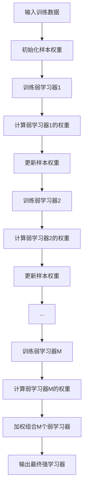

# AdaBoost原理与代码实例讲解

## 1. 背景介绍
### 1.1 问题的由来
在机器学习领域,集成学习(Ensemble Learning)是一种重要的方法,它通过组合多个基础学习器的预测结果来提高整体的预测性能。AdaBoost(Adaptive Boosting)算法作为集成学习中的代表性算法之一,自1995年由Yoav Freund和Robert Schapire提出以来,就受到了广泛的关注和应用。

### 1.2 研究现状
AdaBoost算法经过多年的发展,已经衍生出多个变体,如AdaBoost.M1、AdaBoost.M2、Real AdaBoost等。同时,AdaBoost也被应用到了多个领域,如人脸检测、文本分类、异常检测等。目前,AdaBoost仍然是集成学习领域的重要算法之一,很多研究工作都是基于AdaBoost展开的。

### 1.3 研究意义
AdaBoost算法有着重要的理论意义和实践价值:

1. AdaBoost给出了一种将弱学习器提升为强学习器的框架,为集成学习的发展奠定了基础。
2. AdaBoost具有较好的泛化性能,在很多任务上都取得了不错的效果。
3. AdaBoost思想启发了一系列后续的提升方法,如Gradient Boosting等。
4. AdaBoost的推导过程体现了机器学习中的一些重要思想,如样本加权、误差率最小化等,有助于加深对机器学习的理解。

因此,深入理解和掌握AdaBoost算法,对于从事机器学习研究和应用的人员来说是非常有必要的。

### 1.4 本文结构
本文将从以下几个方面对AdaBoost算法进行讲解:

1. AdaBoost的核心概念与思想
2. AdaBoost算法的原理与步骤
3. AdaBoost的数学模型与公式推导
4. AdaBoost的代码实现与案例分析
5. AdaBoost的实际应用场景
6. AdaBoost的资源与工具推荐
7. AdaBoost的研究总结与展望

通过上述内容的介绍,读者可以全面地了解AdaBoost的理论基础、代码实现以及实际应用,从而更好地理解和运用这一算法。

## 2. 核心概念与联系
在介绍AdaBoost算法之前,我们先来了解几个核心概念:

- 集成学习(Ensemble Learning):通过构建并组合多个学习器来完成学习任务,获得比单一学习器更好的性能。
- 弱学习器(Weak Learner):泛化性能略优于随机猜测的学习器,如决策树桩(Decision Stump)。 
- 强学习器(Strong Learner):泛化性能很高的学习器,能够很好地完成分类或预测任务。
- 样本权重(Sample Weight):反映样本重要程度的权值,AdaBoost通过调整样本权重来关注之前分类错误的样本。
- 基学习器权重(Base Learner Weight):反映基学习器重要程度的权值,AdaBoost根据基学习器的表现来分配权重。

AdaBoost的核心思想是:

1. 针对同一训练集训练多个弱学习器
2. 根据弱学习器的表现调整样本权重,使得先前分类错误的样本在后续受到更多关注 
3. 将各个弱学习器的结果加权组合,得到最终的强学习器

下图展示了AdaBoost的主要流程:

可以看出,AdaBoost通过迭代地训练多个弱学习器,并根据它们的表现进行加权组合,最终得到一个性能较好的强学习器。在这个过程中,样本权重的调整可以使算法聚焦于那些较难分类的样本,这是AdaBoost的一个重要特点。

## 3. 核心算法原理 & 具体操作步骤
### 3.1 算法原理概述
AdaBoost的算法原理可以概括为:

1. 初始化训练样本的权值分布
2. 进行多轮迭代:
   - 使用当前的样本权值分布训练一个弱分类器
   - 计算该分类器的分类误差率
   - 根据误差率计算该分类器的权重
   - 更新样本的权值分布,使先前分类错误的样本权值增大
3. 将各轮得到的弱分类器加权组合,得到最终的强分类器

这个过程不断地关注并改进那些较难分类的样本,使得最终的分类器能够很好地处理各种样本。同时,各个弱分类器的加权组合,保证了最终分类器的性能。

### 3.2 算法步骤详解
下面我们详细介绍AdaBoost的算法步骤:

输入:训练集 $T=\{(x_1,y_1),(x_2,y_2),\ldots,(x_N,y_N)\}$,其中 $x_i \in \mathcal{X}, y_i \in \{-1,+1\}$;弱学习算法 $\mathcal{L}$;训练轮数 $M$。

输出:最终分类器 $G(x)$。

步骤:
1. 初始化训练样本的权值分布:
$$
D_1 = (w_{11},w_{12},\ldots,w_{1N}), \quad w_{1i} = \frac{1}{N}, \quad i=1,2,\ldots,N
$$

2. 对 $m=1,2,\ldots,M$:
   1. 使用权值分布 $D_m$ 的训练集,得到基本分类器:
      $$
      G_m(x): \mathcal{X} \rightarrow \{-1,+1\}
      $$
   2. 计算 $G_m(x)$ 在训练集上的分类误差率:
      $$    
      e_m = \sum_{i=1}^N P(G_m(x_i) \neq y_i) = \sum_{i=1}^N w_{mi} I(G_m(x_i) \neq y_i)
      $$
   3. 计算 $G_m(x)$ 的系数:
      $$
      \alpha_m = \frac{1}{2} \log \frac{1-e_m}{e_m}
      $$
   4. 更新训练样本的权值分布:
      $$
      D_{m+1} = (w_{m+1,1},w_{m+1,2},\ldots,w_{m+1,N}) \\
      w_{m+1,i} = \frac{w_{mi}}{Z_m} \exp(-\alpha_m y_i G_m(x_i)), \quad i=1,2,\ldots,N
      $$
      其中,
      $$
      Z_m = \sum_{i=1}^N w_{mi} \exp(-\alpha_m y_i G_m(x_i))
      $$
      是规范化因子,使 $D_{m+1}$ 成为一个概率分布。
3. 构建基本分类器的线性组合:
   $$
   G(x) = \mathrm{sign} \left( \sum_{m=1}^M \alpha_m G_m(x) \right)
   $$

### 3.3 算法优缺点
AdaBoost算法的主要优点包括:

1. 能够将多个弱学习器提升为强学习器,泛化性能好。
2. 通过样本权重调整,可以关注较难分类的样本。
3. 具有较好的理论基础,如可以认为是模型为加法模型、损失函数为指数函数的提升方法。
4. 实现简单,计算开销小,易于使用。

AdaBoost算法的主要缺点包括:

1. 对异常点比较敏感,容易受到噪声数据的影响。
2. 迭代次数需要预先指定,可能欠拟合或过拟合。
3. 使用的是指数损失函数,不是类概率估计。

### 3.4 算法应用领域
AdaBoost算法在多个领域都有广泛的应用,例如:

1. 人脸检测:将图像划分为多个子窗口,使用AdaBoost训练级联分类器,快速筛选人脸候选区域。
2. 目标跟踪:使用AdaBoost训练多个特征的强分类器,对目标进行跟踪。
3. 文本分类:将词袋特征输入AdaBoost,构建文本分类器。
4. 异常检测:使用AdaBoost构建正常样本的分类器,将异常样本视为分类错误进行检测。
5. 特征选择:根据AdaBoost中特征的权重,选择对分类贡献大的特征。

总之,AdaBoost是一种应用广泛、实践效果好的机器学习算法。

## 4. 数学模型和公式 & 详细讲解 & 举例说明
### 4.1 数学模型构建
AdaBoost算法可以表示为加法模型:

$$
f(x) = \sum_{m=1}^M \alpha_m G_m(x)
$$

其中,$G_m(x)$为基函数,$\alpha_m$为基函数的系数。在AdaBoost中,基函数就是各个弱分类器,系数代表了分类器的重要程度。

同时,AdaBoost算法的损失函数为指数损失函数:

$$
L(y, f(x)) = \exp(-y f(x))
$$

其中,$y$为样本的真实标签,$f(x)$为模型的预测值。这个损失函数的特点是,当分类正确时损失很小,而分类错误时损失很大,这使得AdaBoost会特别关注那些分类错误的样本。

### 4.2 公式推导过程
下面我们推导AdaBoost算法中的一些关键公式。

1. 样本权值更新公式:

假设当前为第$m$轮迭代,样本$x_i$的权值为$w_{mi}$,弱分类器$G_m(x)$的系数为$\alpha_m$。对于样本$x_i$,如果分类正确,则:

$$
\begin{aligned}
w_{m+1,i} & = \frac{w_{mi}}{Z_m} \exp(-\alpha_m y_i G_m(x_i)) \\
& = \frac{w_{mi}}{Z_m} \exp(-\alpha_m) \\
& = \frac{w_{mi}}{Z_m} \sqrt{\frac{e_m}{1-e_m}}
\end{aligned}
$$

如果分类错误,则:

$$
\begin{aligned}
w_{m+1,i} & = \frac{w_{mi}}{Z_m} \exp(-\alpha_m y_i G_m(x_i)) \\
& = \frac{w_{mi}}{Z_m} \exp(\alpha_m) \\
& = \frac{w_{mi}}{Z_m} \sqrt{\frac{1-e_m}{e_m}}
\end{aligned}
$$

可以看出,分类错误的样本权值被放大,分类正确的样本权值被缩小,这使得AdaBoost更关注那些难以分类的样本。

2. 弱分类器系数计算公式:

AdaBoost的目标是最小化指数损失函数:

$$
\begin{aligned}
\min L(y, f(x)) & = \min \sum_{i=1}^N \exp(-y_i f(x_i)) \\
& = \min \sum_{i=1}^N w_{mi} \exp(-y_i \alpha_m G_m(x_i))
\end{aligned}
$$

求导并令导数为0,可得:

$$
\begin{aligned}
\sum_{y_i=G_m(x_i)} w_{mi} \exp(-\alpha_m) & = \sum_{y_i \neq G_m(x_i)} w_{mi} \exp(\alpha_m) \\
(1-e_m) \exp(-\alpha_m) & = e_m \exp(\alpha_m) \\
\frac{1-e_m}{e_m} & = \exp(2\alpha_m) \\
\alpha_m & = \frac{1}{2} \log \frac{1-e_m}{e_m}
\end{aligned}
$$

这就是AdaBoost中弱分类器系数的计算公式。可以看出,当分类误差率越小时,分类器的系数就越大,这符合我们的直观理解。

### 4.3 案例分析与讲解
下面我们以一个简单的二维数据集为例,直观地展示AdaBoost的训练过程。

假设我们有如下的训练集:

| 序号 | 特征1 | 特征2 | 标签 |
|:---:|:-----:|