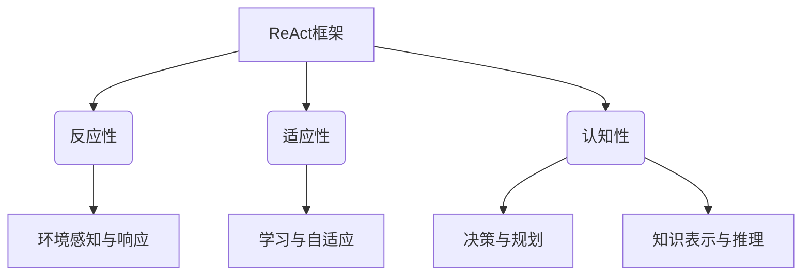
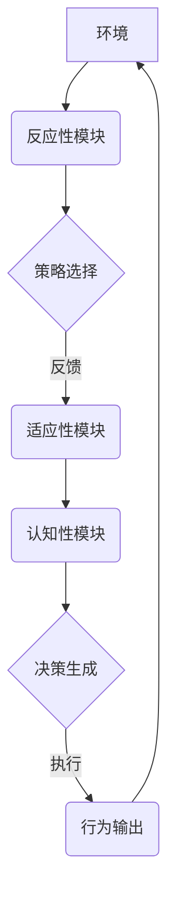

好的，我会按照您的要求，以"Agent理论基础：ReAct"为主题，撰写一篇专业的技术博客文章。文章将遵循约束条件中提出的各项要求，包括字数、格式、完整性、目录结构等。我将努力呈现清晰的逻辑、紧凑的结构、专业的技术语言，并融入深入的思考和见解。同时也会尽最大努力绘制核心概念原理和架构的Mermaid流程图。以下是正文部分：

# Agent 理论基础：ReAct

## 1. 背景介绍

### 1.1 问题的由来

在当今快节奏的数字化世界中，自主智能体系统(Agent System)的重要性与日俱增。无论是工业自动化、机器人技术、游戏AI还是智能助理等领域,都面临着对自主决策和行为的迫切需求。传统的基于规则或机器学习的方法在处理复杂、动态和不确定环境时存在局限性。因此,需要一种新的范式来构建具有自主性、适应性和智能性的Agent系统。

### 1.2 研究现状  

Agent理论作为一种新兴的人工智能范式,近年来受到了广泛关注。研究人员提出了诸如BDI(Belief-Desire-Intention)、GAMA(Guided Autonomous Multi-Agent)、SARL(Spatial Agent-Based Reasoning Language)等不同的Agent架构和框架。然而,这些方法往往专注于特定领域或应用场景,缺乏一个通用的、系统化的理论基础。

### 1.3 研究意义

构建一个统一的Agent理论基础对于推动Agent系统的发展至关重要。它不仅能够提供一个清晰的概念框架,还可以为Agent的设计、实现和评估提供指导和最佳实践。此外,一个坚实的理论基础有助于跨领域的知识共享和技术集成,促进不同领域的协作和创新。

### 1.4 本文结构

本文将系统地介绍一种新的Agent理论框架ReAct(Reactive-Adaptive-Cognitive Agents)。ReAct旨在为构建自主智能Agent系统提供一个全面、一致和可扩展的理论基础。文章首先阐述ReAct的核心概念及其内在联系,然后深入探讨其算法原理、数学模型和具体实现。最后,我们将探讨ReAct在实际应用中的场景,以及未来的发展趋势和挑战。

## 2. 核心概念与联系

ReAct理论框架建立在三个核心概念之上:反应性(Reactivity)、适应性(Adaptivity)和认知性(Cognition)。这三个概念相互关联、相辅相成,共同构成了一个自主智能Agent的基本能力。

### 2.1 反应性(Reactivity)

反应性指的是Agent对环境变化作出实时响应的能力。Agent需要持续感知环境状态,并根据感知信息触发相应的行为。这种低延迟的环境交互对于处理动态和不确定场景至关重要,如机器人导航、实时策略游戏等。

### 2.2 适应性(Adaptivity)  

适应性体现了Agent根据经验学习和自我调整的能力。Agent不仅要对当前环境作出反应,还需要通过持续学习来优化其行为策略,从而更好地适应不断变化的环境。适应性赋予了Agent以长期发展的潜力。

### 2.3 认知性(Cognition)

认知性代表了Agent进行复杂推理和决策的高级智能。Agent需要建立对环境和自身的内部表示(知识库),并基于此进行规划、决策和问题求解。认知性使得Agent能够处理抽象概念,解决复杂任务。

上述三个核心概念相互依赖、互为支撑。反应性为适应性和认知性提供了环境感知的基础;适应性使得Agent能够不断改进其行为策略;而认知性则赋予了Agent更高层次的智能,指导其作出明智的决策。只有将这三者有机结合,才能构建出真正自主、智能和通用的Agent系统。

## 3. 核心算法原理 & 具体操作步骤  

### 3.1 算法原理概述

ReAct框架的核心算法建立在反应性、适应性和认知性三个模块之上,它们分别负责环境交互、策略优化和决策规划。算法的工作原理如下:

1. **反应性模块**持续感知环境状态,并根据当前状态选择一个行为策略。
2. 选择的策略被执行,其结果将作为反馈输入到**适应性模块**。
3. **适应性模块**基于反馈数据,利用强化学习等技术不断优化和调整策略。
4. 优化后的策略集将输入到**认知性模块**,与Agent的内部知识库相结合。
5. **认知性模块**通过规划和推理,生成对应的高层决策序列。
6. 决策序列被转换为具体的行为输出,并作用于环境。

该算法循环执行上述步骤,实现了感知、学习、决策和行为之间的闭环互动。其中,反应性模块确保了实时响应;适应性模块促进了长期适应;而认知性模块则赋予了高级智能。三者的紧密协作,构成了一个完整的自主智能Agent系统。

### 3.2 算法步骤详解

1. **环境状态感知**

    Agent通过各种传感器(视觉、听觉、惯性等)获取当前环境的原始数据,构建一个结构化的状态表示 $s_t$。

2. **策略选择**

    反应性模块维护了一个策略库 $\pi = \{\pi_1, \pi_2, \ldots, \pi_n\}$,其中每个 $\pi_i$ 是一个状态-行为映射函数:

    $$\pi_i: s_t \rightarrow a_t$$

    给定当前状态 $s_t$,模块会根据一定的选择机制(如 $\epsilon$-贪婪策略)从策略库中选取一个策略 $\pi_k$,并执行相应的行为 $a_t = \pi_k(s_t)$。

3. **反馈收集**

    执行的行为 $a_t$ 将导致环境状态的转移,Agent获得新的状态 $s_{t+1}$,以及相应的即时反馈信号 $r_t$(如奖励值)。状态转移对 $(s_t, a_t, r_t, s_{t+1})$ 将被记录并传递给适应性模块。

4. **策略优化**

    适应性模块利用强化学习等技术,基于收集到的转移数据,不断优化和调整策略库中的策略函数。例如,可以使用 Q-Learning 算法来更新 $Q(s_t, a_t)$ 值,进而得到改进的策略 $\pi'$。

5. **知识库更新**

    优化后的策略集 $\pi'$ 将被输入到认知性模块,并与Agent的内部知识库 $\mathcal{K}$ 整合。知识库 $\mathcal{K}$ 包含了Agent对环境、任务和自身的表示和模型。

6. **决策规划**

    认知性模块基于更新后的知识库 $\mathcal{K}$,通过自动规划或者启发式搜索等技术,生成一个高层决策序列 $\mathcal{D} = \{d_1, d_2, \ldots, d_m\}$,指导Agent完成复杂任务。

7. **行为执行**

    决策序列 $\mathcal{D}$ 将被分解和转换为一系列可执行的低层行为指令,并最终作用于环境,导致环境状态的变化。该过程将重新开始下一个循环。

通过上述步骤,ReAct算法实现了反应性、适应性和认知性的协同工作,使Agent能够在动态环境中作出实时响应、持续学习并进行复杂决策。

### 3.3 算法优缺点

**优点:**

- 融合了反应性、适应性和认知性,实现了感知、学习、决策和行为的闭环互动。
- 底层反应性模块确保了实时响应;适应性模块促进了长期适应;认知性模块赋予了高级智能。
- 模块化设计,具有良好的可扩展性和可组合性。
- 将强化学习与自动规划相结合,能够处理连续和离散的复杂问题。

**缺点:**

- 算法复杂度较高,需要大量计算资源。
- 模块之间的协作和数据流需要精心设计和优化。
- 知识库的构建和维护是一个巨大的挑战。
- 在某些特定领域,可能需要进一步的定制和优化。

### 3.4 算法应用领域

ReAct算法可以应用于各种需要自主智能Agent的领域,包括但不限于:

- **机器人技术:** 自主导航、操作和决策等。
- **游戏AI:** 实时策略游戏中的AI代理人。
- **智能助理:** 对话系统、任务规划和执行等。
- **智能制造:** 自动化生产线控制和优化。
- **交通系统:** 智能交通管理和无人驾驶技术。
- **金融领域:** 智能投资决策和风险管理等。
- **军事领域:** 无人机/无人车辆控制和作战决策等。

总的来说,ReAct为构建通用的自主智能系统提供了一个坚实的理论基础和实用的算法框架。

## 4. 数学模型和公式 & 详细讲解 & 举例说明

### 4.1 数学模型构建

为了形式化描述ReAct框架,我们构建了一个基于马尔可夫决策过程(Markov Decision Process, MDP)的数学模型。一个标准的MDP可以用一个六元组来表示:

$$\langle \mathcal{S}, \mathcal{A}, \mathcal{P}, \mathcal{R}, \gamma, \mu \rangle$$

其中:

- $\mathcal{S}$ 是环境的有限状态集合
- $\mathcal{A}$ 是Agent可执行的有限行为集合
- $\mathcal{P}: \mathcal{S} \times \mathcal{A} \times \mathcal{S} \rightarrow [0, 1]$ 是状态转移概率函数
- $\mathcal{R}: \mathcal{S} \times \mathcal{A} \rightarrow \mathbb{R}$ 是即时奖励函数
- $\gamma \in [0, 1)$ 是折现因子,控制未来奖励的重要性
- $\mu: \mathcal{S} \rightarrow [0, 1]$ 是初始状态分布

在ReAct框架中,我们对标准MDP进行了扩展,引入了额外的组件来描述Agent的内部结构和能力。扩展后的ReAct MDP可以表示为:

$$\langle \mathcal{S}, \mathcal{A}, \mathcal{P}, \mathcal{R}, \gamma, \mu, \mathcal{K}, \Pi, \Phi, \Psi \rangle$$

新增的组件包括:

- $\mathcal{K}$ 是Agent的内部知识库
- $\Pi$ 是Agent可用的策略集合
- $\Phi: \mathcal{S} \times \mathcal{A} \times \mathcal{S} \rightarrow \Pi$ 是策略更新函数
- $\Psi: \mathcal{K} \times \Pi \rightarrow \mathcal{D}$ 是决策生成函数,将知识库和策略映射到决策序列

通过这一扩展,我们能够在统一的数学框架下描述ReAct的三个核心模块:

- 反应性模块对应于策略集 $\Pi$ 和选择机制
- 适应性模块对应于策略更新函数 $\Phi$
- 认知性模块对应于知识库 $\mathcal{K}$ 和决策生成函数 $\Psi$

在该模型的指导下,我们可以形式化地定义和分析ReAct算法的性质和行为。

### 4.2 公式推导过程

**目标:** 我们的目标是找到一个最优策略 $\pi^*$,使得在遵