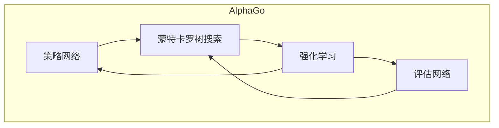

好的，我会严格遵循约束条件，以《AlphaGo原理与代码实例讲解》为题目，撰写一篇专业的技术博客文章。

# AlphaGo原理与代码实例讲解

## 1. 背景介绍

### 1.1 问题的由来

自古以来，围棋一直被视为人类智慧的最高体现之一。这种古老的策略游戏需要深思熟虑和长远计划,对人类的认知能力提出了极高的要求。由于围棋游戏的复杂性,长期以来人工智能在这一领域的发展一直停滞不前,人工智能系统无法有效地处理庞大的可能性空间和长程战略规划。

### 1.2 研究现状 

20世纪90年代,IBM的深蓝战胜了国际象棋世界冠军加里·卡斯帕罗夫,这标志着人工智能在完全信息游戏领域取得了突破。然而,在围棋等信息不完全、规则简单但是复杂度极高的游戏中,人工智能系统的表现仍然远远落后于人类高手。

为了攻克这一难题,谷歌旗下的DeepMind团队在2016年推出了AlphaGo,这是第一个能够战胜人类职业围棋高手的人工智能系统。AlphaGo的诞生标志着人工智能在复杂决策领域取得了里程碑式的进展。

### 1.3 研究意义

AlphaGo的成功不仅在于它战胜了人类高手,更重要的是它展示了一种全新的人工智能方法——结合深度学习和蒙特卡罗树搜索的强化学习,能够在信息高度不完全、复杂度极高的环境中作出优秀的决策。这种方法在很多其他领域也有广泛的应用前景,如机器人控制、资源调度优化、药物设计等。

因此,研究AlphaGo的原理和实现方法,不仅有助于我们理解人工智能在复杂决策领域的最新进展,也为我们在其他领域应用这一范式提供了借鉴。

### 1.4 本文结构

本文将首先介绍AlphaGo的核心概念,包括深度卷积神经网络、蒙特卡罗树搜索和强化学习策略等。接下来,我们将深入探讨AlphaGo的算法原理和数学模型,并结合具体的代码实例进行详细的解释和分析。最后,我们将讨论AlphaGo在实际应用中的场景,以及未来的发展趋势和面临的挑战。

## 2. 核心概念与联系

AlphaGo的核心思想是将深度神经网络与蒙特卡罗树搜索相结合,并通过强化学习不断提高决策质量。其中:

- **深度神经网络**负责从大量的人类对局数据中学习围棋知识,形成一个初始的策略模型。
- **蒙特卡罗树搜索**通过在游戏树上高效地模拟大量对局,评估每一个可能的落子位置,从而指导最终的落子决策。
- **强化学习**通过自我对弈,不断优化策略模型和评估模型,使得AlphaGo能够超越初始的人类水平。

这三个模块相互协作,构成了AlphaGo的核心架构:

其中,策略网络用于根据当前棋局状态,预测下一步的最佳落子位置;评估网络用于评估当前棋局的胜率;蒙特卡罗树搜索根据这两个网络的输出,通过大量模拟对局来选择最优的落子位置;强化学习则通过自我对弈的方式,不断优化策略网络和评估网络的参数和性能。

## 3. 核心算法原理与具体操作步骤

### 3.1 算法原理概述

AlphaGo算法的核心思想是将深度学习与蒙特卡罗树搜索相结合,并通过强化学习来优化策略和评估模型。具体来说,AlphaGo算法由以下三个主要组成部分:

1. **策略网络 (Policy Network)**:一个深度卷积神经网络,根据当前棋局状态,输出一个概率分布,预测下一步的最佳落子位置。
2. **评估网络 (Value Network)**:另一个深度卷积神经网络,评估当前棋局对于下一方而言的胜率。
3. **蒙特卡罗树搜索 (Monte Carlo Tree Search, MCTS)**:一种基于蒙特卡罗采样的树搜索算法,利用策略网络和评估网络的输出,通过大量模拟对局来选择最优的落子位置。

在算法执行过程中,策略网络和评估网络会初始化为从人类对局数据中学习到的模型。然后,AlphaGo会在当前棋局状态下,利用MCTS进行大量模拟对局,根据模拟结果选择一个最优的落子位置。每走一步棋,AlphaGo都会更新策略网络和评估网络,使其更加精确地反映新的棋局状态。

同时,AlphaGo会不断地通过自我对弈的方式产生新的对局数据,并利用这些数据对策略网络和评估网络进行强化学习,从而不断提高它们的性能,使得AlphaGo能够超越最初从人类对局数据中学习到的水平。

### 3.2 算法步骤详解

AlphaGo算法的具体执行步骤如下:

1. **初始化**:从人类对局数据中训练得到初始的策略网络和评估网络模型。

2. **选择落子位置**:
   a. 根据当前棋局状态,策略网络输出一个概率分布,预测下一步可能的落子位置。
   b. 评估网络评估当前棋局对于下一方而言的胜率。
   c. 利用策略网络和评估网络的输出作为先验知识,在蒙特卡罗树上进行大量模拟对局。
   d. 根据模拟对局的结果,选择一个最优的落子位置。

3. **走子并更新**:
   a. 在实际棋盘上落子。
   b. 根据新的棋局状态,更新策略网络和评估网络,使其能够更精确地反映当前局面。

4. **自我对弈与强化学习**:
   a. AlphaGo与自己对弈,产生新的对局数据。
   b. 利用这些新的对局数据,通过强化学习的方式优化策略网络和评估网络的参数。

5. **重复步骤2-4**,直到对局结束。

通过上述步骤,AlphaGo能够在每一步都作出最优的落子决策,并且通过自我对弈和强化学习,不断提高策略网络和评估网络的性能,超越最初从人类对局数据中学习到的水平。

### 3.3 算法优缺点

**优点**:

1. **强大的泛化能力**:通过结合深度学习和蒙特卡罗树搜索,AlphaGo能够在没有明确编码的规则下,从数据中自主学习策略,并在新的局面中进行泛化。

2. **高效的搜索能力**:蒙特卡罗树搜索算法能够在庞大的可能性空间中高效地搜索最优解,从而在复杂的围棋局面中作出精确的决策。

3. **持续学习能力**:通过自我对弈和强化学习,AlphaGo能够不断优化自身的策略和评估模型,超越最初从人类对局数据中学习到的水平。

4. **可解释性**:AlphaGo的决策过程是可解释的,我们可以追踪它的搜索树和模拟过程,了解它作出某个决策的原因。

**缺点**:

1. **需要大量计算资源**:AlphaGo的训练和推理过程需要消耗大量的计算资源,包括GPU加速和分布式计算等。

2. **对训练数据的依赖性**:AlphaGo的初始策略网络和评估网络是从人类对局数据中学习得到的,因此它的初始表现在一定程度上受限于训练数据的质量和数量。

3. **探索与利用的平衡**:在蒙特卡罗树搜索过程中,AlphaGo需要权衡探索新的可能性和利用已知的最优策略之间的平衡,这对算法的性能有一定影响。

4. **可解释性的局限性**:尽管AlphaGo的决策过程是可解释的,但对于它内部的深度神经网络模型,我们很难完全解释它们是如何学习和推理的。

### 3.4 算法应用领域

AlphaGo算法展示了将深度学习与蒙特卡罗树搜索相结合的强大能力,在信息不完全、复杂度极高的决策环境中取得了卓越的表现。因此,这一范式不仅适用于围棋,还可以应用于其他许多领域,包括但不限于:

1. **机器人控制**:在高度动态和不确定的环境中,机器人需要根据实时传感器数据作出精确的运动决策,AlphaGo算法可以为此提供有力支持。

2. **资源调度优化**:在复杂的生产环境中,需要合理调度有限的资源以实现最优化,AlphaGo算法可以用于解决这一问题。

3. **药物设计**:在设计新药物分子时,需要在庞大的化学空间中搜索最优的分子结构,AlphaGo算法可以提供高效的搜索能力。

4. **游戏AI**:除了围棋,AlphaGo算法也可以应用于其他复杂的策略游戏,如国际象棋、星际争霸等,为游戏AI提供强大的决策能力。

5. **自动驾驶**:在自动驾驶场景中,需要根据不断变化的路况作出实时的决策,AlphaGo算法可以为此提供参考。

总的来说,AlphaGo算法为我们展示了一种全新的人工智能范式,在信息高度不完全、复杂度极高的环境中作出优秀的决策,这种范式在许多领域都有广阔的应用前景。

## 4. 数学模型和公式详细讲解举例说明

在AlphaGo算法中,数学模型和公式扮演着至关重要的角色。我们将详细介绍其中的关键模型和公式,并通过具体的例子加以说明。

### 4.1 数学模型构建

#### 4.1.1 策略网络 (Policy Network)

策略网络的目标是根据当前棋局状态 $s$,预测下一步落子位置的概率分布 $\pi(a|s)$,其中 $a$ 表示可能的落子位置。

策略网络采用深度卷积神经网络的结构,其输入是当前棋局状态的编码表示,输出是一个概率向量,每个元素对应一个可能的落子位置的概率。具体来说,策略网络可以表示为:

$$\pi(a|s) = f_{\theta}(s)$$

其中 $f_{\theta}$ 是一个参数化的深度神经网络,$\theta$ 表示网络的参数。

在训练过程中,我们希望策略网络的输出概率分布 $\pi(a|s)$ 尽可能接近人类专家的落子分布 $\pi^*(a|s)$。因此,策略网络的训练目标是最小化交叉熵损失:

$$L(\theta) = -\sum_{s,a}\pi^*(a|s)\log\pi_{\theta}(a|s)$$

通过在人类对局数据上优化该损失函数,我们可以得到初始的策略网络模型。

#### 4.1.2 评估网络 (Value Network)

评估网络的目标是评估当前棋局状态 $s$ 对于下一方而言的胜率 $v(s)$。

与策略网络类似,评估网络也采用深度卷积神经网络的结构,其输入是当前棋局状态的编码表示,输出是一个标量值,表示预测的胜率。具体来说,评估网络可以表示为:

$$v(s) = f_{\phi}(s)$$

其中 $f_{\phi}$ 是一个参数化的深度神经网络,$\phi$ 表示网络的参数。

在训练过程中