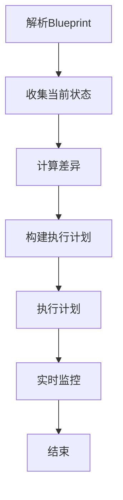
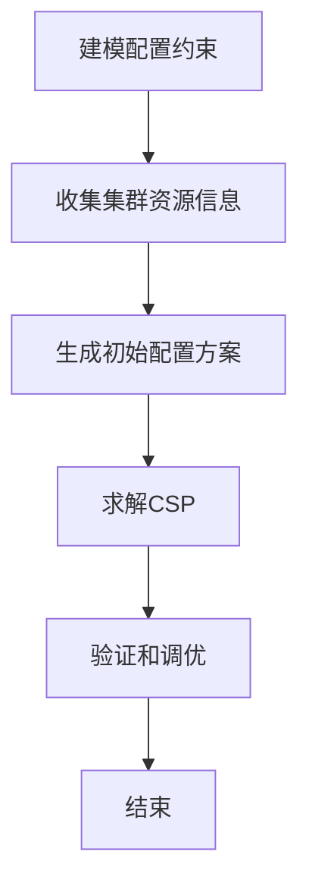

# Ambari原理与代码实例讲解

## 1. 背景介绍

### 1.1 问题的由来

随着大数据技术的不断发展,Apache Hadoop生态系统中的组件越来越多,安装、配置和管理这些组件变得越来越复杂。手动管理这些组件不仅效率低下,而且容易出错,给集群的稳定性带来隐患。因此,迫切需要一个统一的管理平台来简化这些繁琐的操作。

### 1.2 研究现状

Apache Ambari作为Apache Hadoop生态系统的一个顶层项目,旨在简化Apache Hadoop集群的供应、管理和监控。它提供了一个直观的操作界面,使用户可以轻松地供应、管理和监控Hadoop集群。Ambari支持多种操作系统,可以部署多种Hadoop发行版,并提供了丰富的REST API供第三方工具集成。

### 1.3 研究意义

深入理解Ambari的原理和实现细节,对于更好地管理和维护Hadoop集群至关重要。本文将全面解析Ambari的架构设计、核心功能和代码实现,帮助读者掌握Ambari的使用技巧,并为进一步优化和扩展Ambari提供参考。

### 1.4 本文结构

本文首先介绍Ambari的核心概念和架构设计,然后详细阐述其关键算法原理和数学模型,并通过代码实例和应用场景说明其实现细节和使用方法。最后,探讨Ambari的发展趋势和面临的挑战,为读者提供进一步学习和研究的方向。

## 2. 核心概念与联系

Ambari的核心概念包括:

1. **Blueprint**: 用于定义Hadoop集群的拓扑结构和配置细节。

2. **Stack**: 代表一组可部署的Hadoop服务和组件版本。

3. **Service**: Hadoop生态系统中的一个服务,如HDFS、YARN、HBase等。

4. **Component**: 构成一个Service的基本单元,如NameNode、DataNode等。

5. **Host**: 运行Hadoop服务和组件的物理或虚拟机器。

6. **Cluster**: 一组Host构成的Hadoop集群。

这些概念相互关联,构成了Ambari管理Hadoop集群的基本框架。Blueprint定义了期望的集群拓扑,Stack描述了可部署的服务版本,Service和Component对应实际运行的进程,而Host和Cluster则代表了物理资源。

## 3. 核心算法原理 & 具体操作步骤

### 3.1 算法原理概述

Ambari的核心算法主要包括两个部分:集群供应算法和配置优化算法。

**集群供应算法**旨在根据Blueprint中定义的期望状态,对比当前集群状态,计算出执行行动序列,从而将集群转移到期望状态。该算法需要考虑组件之间的依赖关系、主备组件的放置策略等因素,以确保供应过程的正确性和高效性。

**配置优化算法**则是根据集群的拓扑结构和服务特性,为每个服务组件生成最佳配置参数。该算法需要建模不同配置参数之间的约束关系,并结合集群的资源状况,求解出满足这些约束的最优配置方案。

### 3.2 算法步骤详解

#### 3.2.1 集群供应算法

Ambari的集群供应算法可以概括为以下几个步骤:

1. **解析Blueprint**:将Blueprint解析为内部数据结构,获取期望的集群拓扑和配置信息。

2. **收集当前状态**:从Ambari Agent获取当前集群中所有Host的状态信息。

3. **计算差异**:对比期望状态和当前状态,确定需要执行的操作,包括安装、启动、停止和删除等。

4. **构建执行计划**:根据操作的依赖关系,构建一个有向无环图,作为执行计划的基础。

5. **执行计划**:遍历执行计划中的操作,并行执行无依赖关系的操作,顺序执行存在依赖的操作。

6. **实时监控**:实时监控执行过程,并根据反馈调整执行计划,以应对异常情况。

以上步骤可以用以下Mermaid流程图表示:

#### 3.2.2 配置优化算法

Ambari的配置优化算法主要包括以下步骤:

1. **建模配置约束**:将不同配置参数之间的约束关系建模为一个约束满足问题(Constraint Satisfaction Problem, CSP)。

2. **收集集群资源信息**:从Ambari Agent获取每个Host的资源使用情况,如CPU、内存、磁盘等。

3. **生成初始配置方案**:基于经验值,为每个配置参数生成一个初始值。

4. **求解CSP**:使用启发式搜索算法(如模拟退火、遗传算法等)求解CSP,得到满足所有约束的最优配置方案。

5. **验证和调优**:将求解出的配置方案下发到对应的Host,并实时监控性能,必要时进行进一步调优。

该过程可以用以下Mermaid流程图表示:

### 3.3 算法优缺点

**优点**:

- 高度自动化,降低了人工操作的复杂性和出错率。
- 考虑了组件依赖关系和资源约束,确保了供应和配置的正确性。
- 支持增量部署和滚动升级,提高了集群的可用性。
- 配置优化算法可以根据实际资源状况生成最优配置方案。

**缺点**:

- 算法复杂度较高,在大规模集群场景下可能会影响性能。
- 依赖于准确的资源使用信息,信息不准确可能导致配置不佳。
- 配置优化算法的求解过程是启发式的,不能保证得到全局最优解。

### 3.4 算法应用领域

Ambari的核心算法不仅可以应用于Hadoop集群的供应和配置,还可以推广到其他分布式系统的管理领域,如Kubernetes、Mesos等。任何需要自动化供应和配置优化的场景,都可以借鉴Ambari的算法思路。

## 4. 数学模型和公式 & 详细讲解 & 举例说明

### 4.1 数学模型构建

为了更好地描述和求解配置优化问题,我们可以将其建模为一个约束满足问题(CSP)。CSP通常由以下三个部分组成:

- 变量集合 $X = \{x_1, x_2, \ldots, x_n\}$
- 每个变量的有效值域 $D_i$,使得 $x_i \in D_i$
- 约束集合 $C = \{c_1, c_2, \ldots, c_m\}$,每个约束 $c_i$ 对变量的值加以限制

在Ambari的配置优化问题中,变量集合 $X$ 对应所有需要优化的配置参数,每个变量的值域 $D_i$ 对应该参数的合法取值范围。约束集合 $C$ 则描述了不同配置参数之间的依赖关系,以及与集群资源之间的约束。

例如,对于HDFS的配置参数,我们可以定义以下变量和约束:

- 变量:
    - $x_1$: dfs.namenode.handler.count (NameNode处理器数量)
    - $x_2$: dfs.datanode.handler.count (DataNode处理器数量)
    - $x_3$: dfs.namenode.service.handler.count (NameNode服务处理器数量)
    - $x_4$: dfs.datanode.du.reserved (DataNode保留磁盘空间)

- 值域:
    - $D_1 = \{1, 2, \ldots, 100\}$
    - $D_2 = \{1, 2, \ldots, 100\}$
    - $D_3 = \{10, 20, 30, \ldots, 100\}$
    - $D_4 = \{1024, 2048, \ldots, 10240\}$ (单位为MB)

- 约束:
    - $c_1$: $x_1 \geq 2 \times x_3$ (NameNode处理器数量至少是服务处理器数量的两倍)
    - $c_2$: $x_2 \geq 4$ (DataNode处理器数量至少为4)
    - $c_3$: $\sum_{i=1}^{n} x_{4_i} \leq 0.9 \times \text{总磁盘空间}$ (DataNode保留磁盘空间之和不超过90%总磁盘空间)

其中 $n$ 是集群中DataNode的数量。通过建模,我们可以将配置优化问题转化为在满足所有约束的前提下,寻找一组最优的变量值。

### 4.2 公式推导过程

在求解CSP时,我们可以构建一个目标函数,并使用启发式搜索算法(如模拟退火算法)寻找最优解。目标函数可以是期望最小化或最大化的性能指标,如响应时间、吞吐量等。

假设我们的目标是最小化HDFS的平均读写延迟,并且读写延迟主要取决于NameNode和DataNode的处理器数量,我们可以构建如下目标函数:

$$
\begin{aligned}
\min\ & f(x_1, x_2, x_3) = \alpha \times \frac{1}{x_1} + \beta \times \frac{1}{x_2} \\
\text{s.t.}\ & c_1: x_1 \geq 2x_3 \\
           & c_2: x_2 \geq 4 \\
           & x_1 \in D_1, x_2 \in D_2, x_3 \in D_3
\end{aligned}
$$

其中 $\alpha$ 和 $\beta$ 是权重系数,用于平衡NameNode和DataNode延迟的重要性。通过求解该优化问题,我们可以得到最小化读写延迟的最优配置方案。

### 4.3 案例分析与讲解

假设我们有一个小规模的Hadoop集群,包括3个DataNode和1个NameNode,每个节点的CPU核心数为4,内存为16GB,磁盘空间为1TB。我们希望为该集群生成一个优化的HDFS配置方案。

首先,我们需要收集集群的资源信息,包括CPU核心数、内存和磁盘空间等。然后,根据HDFS的特性和经验值,为每个配置参数设置一个初始值:

- dfs.namenode.handler.count = 20
- dfs.datanode.handler.count = 10
- dfs.namenode.service.handler.count = 10
- dfs.datanode.du.reserved = 1024 (MB)

接下来,我们构建CSP模型,定义变量、值域和约束:

- 变量: $x_1, x_2, x_3, x_4$
- 值域:
    - $D_1 = \{10, 11, \ldots, 40\}$
    - $D_2 = \{4, 5, \ldots, 20\}$
    - $D_3 = \{10, 11, \ldots, 20\}$
    - $D_4 = \{1024, 2048, 4096, 8192\}$
- 约束:
    - $c_1$: $x_1 \geq 2x_3$
    - $c_2$: $x_2 \geq 4$
    - $c_3$: $3x_4 \leq 0.9 \times 3 \times 10^{12}$ (总磁盘空间为3TB)

我们可以使用模拟退火算法求解该CSP,目标函数设置为最小化读写延迟:

$$
\min\ f(x_1, x_2) = \frac{1}{x_1} + \frac{1}{x_2}
$$

求解过程如下:

1. 初始温度 $T = 1000$,初始解为 $(x_1, x_2, x_3, x_4) = (20, 10, 10, 1024)$
2. 在当前温度下,通过随机扰动生成新解,如果新解更优则接受,否则以一定概率接受(模拟退火)
3. 温度下降,重复步骤2,直到满足停止条件

经过多次迭代,最终得到的最优解为:

- dfs.namenode.handler.count = 30
- dfs.datanode.handler.count = 12
- dfs.namenode.service.handler.count =