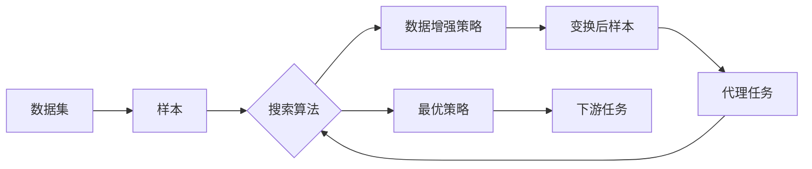

# AutoAugment原理与代码实例讲解

## 1. 背景介绍

### 1.1 问题的由来

在深度学习领域，数据增强(Data Augmentation)是一种非常有效的技术，可以显著提高模型的泛化能力和鲁棒性。传统的数据增强方法通常依赖于人工设计和试错，需要大量的时间和经验来寻找最优的增强策略。而AutoAugment则是一种自动化的数据增强方法，可以自动搜索出最优的数据增强策略，极大地提高了数据增强的效率和性能。

### 1.2 研究现状

自从2018年谷歌提出AutoAugment以来，自动数据增强领域迅速发展，涌现出许多优秀的算法，如RandAugment、Fast AutoAugment、Adversarial AutoAugment等。这些算法在图像分类、目标检测等任务上取得了显著的性能提升。目前，自动数据增强已成为计算机视觉领域的研究热点之一。

### 1.3 研究意义

AutoAugment的研究意义主要体现在以下几个方面：

1. 提高模型性能：通过自动搜索最优的数据增强策略，可以显著提高模型的准确率和泛化能力。
2. 节省人力成本：传统的数据增强需要人工设计和调试，而AutoAugment可以自动完成这一过程，极大地节省了人力成本。
3. 加速算法迭代：AutoAugment可以快速验证不同的数据增强组合，加速算法迭代和优化的过程。
4. 拓展应用场景：AutoAugment不仅适用于图像分类任务，还可以拓展到目标检测、语义分割等其他视觉任务中。

### 1.4 本文结构

本文将全面介绍AutoAugment的原理和代码实现，内容安排如下：

- 第2节介绍AutoAugment的核心概念与内在联系
- 第3节详细讲解AutoAugment的算法原理和具体操作步骤
- 第4节给出AutoAugment的数学模型和公式推导
- 第5节通过代码实例和详细注释，讲解如何使用PyTorch实现AutoAugment
- 第6节讨论AutoAugment在图像分类、目标检测等领域的应用场景
- 第7节推荐AutoAugment相关的学习资源、开发工具和重要论文
- 第8节总结AutoAugment的研究现状、未来趋势和面临的挑战
- 第9节给出AutoAugment常见问题的解答

## 2. 核心概念与联系

AutoAugment的核心思想是将数据增强看作一个离散的搜索空间，使用搜索算法来寻找最优的数据增强策略。其涉及的核心概念包括：

- 数据增强子策略(Sub-policy)：由两个操作(Operation)和对应的概率、幅度(Magnitude)组成。
- 数据增强策略(Policy)：由多个子策略组成，对每个样本依次随机应用子策略中的一个。
- 搜索空间：由所有可能的子策略参数组合构成的离散空间。
- 搜索算法：在搜索空间中寻找最优策略的优化算法，如强化学习、进化算法等。
- 代理任务：在小数据集上快速评估一个策略的性能，用于指导搜索方向。

下图展示了AutoAugment的核心流程：

AutoAugment先在原始数据集上使用搜索算法寻找最优的数据增强策略，得到的最优策略再应用于下游任务的训练数据，提高模型的泛化性能。搜索过程中，每个策略都需要在代理任务上快速评估性能，根据反馈调整搜索方向。

## 3. 核心算法原理 & 具体操作步骤

### 3.1 算法原理概述

AutoAugment的核心是将数据增强策略的搜索建模为一个离散优化问题。给定数据集 $D$，目标是找到一个最优的数据增强策略 $\tau^*$，使得模型在增强后的数据集 $\hat{D}$ 上的验证损失最小：

$$
\tau^* = \arg\min_{\tau} \mathcal{L}(D; \theta^*(\tau)),\quad 
\theta^*(\tau)=\arg\min_{\theta} \mathbb{E}_{(x,y)\sim \hat{D}(\tau)} \ell(x, y; \theta)
$$

其中 $\theta$ 表示模型参数，$\ell$ 表示损失函数。由于 $\tau$ 是一个离散的策略空间，无法直接对其求梯度，因此AutoAugment采用了强化学习和进化算法来进行优化搜索。

### 3.2 算法步骤详解

AutoAugment的具体算法步骤如下：

1. 定义搜索空间：选择一组基础图像增强操作(如平移、旋转、裁剪等)，每个操作有一定的参数范围(如平移像素数、旋转角度等)。将这些操作与参数的组合构成搜索空间。

2. 随机初始化一个种群(Population)：每个个体(Individual)表示一个完整的数据增强策略，由若干个子策略组成，每个子策略包含两个操作和对应的参数。

3. 计算每个个体的适应度(Fitness)：在代理任务上评估每个策略的性能，适应度为验证集上的准确率。

4. 进行进化迭代：
   - 选择(Selection)：从当前种群中选出若干个适应度最高的个体作为父代。
   - 交叉(Crossover)：随机选择两个父代个体，交换它们的部分子策略，生成新的子代个体。
   - 变异(Mutation)：对子代个体的每个子策略，以一定概率随机修改操作或参数。

5. 更新种群：将子代个体加入种群，淘汰部分适应度低的个体，保持种群大小不变。

6. 重复步骤3-5，直到达到预设的迭代次数或满足收敛条件。

7. 输出最优策略：从最终种群中选出适应度最高的个体作为最优数据增强策略。

### 3.3 算法优缺点

AutoAugment的主要优点包括：
- 自动化：无需人工设计和调试数据增强策略，大大节省了时间和精力。
- 高效：通过在代理任务上快速评估策略性能，可以高效地搜索出最优策略。
- 可迁移：在一个数据集上搜索得到的最优策略，可以直接迁移到其他相似数据集上，具有较好的泛化性。

但AutoAugment也存在一些局限性：
- 搜索成本高：完整的搜索过程需要训练大量的子模型，对计算资源要求较高。
- 泛化性有限：在一些特定领域数据上搜索得到的策略，可能无法很好地迁移到其他领域。
- 可解释性差：搜索得到的策略通常较为复杂，难以直观地解释其内在机制。

### 3.4 算法应用领域

AutoAugment最初是在图像分类任务上提出的，但其思想可以拓展到多个视觉领域：

- 图像分类：如CIFAR-10、ImageNet等常见数据集。
- 目标检测：如Pascal VOC、COCO等数据集，可用于增强检测模型的鲁棒性。
- 语义分割：如Cityscapes、VOC等数据集，可提高分割模型的泛化能力。
- 人脸识别：如LFW、MegaFace等数据集，可增强人脸识别模型的鲁棒性。

此外，AutoAugment的思想也可以拓展到其他机器学习任务，如文本分类、语音识别等，用于自动优化数据增强策略。

## 4. 数学模型和公式 & 详细讲解 & 举例说明

### 4.1 数学模型构建

AutoAugment可以看作一个两层优化问题：外层优化搜索数据增强策略，内层优化评估策略性能。

外层优化的目标是最小化期望验证损失：

$$
\min_{\tau} \mathbb{E}_{D_{val}} [\mathcal{L} (\theta^*(\tau); D_{val})]
$$

其中 $\tau$ 表示数据增强策略，$D_{val}$ 表示验证集，$\theta^*(\tau)$ 表示在增强后的训练集上得到的最优模型参数。

内层优化的目标是最小化增强后训练集的经验风险：

$$
\theta^*(\tau) = \arg\min_{\theta} \mathbb{E}_{(x,y)\sim \hat{D}_{train}(\tau)} [\ell(x, y; \theta)]
$$

其中 $\hat{D}_{train}(\tau)$ 表示经过策略 $\tau$ 增强后的训练集，$\ell$ 表示样本损失函数。

### 4.2 公式推导过程

为了求解外层优化问题，AutoAugment将其建模为一个离散搜索问题。搜索空间 $\mathcal{S}$ 由所有可能的增强子策略参数组合构成，每个子策略 $s \in \mathcal{S}$ 包含两个操作 $\{o_1, o_2\}$ 和对应的概率 $p$、幅度 $\lambda$：

$$
s = (o_1, p_1, \lambda_1, o_2, p_2, \lambda_2)
$$

一个完整的数据增强策略 $\tau$ 由 $K$ 个子策略组成：

$$
\tau = (s_1, s_2, \dots, s_K)
$$

AutoAugment使用进化算法来搜索最优策略 $\tau^*$。定义种群 $\mathcal{P}=\{\tau_1, \tau_2, \dots, \tau_N\}$，每个个体 $\tau_i$ 表示一个完整的策略。种群经过 $T$ 轮进化迭代，每轮执行选择、交叉、变异等操作，更新种群。

个体 $\tau_i$ 的适应度 $f(\tau_i)$ 为在验证集上的分类准确率：

$$
f(\tau_i) = \mathrm{Acc}(\theta^*(\tau_i); D_{val})
$$

进化算法的目标是最大化种群的平均适应度：

$$
\max_{\mathcal{P}} \frac{1}{N} \sum_{i=1}^N f(\tau_i)
$$

### 4.3 案例分析与讲解

下面以CIFAR-10数据集为例，说明AutoAugment的搜索过程。

假设搜索空间包含5种图像增强操作：平移、旋转、剪切、对比度、颜色变换。每个操作有3种可能的幅度。一个子策略包含2个操作，每个操作有2种可能的概率。因此完整的搜索空间大小为：

$$
|\mathcal{S}| = (5 \times 3 \times 2)^2 = 900
$$

假设每个完整策略由3个子策略组成，种群大小为20，进化轮数为50。每轮进化后，选择前5个适应度最高的个体作为父代，执行交叉和变异，生成新的子代。

在CIFAR-10的5000张验证集图像上评估每个策略的性能，得到适应度。例如，一个策略 $\tau$ 包含3个子策略：

$$
\begin{aligned}
s_1 &= (\mathrm{Rotate}, 0.5, 10^\circ, \mathrm{Color}, 0.8, 0.5) \\
s_2 &= (\mathrm{Translate}, 0.3, 5\mathrm{px}, \mathrm{Cutout}, 0.9, 0.2) \\ 
s_3 &= (\mathrm{Shear}, 0.2, 0.1, \mathrm{Contrast}, 0.6, 1.5)
\end{aligned}
$$

在验证集上评估 $\tau$ 的性能，得到准确率为0.925，则其适应度为：

$$
f(\tau) = 0.925
$$

经过50轮进化后，种群收敛到一个平均适应度较高的状态，此时适应度最高的个体即为最优策略 $\tau^*$。将 $\tau^*$ 应用于CIFAR-10的训练集，可以显著提高模型的泛化性能。

### 4.4 常见问题解答

**Q1: AutoAugment的搜索空间大小如何确定？**

A1: 搜索空间的大小取决于子策略的组成和参数范围。一般