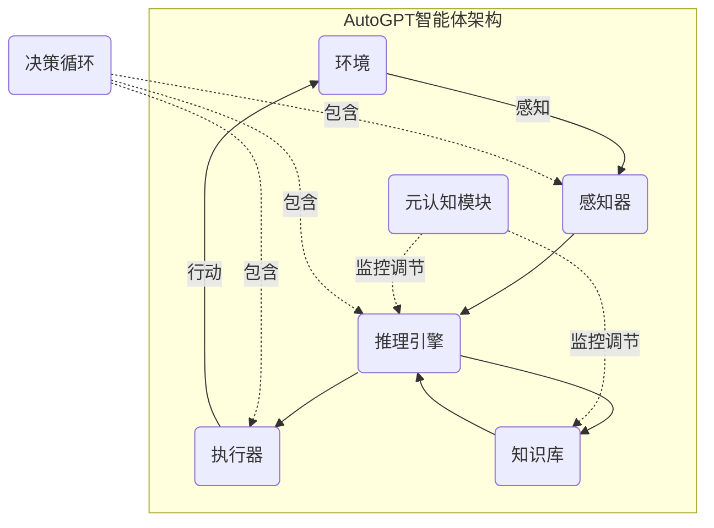

# Auto-GPT 价值：一种基于 Agent 的 AGI 尝试

## 1. 背景介绍

### 1.1 问题的由来

人工智能的发展一直是人类追求的终极目标之一。从最早的专家系统到现代的深度学习模型,人工智能技术不断突破,展现出越来越强大的能力。然而,现有的人工智能系统大多专注于解决特定任务,缺乏通用智能和自主学习能力,无法像人类那样灵活地应对复杂环境和多样化任务。

为了实现通用人工智能(Artificial General Intelligence, AGI),需要构建一种具有自主学习、推理和决策能力的智能系统,能够像人类一样不断获取新知识、形成新概念,并将已有知识灵活应用于新情景中。这是一个极具挑战性的目标,需要在计算架构、算法模型、知识表示等多个层面进行创新和突破。

### 1.2 研究现状

目前,AGI研究主要集中在以下几个方向:

1. **符号主义方法**: 基于逻辑规则和知识表示,构建类似于人类思维的推理系统。代表工作包括Cyc项目、开放思维引擎(OpenCog)等。

2. **连接主义方法**: 借鉴人脑神经网络的工作原理,构建深度神经网络模型,实现模式识别、知识表示和推理等功能。代表工作包括深度学习、强化学习等。

3. **综合方法**: 结合符号主义和连接主义的优势,构建混合智能系统。代表工作包括认知架构ACT-R、Numenta的分层时序记忆(HTM)等。

4. **基于Agent的方法**: 将智能系统建模为一个或多个交互的智能体(Agent),通过感知、决策和行动来实现智能行为。代表工作包括AutoGPT、DeepMind的AlphaGo等。

尽管取得了一些进展,但现有的AGI系统在通用性、可解释性、可扩展性等方面仍存在诸多不足,距离真正实现人类级别的通用智能还有很长的路要走。

### 1.3 研究意义

AGI的实现将为人类社会带来深远的影响,可能引发生产力的飞跃、科技创新的加速、社会结构的重塑等。同时,AGI也可能带来一些潜在风险,如技术垄断、就业替代、伦理道德挑战等。因此,AGI研究不仅具有重大的科学价值,也蕴含着广泛的社会影响。

从科学层面来看,AGI研究将推动人工智能、认知科学、神经科学、哲学等多个学科的交叉融合,促进智能理论和计算模型的创新,拓展人类对智能本质的认知边界。从应用层面来看,AGI系统有望在复杂决策、智能规划、自动化系统等领域发挥重要作用,推动科技创新和社会进步。

### 1.4 本文结构

本文将介绍一种基于智能体(Agent)的AGI尝试 —— AutoGPT。首先阐述AutoGPT的核心概念和原理,包括智能体架构、决策循环、知识表示等;然后详细解释其核心算法,包括规划算法、强化学习等;接着介绍相关的数学模型和公式推导;再通过代码实例展示AutoGPT的具体实现;分析其在不同场景下的应用前景;最后总结AutoGPT的优缺点,并展望AGI研究的未来发展趋势和挑战。

## 2. 核心概念与联系

AutoGPT是一种基于智能体(Agent)的AGI架构,旨在构建具有自主学习、推理和决策能力的通用人工智能系统。它的核心思想是将智能系统建模为一个或多个交互的智能体,每个智能体都具有感知(Perception)、决策(Decision Making)和行动(Action)的能力,通过不断地与环境交互来获取新知识、形成新概念,并将已有知识灵活应用于新情景中。

AutoGPT的智能体架构借鉴了强化学习和决策理论中的智能体概念,但在此基础上进行了拓展和创新,以适应AGI的需求。其核心要素包括:

1. **环境(Environment)**: 智能体所处的外部世界,包括物理环境和信息环境。智能体通过感知器获取环境状态,通过执行器对环境产生影响。

2. **感知器(Sensors)**: 用于获取环境状态信息的模块,如视觉传感器、语音传感器、文本输入等。

3. **执行器(Actuators)**: 用于对环境产生影响的模块,如机器人手臂、语音输出、文本生成等。

4. **知识库(Knowledge Base)**: 存储智能体已获取知识的模块,包括事实知识、规则知识、程序知识等多种形式。

5. **推理引擎(Reasoning Engine)**: 基于知识库进行推理和决策的模块,包括规划算法、强化学习算法等。

6. **元认知模块(Metacognitive Module)**: 监控和调节智能体的学习和决策过程,实现自我提升和优化。

7. **决策循环(Decision Cycle)**: 智能体的核心工作流程,包括感知、推理、决策、行动和反馈五个阶段,形成一个闭环系统。

这些要素相互关联、相互作用,共同构成了AutoGPT的智能体架构。智能体通过不断地与环境交互,获取新知识,更新知识库;推理引擎基于知识库进行推理和决策,产生行动指令;执行器执行相应的行动,对环境产生影响;环境的变化又被感知器捕获,形成新的输入,重新进入决策循环。在这个过程中,元认知模块监控和调节整个系统,实现自我优化和提升。

AutoGPT的核心创新点在于将多种人工智能技术有机融合,构建一种通用的智能体架构,并在此基础上引入元认知和自我优化机制,赋予系统自主学习和持续进化的能力。这种基于智能体的AGI架构,为实现人类级别的通用智能提供了一种全新的尝试和可能性。

## 3. 核心算法原理 & 具体操作步骤

### 3.1 算法原理概述

AutoGPT的核心算法主要包括规划算法和强化学习算法,用于驱动智能体的决策和行动。

**规划算法**负责根据当前状态和目标,生成一系列行动序列,以达成目标。常用的规划算法包括启发式搜索算法(如A*算法)、时序规划算法(如时序规划网络TPN)等。AutoGPT中采用了一种新型的多层次规划算法,能够处理复杂、动态、不确定的环境。

**强化学习算法**则通过与环境的交互,不断优化智能体的决策策略,以获得最大的长期回报。常用的强化学习算法包括Q-Learning、策略梯度算法等。AutoGPT中采用了一种基于深度神经网络的强化学习框架,能够从原始感知数据中直接学习策略,无需人工设计状态和奖励函数。

这两类算法在AutoGPT中相互配合、互为补充。规划算法为智能体提供短期的行动序列,强化学习算法则优化长期的决策策略。通过两者的协同作用,AutoGPT能够在动态复杂环境中做出合理的决策和行动。

### 3.2 算法步骤详解

以下是AutoGPT核心算法的具体步骤:

1. **环境状态获取**:智能体通过感知器获取当前环境状态$s_t$。

2. **目标确定**:根据任务需求或内部驱动,确定当前需要达成的目标$g$。

3. **规划求解**:基于当前状态$s_t$和目标$g$,运行规划算法,生成一系列行动序列$\pi = [a_1, a_2, \dots, a_n]$。

   规划算法包括以下步骤:
   
   a. 状态空间建模:将环境状态和目标表示为一组状态变量$X = \{x_1, x_2, \dots, x_m\}$。
   
   b. 行动空间建模:将可执行的行动表示为一组行动操作符$O = \{o_1, o_2, \dots, o_k\}$,每个操作符$o_i$定义了其前提条件和效果。
   
   c. 启发式函数设计:设计一个评估函数$h(s)$,估计从状态$s$到目标状态的距离。
   
   d. 搜索求解:采用A*等启发式搜索算法,在状态空间中查找到达目标的最优行动序列$\pi$。

4. **策略优化**:将当前状态$s_t$、目标$g$和规划序列$\pi$作为输入,通过强化学习算法优化长期决策策略$\pi_\theta$,其中$\theta$为策略参数。

   强化学习算法包括以下步骤:

   a. 策略网络建模:使用深度神经网络$\pi_\theta(s, g)$对策略进行参数化建模。
   
   b. 环境模拟交互:让智能体与模拟环境交互,执行策略$\pi_\theta$并获得轨迹$(s_t, a_t, r_t)$序列。
   
   c. 策略梯度优化:根据轨迹数据,通过策略梯度方法优化策略网络参数$\theta$,提高长期累积奖励。

5. **行动执行**:执行规划序列$\pi$中的第一个行动$a_1$,通过执行器对环境产生影响,转移到新状态$s_{t+1}$。

6. **反馈获取**:观测环境的变化,获取行动执行后的反馈(如奖励值),用于强化学习。

7. **知识库更新**:将新获取的经验(状态转移、行动效果等)存储到知识库中,为下一轮决策提供知识基础。

8. **返回第1步**,重复上述过程,形成一个闭环的决策循环。

在这个过程中,元认知模块会持续监控和评估智能体的学习效果,对知识库和推理引擎进行优化调整,实现自我提升。

### 3.3 算法优缺点

AutoGPT算法的主要优点包括:

1. **通用性强**:能够处理各种复杂、动态、不确定的环境和任务,不受领域限制。

2. **自主学习能力**:通过与环境交互,能够不断获取新知识,形成新概念,持续提升自身能力。

3. **可解释性好**:基于符号规划和强化学习相结合,决策过程具有较好的可解释性和可理解性。

4. **高效性能**:多算法协同作用,能够在保证决策质量的同时提高计算效率。

5. **可扩展性强**:模块化设计,各组件可以单独优化和替换,具有良好的可扩展性。

其主要缺点和挑战包括:

1. **训练数据需求大**:强化学习算法需要大量的环境交互数据进行训练,数据获取成本高。

2. **收敛性能不稳定**:强化学习算法的收敛性能受多种因素影响,可能出现振荡、发散等问题。

3. **探索与利用权衡**:在探索(获取新知识)和利用(应用已有知识)之间需要权衡,影响学习效率。

4. **奖励函数设计困难**:在复杂环境中设计合理的奖励函数是一个挑战。

5. **伦理与安全风险**:自主学习系统可能产生意外行为,存在潜在的伦理和安全隐患。

### 3.4 算法应用领域

AutoGPT算法由于其通用性和自主学习能力,在多个领域具有广阔的应用前景:

1. **智能决策系统**