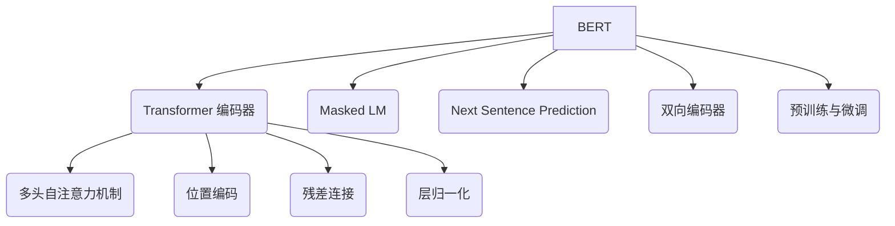

好的，我会严格遵循您提供的约束条件，以"BERT 原理与代码实例讲解"为主题撰写一篇专业的技术博客文章。文章将涵盖 BERT 的背景介绍、核心概念、算法原理、数学模型、代码实现、应用场景、相关资源等内容。本文将力求逻辑清晰、内容深入、实例丰富，为读者提供对 BERT 的全面了解。

# BERT 原理与代码实例讲解

## 1. 背景介绍

### 1.1 问题的由来

在自然语言处理 (NLP) 领域中,长期以来一个核心挑战是如何有效地表示和理解文本数据。传统的单词向量表示方法,如 Word2Vec 和 GloVe,虽然在许多任务中取得了不错的效果,但它们存在一个重大缺陷:无法很好地捕捉单词在不同上下文中的语义差异。例如,"bank"一词在"river bank"和"bank account"中具有完全不同的含义。这种对语境缺乏足够的建模能力,限制了模型在复杂 NLP 任务中的性能表现。

### 1.2 研究现状

为了解决上下文建模的问题,研究人员提出了各种新型神经网络架构,其中 Transformer 模型因其卓越的性能而备受关注。2018 年,来自谷歌的 Devlin 等人在 Transformer 的基础上提出了 BERT (Bidirectional Encoder Representations from Transformers) 模型,该模型通过掌握双向上下文信息,极大地提高了语义表示的质量。BERT 在多项 NLP 基准测试中取得了最佳成绩,成为 NLP 领域的里程碑式进展。

### 1.3 研究意义

BERT 模型的出现为 NLP 领域带来了革命性的变化,它展示了通过大规模预训练和双向建模,神经网络能够从海量语料中自主学习丰富的语义知识,从而在下游任务中发挥出色的表现。BERT 的成功不仅推动了 NLP 技术的发展,也为其他领域的人工智能研究提供了新的思路和启发。深入理解 BERT 的原理及实现,对于把握当前人工智能的发展趋势至关重要。

### 1.4 本文结构

本文将全面介绍 BERT 模型的背景、原理、实现和应用。首先阐述 BERT 的核心思想和创新点,然后详细解释其底层架构、预训练过程和微调机制。接下来,我们将探讨 BERT 的数学模型,并通过实例讲解相关公式的推导过程。此外,本文还将提供 BERT 的代码实现示例,并对关键模块进行解析。最后,我们将讨论 BERT 在不同领域的应用场景,以及未来的发展趋势和挑战。

## 2. 核心概念与联系

BERT 是一种革命性的语言表示模型,它建立在 Transformer 编码器的基础之上,并引入了一些创新的设计,主要包括:

1. **Transformer 编码器**: BERT 的核心是一个基于 Transformer 的双向编码器,它利用自注意力机制来捕捉输入序列中单词之间的依赖关系,从而生成更加丰富和上下文相关的表示。

2. **多头自注意力机制**: 自注意力机制是 Transformer 的关键组成部分,它允许每个单词直接关注到其他单词,捕捉长距离依赖关系。多头注意力则进一步增强了这种建模能力。

3. **位置编码**: 由于 Transformer 没有递归或卷积结构,因此需要一些方式来注入序列的位置信息。BERT 采用了基于正弦和余弦函数的位置编码方案。

4. **残差连接**: 残差连接有助于更好地传播梯度,缓解了深度神经网络的训练难题。

5. **层归一化**: 层归一化可以加速训练收敛并提高模型性能。

6. **Masked LM (掩码语言模型)**: BERT 预训练的一个核心任务是 Masked LM,它通过随机掩蔽部分输入单词,然后预测被掩蔽单词的方式,学习双向语义表示。

7. **Next Sentence Prediction (下一句预测)**: 另一个预训练任务是判断两个句子是否相邻,这有助于捕捉句子之间的关系和建模更长的上下文。

8. **双向编码器**: 与传统单向语言模型不同,BERT 利用了深度双向 Transformer 编码器,能够同时利用左右上下文的信息。

9. **预训练与微调**: BERT 首先在大规模语料上进行无监督预训练,学习通用的语言表示;然后可以在特定的有监督下游任务上进行微调,快速适应新任务。

BERT 将上述创新元素融合在一起,形成了一个高效而强大的语言表示模型,极大地推动了 NLP 技术的发展。

## 3. 核心算法原理及具体操作步骤

### 3.1 算法原理概述

BERT 的核心算法原理可以概括为两个关键步骤:预训练(Pre-training)和微调(Fine-tuning)。

1. **预训练**: 在预训练阶段,BERT 模型在大规模通用语料库(如Wikipedia)上进行无监督训练,目标是学习通用的语言表示能力。预训练包括两个任务:

   - **Masked LM (掩码语言模型)**: 该任务随机选择输入序列中的部分单词,将它们用特殊的 [MASK] 标记替换,然后让模型基于上下文预测被掩蔽的单词。这有助于模型学习双向语义表示。
   - **Next Sentence Prediction (下一句预测)**: 该任务判断两个给定的句子是否在语料库中相邻。这项任务促使模型捕捉句子之间的关系,并建模更长的上下文依赖。

2. **微调**: 在预训练完成后,BERT 模型已经获得了通用的语言理解能力。对于特定的下游任务(如文本分类、问答等),只需要在相应的数据集上对 BERT 进行少量微调(Fine-tuning),即可快速适应新任务。微调过程中,BERT 模型的大部分参数保持不变,只对最后一层进行少量调整。

通过巧妙地结合预训练和微调,BERT 模型能够在通用语料库中学习丰富的语义知识,并快速迁移到特定的下游任务上,从而取得卓越的性能表现。

### 3.2 算法步骤详解

BERT 算法的具体实现步骤如下:

#### 预训练阶段:

1. **输入处理**: 将原始文本数据切分为单词序列,并使用 WordPiece 词元化模型将单词转换为子词单元。然后添加特殊标记 [CLS] 和 [SEP] 分别表示序列的开始和分隔。

2. **掩码语言模型任务**:
   - 随机选择输入序列中的 15% 的单词位置
   - 对于选中的单词位置:
     - 80% 的情况下,用特殊标记 [MASK] 替换该单词
     - 10% 的情况下,保留原词
     - 10% 的情况下,替换为随机单词

3. **Next Sentence Prediction 任务**:
   - 50% 的情况下,输入是两个连续的句子
   - 50% 的情况下,第二个句子是从语料库中随机选取的
   - 输入序列中添加特殊标记 [CLS] 表示这是一个序列级的二分类任务

4. **输入 Transformer 编码器**:
   - 将处理后的输入序列输入 BERT 的 Transformer 编码器
   - 编码器由多层 Transformer 块组成,每层包含多头自注意力和前馈神经网络
   - 使用位置编码、残差连接和层归一化来增强模型性能

5. **预训练损失函数**:
   - 对于 Masked LM 任务,使用交叉熵损失函数,最小化被掩蔽单词的预测误差
   - 对于 Next Sentence Prediction 任务,使用二分类交叉熵损失函数

6. **模型优化**:
   - 使用 Adam 优化器和梯度下降法更新模型参数
   - 在大规模语料库上进行多轮训练,直至收敛

#### 微调阶段:

1. **下游任务数据准备**:
   - 针对特定的下游任务(如文本分类、问答等),准备相应的训练数据集
   - 将输入数据转换为与 BERT 预训练阶段相同的格式

2. **模型微调**:
   - 加载预训练好的 BERT 模型权重作为初始化参数
   - 根据下游任务的目标,设计合适的输出层(如分类层或回归层)
   - 在下游任务的训练数据上进行有监督微调,更新模型参数

3. **模型评估**:
   - 在测试集上评估微调后模型的性能
   - 根据需要,可以进行多轮微调和超参数调整

通过上述步骤,BERT 模型能够在大规模语料库上学习通用的语言表示能力,并快速适应特定的下游任务,从而在广泛的 NLP 任务中取得卓越的性能表现。

### 3.3 算法优缺点

**优点**:

1. **双向建模**: 与传统的单向语言模型不同,BERT 利用了双向 Transformer 编码器,能够同时捕捉左右上下文信息,从而生成更加丰富和上下文相关的表示。

2. **预训练与微调**: 通过在大规模语料库上进行无监督预训练,BERT 能够学习通用的语言表示能力。然后只需在特定任务上进行少量微调,即可快速适应新任务,大大提高了模型的泛化能力和训练效率。

3. **注意力机制**: 自注意力机制使 BERT 能够直接捕捉输入序列中单词之间的长距离依赖关系,而不受序列长度的限制。

4. **并行计算**: Transformer 架构中的自注意力层可以高度并行化,使 BERT 在训练和推理时拥有更好的计算效率。

**缺点**:

1. **计算资源需求高**: 由于 BERT 模型的巨大规模,训练和推理过程需要消耗大量的计算资源,包括 GPU 内存和计算能力。这对于资源有限的场景可能造成一定挑战。

2. **序列长度限制**: 尽管自注意力机制理论上可以处理任意长度的序列,但实际上由于计算资源的限制,BERT 只能处理长度有限的输入序列。

3. **缺乏显式语法知识**: BERT 是一种端到端的神经网络模型,它缺乏对语言的显式语法和语义理解。这可能会在某些需要深层次语言推理的任务中造成性能瓶颈。

4. **预训练数据偏差**: BERT 的预训练语料库可能存在一定的偏差和噪声,这可能会导致模型在特定领域或任务上的性能受到影响。

5. **黑盒特性**: 作为一种深度神经网络模型,BERT 的内部机理并不完全透明,这使得模型的解释性和可解释性受到一定程度的限制。

### 3.4 算法应用领域

BERT 及其变体模型已被广泛应用于自然语言处理的各个领域,包括但不限于:

1. **文本分类**: 如新闻分类、情感分析、垃圾邮件检测等。

2. **序列标注**: 如命名实体识别、关系抽取、事件检测等。

3. **机器阅读理解**: 如问答系统、文本摘要、知识抽取等。

4. **自然语言推理**: 如语义等价性判断、逻辑推理等。

5. **机器翻译**: BERT 可以作为编码器或解码器,提高神经机器翻译系统的性能。

6. **对话系统**: 在对话代理、问答机器人等领域,BERT 可以更好地理解上下文和捕捉语义。

7. **文本