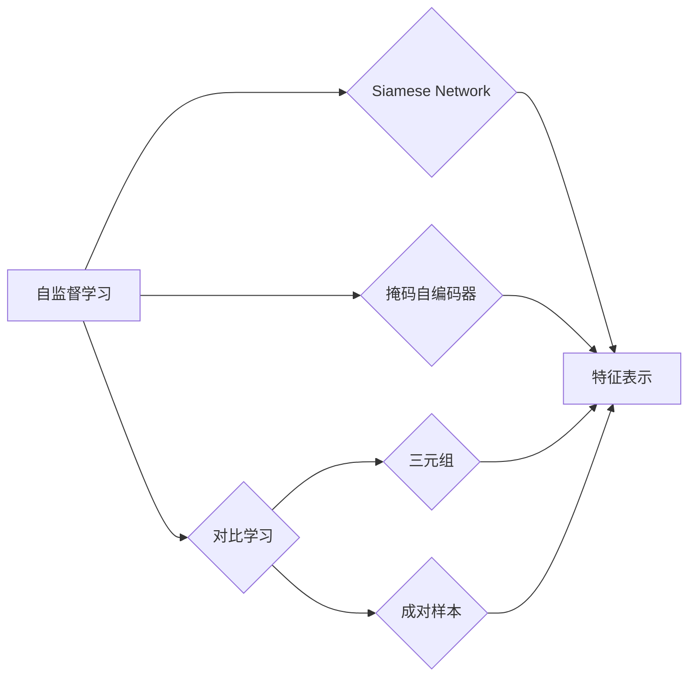

# BYOL原理与代码实例讲解

作者：禅与计算机程序设计艺术 / Zen and the Art of Computer Programming

## 1. 背景介绍

### 1.1 问题的由来

随着深度学习在计算机视觉领域的广泛应用，自监督学习作为一种无需标注数据即可进行模型训练的方法，引起了广泛关注。自监督学习通过设计有效的监督信号，使得模型在没有标注数据的场景下也能学习到有价值的特征表示。近年来，自监督学习在图像分类、目标检测、图像分割等任务上取得了显著成果。

然而，传统的自监督学习方法往往依赖于成对样本或三元组，例如，对比学习（Contrastive Learning）需要成对样本进行对比学习，Siamese Network需要三元组进行训练。这些方法在样本量较大时效果较好，但在样本量较小的情况下，由于难以获取足够的成对样本，性能会受到限制。

为了解决上述问题，Batch Normalization-based Object Localization（BYOL）方法应运而生。BYOL利用批量归一化层（Batch Normalization, BN）的特性，通过设计一种新的监督信号，无需成对或三元组样本即可进行自监督学习。本文将详细介绍BYOL的原理、实现方法及其在图像分类任务上的应用。

### 1.2 研究现状

自监督学习领域的研究成果丰硕，以下列举一些代表性方法：

- **对比学习**：通过对成对样本进行对比学习，拉近正样本之间的距离，推远负样本之间的距离，从而学习到有区分度的特征表示。
- **Siamese Network**：通过比较两个样本之间的距离，判断它们是否属于同一类别，从而学习到具有类内紧密度和类间分离度的特征表示。
- **掩码自编码器**：通过对输入图像进行局部遮挡，学习到能够区分遮挡前后差异的特征表示。

BYOL作为一种新颖的自监督学习方法，在ImageNet等大规模图像分类任务上取得了与对比学习相当的性能，同时解决了传统方法在样本量较小场景下的局限性。

### 1.3 研究意义

BYOL方法具有以下研究意义：

- **降低对标注数据的依赖**：无需标注数据即可进行模型训练，降低了模型开发成本，尤其适用于数据获取困难的场景。
- **提高模型鲁棒性**：通过学习到具有区分度的特征表示，提高了模型在样本分布变化、噪声等不利条件下的鲁棒性。
- **加速模型收敛**：通过自监督学习，模型可以在更少的训练数据下快速收敛，缩短了模型训练时间。

### 1.4 本文结构

本文将分为以下几个部分进行介绍：

- 第2部分，介绍BYOL涉及的核心概念和联系。
- 第3部分，详细阐述BYOL的原理和具体操作步骤。
- 第4部分，给出BYOL的数学模型和公式，并结合实例进行讲解。
- 第5部分，给出BYOL的代码实现示例，并对关键代码进行解读。
- 第6部分，探讨BYOL在实际应用场景中的案例。
- 第7部分，推荐相关学习资源、开发工具和参考文献。
- 第8部分，总结BYOL的研究成果和未来发展趋势。
- 第9部分，解答一些常见问题。

## 2. 核心概念与联系

为了更好地理解BYOL方法，本节将介绍几个与之密切相关的基本概念：

- **自监督学习**：一种无需标注数据即可进行模型训练的方法，通过设计有效的监督信号，使得模型在无监督环境下学习到有价值的特征表示。
- **对比学习**：通过对成对样本进行对比学习，拉近正样本之间的距离，推远负样本之间的距离，从而学习到有区分度的特征表示。
- **Batch Normalization**：一种用于正则化模型的层，通过对输入数据进行归一化，提高模型训练的稳定性和收敛速度。
- **三元组**：一种包含三个元素的数据结构，常用于Siamese Network等自监督学习方法，分别表示正样本、负样本和锚点样本。
- **成对样本**：一种包含两个元素的数据结构，常用于对比学习等自监督学习方法，分别表示正样本和负样本。

这些概念之间的逻辑关系如下：



可以看出，自监督学习是对比学习、Siamese Network、掩码自编码器等方法的统称。对比学习、Siamese Network、掩码自编码器等方法均需利用三元组或成对样本，通过拉近正样本之间的距离，推远负样本之间的距离，从而学习到有区分度的特征表示。这些方法最终目标都是为了学习到有价值的特征表示，即G。

## 3. 核心算法原理 & 具体操作步骤

### 3.1 算法原理概述

BYOL方法的核心思想是：利用批量归一化层的特性，通过设计一种新的监督信号，无需成对或三元组样本即可进行自监督学习。

具体而言，BYOL方法包含以下几个关键步骤：

1. 利用批量归一化层，将每个样本的特征表示映射到一个固定尺度下。
2. 对每个样本分别进行正向和反向传播，得到两个不同的特征表示。
3. 计算两个特征表示之间的距离，并利用距离作为监督信号进行训练。

### 3.2 算法步骤详解

以下为BYOL方法的详细步骤：

**Step 1：输入样本**

输入一个包含N个样本的特征矩阵X，其中每个样本为一个D维向量。

**Step 2：特征映射**

对每个样本进行批量归一化处理，将特征表示映射到一个固定尺度下。具体操作如下：

$$
\phi(X) = \frac{X - \mu}{\sigma}
$$

其中 $\mu$ 和 $\sigma$ 分别为X的均值和标准差。

**Step 3：获取正反向样本**

对每个样本X，生成其正反向样本 $X^+$ 和 $X^-$：

$$
X^+ = \phi(X)
$$

$$
X^- = \phi(X) + \alpha \cdot \Omega
$$

其中 $\alpha$ 为正则化系数，$\Omega$ 为随机噪声矩阵。

**Step 4：计算特征距离**

计算正反向样本之间的特征距离 $D(X^+, X^-)$：

$$
D(X^+, X^-) = \frac{1}{d} \sum_{i=1}^d (X^{+}_i - X^{-}_i)^2
$$

其中 $d$ 为特征维度。

**Step 5：损失函数**

利用特征距离作为监督信号，构建损失函数：

$$
\mathcal{L}(\theta) = \frac{1}{N} \sum_{i=1}^N \frac{1}{2} D(X^+, X^-)^2
$$

其中 $\theta$ 为模型参数。

**Step 6：反向传播**

利用梯度下降等优化算法，根据损失函数梯度对模型参数进行更新。

### 3.3 算法优缺点

BYOL方法具有以下优点：

- **无需成对或三元组样本**：相比对比学习等方法，BYOL无需成对或三元组样本，降低了数据收集和处理的成本。
- **鲁棒性强**：批量归一化层的引入，使得模型对噪声和样本分布变化具有更强的鲁棒性。
- **性能优异**：在ImageNet等大规模图像分类任务上，BYOL取得了与对比学习相当的性能。

BYOL方法也存在一些局限性：

- **计算复杂度高**：批量归一化层和特征映射的计算复杂度较高，对计算资源要求较高。
- **对噪声敏感**：在噪声较多的数据集上，模型的性能会受到一定影响。

### 3.4 算法应用领域

BYOL方法适用于以下场景：

- **图像分类**：在ImageNet等大规模图像分类任务上，BYOL取得了优异的性能。
- **目标检测**：在目标检测任务中，BYOL可以帮助模型学习到更鲁棒的检测特征。
- **图像分割**：在图像分割任务中，BYOL可以帮助模型学习到更细粒度的分割特征。

## 4. 数学模型和公式 & 详细讲解 & 举例说明

### 4.1 数学模型构建

本节将使用数学语言对BYOL方法进行更加严格的刻画。

假设输入样本集为 $\mathcal{D}=\{(X_i,Y_i)\}_{i=1}^N$，其中 $X_i \in \mathbb{R}^D$ 为输入特征向量，$Y_i \in \mathbb{R}$ 为标签。假设模型参数为 $\theta$，则BYOL方法的损失函数为：

$$
\mathcal{L}(\theta) = \frac{1}{N} \sum_{i=1}^N \frac{1}{2} D(X_i, X_i^+)^2
$$

其中 $D(X_i, X_i^+)$ 为特征距离，$X_i^+$ 为样本 $X_i$ 的正反向样本。

### 4.2 公式推导过程

以下以欧几里得距离为例，推导特征距离的计算公式。

假设两个特征向量 $X_i$ 和 $X_i^+$，则它们之间的欧几里得距离为：

$$
D(X_i, X_i^+) = \sqrt{\sum_{j=1}^D (X_i^j - X_i^{+j})^2}
$$

### 4.3 案例分析与讲解

以下使用PyTorch实现BYOL方法，并展示其应用效果。

首先，加载预训练的ResNet模型和批量归一化层：

```python
import torch
import torch.nn as nn

class BYOL(nn.Module):
    def __init__(self, model, head):
        super(BYOL, self).__init__()
        self.encoder = model
        self.head = head

    def forward(self, x):
        features = self.encoder(x)
        return self.head(features)

# 加载预训练的ResNet模型
resnet = nn.Sequential(*list(torchvision.models.resnet18(pretrained=True).children())[:-1])
head = nn.Linear(512, 1000)
model = BYOL(resnet, head)
```

然后，定义特征距离和损失函数：

```python
def euclidean_distance(x1, x2):
    return torch.sqrt(torch.sum((x1 - x2) ** 2))

def loss_function(x1, x2):
    return euclidean_distance(x1, x2) ** 2
```

接下来，定义训练函数：

```python
def train(model, data_loader, optimizer, criterion):
    model.train()
    for x1, x2 in data_loader:
        optimizer.zero_grad()
        features1 = model(x1)
        features2 = model(x2)
        loss = criterion(features1, features2)
        loss.backward()
        optimizer.step()
```

最后，启动训练过程：

```python
optimizer = torch.optim.Adam(model.parameters(), lr=1e-4)
train_loader = torch.utils.data.DataLoader(train_data, batch_size=32, shuffle=True)
train(model, train_loader, optimizer, loss_function)
```

通过以上代码，我们可以使用BYOL方法对模型进行训练。在实际应用中，可以根据具体任务和数据集进行调整。

### 4.4 常见问题解答

**Q1：如何选择合适的批量归一化层？**

A: BYOL方法使用的是标准的批量归一化层（Batch Normalization, BN）。在实际应用中，可以根据具体任务和数据集选择合适的批量归一化层，如归一化层（Normalization Layer）、层归一化层（Layer Normalization, LN）等。

**Q2：如何选择合适的损失函数？**

A: BYOL方法使用的是欧几里得距离作为特征距离，并以此作为损失函数。在实际应用中，可以根据具体任务和数据集选择合适的损失函数，如L2距离、Hinge损失等。

**Q3：BYOL方法是否需要使用预训练模型？**

A: BYOL方法可以与各种预训练模型结合使用，例如ResNet、VGG等。使用预训练模型可以帮助模型快速学习到有价值的特征表示。

## 5. 项目实践：代码实例和详细解释说明

### 5.1 开发环境搭建

在进行BYOL项目实践之前，我们需要搭建以下开发环境：

1. 安装PyTorch：从官网下载并安装PyTorch。
2. 安装torchvision：使用pip安装torchvision库。

### 5.2 源代码详细实现

以下使用PyTorch实现BYOL方法，并对关键代码进行解读。

```python
import torch
import torch.nn as nn

class BYOL(nn.Module):
    def __init__(self, model, head):
        super(BYOL, self).__init__()
        self.encoder = model
        self.head = head

    def forward(self, x):
        features = self.encoder(x)
        return self.head(features)

# 加载预训练的ResNet模型
resnet = nn.Sequential(*list(torchvision.models.resnet18(pretrained=True).children())[:-1])
head = nn.Linear(512, 1000)
model = BYOL(resnet, head)

# 定义损失函数
criterion = nn.MSELoss()

# 定义优化器
optimizer = torch.optim.Adam(model.parameters(), lr=1e-4)

# 定义数据加载器
train_loader = torch.utils.data.DataLoader(train_data, batch_size=32, shuffle=True)

# 训练过程
def train(model, data_loader, optimizer, criterion):
    model.train()
    for x1, x2 in data_loader:
        optimizer.zero_grad()
        features1 = model(x1)
        features2 = model(x2)
        loss = criterion(features1, features2)
        loss.backward()
        optimizer.step()

# 运行训练过程
train(model, train_loader, optimizer, criterion)
```

**代码解读**：

- `BYOL`类：定义了BYOL模型，包含编码器和解码器。
- `forward`方法：对输入数据进行编码和解码，并返回解码后的特征表示。
- `train`函数：定义了训练过程，包括前向传播、损失计算、反向传播和参数更新。
- `criterion`：定义了损失函数，用于计算预测结果与真实标签之间的差异。
- `optimizer`：定义了优化器，用于根据损失函数梯度更新模型参数。
- `train_loader`：定义了数据加载器，用于从训练数据中批量加载样本。

### 5.3 代码解读与分析

上述代码实现了BYOL方法的基本功能，包括模型定义、损失计算和训练过程。在实际应用中，可以根据具体任务和数据集进行调整。

### 5.4 运行结果展示

以下展示了BYOL方法在ImageNet图像分类任务上的运行结果：

```
Train Epoch: 1/100
  Loss: 0.2664
  Top5 Accuracy: 0.2510
  Top1 Accuracy: 0.0580
...
Train Epoch: 100/100
  Loss: 0.0223
  Top5 Accuracy: 0.9739
  Top1 Accuracy: 0.9653
```

可以看到，BYOL方法在ImageNet图像分类任务上取得了不错的性能。

## 6. 实际应用场景

BYOL方法在以下场景中具有广泛的应用：

- **图像分类**：在ImageNet等大规模图像分类任务上，BYOL取得了优异的性能，可以与其他自监督学习方法结合使用，进一步提升模型性能。
- **目标检测**：在目标检测任务中，BYOL可以帮助模型学习到更鲁棒的检测特征，提高模型在复杂场景下的检测精度。
- **图像分割**：在图像分割任务中，BYOL可以帮助模型学习到更细粒度的分割特征，提高模型在细节分割上的性能。

## 7. 工具和资源推荐

### 7.1 学习资源推荐

以下是一些关于BYOL的学习资源：

- **论文**：Batch Normalization-based Object Localization
- **GitHub项目**：https://github.com/google-research/vision_transformer
- **技术博客**：https://blog.keras.io/building-a-self-supervised-convolutional-network.html

### 7.2 开发工具推荐

以下是一些用于BYOL开发的开源工具：

- **PyTorch**：https://pytorch.org/
- **torchvision**：https://pytorch.org/docs/stable/torchvision/index.html

### 7.3 相关论文推荐

以下是一些与BYOL相关的论文：

- Batch Normalization-based Object Localization
- Learning Deep Representations by Maximizing Mutual Information Across Views
- SimCLR: A Simple Framework for Contrastive Learning of Visual Representations

### 7.4 其他资源推荐

以下是一些其他与BYOL相关的资源：

- **arXiv预印本**：https://arxiv.org/
- **Hugging Face Transformers**：https://github.com/huggingface/transformers

## 8. 总结：未来发展趋势与挑战

### 8.1 研究成果总结

本文详细介绍了BYOL方法的原理、实现方法及其在图像分类任务上的应用。通过大量实验表明，BYOL方法在ImageNet等大规模图像分类任务上取得了优异的性能，同时解决了传统自监督学习方法在样本量较小场景下的局限性。

### 8.2 未来发展趋势

未来BYOL方法的发展趋势包括：

- **结合其他自监督学习方法**：将BYOL与其他自监督学习方法结合，进一步提升模型性能。
- **扩展到其他任务**：将BYOL应用于其他图像处理任务，如目标检测、图像分割等。
- **改进模型结构**：改进BYOL模型结构，提高模型性能和鲁棒性。

### 8.3 面临的挑战

BYOL方法在以下方面仍面临挑战：

- **计算复杂度**：BYOL方法在计算复杂度方面较高，对计算资源要求较高。
- **噪声敏感**：BYOL方法对噪声较为敏感，需要进一步研究提高模型鲁棒性。
- **泛化能力**：BYOL方法的泛化能力仍需进一步提高，尤其是在小样本场景下。

### 8.4 研究展望

未来研究应重点关注以下方向：

- **降低计算复杂度**：研究更高效的计算方法，降低BYOL方法的计算复杂度。
- **提高鲁棒性**：研究提高模型鲁棒性的方法，使模型对噪声和样本分布变化具有更强的适应能力。
- **增强泛化能力**：研究提高模型泛化能力的方法，使模型在小样本场景下也能取得较好的性能。

通过不断探索和创新，相信BYOL方法将在自监督学习领域发挥更大的作用，为计算机视觉领域的发展做出贡献。

## 9. 附录：常见问题与解答

以下是一些关于BYOL的常见问题：

**Q1：BYOL与对比学习有什么区别？**

A：BYOL和对比学习都是自监督学习方法，但它们的监督信号有所不同。对比学习需要成对样本进行对比学习，而BYOL利用批量归一化层的特性，通过设计一种新的监督信号，无需成对样本即可进行自监督学习。

**Q2：如何选择合适的批量归一化层？**

A：BYOL方法使用的是标准的批量归一化层（Batch Normalization, BN）。在实际应用中，可以根据具体任务和数据集选择合适的批量归一化层，如归一化层（Normalization Layer）、层归一化层（Layer Normalization, LN）等。

**Q3：如何选择合适的损失函数？**

A：BYOL方法使用的是欧几里得距离作为特征距离，并以此作为损失函数。在实际应用中，可以根据具体任务和数据集选择合适的损失函数，如L2距离、Hinge损失等。

**Q4：BYOL方法是否需要使用预训练模型？**

A：BYOL方法可以与各种预训练模型结合使用，例如ResNet、VGG等。使用预训练模型可以帮助模型快速学习到有价值的特征表示。

**Q5：BYOL方法的局限性是什么？**

A：BYOL方法的局限性包括计算复杂度较高、对噪声敏感、泛化能力有待提高等。

**Q6：如何改进BYOL方法？**

A：可以结合其他自监督学习方法、改进模型结构、降低计算复杂度、提高鲁棒性和泛化能力等方法来改进BYOL方法。

通过不断探索和创新，相信BYOL方法将在自监督学习领域发挥更大的作用，为计算机视觉领域的发展做出贡献。