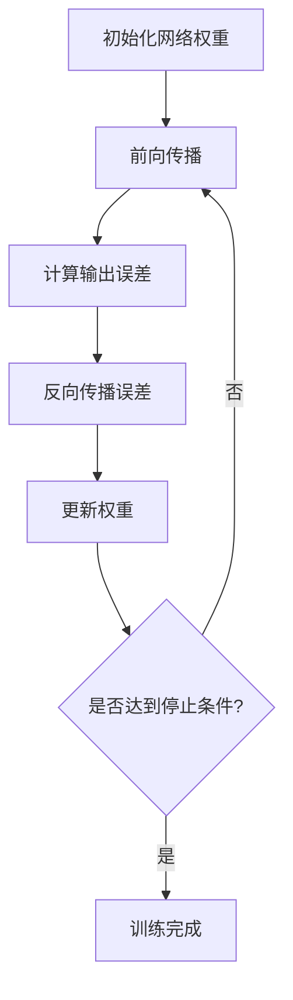

以下是关于《Backpropagation 原理与代码实例讲解》的技术博客文章正文部分：

# Backpropagation原理与代码实例讲解

## 1. 背景介绍

### 1.1 问题的由来

在机器学习和深度学习领域中,神经网络已经成为解决各种复杂问题的强大工具。然而,训练神经网络一直是一个巨大的挑战。在20世纪80年代之前,由于缺乏有效的训练算法,神经网络的发展一直相对缓慢。直到1986年,Rumelhart、Hinton和Williams提出了反向传播(Backpropagation)算法,这种革命性的算法为有效训练多层神经网络提供了可能,从而推动了神经网络及深度学习的飞速发展。

### 1.2 研究现状

反向传播算法是目前训练多层神经网络最广泛使用的算法之一。它通过计算每个神经元对最终输出的误差的梯度,并沿着这个梯度方向更新网络权重,从而最小化网络的总体误差。虽然反向传播算法已经取得了巨大的成功,但它也存在一些局限性,例如容易陷入局部最小值、梯度消失或爆炸等问题。因此,研究人员一直在探索改进反向传播算法的方法,例如采用不同的优化算法、正则化技术、残差连接等。

### 1.3 研究意义

理解反向传播算法的原理对于深入掌握神经网络及深度学习至关重要。它不仅是训练神经网络的核心算法,也揭示了神经网络如何从数据中学习的基本机制。掌握反向传播算法有助于我们更好地设计和优化神经网络模型,并为解决更加复杂的问题提供理论基础。

### 1.4 本文结构  

本文将全面介绍反向传播算法的原理、数学模型、代码实现和应用场景。首先,我们将探讨反向传播算法的核心概念和与其他算法的联系。接下来,详细阐述算法的原理和具体操作步骤。然后,我们将推导算法的数学模型,并通过案例分析加深理解。之后,提供反向传播算法的代码实现示例并进行详细解释。最后,讨论算法在实际应用中的场景,介绍相关工具和资源,并总结算法的发展趋势和面临的挑战。

## 2. 核心概念与联系

反向传播算法是一种基于梯度下降的优化算法,用于训练人工神经网络。它的核心思想是通过计算每个神经元对网络输出的误差梯度,并沿着这个梯度方向更新网络权重,从而最小化网络的总体误差。

反向传播算法可以看作是一种端到端的训练方法,它将输入数据传递到网络的输出层,计算输出与期望值之间的误差,然后沿着网络的反方向传播这个误差,并根据误差梯度更新每个层的权重。这种反向传播误差的过程给算法命名。

反向传播算法与其他优化算法有一定的联系,例如:

1. **梯度下降(Gradient Descent)**: 反向传播算法本质上是一种基于梯度下降的优化算法,它通过计算误差函数对权重的梯度来更新权重。

2. **反向模式微分(Reverse Mode Differentiation)**: 反向传播算法利用了反向模式微分的思想,通过链式法则从输出层反向计算每个神经元对误差的梯度。

3. **动态规划(Dynamic Programming)**: 反向传播算法的计算过程可以看作是一种动态规划,它通过递推的方式计算每个神经元的误差梯度。

4. **自动微分(Automatic Differentiation)**: 反向传播算法实现了对复杂函数(神经网络)的自动微分,这为训练深度神经网络提供了关键支持。

总的来说,反向传播算法将梯度下降、反向模式微分、动态规划和自动微分等概念融合在一起,形成了一种高效的神经网络训练方法。

## 3. 核心算法原理 & 具体操作步骤

### 3.1 算法原理概述

反向传播算法的核心思想是通过计算每个神经元对网络输出的误差梯度,并沿着这个梯度方向更新网络权重,从而最小化网络的总体误差。算法分为两个阶段:前向传播(Forward Propagation)和反向传播(Backpropagation)。

1. **前向传播**:在这个阶段,输入数据通过网络的各个层传递到输出层,产生一个输出值。

2. **反向传播**:在这个阶段,我们计算输出值与期望值之间的误差,并沿着网络的反方向传播这个误差,计算每个神经元对最终误差的梯度。然后,我们根据这些梯度值更新每个层的权重,以减小总体误差。

反向传播算法的关键在于利用链式法则计算每个神经元对最终误差的梯度。这个过程可以通过动态规划的方式高效实现,从而使得训练深度神经网络成为可能。

### 3.2 算法步骤详解

反向传播算法可以分为以下几个步骤:

1. **初始化网络权重**:通常使用小的随机值初始化网络的所有权重。

2. **前向传播**:
   - 输入数据通过网络的各个层传递到输出层,产生一个输出值。
   - 在每个神经元,我们计算加权输入的总和,并将其传递到激活函数(如Sigmoid或ReLU)以获得该神经元的输出。

3. **计算输出误差**:
   - 计算输出层神经元的误差,即输出值与期望值之间的差异。
   - 对于其他层的神经元,我们需要计算它们对最终误差的贡献,这就需要反向传播。

4. **反向传播误差**:
   - 利用链式法则,我们从输出层开始,沿着网络的反方向传播误差。
   - 对于每个神经元,我们计算它对上一层每个神经元误差的贡献,并将这些贡献相加得到该神经元的误差梯度。

5. **更新权重**:
   - 根据每个神经元的误差梯度,我们使用梯度下降法则更新该神经元与上一层神经元之间的权重。
   - 通常,我们会使用一个小的学习率来控制权重的更新幅度。

6. **重复训练**:
   - 我们重复步骤2到5,使用新的训练数据,直到网络在验证集上的性能不再提高为止。

通过这个过程,网络权重会不断调整,使得输出值逐渐接近期望值,从而最小化总体误差。

### 3.3 算法优缺点

**优点**:

1. **端到端训练**:反向传播算法实现了神经网络的端到端训练,无需手工设计特征提取器,从而大大简化了模型设计过程。

2. **通用性强**:反向传播算法可以应用于各种类型的神经网络,包括前馈网络、卷积神经网络和递归神经网络等。

3. **自动微分**:反向传播算法实现了对复杂函数(神经网络)的自动微分,这为训练深度神经网络提供了关键支持。

4. **并行计算**:反向传播算法的计算过程可以很好地利用现代硬件(如GPU)的并行计算能力,从而加速训练过程。

**缺点**:

1. **局部最小值**:由于反向传播算法使用梯度下降优化,因此容易陷入局部最小值,无法找到全局最优解。

2. **梯度消失/爆炸**:在训练深度神经网络时,反向传播算法可能会遇到梯度消失或梯度爆炸的问题,导致训练效果不佳。

3. **计算量大**:对于大型神经网络,反向传播算法需要计算大量的梯度,这可能会导致计算量过大,训练时间过长。

4. **对噪声敏感**:反向传播算法对训练数据中的噪声比较敏感,噪声可能会干扰梯度计算,影响训练效果。

### 3.4 算法应用领域

反向传播算法广泛应用于各种机器学习和深度学习任务,包括但不限于:

1. **图像识别**:通过卷积神经网络实现图像分类、目标检测和语义分割等任务。

2. **自然语言处理**:使用递归神经网络或transformer模型进行机器翻译、文本生成、情感分析等任务。

3. **语音识别**:利用递归神经网络或卷积神经网络实现语音转文本和语音识别。

4. **推荐系统**:通过神经网络模型学习用户偏好,为用户推荐个性化内容。

5. **游戏AI**:训练神经网络模型玩棋类游戏、视频游戏等,实现人工智能对手。

6. **控制系统**:使用神经网络模型控制机器人或自动驾驶汽车等系统。

7. **金融预测**:利用神经网络模型预测股票走势、贷款风险等金融数据。

总的来说,反向传播算法为训练各种复杂的神经网络模型提供了强大的支持,在人工智能的广泛领域发挥着重要作用。

## 4. 数学模型和公式 & 详细讲解 & 举例说明

### 4.1 数学模型构建

为了更好地理解反向传播算法的原理,我们需要构建一个数学模型来描述神经网络的前向传播和反向传播过程。

假设我们有一个包含 $L$ 层的全连接神经网络,每层有 $n_l$ 个神经元。我们使用以下符号表示:

- $x^{(i)}$: 第 $i$ 个训练样本的输入
- $y^{(i)}$: 第 $i$ 个训练样本的期望输出
- $a_j^{(l)}$: 第 $l$ 层第 $j$ 个神经元的激活值
- $w_{jk}^{(l)}$: 第 $l$ 层第 $j$ 个神经元与第 $l-1$ 层第 $k$ 个神经元之间的权重
- $b_j^{(l)}$: 第 $l$ 层第 $j$ 个神经元的偏置项
- $z_j^{(l)}$: 第 $l$ 层第 $j$ 个神经元的加权输入
- $\sigma(\cdot)$: 激活函数,如Sigmoid或ReLU

前向传播过程可以表示为:

$$z_j^{(l)} = \sum_{k=1}^{n_{l-1}} w_{jk}^{(l)}a_k^{(l-1)} + b_j^{(l)}$$
$$a_j^{(l)} = \sigma(z_j^{(l)})$$

其中, $a_j^{(0)} = x_j^{(i)}$ 表示输入层的激活值就是输入数据。

我们定义一个损失函数 $J(\boldsymbol{w}, \boldsymbol{b})$ 来衡量网络输出与期望输出之间的差异,例如均方误差:

$$J(\boldsymbol{w}, \boldsymbol{b}) = \frac{1}{2m} \sum_{i=1}^m \sum_{j=1}^{n_L} (y_j^{(i)} - a_j^{(L)})^2$$

其中, $m$ 是训练样本的数量, $n_L$ 是输出层的神经元数量。

我们的目标是通过调整网络权重 $\boldsymbol{w}$ 和偏置项 $\boldsymbol{b}$ 来最小化损失函数 $J(\boldsymbol{w}, \boldsymbol{b})$。这可以通过反向传播算法实现,它计算每个权重和偏置项对损失函数的梯度,并沿着梯度的反方向更新它们。

### 4.2 公式推导过程

反向传播算法的核心是计算每个权重和偏置项对损失函数的梯度。我们可以利用链式法则推导出这些梯度的计算公式。

首先,我们定义一个误差项 $\delta_j^{(l)}$,表示第 $l$ 层第 $