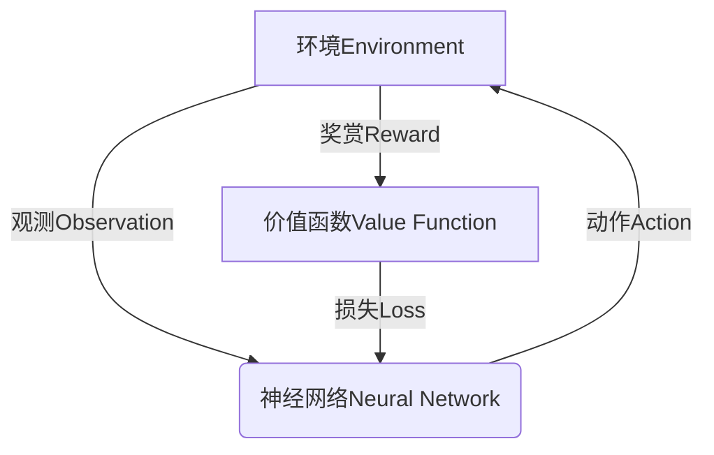

# Deep Reinforcement Learning原理与代码实例讲解

## 1. 背景介绍

### 1.1 问题的由来

在传统的机器学习领域中,监督学习和无监督学习一直是主导地位。然而,这两种范式都存在一些固有的局限性。监督学习需要大量标注的训练数据,而无监督学习则无法直接优化特定的目标。为了解决这些问题,强化学习(Reinforcement Learning)应运而生。

强化学习是一种基于奖赏或惩罚的学习方式,其灵感来源于行为主义心理学。在这种范式中,智能体(Agent)通过与环境(Environment)进行交互来学习,目标是最大化预期的累积奖赏。与监督学习不同,强化学习没有提供正确答案的训练数据,智能体必须通过反复试错来发现最优策略。

然而,传统的强化学习算法在处理高维观测空间和动作空间时面临巨大挑战。Deep Reinforcement Learning(深度强化学习)的出现为解决这一难题提供了新的思路。

### 1.2 研究现状

Deep Reinforcement Learning结合了深度学习(Deep Learning)和强化学习的优势,利用深度神经网络来近似智能体的策略函数或值函数,从而能够处理高维的输入和输出。自2013年DeepMind提出Deep Q-Network(DQN)算法以来,Deep Reinforcement Learning在多个领域取得了突破性进展,如Atari游戏、国际象棋、围棋等。

目前,Deep Reinforcement Learning已经成为人工智能领域的一个重要研究方向,吸引了众多学者和工程师的关注。一些著名的Deep Reinforcement Learning算法包括DQN、Double DQN、Dueling DQN、A3C、DDPG、PPO等。这些算法在不同的场景下展现出了优异的性能。

### 1.3 研究意义

Deep Reinforcement Learning的研究意义主要体现在以下几个方面:

1. **通用性**: 强化学习提供了一种通用的学习框架,可以应用于各种决策过程,包括机器人控制、游戏AI、自动驾驶、资源调度等领域。

2. **自主学习**: 与监督学习不同,强化学习不需要大量的标注数据,智能体可以通过与环境的交互自主学习最优策略。

3. **长期规划**: 强化学习关注的是长期累积奖赏的最大化,这使得它能够进行长期规划和决策,而不仅局限于即时反馈。

4. **泛化能力**: 深度神经网络赋予了Deep Reinforcement Learning强大的泛化能力,能够处理高维的观测和动作空间。

5. **多领域应用**: Deep Reinforcement Learning已经在多个领域取得了卓越的成就,如游戏AI、机器人控制、自然语言处理等,展现出了巨大的应用前景。

### 1.4 本文结构

本文将全面介绍Deep Reinforcement Learning的核心概念、算法原理、数学模型、代码实现和应用场景。文章结构如下:

- 第2章介绍Deep Reinforcement Learning的核心概念和基本框架。
- 第3章详细阐述Deep Reinforcement Learning的核心算法原理和具体操作步骤。
- 第4章推导Deep Reinforcement Learning的数学模型和公式,并结合案例进行讲解。
- 第5章提供Deep Reinforcement Learning的代码实例,并对关键部分进行解释说明。
- 第6章探讨Deep Reinforcement Learning在实际应用中的场景。
- 第7章推荐相关的学习资源、开发工具和论文。
- 第8章总结Deep Reinforcement Learning的研究成果、发展趋势和面临的挑战。
- 第9章列出常见问题并给出解答。

## 2. 核心概念与联系

在深入探讨Deep Reinforcement Learning的算法细节之前,我们需要先了解一些核心概念和基本框架。

**强化学习(Reinforcement Learning)**是一种基于奖赏或惩罚的学习范式。在强化学习中,有以下几个关键要素:

- **智能体(Agent)**: 也称为决策者,它通过观察当前状态并执行动作来与环境交互。
- **环境(Environment)**: 智能体所处的外部世界,它根据智能体的动作转移到下一个状态,并给出相应的奖赏或惩罚。
- **状态(State)**: 描述环境的当前情况。
- **动作(Action)**: 智能体在当前状态下可执行的操作。
- **策略(Policy)**: 智能体根据当前状态选择动作的策略或行为准则。
- **奖赏(Reward)**: 环境对智能体当前动作给出的反馈,可以是正值(奖赏)或负值(惩罚)。
- **价值函数(Value Function)**: 评估当前状态或状态-动作对的长期累积奖赏。

强化学习的目标是找到一个最优策略,使得在给定的环境中,智能体可以最大化其预期的长期累积奖赏。

**深度学习(Deep Learning)**是机器学习的一个分支,它利用深度神经网络来模拟人脑的信息处理过程,从而实现对复杂数据(如图像、语音、文本等)的高效处理和表示学习。深度学习的关键在于通过多层非线性变换,自动从原始输入数据中提取出有意义的高层次特征表示。

**Deep Reinforcement Learning**将深度学习与强化学习相结合,利用深度神经网络来近似智能体的策略函数或值函数,从而能够处理高维的观测和动作空间。在Deep Reinforcement Learning中,神经网络的输入通常是当前状态的观测值,输出则可以是动作的概率分布(策略函数)或状态-动作对的值估计(值函数)。

Deep Reinforcement Learning的基本框架如下所示:

在这个框架中,智能体(Agent)使用神经网络来近似其策略函数或值函数。神经网络从环境中获取当前状态的观测值作为输入,并输出相应的动作或状态-动作值估计。根据执行动作后环境的反馈(奖赏或惩罚),智能体可以计算出价值函数的损失,并使用这个损失来更新神经网络的参数,从而不断改进其策略或值函数的估计。

Deep Reinforcement Learning的核心思想是利用深度神经网络的强大表示能力和泛化能力,来解决传统强化学习算法在处理高维观测和动作空间时面临的困难。通过端到端的训练,Deep Reinforcement Learning可以自动从原始输入中提取出有意义的特征表示,而不需要人工设计特征工程。

## 3. 核心算法原理 & 具体操作步骤

在上一章节中,我们介绍了Deep Reinforcement Learning的核心概念和基本框架。本章将详细阐述Deep Reinforcement Learning的核心算法原理和具体操作步骤。

### 3.1 算法原理概述

Deep Reinforcement Learning的核心算法主要分为两大类:基于值函数(Value-Based)的算法和基于策略(Policy-Based)的算法。

**基于值函数的算法**旨在估计每个状态或状态-动作对的值函数,即在当前状态下执行某个动作序列所能获得的预期累积奖赏。一旦获得了准确的值函数估计,智能体就可以通过选择具有最大值的动作来实现最优策略。著名的基于值函数的算法包括Deep Q-Network(DQN)及其变体。

**基于策略的算法**则直接对智能体的策略函数进行参数化建模,并通过策略梯度方法来优化策略参数,使得在给定的环境中能够获得最大的预期累积奖赏。代表性的基于策略的算法有REINFORCE、A3C(Asynchronous Advantage Actor-Critic)、PPO(Proximal Policy Optimization)等。

除了上述两大类算法之外,还有一些结合值函数和策略的Actor-Critic算法,如Deep Deterministic Policy Gradient(DDPG)等。

在Deep Reinforcement Learning中,无论是值函数还是策略函数,都是通过深度神经网络来近似和表示。神经网络的输入通常是当前状态的观测值,而输出则可以是动作的概率分布(策略函数)或状态-动作对的值估计(值函数)。通过反向传播算法,我们可以根据奖赏信号来更新神经网络的参数,从而不断改进智能体的决策能力。

### 3.2 算法步骤详解

接下来,我们将以Deep Q-Network(DQN)算法为例,详细介绍基于值函数的Deep Reinforcement Learning算法的具体步骤。

DQN算法的核心思想是使用一个深度神经网络来近似状态-动作值函数$Q(s,a)$,即在当前状态$s$下执行动作$a$所能获得的预期累积奖赏。神经网络的输入是当前状态$s$的观测值,输出是所有可能动作的Q值$Q(s,a_1),Q(s,a_2),...,Q(s,a_n)$。

DQN算法的训练过程如下:

1. **初始化回放存储器(Replay Buffer)和神经网络参数**。回放存储器用于存储智能体与环境交互过程中的转换样本$(s_t,a_t,r_t,s_{t+1})$,即当前状态、执行的动作、获得的奖赏以及下一个状态。神经网络参数初始化为随机值。

2. **观测当前状态$s_t$,选择动作$a_t$**。根据当前状态$s_t$的观测值,通过神经网络计算所有可能动作的Q值$Q(s_t,a_1),Q(s_t,a_2),...,Q(s_t,a_n)$,并选择Q值最大的动作$a_t$作为当前动作。这一步骤被称为贪婪策略(Greedy Policy)。为了增加探索性,我们通常会以一定的概率$\epsilon$随机选择动作,这种策略被称为$\epsilon$-贪婪策略($\epsilon$-Greedy Policy)。

3. **执行动作$a_t$,观测下一个状态$s_{t+1}$和奖赏$r_t$**。在环境中执行选择的动作$a_t$,观测到下一个状态$s_{t+1}$以及获得的即时奖赏$r_t$。

4. **存储转换样本$(s_t,a_t,r_t,s_{t+1})$到回放存储器**。将当前状态、执行的动作、获得的奖赏以及下一个状态的转换样本存储到回放存储器中。

5. **从回放存储器中采样一个小批量的转换样本**。为了打破序列相关性,提高数据利用效率,我们通常会从回放存储器中随机采样一个小批量的转换样本$(s_j,a_j,r_j,s_{j+1})$,而不是直接使用连续的序列数据。

6. **计算目标Q值**。对于每个转换样本$(s_j,a_j,r_j,s_{j+1})$,我们需要计算其目标Q值$y_j$,作为神经网络的监督信号。目标Q值的计算公式如下:

$$y_j = r_j + \gamma \max_{a'}Q(s_{j+1},a';\theta^-)$$

其中,$\gamma$是折扣因子(Discount Factor),用于权衡即时奖赏和未来奖赏的重要性;$\max_{a'}Q(s_{j+1},a';\theta^-)$表示在下一个状态$s_{j+1}$下,所有可能动作的最大Q值,这个最大Q值是由一个固定的目标网络(Target Network)计算得到的,目标网络的参数$\theta^-$是一个滞后的拷贝,用于增加训练的稳定性。

7. **计算损失函数并进行反向传播**。将神经网络在当前状态$s_j$下对应动作$a_j$的Q值预测$Q(s_j,a_j;\theta)$与目标Q值$y_j$的差异作为损失函数,通常采用均方误差(Mean Squared Error)作为损失函数:

$$\mathcal{L}(\theta) = \mathbb{E}_{(s_j,a_j,r_j,s_{j+1})\sim D}\left[(y_j - Q(s_j,a_j;\theta))^2\right]$$

其中,$D$表示回放存储器中的数据分布。通过反向传播算法,我们可以计算出神经网络参数$\theta$的梯度,并使用优化算法(如RMSProp或Adam)来