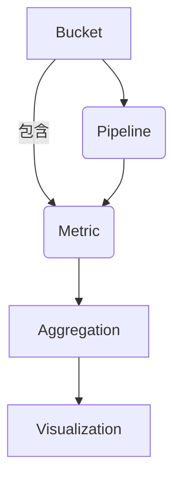

好的,我会按照要求撰写这篇文章。以下是文章正文部分:

# ES聚合分析原理与代码实例讲解

## 1. 背景介绍

### 1.1 问题的由来

在当今大数据时代,海量数据的存储和分析成为了一个巨大的挑战。传统的关系型数据库在处理非结构化数据和大规模数据时,性能和扩展性都存在瓶颈。Elasticsearch作为一种分布式、RESTful 风格的搜索和数据分析引擎,在大数据处理领域发挥着越来越重要的作用。

ES的聚合分析功能可以对海量数据进行实时的统计、分析和挖掘,为数据驱动的商业智能提供了强大的支持。然而,ES聚合分析的原理和使用方法对很多开发者来说仍然是一个黑盒,如何高效利用这一强大功能成为了一个亟待解决的问题。

### 1.2 研究现状

目前已有一些文献和资料对ES聚合分析进行了介绍,但大多数只是浅尝辄止,缺乏对核心原理和实现细节的深入探讨。一些博客和在线教程虽然提供了一些实例代码,但缺乏系统性,代码片段也难以很好地解释聚合分析的本质。

总的来说,现有资料大多缺乏深入浅出、系统完整的阐释,无法真正帮助开发者掌握ES聚合分析的精髓。

### 1.3 研究意义  

掌握ES聚合分析原理和实践技能,对于开发者和数据分析师来说都是非常宝贵的。通过本文的学习,读者能够:

- 深入理解ES聚合分析的核心概念和工作原理
- 掌握编写高效聚合分析语句的方法和技巧
- 学习如何基于ES构建数据分析和商业智能应用
- 提高数据处理和分析能力,驱动业务发展

### 1.4 本文结构

本文将从以下几个方面对ES聚合分析进行全面的阐述:

- 核心概念与联系
- 核心算法原理和具体操作步骤
- 数学模型和公式详细讲解
- 项目实践:代码实例和详细解释
- 实际应用场景分析
- 相关工具和学习资源推荐
- 总结未来发展趋势和面临的挑战

## 2. 核心概念与联系

ES聚合分析的核心概念主要包括:Bucket、Metric、Pipeline等。它们之间存在着内在的联系,构成了ES聚合分析的整体框架。



上图展示了ES聚合分析的核心概念及其关系:

1. **Bucket**: 用于对数据进行分组或分类,常见的Bucket类型有Terms、Date Range、Histogram等。
2. **Metric**: 用于对Bucket内的数据进行统计计算,如Sum、Avg、Stats等。
3. **Pipeline**: 对Metric的输出结果进行进一步的转换和处理,如Bucket Script、Derivative等。
4. **Aggregation**: Bucket、Metric和Pipeline的组合,构成了完整的聚合分析逻辑。
5. **Visualization**: 将Aggregation的结果以图表等形式可视化展现。

理解这些核心概念及其内在联系,是掌握ES聚合分析的基础和关键。

## 3. 核心算法原理和具体操作步骤  

### 3.1 算法原理概述

ES聚合分析的核心算法原理可以概括为"Shuffle分组 -> 聚合计算 -> 树状合并"三个主要阶段:


1. **Shuffle分组**:根据聚合语句中的Bucket条件,对每个数据分片上的原始数据进行分组。
2. **本地聚合计算**:对每个分组内的数据,执行Metric统计计算,生成本地聚合结果。
3. **树状合并**:将所有分片上的本地聚合结果,通过有序的树状结构进行合并,得到最终结果。

这种分布式的聚合计算模式,可以最大限度地利用ES的并行处理能力,从而支持大规模数据集的高效分析。

### 3.2 算法步骤详解

我们以一个简单的例子来详细解释ES聚合分析算法的具体执行步骤。

假设我们要统计某电商平台上各个城市的销售总额,聚合语句如下:

```json
{
  "aggs": {
    "sales_by_city": {
      "terms": {
        "field": "city"
      },
      "aggs": {
        "total_sales": {
          "sum": {
            "field": "price"
          }
        }
      }
    }
  }
}
```

1. **Shuffle分组**

   ES会根据"city"字段的值,将每个分片上的数据进行分组。假设有3个分片,分组结果如下:

   分片1: 
    - 组1: 北京 
    - 组2: 上海
    - 组3: 广州
   
   分片2:
    - 组1: 北京
    - 组2: 上海 
    - 组3: 深圳

   分片3:
    - 组1: 北京
    - 组2: 上海
    - 组3: 重庆

2. **本地聚合计算**

   对每个分组内的数据,执行"sum"的聚合计算,统计出该城市的销售总额。
   
   分片1:
    - 北京: 10000
    - 上海: 8000
    - 广州: 12000

   分片2: 
    - 北京: 15000
    - 上海: 13000
    - 深圳: 9000
    
   分片3:
    - 北京: 20000 
    - 上海: 16000
    - 重庆: 11000

3. **树状合并**

   将所有分片的本地聚合结果进行有序的树状合并:

   - 第一层: 
     - 北京: 10000 + 15000 + 20000 = 45000
     - 上海: 8000 + 13000 + 16000 = 37000
     - 广州: 12000
     - 深圳: 9000 
     - 重庆: 11000
   
   - 第二层:
     - 北京: 45000
     - 上海: 37000 
     - 广州+深圳+重庆: 12000 + 9000 + 11000 = 32000

   - 最终结果:
     - 北京: 45000
     - 上海: 37000
     - 广州+深圳+重庆: 32000

通过以上步骤,ES就完成了分布式的聚合计算,并得到了各城市销售总额的统计结果。

### 3.3 算法优缺点

ES聚合分析算法的优点:

- 分布式并行计算,能够支持大规模数据集的高效分析。
- 算法步骤清晰,实现机制简单直观。
- 支持多级嵌套聚合,可以构建复杂的分析逻辑。
- 与ES的分布式架构天然契合,便于集成和扩展。

缺点:

- 中间环节的数据传输和合并会产生一定的性能开销。
- 对于高基数的Bucket聚合(如Terms),内存消耗较大。
- 缺乏增量计算能力,每次聚合都需要全量重新计算。

总的来说,ES聚合分析算法具有简单高效的特点,适合大多数在线数据分析场景,但也存在一些需要优化和改进的不足。

### 3.4 算法应用领域

ES聚合分析算法广泛应用于以下领域:

- **商业智能(BI)**: 统计报表、数据可视化、OLAP等。
- **运维监控**: 日志分析、指标监控、异常检测等。
- **内容分析**: 文本挖掘、情感分析、个性化推荐等。  
- **安全分析**: 威胁情报分析、欺诈检测、用户行为分析等。
- **互联网广告**: 用户行为分析、广告投放优化等。
- **其他**: 物联网数据分析、社交网络分析等。

ES聚合分析能力的不断增强,也推动了它在更多新兴领域的应用实践。

## 4. 数学模型和公式详细讲解与举例说明

在ES聚合分析中,常用的数学模型和公式主要包括:

### 4.1 数学模型构建

1. **文本相似度模型**

文本相似度是ES在搜索、相关性排序等场景中广泛使用的一种模型。最常用的是基于TF-IDF的向量空间模型(VSM):

$$\vec{q} \cdot \vec{d} = \sum_{i=1}^{|V|}{tfidf(t_i, q) \times tfidf(t_i, d)}$$

其中:
- $\vec{q}$是查询向量
- $\vec{d}$是文档向量 
- $tfidf(t, x)$表示词项$t$在$x$中的TF-IDF权重

通过计算查询向量和文档向量的余弦相似度,可以量化查询与文档的相关程度。

2. **时序数据模型**

对于时序数据,ES支持多种模型,如简单移动平均(SMA)、指数加权移动平均(EMA)等:

$$
EMA_t = \alpha \times value_t + (1 - \alpha) \times EMA_{t-1}
$$

其中$\alpha$是平滑系数,决定了新数据对EMA的影响程度。EMA可以很好地反映时序数据的趋势和周期性特征。

### 4.2 公式推导过程

1. **TF-IDF公式推导**

TF-IDF广泛应用于信息检索领域,其公式推导过程如下:

已知词频TF和逆向文档频率IDF的计算公式:

$$
TF(t,d) = \frac{n_{t,d}}{\sum_{k \in d}n_{k,d}}
$$

$$
IDF(t,D) = \log{\frac{|D|}{|\{d \in D: t \in d\}|}}
$$

其中:
- $n_{t,d}$是词项$t$在文档$d$中出现的次数
- $|D|$是文档集$D$中文档的总数
- $|\{d \in D: t \in d\}|$是包含词项$t$的文档数量

将TF和IDF相乘,得到TF-IDF公式:

$$
TFIDF(t,d,D) = TF(t,d) \times IDF(t,D)
$$

TF-IDF能够平衡词项的词频和逆向文档频率,从而更好地量化词项对文档的重要性。

2. **信息熵公式推导**

信息熵是信息论中的一个重要概念,常用于特征选择、决策树构建等场景。对于一个离散随机变量$X$,其信息熵的公式为:

$$
H(X) = -\sum_{i=1}^{n}P(x_i)\log_2 P(x_i)
$$

其中$P(x_i)$是随机变量$X$取值$x_i$的概率。

我们可以从信息论的角度推导这个公式:

设$X$是一个可取$n$个值的随机变量,编码长度为$l(x_i)$,则根据信息论,期望编码长度为:

$$
E[l(X)] = \sum_{i=1}^{n}P(x_i)l(x_i)
$$

为了使$E[l(X)]$最小,需要使用最优前缀编码,即霍夫曼编码。根据霍夫曼编码的性质,有:

$$
l(x_i) = -\log_2 P(x_i)
$$

将其代入$E[l(X)]$,即可得到信息熵的公式。

信息熵能够很好地量化随机变量的不确定性,在ES的特征选择、决策树构建等场景中发挥着重要作用。

### 4.3 案例分析与讲解

1. **文本相似度案例**

假设有两个文档$d_1$和$d_2$,以及一个查询$q$,它们的向量表示如下:

$$
\vec{d_1} = (0.6, 0.8, 0, 0.4) \\
\vec{d_2} = (0.3, 0, 0.5, 0.7) \\
\vec{q} = (0.4, 0.6, 0.2, 0)
$$

我们可以计算查询$q$与文档$d_1$、$d_2$的相似度:

$$
\begin{aligned}
sim(q, d_1) &= \