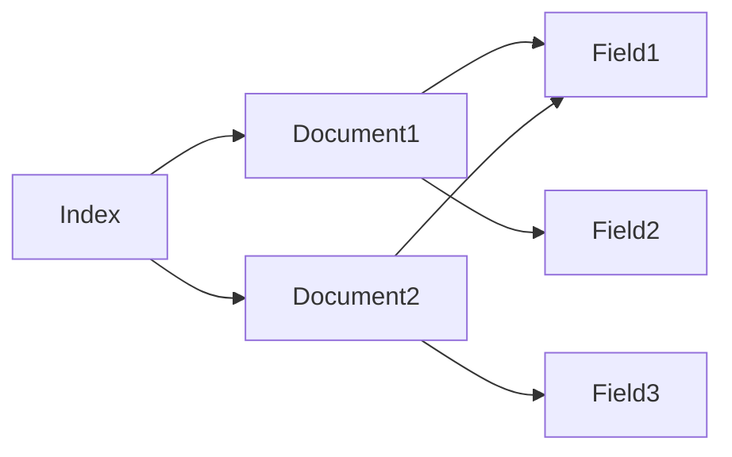

# ElasticSearch Mapping原理与代码实例讲解

关键词：ElasticSearch, Mapping, 倒排索引, 分词器, 字段类型, 动态映射

## 1. 背景介绍
### 1.1 问题的由来
随着互联网数据的爆炸式增长,传统的关系型数据库已经无法满足海量数据的实时查询和分析需求。ElasticSearch作为一款基于Lucene的高性能分布式搜索和分析引擎,凭借其强大的全文检索、准实时搜索、高可用等特性,在全文搜索、日志分析、指标分析等领域得到了广泛应用。

### 1.2 研究现状
目前,国内外已有大量研究ElasticSearch原理和应用的学术论文和技术博客。这些研究主要集中在ElasticSearch的分布式架构、倒排索引、relevance scoring等核心原理,以及在不同领域的应用实践。但关于ElasticSearch Mapping的原理解析和最佳实践的文章还比较少。

### 1.3 研究意义
深入理解ElasticSearch Mapping的原理,对于优化ElasticSearch的索引结构、提升查询和聚合分析性能具有重要意义。同时,掌握ElasticSearch Mapping的最佳实践,可以避免一些常见的错误使用方式,充分发挥ElasticSearch的性能优势。

### 1.4 本文结构 
本文将重点介绍ElasticSearch Mapping的核心概念、工作原理,并结合实际代码示例详细讲解Mapping的常见配置。内容安排如下:

- 介绍ElasticSearch Mapping的背景和研究意义
- 阐述Mapping的核心概念,如Field、Analyzer等 
- 剖析Mapping的工作原理,结合Lucene倒排索引
- 通过代码示例演示Mapping的常见配置
- 总结Mapping的最佳实践和常见问题

## 2. 核心概念与联系
在ElasticSearch中,Mapping定义了文档及其包含的字段如何被存储和索引。一个Mapping相当于关系型数据库中的一个Schema定义。它包含了以下核心概念:

- Index(索引):含有相同属性的文档集合
- Document(文档):索引中的一条记录,由多个Field组成
- Field(字段):文档的一个属性,包含name、type等元数据
- Type(类型):在7.0之前,一个Index可以定义多个Type。7.0开始一个Index只能包含一个Type
- Analyzer(分词器):将文本分成一个个单词(term)的一个组件,常见的有standard, whitespace, simple, stop等

下图展示了Index、Document、Field三者之间的关系:



## 3. 核心算法原理 & 具体操作步骤
### 3.1 算法原理概述
ElasticSearch的底层基于Lucene的倒排索引(Inverted Index)。倒排索引中存储了单词(Term)到包含它的文档的映射关系。当我们用ElasticSearch进行全文检索时,ElasticSearch会根据查询语句分析出查询词,然后去倒排索引中查找包含查询词的文档,并根据relevance score算法对结果进行排序。

### 3.2 算法步骤详解
倒排索引的核心由以下几步构建而成:

1. 将原始文档集合按照Mapping定义切分成一个个Field。
2. 对需要分词的Field使用Analyzer进行分词,生成一个个单词(Term)。
3. 创建倒排索引表,记录每个Term对应的文档集合(Posting List),即包含该Term的文档ID。
4. 对Posting List按照文档ID大小进行排序,然后记录每个文档中Term的位置、偏移等信息,用于phraseQuery等查询。

检索过程则分为以下步骤:

1. 对查询语句进行词法、语法分析,提取查询词。
2. 对查询词进行Analyzer分词处理,得到Term。
3. 从倒排索引中查找包含查询词的文档。
4. 根据relevance score算法对结果进行排序。

### 3.3 算法优缺点
倒排索引的优点在于:

- 索引结构简单,易于压缩存储
- 查询速度快,复杂度与文档数量无关
- 支持高效的相关度排序

缺点主要有:

- 索引文件庞大,占用存储空间大 
- 更新代价高,需要重建索引
- 不适合用于实时索引的场景

### 3.4 算法应用领域
倒排索引广泛应用于全文检索、搜索引擎、推荐系统等领域。一些典型的应用包括:

- 搜索引擎,如Google、百度等
- 日志分析,如ELK日志分析平台
- 电商搜索、推荐,如亚马逊、淘宝等
- 论坛、博客的全文搜索等

## 4. 数学模型和公式 & 详细讲解 & 举例说明
### 4.1 数学模型构建
在ElasticSearch中,Relevance Score用于衡量文档与查询的相关性。常用的相关性算分模型有:

- TF/IDF模型
TF(Term Frequency)衡量一个词在文档中出现的频率。IDF(Inverse Document Frequency)衡量一个词的常见程度。TF/IDF认为一个词在一篇文档中出现的频率越高,在所有文档中出现的频率越低,则越能代表该文档的主题。其数学表达为:

$$
tfidf(t,d) = tf(t,d) * idf(t)
$$

其中,$tf(t,d)$表示词t在文档d中出现的频率,$idf(t)$的计算公式为:

$$
idf(t) = 1 + log(\frac{numDocs}{docFreq(t)+1})
$$

$numDocs$为文档总数,$docFreq(t)$为包含t的文档数。

- BM25模型
BM25在TF/IDF的基础上,考虑了文档长度对相关性的影响。其数学表达为:

$$
score(q,d) = \sum_{t \in q} idf(t) * \frac{tf(t,d) * (k_1+1)}{tf(t,d) + k_1 * (1-b+b*\frac{|d|}{avgdl})}
$$

其中,$|d|$为文档d的长度,$avgdl$为文档平均长度,$k_1$和$b$为调节因子,一般取$k_1=1.2$, $b=0.75$。

### 4.2 公式推导过程
以TF/IDF公式为例,推导过程如下:

假设语料库中有10000个文档,其中包含词"ElasticSearch"的文档有100个。那么"ElasticSearch"的逆文档频率为:

$$
idf("ElasticSearch") = log(\frac{10000}{100}) = 2
$$

假设文档d1中"ElasticSearch"出现了5次,文档d2中出现了10次。那么"ElasticSearch"在d1和d2中的TF/IDF权重分别为:

$$
tfidf("ElasticSearch", d_1) = 5 * 2 = 10 \\
tfidf("ElasticSearch", d_2) = 10 * 2 = 20
$$

可见,虽然"ElasticSearch"在d2中出现的次数是d1的两倍,但并不意味着d2的权重就是d1的两倍,而要考虑到该词的逆文档频率。

### 4.3 案例分析与讲解
下面以一个实际的例子来说明TF/IDF的计算过程。假设我们有以下三个文档:

```
d1: ElasticSearch is an open source search engine
d2: Lucene is an Apache open source project
d3: ElasticSearch is developed based on Lucene
```

对这三个文档建立倒排索引,计算"ElasticSearch"和"Lucene"两个词的IDF值:

```
"ElasticSearch": df=2, idf=log(3/2)≈0.18
"Lucene": df=2, idf=log(3/2)≈0.18
```

然后计算每个文档中两个词的TF值和TF-IDF值:

d1:
 - "ElasticSearch": tf=1, tfidf=1*0.18=0.18
 - "Lucene": tf=0, tfidf=0

d2:
 - "ElasticSearch": tf=0, tfidf=0
 - "Lucene": tf=1, tfidf=1*0.18=0.18 

d3:
 - "ElasticSearch": tf=1, tfidf=1*0.18=0.18
 - "Lucene": tf=1, tfidf=1*0.18=0.18

可以看到,虽然三个文档都包含"ElasticSearch"或"Lucene",但是TF-IDF值能够很好地区分它们的重要程度。d1和d3与"ElasticSearch"最相关,d2和d3与"Lucene"最相关。

### 4.4 常见问题解答
- TF-IDF能否衡量词语的重要性?
TF-IDF的确能在一定程度上衡量词语的重要性,但并不完全准确。举例来说,冠词、介词等虚词通常也会有较高的TF-IDF值,但并不能反映文档主题。因此在实际应用中,还需要采取停用词过滤、词干提取等文本预处理手段。

- ElasticSearch是否完全采用TF-IDF算法?
ElasticSearch采用的是改进的TF-IDF算法,即BM25。BM25在TF-IDF的基础上,引入了文档长度因子,对过长或过短的文档进行了惩罚。同时ElasticSearch还支持自定义Relevance Score算法,以插件的形式引入。

## 5. 项目实践：代码实例和详细解释说明
### 5.1 开发环境搭建
首先我们需要搭建一个ElasticSearch的开发环境。可以直接使用官方的Docker镜像:

```bash
docker run -d --name es762 -p 9200:9200 -p 9300:9300 -e "discovery.type=single-node" elasticsearch:7.6.2
```

这会启动一个单节点的ElasticSearch实例,并暴露9200端口用于RESTful请求。

然后我们通过Kibana来测试ElasticSearch是否启动成功:

```
http://localhost:9200/_cat/health
```

如果看到green的状态,就说明ElasticSearch成功启动了。

### 5.2 源代码详细实现
下面我们通过一个具体的Mapping示例来演示ElasticSearch的基本用法。

假设我们要创建一个名为`my_index`的索引,包含以下字段:

- name: 字符串类型,支持全文检索
- age: 整数类型
- gender: 枚举类型,只能是"male"或"female"
- tags: 字符串数组,支持全文检索

我们可以定义如下的Mapping:

```json
PUT my_index
{
  "mappings": {
    "properties": {
      "name": {
        "type": "text",
        "analyzer": "ik_max_word"
      },
      "age": {
        "type": "integer"
      },
      "gender": {
        "type": "keyword"
      },
      "tags": {
        "type": "text",
        "analyzer": "whitespace"
      }
    }
  }
}
```

这里我们为name和tags字段指定了分词器。name字段使用ik_max_word分词器,会将文本切分成尽可能多的词。tags使用whitespace分词器,会按照空格切分。

接下来,我们往索引中插入一些测试数据:

```json
POST my_index/_doc
{
  "name": "张三",
  "age": 20,
  "gender": "male",
  "tags": ["学生", "开发", "游戏"]
}

POST my_index/_doc
{  
  "name": "李四",
  "age": 25,
  "gender": "male",
  "tags": ["程序员", "篮球"]
}

POST my_index/_doc
{
  "name": "王五",
  "age": 30,
  "gender": "female",
  "tags": ["设计师", "画家"]  
}
```

现在我们来测试一下全文检索:

```json
POST my_index/_search
{
  "query": {
    "match": {
      "tags": "篮球"
    }
  }
}
```

返回结果为:

```json
{
  "hits": [
    {
      "_source": {
        "name": "李四",
        "age": 25,
        "gender": "male",
        "tags": ["程序员", "篮球"] 
      }
    }
  ]
}
```

可以看到,ElasticSearch正确地返回了包含"篮球"标签的文档。

### 5.3 代码解读与分析
在上面的Mapping定义中,我们用到了以下字段类型:

- text: 会被分词,支持全文检索。默认不支持聚合和排序。
- keyword: 不会被分词,用于精确匹配。支持聚合和排序。
- integer: 整