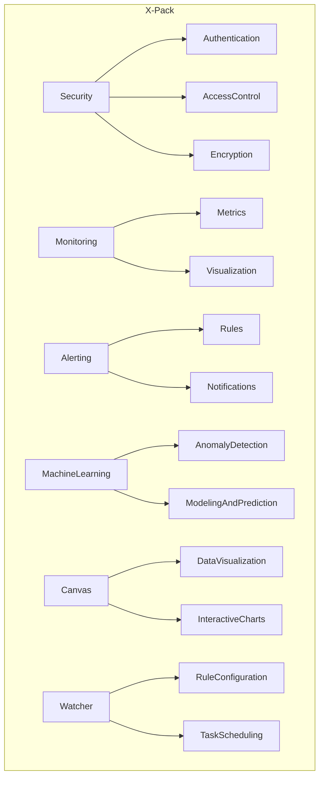

# ElasticSearch X-Pack原理与代码实例讲解

## 1. 背景介绍

### 1.1 问题的由来

随着数据量的爆炸式增长和业务需求的不断扩展,传统的数据存储和检索方式已经无法满足现代应用的需求。企业需要一种高效、可扩展、分布式的解决方案来处理海量数据,并提供实时的搜索和分析功能。这就是ElasticSearch应运而生的原因。

ElasticSearch是一个分布式、RESTful风格的搜索和分析引擎,基于Apache Lucene构建,能够快速地存储、搜索和分析大量的数据。它具有高可扩展性、高可用性和近乎实时的搜索能力,可以用于各种场景,如网站搜索、日志分析、基础设施监控等。

然而,ElasticSearch的开箱即用版本只提供了基本的搜索和分析功能,对于企业级应用场景,还需要更多的安全性、监控、警报和机器学习等高级功能。为了满足这些需求,Elastic公司推出了X-Pack,一个集成了多种高级功能的商业插件。

### 1.2 研究现状

ElasticSearch作为一款开源软件,拥有庞大的社区和活跃的开发者群体。许多公司和组织都在使用ElasticSearch及其X-Pack插件,并为其贡献代码和文档。然而,由于X-Pack的复杂性和不断更新的特性,对其原理和实现细节的深入研究仍然是一个挑战。

目前,已有一些文献和资源介绍了X-Pack的基本用法和配置,但对于其内部机制和设计思想的探讨还相对较少。一些专业的技术博客和论文对X-Pack的某些模块进行了深入分析,但缺乏一个全面、系统的介绍。

### 1.3 研究意义

深入理解ElasticSearch X-Pack的原理和实现细节,对于企业和开发者来说都有重大意义:

1. **提高系统可靠性和安全性**:X-Pack提供了多种安全功能,如身份认证、访问控制、数据加密等,有助于保护敏感数据和防止未经授权的访问。了解其原理有助于更好地配置和管理这些安全机制。

2. **优化系统性能和可扩展性**:X-Pack包含了监控、警报和机器学习等模块,可以帮助监控系统状态、发现性能瓶颈并进行自动优化。深入了解这些模块的工作原理,有助于更好地利用它们来提升系统性能和可扩展性。

3. **扩展系统功能和应用场景**:X-Pack提供了许多高级功能,如Canvas数据可视化、Watcher警报管理、机器学习等,可以将ElasticSearch应用于更多领域。研究这些模块的实现细节,有助于开发者开发出更多创新的应用。

4. **促进社区发展和知识共享**:通过深入研究X-Pack的内部机制,并分享研究成果,可以促进ElasticSearch社区的发展,推动知识的传播和交流。

### 1.4 本文结构

本文将全面介绍ElasticSearch X-Pack的核心原理和实现细节,内容包括:

1. X-Pack的核心概念和架构设计
2. 安全模块的身份认证和访问控制机制
3. 监控模块的指标采集和可视化方法
4. 警报模块的规则配置和通知机制
5. 机器学习模块的异常检测和预测建模算法
6. Canvas数据可视化模块的交互式图表构建
7. Watcher警报管理模块的规则配置和任务调度
8. 代码实例和实践指南

此外,本文还将探讨X-Pack的未来发展趋势和面临的挑战,以及相关的学习资源和工具推荐。

## 2. 核心概念与联系

在深入探讨X-Pack的具体模块之前,我们先来了解一些核心概念和它们之间的关系。

### 2.1 ElasticSearch集群

ElasticSearch是一个分布式系统,由多个节点组成集群。集群中的节点分为以下几种角色:

- **Master节点**: 负责集群的管理和协调,如分配分片、管理索引元数据等。
- **Data节点**: 负责存储和处理数据,执行搜索和聚合操作。
- **Ingest节点**: 负责数据的预处理,如数据转换、格式化等。
- **Coordinating节点**: 负责接收客户端请求,将请求转发给相应的数据节点,并汇总结果返回给客户端。
- **Machine Learning节点**: 专门用于运行机器学习任务的节点。

这些节点通过内部的通信机制协调工作,形成一个高可用、可扩展的分布式系统。

### 2.2 X-Pack架构

X-Pack是一个插件集合,包含多个功能模块,每个模块都提供特定的功能和服务。X-Pack的架构如下图所示:

其中:

- **Security模块**提供身份认证、访问控制和数据加密等安全功能。
- **Monitoring模块**收集和可视化集群的各种指标数据,用于监控系统状态。
- **Alerting模块**允许用户配置规则,在特定条件下触发警报通知。
- **Machine Learning模块**提供异常检测和预测建模等机器学习功能。
- **Canvas模块**支持创建交互式的数据可视化图表。
- **Watcher模块**用于配置警报规则和调度任务。

这些模块相互协作,为ElasticSearch提供全面的企业级功能。

## 3. 核心算法原理 & 具体操作步骤

### 3.1 算法原理概述

ElasticSearch X-Pack中的各个模块都采用了不同的算法和技术来实现其功能。这里我们重点介绍Security、Monitoring和Machine Learning三个核心模块的算法原理。

#### 3.1.1 Security模块

Security模块主要包括以下几个部分:

1. **身份认证(Authentication)**:基于JSON Web Token(JWT)实现的无状态认证机制。
2. **访问控制(Access Control)**:采用基于角色的访问控制(RBAC)模型,通过权限管理来控制对资源的访问。
3. **数据加密(Encryption)**:使用对称加密和非对称加密相结合的混合加密方案,保护数据的机密性和完整性。

#### 3.1.2 Monitoring模块

Monitoring模块主要包括以下部分:

1. **指标采集(Metrics Collection)**:使用Elasticsearch自身的监控API和Exporters收集各种指标数据,如CPU、内存、磁盘、JVM等。
2. **数据存储(Data Storage)**:将采集到的指标数据存储在内部的`.monitoring`索引中。
3. **可视化(Visualization)**:基于Kibana提供丰富的图表和仪表盘,用于可视化监控数据。

#### 3.1.3 Machine Learning模块

Machine Learning模块采用了多种机器学习算法,包括:

1. **异常检测(Anomaly Detection)**:使用随机切分森林(Random Cut Forest)算法检测时序数据中的异常模式。
2. **预测建模(Predictive Modeling)**:采用回归分析、分类算法等方法对未来趋势进行预测和建模。
3. **特征工程(Feature Engineering)**:通过数据分析和特征提取,为机器学习模型提供高质量的输入特征。

### 3.2 算法步骤详解

#### 3.2.1 Security模块算法步骤

1. **身份认证**:
   - 客户端发送包含用户名和密码的HTTP请求。
   - 服务端使用PBKDF2算法对密码进行加盐哈希处理。
   - 服务端生成JWT令牌,其中包含用户信息和过期时间等claims。
   - 客户端在后续请求中携带JWT令牌进行身份验证。

2. **访问控制**:
   - 管理员为用户分配角色,每个角色包含一组权限。
   - 当用户发起请求时,服务端检查JWT令牌的有效性。
   - 服务端根据用户的角色和请求的资源,评估是否具有相应的权限。
   - 只有具有足够权限的请求才能被执行。

3. **数据加密**:
   - 服务端使用非对称加密算法(如RSA)生成公钥和私钥对。
   - 客户端使用服务端的公钥加密对称密钥(如AES密钥)。
   - 客户端使用对称密钥加密数据,并将加密后的数据和加密的对称密钥一并发送给服务端。
   - 服务端使用私钥解密对称密钥,然后使用对称密钥解密数据。

#### 3.2.2 Monitoring模块算法步骤

1. **指标采集**:
   - Elasticsearch内置的监控API定期收集集群、节点和索引级别的指标数据。
   - Exporters从系统和JVM中采集CPU、内存、磁盘等指标数据。

2. **数据存储**:
   - 采集到的指标数据被格式化为文档,并索引到`.monitoring`索引中。
   - 索引的映射和设置被优化,以支持高效的数据查询和聚合。

3. **可视化**:
   - Kibana通过查询`.monitoring`索引获取监控数据。
   - 使用Kibana的可视化工具创建图表和仪表盘,如折线图、饼图、指标等。
   - 支持自定义视图、应用过滤条件和设置阈值等功能。

#### 3.2.3 Machine Learning模块算法步骤

1. **异常检测**:
   - 对时序数据进行预处理,如填充缺失值、标准化等。
   - 使用随机切分森林算法构建异常检测模型。
   - 将新的数据输入模型,计算异常分数。
   - 根据异常分数和设定的阈值,判断是否为异常。

2. **预测建模**:
   - 根据问题类型选择合适的算法,如回归、分类等。
   - 对历史数据进行特征工程,提取有用的特征。
   - 使用训练数据构建预测模型。
   - 将新的数据输入模型,获得预测结果。

3. **特征工程**:
   - 对原始数据进行探索性数据分析(EDA)。
   - 应用各种特征提取技术,如编码、缩放、降维等。
   - 选择有意义且不相关的特征作为模型输入。

### 3.3 算法优缺点

#### 3.3.1 Security模块

**优点**:

- JWT无状态认证机制简单高效,适合分布式系统。
- RBAC模型权限管理灵活,易于扩展和维护。
- 混合加密方案提供了数据机密性和完整性的双重保护。

**缺点**:

- JWT令牌一旦被盗,攻击者可以伪造身份直到令牌过期。
- RBAC模型管理复杂度随着角色和权限的增加而增加。
- 加密和解密操作会带来一定的性能开销。

#### 3.3.2 Monitoring模块

**优点**:

- 利用Elasticsearch自身的监控API,无需部署额外的监控系统。
- 基于Kibana的可视化功能强大,易于定制和扩展。
- 将监控数据存储在Elasticsearch中,便于进一步分析和处理。

**缺点**:

- 监控数据的存储和查询会对集群性能产生一定影响。
- 对于大规模集群,监控数据量可能会变得非常庞大。
- 缺乏一些高级监控功能,如主动告警和自动修复。

#### 3.3.3 Machine Learning模块

**优点**:

- 随机切分森林算法对异常检测表现出色,能够捕获复杂的异常模式。
- 支持多种预测建模算法,可以应对不同的问题场景。
- 通过特征工程,能够从原始数据中提取有价值的特征。

**缺点**:

- 机器学习模型的训练和预测过程计算密集,对资源要求较高。
- 模型的准确性和效果很大程度上依赖于数据质量和特征工程。
- 缺乏可解释性,模型的决策过程往往是一个黑箱。

### 3.4 算法应用领域

#### 3.4.1 Security模