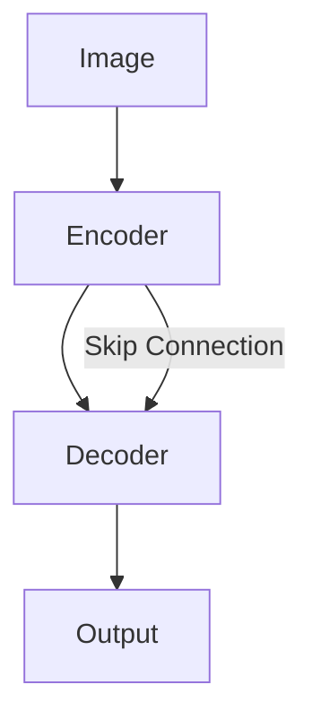

# FCN原理与代码实例讲解

## 1. 背景介绍

### 1.1 问题的由来

随着深度学习的快速发展,计算机视觉领域也取得了巨大的进步。图像语义分割作为计算机视觉的一个重要分支,旨在对图像中的每个像素进行分类,为图像理解和场景感知提供了重要基础。传统的语义分割方法主要基于手工设计特征和分类器,存在泛化能力差、鲁棒性不足等问题。近年来,基于深度学习的语义分割方法逐渐成为主流,其中全卷积网络(Fully Convolutional Networks, FCN)是一个里程碑式的工作。

### 1.2 研究现状 

自从2015年Long等人提出FCN以来,大量的研究工作围绕如何改进FCN展开。总的来说,这些改进主要集中在以下几个方面:

1. 网络结构改进:如引入空洞卷积(Dilated Convolution)、金字塔池化(Pyramid Pooling)等结构,以扩大感受野、融合多尺度信息。代表工作有DeepLab系列、PSPNet等。

2. 特征融合:通过融合浅层高分辨率特征和深层高级语义特征,兼顾分割的精细程度和类别判断能力。如U-Net、RefineNet等。

3. 上下文信息利用:通过设计各种注意力机制模块如Non-local等,以捕获长距离像素间的关系。

4. 边界优化:通过引入显式的边界监督如边界损失,或通过特殊设计的卷积核如形态学卷积,以提升预测结果在物体边界处的精度。

5. 弱监督和无监督:探索在标注数据稀缺情况下如何进行语义分割,如利用图像级别标注弱监督、对抗学习等。

这些改进有效提升了FCN的性能,在Pascal VOC、Cityscapes等公开数据集上取得了state-of-the-art的结果。

### 1.3 研究意义

语义分割在自动驾驶、医学影像分析、遥感图像解译、增强现实等诸多领域有广泛应用。研究FCN的原理和改进方法,对于推动语义分割技术的进步、服务于相关行业应用具有重要意义。一方面,深入理解FCN的内在机制,有助于我们分析深度学习模型的行为模式,把握其局限性,为算法改进提供思路。另一方面,FCN作为encoder-decoder架构的开山之作,对图像生成、风格迁移等多种任务产生了深远影响。对FCN的研究也为深度学习在其他领域的应用提供了有益参考。

### 1.4 本文结构

本文将全面介绍FCN的原理、数学基础、代码实现和应用案例。第2部分介绍FCN中的核心概念。第3部分阐述FCN的网络结构和训练推理流程。第4部分给出FCN涉及的关键公式及推导过程。第5部分提供基于PyTorch的FCN完整代码实现和讲解。第6部分列举FCN在多个领域的典型应用场景。第7部分推荐FCN相关的学习资源。第8部分对全文进行总结并展望未来研究方向。第9部分收录FCN常见问题解答。

## 2. 核心概念与联系

在介绍FCN之前,我们先明确几个核心概念:

- 全卷积网络(Fully Convolutional Networks):由卷积层、池化层、激活函数层等组成,不包含全连接层的卷积神经网络。FCN可以接受任意尺寸的输入图像,输出与输入尺寸相同的像素级别预测结果。

- 反卷积(Deconvolution)/转置卷积(Transposed Convolution):也称为分数步长卷积(Fractionally Strided Convolution),是卷积操作的逆过程。通过反卷积可以将特征图尺寸放大,恢复空间信息。FCN中用反卷积层逐步恢复特征图尺寸到输入图像大小。

- 跳跃连接(Skip Connection):将编码器浅层的高分辨率特征图与解码器深层的高级语义特征图进行融合,兼顾分割结果的精细程度和类别判断能力。FCN利用跳跃连接融合了多个中间层的特征。

- 下采样(Downsampling):通过池化或步长卷积减小特征图尺寸,扩大感受野,提取抽象语义特征的过程。FCN编码器部分主要进行下采样。

- 上采样(Upsampling):通过反卷积、双线性插值等方式恢复特征图尺寸的过程。FCN解码器部分主要进行上采样。

这些概念环环相扣,共同构成了FCN的基本框架。FCN通过下采样提取多尺度语义特征,再通过上采样逐步恢复空间细节,同时利用跳跃连接融合浅层位置信息,最终实现端到端的像素级分类。

## 3. 核心算法原理 & 具体操作步骤

### 3.1 算法原理概述

FCN的核心思想是利用卷积神经网络实现端到端的像素级分类。与经典的CNN不同,FCN抛弃了全连接层,使得网络可以接受任意尺寸的输入图像,并输出相同尺寸的分割结果。

FCN主要由编码器(encoder)和解码器(decoder)两部分组成。编码器负责提取图像的层级语义特征,解码器负责恢复特征图的空间尺寸。编码器一般采用主流的CNN分类网络如VGG、ResNet等,去掉原有的全连接层。解码器通过反卷积或上采样操作逐步放大特征图。

为了兼顾分割的精细程度和类别判断能力,FCN提出了跳跃连接的思想。将编码器部分多个中间层的特征图与解码器的相应层进行逐元素相加,融合了高分辨率的浅层特征和高级语义的深层特征。

FCN的训练过程与标准的CNN分类网络类似,采用端到端的反向传播算法,以交叉熵损失函数为优化目标,利用梯度下降法对网络权重进行更新。推理时,对任意尺寸图像进行一次前向传播即可得到每个像素的类别预测结果。

### 3.2 算法步骤详解

下面以经典的FCN-8s为例,详细讲解FCN的构建和训练推理步骤。

1. 以VGG16为基础构建编码器:
   - 去掉VGG16的全连接层fc6、fc7、fc8
   - 保留5个卷积组(conv1到conv5)和4个池化层(pool1到pool4)

2. 构建解码器:
   - 在VGG16的pool3、pool4和conv7层后分别添加1x1卷积,将通道数映射为类别数K,得到预测特征图pool3_predict、pool4_predict、conv7_predict
   - 以conv7_predict为基础,经过一次4x上采样(上采样因子stride=4),得到与pool4尺寸相同的特征图fcn_16s
   - fcn_16s与pool4_predict逐元素相加,再经过一次2x上采样,得到与pool3尺寸相同的特征图fcn_8s  
   - fcn_8s与pool3_predict逐元素相加,再经过一次8x上采样,得到与输入尺寸相同的特征图fcn_8s_final

3. 设计损失函数:
   - 对fcn_8s_final应用softmax激活,得到每个像素的类别概率分布
   - 将真值标签图进行one-hot编码,与预测概率分布计算逐像素交叉熵损失

4. 训练网络:
   - 利用反向传播算法计算损失函数对各层权重的梯度
   - 使用梯度下降法(如Adam优化器)更新权重
   - 迭代进行以上步骤直到模型收敛或达到预设的epoch数

5. 测试阶段:
   - 将训练好的FCN模型应用于测试图像
   - 对图像进行一次前向传播,得到输出的分割概率图
   - 对每个像素取概率最大的类别作为预测标签,得到最终的分割结果图

以上就是FCN的主要构建和训练推理流程。通过编码器提取多层次特征,解码器逐步恢复空间信息并融合跨层特征,最终实现端到端的像素级分类。

### 3.3 算法优缺点

FCN作为语义分割领域的开创性工作,具有以下优点:

1. 端到端的像素级分类:FCN实现了从输入图像到输出分割图的端到端映射,无需手工设计特征或后处理步骤,大大简化了语义分割流程。

2. 任意尺寸的输入:去除全连接层后,FCN可以接受任意尺寸的输入图像,具有更好的灵活性。

3. 高效的推理:FCN去除了冗余的全连接层,推理时只需一次前向传播,速度很快。

4. 多尺度特征的融合:通过跳跃连接融合了编码器多个层次的特征,兼顾了分割的精细程度和类别判断能力。

但FCN也存在一些不足:

1. 上采样导致的锯齿效应:FCN采用反卷积或双线性插值进行上采样,在物体边界处容易产生锯齿状的不真实效果。

2. 感受野有限:FCN的感受野主要由卷积核大小和下采样倍数决定,对小目标和细节的刻画能力有限。

3. 缺乏全局上下文信息:FCN逐像素进行分类,缺乏对全局场景的理解,容易产生语义不一致的分割结果。

4. 边界定位不准:FCN对边界像素的定位精度偏低,在图像语义理解任务中表现欠佳。

这些问题在后续的研究工作中得到了改进,如采用条件随机场(CRF)后处理、引入空洞卷积(Dilated Convolution)等。

### 3.4 算法应用领域

FCN是通用的语义分割算法,可应用于多个领域,如:

1. 自动驾驶:可用于街景图像的语义理解,如车道线、交通标志、行人等关键要素的分割。

2. 遥感图像分析:可用于土地利用分类、变化检测等任务,提供像素级别的地物识别结果。

3. 医学影像分析:可用于器官、肿瘤等区域的分割,辅助疾病诊断和手术规划。

4. 工业视觉检测:可用于工件缺陷、瑕疵的分割,实现自动化视觉检测。

5. 增强现实:可用于图像语义分割,实现虚拟信息与真实场景的融合互动。

6. 时尚服饰分析:可用于服饰图像的语义分割,实现服饰款式、面料、配饰等要素的识别。

FCN为这些领域的智能化应用提供了有力支撑,具有广阔的应用前景。

## 4. 数学模型和公式 & 详细讲解 & 举例说明

FCN涉及卷积、池化、反卷积、Softmax、交叉熵损失等数学运算,下面对其中的关键公式进行讲解。

### 4.1 数学模型构建

设输入图像为$\mathbf{X} \in \mathbb{R}^{H \times W \times C}$,其中$H$、$W$、$C$分别为图像的高、宽、通道数。FCN的目标是学习一个映射函数$f$,将输入图像映射为像素级别的类别概率图$\mathbf{Y} \in \mathbb{R}^{H \times W \times K}$,其中$K$为类别数。

假设FCN包含$L$个下采样层和$M$个上采样层,则可表示为:

$$
f(\mathbf{X}) = u_M \circ \dots \circ u_1 \circ d_L \circ \dots \circ d_1(\mathbf{X})
$$

其中$d_l$表示第$l$个下采样层,$u_m$表示第$m$个上采样层,$\circ$表示层之间的复合运算。

对于第$l$个下采样层,设其包含卷积、ReLU激活、最大池化三个子层,可表示为:

$$
d_l(\mathbf{X}_l) = \text{MaxPool}(\text{ReLU}(\mathbf{W}_l * \mathbf{X}_l + \