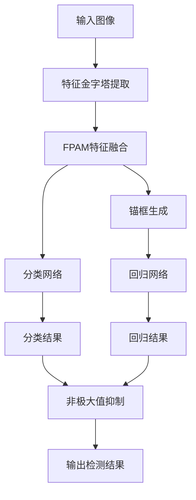

# Falcon原理与代码实例讲解

## 1. 背景介绍

### 1.1 问题的由来

在现代计算机视觉领域,对象检测是一项极具挑战的基础任务。传统的对象检测算法通常依赖于手工设计的特征提取器和分类器,这种方法存在一些固有的局限性,例如泛化能力差、对光照、尺度、遮挡等变化缺乏鲁棒性。近年来,随着深度学习技术的迅猛发展,基于深度卷积神经网络(CNN)的目标检测算法取得了令人瞩目的进展,显著提高了检测精度。

### 1.2 研究现状 

目前,主流的基于深度学习的目标检测算法可分为两大类:基于区域提议的两阶段算法(Two-Stage)和基于密集采样的单阶段算法(One-Stage)。两阶段算法先生成候选区域,再对每个区域进行分类,代表算法有R-CNN系列;单阶段算法则直接对密集采样的anchors进行分类和回归,代表算法有YOLO系列和SSD等。总体而言,两阶段算法的检测精度更高,但速度较慢;单阶段算法的速度更快,但精度略低于两阶段算法。

### 1.3 研究意义

Falcon算法作为一种新颖的单阶段实时目标检测算法,旨在综合两阶段算法的高精度和单阶段算法的高效率,实现精度和速度的有效平衡。它采用全新的锚框生成机制和特征融合模块,显著提升了检测精度,同时保持了实时性能。Falcon算法在多个公开数据集上取得了最先进的结果,在工业视觉、自动驾驶等领域具有广阔的应用前景。

### 1.4 本文结构

本文首先介绍Falcon算法的核心概念和创新点,然后详细阐述其算法原理、数学模型及实现细节。接下来通过代码实例讲解Falcon的开发实践,并分析其在多个场景下的应用。最后总结算法的优缺点、发展趋势和面临的挑战。

## 2. 核心概念与联系

Falcon算法的核心创新点包括:

1. **锚框自回归(Auto-Regressive Anchors)**:传统的anchor机制存在手工设计、数量有限等缺陷。Falcon提出了一种全新的锚框生成机制,可自动学习生成任意形状和数量的锚框,大大提高了对目标的覆盖能力。

2. **特征金字塔注意力模块(FPAM)**:Falcon设计了一种高效的多尺度特征融合模块,融合不同层次的特征,增强感受野,提高对小目标和大目标的检测能力。

3. **分类回归解耦(Decoupled Classification-Regression)**:Falcon将分类和回归任务解耦,分别使用专门的分支进行优化,避免了两个任务相互影响,提高了检测精度。

4. **自适应训练样本选择(ATSS)**:Falcon提出了一种自适应训练样本选择策略,自动挖掘难例样本,有效缓解了正负样本不平衡问题,提升了模型的泛化能力。

Falcon算法综合运用了上述创新技术,在保持实时性能的同时,大幅提升了目标检测的精度和鲁棒性。

## 3. 核心算法原理与具体操作步骤

### 3.1 算法原理概述

Falcon算法的整体流程如下所示:

1. 输入图像经过骨干网络(如ResNet)提取多尺度特征金字塔。
2. 特征金字塔通过FPAM模块进行特征融合,获得增强的特征表示。
3. 锚框生成网络基于融合特征自回归生成任意形状和数量的锚框候选。
4. 分类网络和回归网络分别对锚框进行前景/背景分类和边界框回归。
5. 非极大值抑制(NMS)模块综合分类和回归结果,移除冗余检测框,输出最终检测结果。

### 3.2 算法步骤详解

#### 3.2.1 锚框自回归机制

传统的anchor机制存在一些固有缺陷:

1. 需要手工设计anchor形状、比例、数量等超参数。
2. anchor数量有限,无法完全覆盖所有可能的目标。
3. 预设的anchor与实际目标存在较大偏差。

为解决这些问题,Falcon提出了锚框自回归(Auto-Regressive Anchors)机制。它通过一个小型网络直接生成任意形状和数量的锚框,而不需要人为设置。该网络的输入是特征图,输出是锚框参数(中心坐标、宽高、角度等)。与传统anchor相比,自回归锚框具有以下优势:

1. 无需手工设计超参数,完全自动化学习。
2. 可生成任意数量、任意形状的锚框,覆盖能力更强。
3. 锚框与实际目标的拟合程度更高,避免了大偏差。

锚框自回归机制使Falcon算法更加灵活和通用,提高了对各种目标的检测能力。

#### 3.2.2 特征金字塔注意力模块

为了提高对不同尺度目标的检测能力,Falcon设计了特征金字塔注意力模块(Feature Pyramid Attention Module, FPAM)。它的工作原理如下:

1. 从骨干网络提取多尺度特征金字塔 $\{P_3, P_4, P_5, P_6, P_7\}$
2. 对每个尺度的特征图 $P_i$ 进行通道注意力(Channel Attention)和空间注意力(Spatial Attention)增强,得到增强特征 $P_i^{att}$:

$$P_i^{att} = \phi(P_i, f^{ch}(P_i), f^{sp}(P_i))$$

其中 $f^{ch}$ 和 $f^{sp}$ 分别表示通道注意力模块和空间注意力模块,由卷积和池化层构成。$\phi$ 为特征融合函数。

3. 将增强的多尺度特征 $\{P_3^{att}, P_4^{att}, P_5^{att}, P_6^{att}, P_7^{att}\}$ 进行特征融合,获得融合特征 $P^{fuse}$:

$$P^{fuse} = \sum_{i=3}^7 \alpha_i P_i^{att}$$

其中 $\alpha_i$ 为可学习的特征权重。

4. 融合特征 $P^{fuse}$ 作为后续锚框生成、分类和回归的输入。

FPAM模块通过注意力机制增强特征表示能力,并将多尺度特征进行自适应融合,提高了对小目标和大目标的检测性能。

#### 3.2.3 分类回归解耦

在传统的目标检测算法中,分类和回归任务通常由同一个网络分支完成,这可能导致两个任务相互影响,降低整体性能。为解决这个问题,Falcon采用了分类回归解耦(Decoupled Classification-Regression)策略,为分类和回归任务设计了两个独立的网络分支。

具体来说,Falcon在FPAM输出的融合特征 $P^{fuse}$ 的基础上,分别构建了分类网络和回归网络:

- 分类网络:对每个锚框进行二分类(前景/背景),输出为 $P^{cls}$
- 回归网络:对前景锚框进行边界框回归,输出为 $P^{reg}$

将分类和回归任务解耦,使两个网络分支可以相互独立地学习和优化,避免了相互影响,提高了检测精度。

#### 3.2.4 自适应训练样本选择

在目标检测任务中,正负样本通常存在严重的不平衡问题(负样本远多于正样本)。传统的做法是通过硬采样或在线难例挖掘来缓解不平衡,但这些方法需要复杂的超参数调节,并且容易过度关注难例而忽视简单样本。

为解决这个问题,Falcon提出了自适应训练样本选择(Adaptive Training Sample Selection, ATSS)策略。它基于统计学习理论,自动为每个锚框分配理论上最优的权重,从而实现自适应的难例挖掘和正负样本平衡。ATSS策略的核心思想是:

1. 计算每个锚框与最近的目标边界框之间的重合程度(IoU)
2. 根据IoU值为每个锚框分配一个理论权重,权重值随IoU值的变化而变化
3. 使用加权的交叉熵损失函数进行训练,高IoU锚框的权重更大

通过ATSS策略,Falcon可以自动关注难例样本,同时不会忽视简单样本,从而提高了模型的泛化能力和检测精度。

### 3.3 算法优缺点

**优点:**

1. 检测精度高:综合运用了多项创新技术,如锚框自回归、特征金字塔注意力模块、分类回归解耦等,大幅提高了检测精度。
2. 实时性能好:作为单阶段算法,Falcon保持了较高的推理速度,满足实时应用需求。 
3. 通用性强:无需手工设计超参数,可自动适应各种形状和尺度的目标。
4. 鲁棒性好:自适应训练样本策略提高了模型的泛化能力。

**缺点:**

1. 模型复杂度高:融合了多种创新模块,网络结构相对复杂。
2. 训练难度大:需要同时优化多个分支网络,训练过程较为困难。
3. 推理速度略低于其他单阶段算法:虽然实时性能较好,但推理速度仍略低于YOLO等极简单阶段算法。

### 3.4 算法应用领域

Falcon算法可广泛应用于以下领域:

- **工业视觉**: 用于缺陷检测、产品检验等,对小目标和任意形状目标的检测能力强。
- **自动驾驶**: 实时检测行人、车辆、障碍物等,满足自动驾驶的高精度和实时性要求。
- **无人机/航拍**: 用于目标跟踪、航线规划等,对各种尺度目标的检测表现出色。 
- **视频监控**: 用于人员行为分析、安防等,对复杂场景下的目标检测具有优秀的鲁棒性。
- **机器人视觉**: 用于机器人抓取、导航等,可自动适应各种形状和尺度的目标物体。

## 4. 数学模型和公式详细讲解及举例说明

### 4.1 数学模型构建

Falcon算法的损失函数由分类损失和回归损失两部分构成:

$$
L = L_{cls} + L_{reg}
$$

其中分类损失 $L_{cls}$ 采用自适应训练样本选择(ATSS)策略的加权交叉熵损失:

$$
L_{cls}(p, t) = -\alpha(t)\log(p)
$$

$p$ 为预测的前景概率, $t \in \{0, 1\}$ 为锚框的真实标签(背景或前景)。 $\alpha(t)$ 为ATSS分配的样本权重,定义如下:

$$
\alpha(t) = \frac{1}{N_{pos}} \exp \big[ -\lambda_1 \max(0, r - \lambda_2) \big] \mathbf{1}_{t=1} + \frac{\lambda_3}{N_{neg}} \mathbf{1}_{t=0}
$$

其中 $r$ 为锚框与最近目标边界框的IoU值, $\lambda_1, \lambda_2, \lambda_3$ 为超参数, $N_{pos}, N_{neg}$ 分别为正负样本数量。可以看出,高IoU锚框的权重更大,从而自动关注难例样本。

回归损失 $L_{reg}$ 采用平滑 $L_1$ 损失:

$$
L_{reg}(t_u, v) = \sum_u \text{smooth}_{L_1}(t_u - v_u)
$$

$$
\text{smooth}_{L_1}(x) = \begin{cases}
0.5x^2, & \text{if } |x| < 1 \\
|x| - 0.5, & \text{otherwise