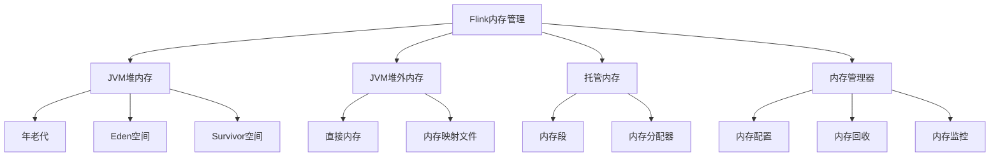

# Flink Memory Management原理与代码实例讲解

## 1. 背景介绍

### 1.1 问题的由来

在大数据时代，数据量的快速增长对于数据处理系统的性能和资源利用率提出了更高的要求。Apache Flink作为一种新兴的分布式流式数据处理引擎,其内存管理机制对于系统的整体性能和稳定性至关重要。合理高效的内存管理策略可以最大化利用有限的内存资源,提高数据处理效率,同时避免发生内存不足(OutOfMemoryError)等问题。

### 1.2 研究现状

Apache Flink采用了基于JVM堆外内存(Off-Heap Memory)和托管内存(Managed Memory)的混合内存管理模型。这种模型旨在平衡内存利用率、垃圾回收开销和操作系统内存管理开销之间的关系。然而,在实际应用场景中,如何根据具体的数据处理需求和集群资源情况合理配置和调优内存管理参数仍然是一个值得探讨的问题。

### 1.3 研究意义

深入理解Flink内存管理的原理和实现机制,对于开发人员来说具有重要意义。它不仅有助于更好地利用集群资源,提高数据处理效率,还可以帮助开发人员预防和排查内存相关的问题,从而提高应用程序的稳定性和可靠性。此外,对Flink内存管理机制的研究也可以为其他大数据处理系统的内存管理策略提供借鉴和参考。

### 1.4 本文结构

本文将从以下几个方面深入探讨Flink内存管理的原理和实践:

1. 介绍Flink内存管理的核心概念和架构设计
2. 详细解释Flink内存管理的算法原理和具体实现步骤
3. 阐述内存管理相关的数学模型和公式,并通过案例进行讲解
4. 提供基于Flink的实际代码实例,并对关键代码进行解读和分析
5. 探讨Flink内存管理在实际应用场景中的使用和优化方法
6. 推荐相关的学习资源、开发工具和论文资料
7. 总结Flink内存管理的发展趋势和面临的挑战
8. 回答常见的问题和疑虑

## 2. 核心概念与联系

在深入探讨Flink内存管理的细节之前,我们需要先了解一些核心概念和它们之间的联系。

1. **JVM堆内存(Heap Memory)**: 用于存储Java对象实例和相关元数据。它由年老代(Old Generation)、Eden空间(Eden Space)和Survivor空间(Survivor Space)组成。

2. **JVM堆外内存(Off-Heap Memory)**: 不受JVM堆内存限制,可以直接从操作系统申请和管理内存。包括直接内存(Direct Memory)和内存映射文件(Memory-Mapped Files)。

3. **托管内存(Managed Memory)**: Flink自己实现的一种内存管理机制,用于管理数据流的缓冲区、中间结果等。它由多个内存段(Memory Segment)组成,并由内存分配器(Memory Allocator)进行分配和回收。

4. **内存管理器(Memory Manager)**: 负责管理和协调Flink内存资源的核心组件,包括内存配置、内存回收和内存监控等功能。

这些核心概念相互关联,共同构建了Flink的内存管理架构。JVM堆内存和堆外内存用于存储Java对象和原生数据,而托管内存则专门用于管理Flink自身的数据流和中间结果。内存管理器作为协调者,负责配置、管理和监控这些不同类型的内存资源。

## 3. 核心算法原理 & 具体操作步骤

### 3.1 算法原理概述

Flink内存管理的核心算法原理基于以下几个关键点:

1. **内存分段**: 将内存划分为多个固定大小的内存段,每个内存段可以独立分配和回收,从而提高内存利用率和降低内存碎片化。

2. **内存复用**: 通过内存池和缓冲区重用机制,减少频繁的内存分配和回收操作,降低内存管理开销。

3. **基于生命周期的内存管理**: 根据数据流的生命周期,动态调整内存分配和回收策略,确保内存资源的高效利用。

4. **内存限制和溢出处理**: 设置合理的内存限制,并在发生内存不足时采取相应的策略(如数据溢写到磁盘等),保证系统的稳定运行。

5. **内存监控和调优**: 实时监控内存使用情况,并根据实际需求动态调整内存配置参数,优化内存利用效率。

### 3.2 算法步骤详解

1. **初始化内存配置**

   在Flink作业启动时,根据用户配置和集群资源情况,初始化内存管理器和相关内存池。这包括设置总内存限制、内存段大小、内存复用策略等参数。

2. **内存分配**

   当需要存储数据流或中间结果时,内存管理器会从内存池中分配一个或多个内存段。如果内存池中没有足够的空闲内存段,则会尝试从其他内存池借用或者直接从操作系统申请新的内存。

3. **内存使用和回收**

   分配的内存段会被用于存储数据流或中间结果。当数据处理完成或者内存段不再需要时,内存管理器会将其回收到内存池中,以供后续复用。

4. **内存溢写**

   如果内存资源不足以容纳所有数据,Flink会将部分数据溢写到磁盘上,以避免内存不足错误。溢写数据会在后续处理时从磁盘读取,并与内存中的数据合并处理。

5. **内存监控和调优**

   在作业运行过程中,内存管理器会实时监控内存使用情况,包括内存池利用率、内存段分配和回收情况等。根据监控数据,可以动态调整内存配置参数,优化内存利用效率。

6. **内存释放**

   当Flink作业结束时,内存管理器会释放所有分配的内存资源,包括内存池中的内存段和从操作系统申请的直接内存等。

### 3.3 算法优缺点

**优点**:

- 提高内存利用率,减少内存碎片化
- 降低内存管理开销,提高数据处理效率
- 支持内存溢写,保证系统稳定运行
- 可配置和动态调整内存参数,满足不同场景需求

**缺点**:

- 增加了系统复杂度,需要更多的内存管理开销
- 内存溢写会导致性能下降,需要权衡内存和磁盘IO开销
- 配置不当可能导致内存浪费或内存不足问题

### 3.4 算法应用领域

Flink内存管理算法可以广泛应用于以下领域:

- 大数据处理系统,如Apache Spark、Apache Hadoop等
- 流式数据处理系统,如Apache Kafka、Apache Storm等
- 内存数据库和缓存系统,如Redis、Memcached等
- 科学计算和高性能计算领域
- 游戏开发和图形渲染领域

任何需要高效管理和利用内存资源的系统或应用程序,都可以借鉴Flink内存管理算法的思想和实现方式。

## 4. 数学模型和公式 & 详细讲解 & 举例说明

### 4.1 数学模型构建

为了更好地理解和优化Flink内存管理策略,我们可以构建一个数学模型来描述内存分配和回收过程。

假设系统中有 $N$ 个内存段,每个内存段的大小为 $S$ 字节。我们定义以下变量:

- $M$: 总内存大小(字节)
- $U(t)$: 时刻 $t$ 时已使用的内存大小(字节)
- $F(t)$: 时刻 $t$ 时空闲内存大小(字节)
- $R(t)$: 时刻 $t$ 时内存分配请求率(请求/秒)
- $D(t)$: 时刻 $t$ 时内存释放率(字节/秒)

则有:

$$
M = N \times S \\
U(t) + F(t) = M \\
\frac{dU(t)}{dt} = R(t) - D(t)
$$

我们的目标是最小化内存浪费,即最大化内存利用率:

$$
\max \limits_{t} \frac{U(t)}{M}
$$

同时,我们需要确保在任何时刻 $t$,都有足够的空闲内存来满足新的内存分配请求:

$$
F(t) \geq R(t) \times T
$$

其中 $T$ 是一个预定义的时间阈值,表示在这个时间范围内,系统应该能够响应新的内存分配请求。

通过构建和优化这个数学模型,我们可以确定合理的内存段大小 $S$、总内存大小 $M$ 以及内存复用策略,从而提高内存利用效率和系统性能。

### 4.2 公式推导过程

接下来,我们将推导一个公式,用于计算在给定内存限制和数据率下,系统可以处理的最大数据量。

假设:

- 总内存限制为 $M$ 字节
- 数据输入率为 $R$ 字节/秒
- 数据处理率为 $P$ 字节/秒
- 内存段大小为 $S$ 字节
- 内存溢写开销为 $O$ 字节/秒

我们定义 $U(t)$ 为时刻 $t$ 时内存中的数据量(字节)。根据前面的数学模型,我们有:

$$
\frac{dU(t)}{dt} = R - P - O
$$

当系统达到稳定状态时,内存中的数据量保持不变,即 $\frac{dU(t)}{dt} = 0$,因此:

$$
R - P - O = 0 \\
P = R - O
$$

另一方面,由于内存限制,我们有:

$$
U(t) \leq M - N \times S
$$

其中 $N$ 是系统中内存段的数量。

将上面两个等式结合,我们可以得到:

$$
\int_0^T R dt \leq M - N \times S + \int_0^T O dt
$$

其中 $T$ 是处理时间。

假设内存溢写开销 $O$ 是一个常数,则:

$$
R \times T \leq M - N \times S + O \times T \\
T \leq \frac{M - N \times S}{R - O}
$$

这个公式给出了在给定内存限制和数据率下,系统可以持续处理数据的最长时间 $T$。相应地,最大数据量为:

$$
V_\max = R \times T = \frac{R \times (M - N \times S)}{R - O}
$$

通过这个公式,我们可以评估不同内存配置下的系统处理能力,并进行相应的优化和调整。

### 4.3 案例分析与讲解

为了更好地理解上述数学模型和公式,我们来分析一个具体的案例。

假设我们有一个Flink作业,需要处理一个流式数据源,数据输入率为 100MB/s。系统的总内存限制为 32GB,内存段大小为 32KB。我们希望确定在这种配置下,系统可以持续处理数据的最长时间,以及相应的最大数据量。

首先,我们需要估计内存溢写开销 $O$。假设内存溢写开销为 10MB/s,则:

$$
R = 100\,\text{MB/s} \\
M = 32\,\text{GB} = 32 \times 1024\,\text{MB} \\
S = 32\,\text{KB} = 0.032\,\text{MB} \\
N = \frac{M}{S} = \frac{32 \times 1024}{0.032} = 1048576 \\
O = 10\,\text{MB/s}
$$

将这些值代入前面推导的公式,我们