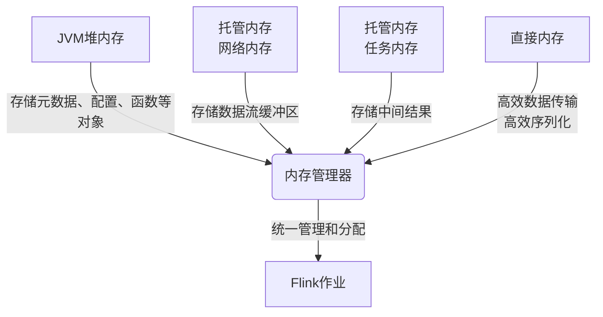

# Flink Memory Management原理与代码实例讲解

## 1. 背景介绍

### 1.1 问题的由来

在大数据时代,数据量的快速增长对数据处理系统的性能和资源利用率提出了更高的要求。作为一种流行的分布式流处理框架,Apache Flink在处理大规模数据流时,内存管理扮演着至关重要的角色。高效的内存管理策略不仅能够提高系统的吞吐量和延迟,还能够减少资源浪费,提高集群利用率。

### 1.2 研究现状

目前,Flink的内存管理主要包括三个部分:JVM堆内存、托管内存和直接内存。JVM堆内存用于存储常规Java对象,托管内存用于存储数据流的缓冲区和中间结果,直接内存则用于高效的数据传输和序列化操作。Flink采用了多种内存管理策略来优化不同场景下的性能,例如基于堆外内存的缓冲区重用、基于生命周期的内存管理等。

### 1.3 研究意义

深入理解Flink内存管理原理对于开发人员来说至关重要,有助于合理配置内存参数、优化内存使用、排查内存相关问题等。同时,研究Flink内存管理的设计思路和实现细节,也有助于开发人员在设计自己的系统时借鉴相关经验。

### 1.4 本文结构

本文将首先介绍Flink内存管理的核心概念和架构,然后深入探讨内存管理的算法原理和数学模型,并通过代码实例和应用场景分析,帮助读者全面理解Flink内存管理的实现细节和实践经验。

## 2. 核心概念与联系

在深入探讨Flink内存管理原理之前,我们需要先了解一些核心概念和它们之间的联系。

### 2.1 JVM堆内存

JVM堆内存是Java虚拟机中用于存储对象实例和数组的内存区域。在Flink中,JVM堆内存主要用于存储作业相关的元数据、配置信息、用户函数等对象。由于JVM堆内存的管理由Java虚拟机自动完成,因此开发人员无需过多关注。

### 2.2 托管内存

托管内存是Flink用于存储数据流缓冲区和中间结果的内存区域。与JVM堆内存不同,托管内存由Flink自身管理,可以更好地控制内存使用和优化性能。托管内存分为两部分:网络内存和任务内存。

1. **网络内存**:用于存储传入和传出的数据流缓冲区,以及一些网络传输相关的元数据。
2. **任务内存**:用于存储算子的中间结果,如窗口缓冲区、连接哈希表等。

### 2.3 直接内存

直接内存是JVM直接在操作系统级别申请的一块内存区域,不受JVM堆内存限制。在Flink中,直接内存主要用于以下两个场景:

1. **高效的数据传输**:通过直接内存可以避免数据在JVM堆内存和操作系统内核之间的额外拷贝,提高数据传输效率。
2. **高效的序列化和反序列化**:Flink使用直接内存作为序列化和反序列化的缓冲区,提高了序列化性能。

### 2.4 内存管理器

Flink通过内存管理器(MemoryManager)来统一管理和分配上述三种类型的内存。内存管理器负责根据作业的内存配置和资源需求,合理分配和回收内存资源。它还实现了一些内存优化策略,如基于生命周期的内存管理、内存段重用等。

### 2.5 核心概念关系

上述核心概念之间的关系如下所示:

## 3. 核心算法原理 & 具体操作步骤

在上一节中,我们了解了Flink内存管理的核心概念和它们之间的关系。接下来,我们将深入探讨Flink内存管理的核心算法原理和具体操作步骤。

### 3.1 算法原理概述

Flink内存管理的核心算法原理可以概括为以下几个方面:

1. **基于生命周期的内存管理**:Flink根据数据流和中间结果的生命周期,动态分配和回收内存资源,避免内存浪费。
2. **内存段重用**:Flink采用内存段重用策略,复用已经分配但未使用的内存段,提高内存利用率。
3. **基于代价模型的内存分配**:Flink根据算子的内存代价模型,合理分配网络内存和任务内存,优化内存使用。
4. **流控制和反压机制**:Flink通过流控制和反压机制,防止下游算子被过多的数据淹没,从而避免内存溢出。

### 3.2 算法步骤详解

下面我们将详细介绍Flink内存管理算法的具体步骤。

#### 3.2.1 内存分配

在作业启动时,Flink会根据用户配置的总内存大小和其他参数,计算出网络内存、任务内存和直接内存的大小,并为每个TaskManager进程分配相应的内存资源。

具体分配过程如下:

1. 计算总内存大小:根据用户配置的总内存大小或者自动计算得到。
2. 预留直接内存:从总内存中预留一部分作为直接内存。
3. 计算网络内存:根据算子的内存代价模型,计算网络内存的大小。
4. 计算任务内存:任务内存 = 总内存 - 网络内存 - 直接内存。

#### 3.2.2 内存段分配

在运行时,Flink会根据算子的需求动态分配内存段(MemorySegment)。内存段是Flink内存管理的基本单元,用于存储数据流缓冲区和中间结果。

内存段分配过程如下:

1. 从内存池中获取可用内存段:Flink维护一个内存段池,存储已分配但未使用的内存段。
2. 如果内存池中没有可用内存段,则从托管内存中分配新的内存段。
3. 将分配的内存段与算子的缓冲区或中间结果关联。

#### 3.2.3 内存段回收

当数据流缓冲区或中间结果不再需要时,Flink会回收相应的内存段,以供后续重用。

内存段回收过程如下:

1. 将与算子关联的内存段从算子中分离。
2. 清空内存段中的数据。
3. 将内存段放回内存池中,供后续分配使用。

#### 3.2.4 流控制和反压

为了防止下游算子被过多的数据淹没导致内存溢出,Flink采用了流控制和反压机制。

具体步骤如下:

1. 每个算子都维护一个输入缓冲区,用于暂存来自上游的数据。
2. 当输入缓冲区达到一定阈值时,算子会向上游发送反压信号,要求上游暂停发送数据。
3. 上游算子收到反压信号后,会暂停发送数据,直到下游缓冲区有足够空间。
4. 当下游缓冲区有足够空间时,会向上游发送恢复信号,上游算子继续发送数据。

通过这种机制,Flink可以有效控制数据流量,避免内存溢出。

### 3.3 算法优缺点

Flink内存管理算法的优点包括:

1. **高效利用内存资源**:基于生命周期的内存管理和内存段重用策略可以有效减少内存浪费,提高内存利用率。
2. **动态调整内存分配**:根据算子的实际需求动态分配内存,避免过度分配或不足分配。
3. **流控制和反压机制**:防止下游算子被过多数据淹没,避免内存溢出。

但是,该算法也存在一些缺点:

1. **内存管理开销**:动态分配和回收内存段会带来一定的开销,在某些场景下可能影响性能。
2. **内存碎片化**:频繁分配和回收内存段可能导致内存碎片化,降低内存利用率。
3. **配置复杂性**:需要合理配置多个内存参数,对于初学者来说可能有一定困难。

### 3.4 算法应用领域

Flink内存管理算法主要应用于以下领域:

1. **大数据流处理**:在处理大规模数据流时,高效的内存管理对于提高系统吞吐量和降低延迟至关重要。
2. **机器学习**:在机器学习领域,内存管理算法可以用于管理训练数据、模型参数等,提高资源利用率。
3. **实时分析**:在实时分析场景中,内存管理算法可以帮助系统高效处理实时数据,满足低延迟的要求。
4. **物联网**:在物联网领域,内存管理算法可以应用于边缘计算设备,优化资源利用。

## 4. 数学模型和公式 & 详细讲解 & 举例说明

在上一节中,我们详细介绍了Flink内存管理的核心算法原理和具体操作步骤。在这一节,我们将探讨内存管理背后的数学模型和公式,并通过案例分析和常见问题解答,帮助读者更好地理解和掌握这些概念。

### 4.1 数学模型构建

为了合理分配网络内存和任务内存,Flink采用了基于代价模型的内存分配策略。该模型的核心思想是,根据算子的输入和输出数据率、选择性等因素,估计算子处理数据的代价,从而确定所需的内存大小。

具体来说,Flink将算子的内存代价分为四个部分:

1. **输入数据流的内存代价**:用于缓存输入数据流。
2. **输出数据流的内存代价**:用于缓存输出数据流。
3. **中间结果的内存代价**:用于存储算子的中间结果,如窗口缓冲区、连接哈希表等。
4. **算子本身的内存代价**:用于存储算子的状态、函数对象等。

我们可以用以下公式表示算子的总内存代价:

$$
\text{TotalCost} = \text{InputCost} + \text{OutputCost} + \text{StateCost} + \text{OpCost}
$$

其中:

- $\text{InputCost}$表示输入数据流的内存代价
- $\text{OutputCost}$表示输出数据流的内存代价
- $\text{StateCost}$表示中间结果的内存代价
- $\text{OpCost}$表示算子本身的内存代价

接下来,我们将详细介绍每个部分的计算方式。

#### 4.1.1 输入数据流的内存代价

输入数据流的内存代价主要取决于输入数据流的数据率和缓冲区大小。我们可以用以下公式表示:

$$
\text{InputCost} = \text{InputBufferSize} \times \text{NumInputGates}
$$

其中:

- $\text{InputBufferSize}$表示每个输入缓冲区的大小,由用户配置或自动计算得到
- $\text{NumInputGates}$表示算子的输入gate数量,等于上游算子的并行度

#### 4.1.2 输出数据流的内存代价

输出数据流的内存代价主要取决于输出数据流的数据率和缓冲区大小。我们可以用以下公式表示:

$$
\text{OutputCost} = \text{OutputBufferSize} \times \text{NumOutputGates}
$$

其中:

- $\text{OutputBufferSize}$表示每个输出缓冲区的大小,由用户配置或自动计算得到
- $\text{NumOutputGates}$表示算子的输出gate数量,等于下游算子的并行度

#### 4.1.3 中间结果的内存代价

中间结果的内存代价取决于算子的具体类型和实现。对于一些常见的算子,Flink提供了预估内存代价的公式。

以窗口算子为例,