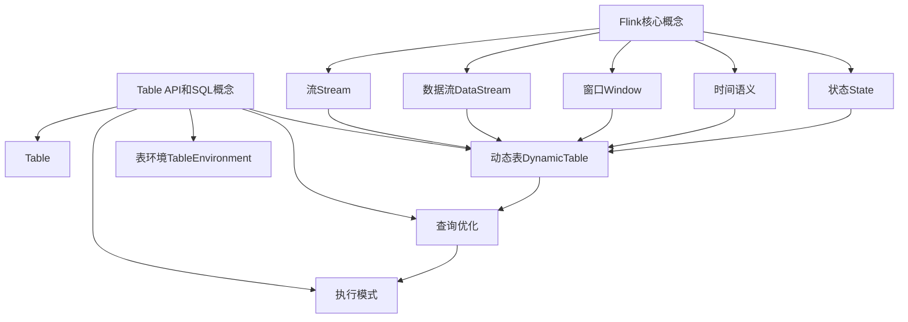

# Flink Table API和SQL原理与代码实例讲解

## 1. 背景介绍

### 1.1 问题的由来

在当今的大数据时代，实时数据处理和分析已经成为了许多企业和组织的关键需求。传统的批处理系统无法满足对实时性的要求,而流式处理系统则能够及时地处理持续到来的数据流。Apache Flink作为一种新兴的开源流处理框架,凭借其低延迟、高吞吐量和容错性,已经被广泛应用于各种实时数据处理场景。

然而,对于数据分析人员和应用开发人员来说,直接使用Flink的DataStream API进行编程可能会存在一定的学习曲线。为了降低使用门槛,Flink提供了基于SQL的Table API和SQL查询语言,使得用户可以使用类似于关系型数据库的方式来查询和处理流数据。

### 1.2 研究现状

Flink Table API和SQL是Flink生态系统中非常重要的组成部分,它们为用户提供了声明式的编程范式,使得数据处理过程更加简洁和高效。目前,Flink Table API和SQL已经得到了广泛的应用和研究,包括:

1. **流批一体化处理**:Flink Table API和SQL支持对流式数据和批量数据进行统一的处理,使得用户无需关注数据的来源,只需要关注数据处理逻辑。

2. **复杂事件处理(CEP)**:Flink SQL支持复杂事件处理,可以对流式数据进行模式匹配和检测,从而发现有价值的事件序列。

3. **机器学习集成**:Flink提供了机器学习库FlinkML,用户可以在Table API和SQL中直接调用机器学习算法,实现流式数据的实时预测和建模。

4. **流式SQL优化**:Flink社区正在致力于优化流式SQL的执行效率,包括查询优化、增量计算和自适应查询处理等方面。

### 1.3 研究意义

尽管Flink Table API和SQL已经取得了一定的研究进展,但是仍然存在一些值得探讨和改进的地方,包括:

1. **性能优化**:如何进一步提高Flink Table API和SQL的执行效率,减少延迟和提高吞吐量,是一个值得深入研究的课题。

2. **查询优化**:如何针对流式数据的特点,设计更加高效的查询优化策略,是一个具有挑战性的问题。

3. **语义扩展**:如何扩展Flink SQL的语义,支持更加丰富的数据处理操作,是一个需要持续探索的方向。

4. **可用性提升**:如何降低Flink Table API和SQL的使用门槛,提高其可用性和易用性,对于推广和应用也至关重要。

本文将深入探讨Flink Table API和SQL的原理和实现细节,并通过代码实例和案例分析,帮助读者更好地理解和掌握这一强大的流式数据处理工具。

### 1.4 本文结构

本文的结构安排如下:

1. 背景介绍
2. 核心概念与联系
3. 核心算法原理与具体操作步骤
4. 数学模型和公式详细讲解与举例说明
5. 项目实践:代码实例和详细解释说明
6. 实际应用场景
7. 工具和资源推荐
8. 总结:未来发展趋势与挑战
9. 附录:常见问题与解答

## 2. 核心概念与联系

在深入探讨Flink Table API和SQL的原理之前,我们需要先了解一些核心概念和它们之间的联系。

### 2.1 Flink核心概念

#### 2.1.1 流(Stream)

Flink是一个分布式流处理系统,它将数据看作是无界的数据流。流是一个无限序列,可以持续不断地产生新的数据记录。

#### 2.1.2 数据流(DataStream)

DataStream是Flink中表示流的基本抽象,它是一个不可变的数据记录流。DataStream可以通过各种转换操作(如过滤、映射、聚合等)进行处理,并生成新的DataStream。

#### 2.1.3 窗口(Window)

由于流是无界的,因此需要使用窗口将无界流切分为有界的数据集,以便进行聚合和其他操作。Flink支持多种窗口类型,如滚动窗口、滑动窗口、会话窗口等。

#### 2.1.4 时间语义

Flink支持三种时间语义:事件时间(Event Time)、IngestionTime和处理时间(Processing Time)。事件时间是指数据记录实际发生的时间,通常用于处理有延迟或乱序的数据流。

#### 2.1.5 状态(State)

Flink支持有状态的流处理,可以在流处理过程中维护状态,例如窗口聚合中的聚合结果。状态可以被持久化和容错,以确保在发生故障时能够恢复计算。

### 2.2 Table API和SQL概念

#### 2.2.1 Table

Table是Flink中表示关系型数据的核心抽象。Table可以来自于各种数据源,如文件、Kafka主题、数据库表等。Table API和SQL就是基于Table进行查询和转换的。

#### 2.2.2 动态表(Dynamic Table)

动态表是一种特殊的Table,它可以表示持续更新的数据流或持续查询。动态表支持在流式数据上执行SQL查询,并将结果作为新的动态表输出。

#### 2.2.3 表环境(TableEnvironment)

TableEnvironment是Flink中执行Table API和SQL操作的入口。它提供了一个集成的上下文,用于注册数据源、创建Table、执行查询等操作。

#### 2.2.4 查询优化

Flink会对SQL查询进行优化,以提高执行效率。优化过程包括逻辑优化(如谓词下推、投影剪裁等)和物理优化(如操作重排序、代码生成等)。

#### 2.2.5 执行模式

Flink Table API和SQL支持三种执行模式:流式模式(Streaming Mode)、批处理模式(Batch Mode)和混合模式(Hybrid Mode)。不同的执行模式适用于不同的数据处理场景。

### 2.3 核心概念关系

上述核心概念之间存在着密切的关系,如下图所示:



可以看出,Flink的核心概念(如流、数据流、窗口等)为Table API和SQL提供了基础支持。动态表则将这些概念与关系型数据模型相结合,使得用户可以使用SQL对流式数据进行查询和处理。查询优化和执行模式则确保了SQL查询的高效执行。

通过对这些核心概念的理解,我们可以更好地掌握Flink Table API和SQL的工作原理和使用方式。

## 3. 核心算法原理与具体操作步骤

### 3.1 算法原理概述

Flink Table API和SQL的核心算法原理可以概括为以下几个方面:

1. **关系代数转换**:SQL查询会被转换为关系代数表达式,表示一系列关系运算(如选择、投影、连接等)的组合。

2. **逻辑优化**:关系代数表达式会经过一系列逻辑优化规则的应用,如谓词下推、投影剪裁等,以简化表达式并提高执行效率。

3. **物理优化**:优化后的逻辑计划会被转换为物理执行计划,包括选择合适的算法实现、操作重排序、代码生成等。

4. **流式执行**:物理执行计划会被映射到Flink的流式执行引擎上,形成一个分布式的数据流执行图。

5. **增量计算**:对于流式查询,Flink采用增量计算模式,只对新到达的数据记录进行计算,以减少重复计算。

6. **状态管理**:涉及到窗口或者连接等有状态操作时,Flink会维护相应的状态,并进行状态管理和容错。

下面我们将详细介绍这些核心算法原理的具体操作步骤。

### 3.2 算法步骤详解

#### 3.2.1 SQL查询解析

SQL查询首先会被解析为抽象语法树(Abstract Syntax Tree, AST)。AST表示了查询的语法结构,方便后续的语义分析和优化。

#### 3.2.2 关系代数转换

AST会被转换为关系代数表达式,表示一系列关系运算的组合。例如,下面的SQL查询:

```sql
SELECT userId, sum(amount) 
FROM transactions
WHERE amount > 100
GROUP BY userId;
```

可以转换为以下关系代数表达式:

```
GroupBy(
  Project(userId, amount),
  Filter(amount > 100),
  Scan(transactions)
)
```

#### 3.2.3 逻辑优化

关系代数表达式会经过一系列逻辑优化规则的应用,以简化表达式并提高执行效率。常见的逻辑优化规则包括:

1. **投影剪裁(Projection Pruning)**:去除不需要的投影字段。
2. **谓词下推(Predicate Pushdown)**:将过滤条件下推到扫描操作,以尽早过滤数据。
3. **常量折叠(Constant Folding)**:预计算常量表达式。
4. **子查询去关联(Subquery Decolrelation)**:将相关子查询转换为非相关子查询。
5. **规则探测(Pattern Matching)**:识别特定的模式,应用相应的优化规则。

经过逻辑优化后,上述关系代数表达式可能被简化为:

```
GroupBy(
  Filter(amount > 100),
  Project(userId, amount),
  Scan(transactions)
)
```

#### 3.2.4 物理优化

优化后的逻辑计划会被转换为物理执行计划,包括选择合适的算法实现、操作重排序、代码生成等。

1. **算法选择**:根据数据特征(如数据分布、数据大小等)和查询类型,选择合适的算法实现,如哈希聚合、排序聚合等。
2. **操作重排序**:对关系运算进行重排序,以减少数据传输和内存消耗。
3. **代码生成**:将物理执行计划转换为可执行的代码,以提高执行效率。

#### 3.2.5 流式执行

物理执行计划会被映射到Flink的流式执行引擎上,形成一个分布式的数据流执行图。执行图由多个并行的Task组成,每个Task负责处理一部分数据。

在流式执行过程中,Flink采用了增量计算模式。对于每个到达的数据记录,Flink会根据查询的语义,只对受影响的部分进行计算,而不是重新计算整个结果。这种增量计算模式可以大大减少计算开销,提高执行效率。

#### 3.2.6 状态管理

对于涉及到窗口或者连接等有状态操作的查询,Flink会维护相应的状态,以便在数据到达时进行计算。

Flink采用了分布式快照的方式来管理状态,并提供了精确一次(Exactly-Once)的状态一致性保证。当发生故障时,Flink可以从最近的一致性快照恢复计算,确保计算结果的正确性。

### 3.3 算法优缺点

Flink Table API和SQL的核心算法具有以下优点:

1. **声明式编程**:SQL提供了声明式的编程范式,使得开发人员只需关注"做什么",而不用过多关注"怎么做"。
2. **查询优化**:Flink的查询优化器可以自动优化SQL查询,提高执行效率。
3. **流批一体**:SQL查询可以统一处理流式数据和批量数据,简化了开发流程。
4. **容错性**:Flink的状态管理机制确保了精确一次的计算结果,即使在发生故障时也能够恢复计算。

同时,该算法也存在一些缺点和局限性:

1. **查询复杂度**:对于非常复杂的SQL查询,优化器可能无法找到最优的执行计划,导致